# Border Guard — Index de Navigation

## Contexte

Border Guard est le **core de définition des frontières et des règles d'entrée/sortie** du Miyukini Core System. Il incarne la capacité conceptuelle du système à distinguer ce qui est interne de ce qui est externe, à classifier les niveaux de confiance, et à établir les règles qui gouvernent toute interaction traversant une frontière.

Border Guard représente le **gardien des limites** du système : il connaît les frontières de la maison, il sait qui peut entrer par quelle porte, il définit les règles d'accueil des visiteurs — sans jamais filtrer, bloquer, ou exécuter lui-même.

**Strate :** 2 (Frontière)  
**Rôle :** Définition des frontières et classification de confiance  
**Terminologie officielle :** [Miyukini Conceptual References - Glossaire](..//..//miyukini-webway-system//reference//_index.md)

---

## Question fondamentale

> **"Où sont les frontières du système, et quelles règles gouvernent leur franchissement ?"**

Cette question se décline en :
- Qu'est-ce qui est "interne" et qu'est-ce qui est "externe" ?
- Quel niveau de confiance accorder à une source ou une destination ?
- Quelles conditions doivent être respectées pour franchir une frontière ?
- Comment classifier les intégrations selon leur nature et leur risque ?

---

## Structure de la documentation

### Foundation

Documents fondateurs définissant l'identité et le rôle de Border Guard.

| Document | Description |
|----------|-------------|
| [Documentation Fondatrice](./foundation/Border%20Guard%20-%20Documentation%20Fondatrice.md) | Définition conceptuelle, rôle, positionnement, invariants fondamentaux |

---

### Architecture

Documentation architecturale.

| Document | Description |
|----------|-------------|
| [Architecture & Flows](./architecture/Border%20Guard%20-%20Architecture%20&%20Flows.md) | Architecture conceptuelle, composants, flux de définition |
| [Core Interaction Contract](./architecture/Border%20Guard%20-%20Core%20Interaction%20Contract.md) | Modèle d'interaction avec les autres cores |

---

### Contracts

Contrats FONDATION normatifs et non négociables.

#### Boundaries

| Document | Description |
|----------|-------------|
| [Boundary Definition Contract](./contracts/boundaries/Border%20Guard%20-%20Boundary%20Definition%20Contract.md) | Définition formelle des frontières (externe, interne, intégration) |
| [Trust Level Classification Contract](./contracts/boundaries/Border%20Guard%20-%20Trust%20Level%20Classification%20Contract.md) | Classification des niveaux de confiance (trusted, verified, unknown, hostile) |
| [Crossing Rules Contract](./contracts/boundaries/Border%20Guard%20-%20Crossing%20Rules%20Contract.md) | Règles déclaratives de franchissement des frontières |

#### Governance

| Document | Description |
|----------|-------------|
| [Invariants & Guarantees](./contracts/governance/Border%20Guard%20-%20Invariants%20&%20Guarantees.md) | Catalogue consolidé des invariants INV-BG-1 à INV-BG-10 |
| [Violations & Anti-Patterns](./contracts/governance/Border%20Guard%20-%20Violations%20&%20Anti-Patterns.md) | Violations cataloguées, anti-patterns |

#### Integration

| Document | Description |
|----------|-------------|
| [StrongFather Integration Contract](./contracts/integration/Border%20Guard%20-%20StrongFather%20Integration%20Contract.md) | Flux d'information : contexte de confiance pour les décisions |
| [BondingBrother Integration Contract](./contracts/integration/Border%20Guard%20-%20BondingBrother%20Integration%20Contract.md) | Flux de règles : définition/application des règles de franchissement |
| [CaringNanny Integration Contract](./contracts/integration/Border%20Guard%20-%20CaringNanny%20Integration%20Contract.md) | Flux d'état : signalement des changements de frontières |
| [KindMother Integration Contract](./contracts/integration/Border%20Guard%20-%20KindMother%20Integration%20Contract.md) | Relation de complémentarité : frontières vs persistance |

#### Security

| Document | Description |
|----------|-------------|
| [Security Levels Adaptation Contract](./contracts/security/Border%20Guard%20-%20Security%20Levels%20Adaptation%20Contract.md) | Adaptation des frontières selon les niveaux de sécurité 0-4 |
| [Threat Model Contract](./contracts/security/Border%20Guard%20-%20Threat%20Model%20Contract.md) | Modèle de menaces pour les frontières |

---

### Implementation

Guides d'implémentation.

| Document | Description |
|----------|-------------|
| [Reference Implementation Guidelines](./implementation/Border%20Guard%20-%20Reference%20Implementation%20Guidelines.md) | Guidelines d'implémentation de référence |

---

### Reference

Documentation de référence et exemples.

| Document | Description |
|----------|-------------|
| [Vocabulary & Glossary](./reference/Border%20Guard%20-%20Vocabulary%20&%20Glossary.md) | Vocabulaire canonique de Border Guard |
| [FAQ & Common Questions](./reference/Border%20Guard%20-%20FAQ%20&%20Common%20Questions.md) | Questions fréquentes |
| [Examples & Use Cases](./reference/Border%20Guard%20-%20Examples%20&%20Use%20Cases.md) | Exemples et cas d'usage |

---

## Invariants clés

| Invariant | Description |
|-----------|-------------|
| **INV-BG-1** | Aucune capacité d'exécution — Border Guard ne filtre pas, ne bloque pas, n'intercepte pas |
| **INV-BG-2** | Aucune persistance directe — Transmission à KindMother via les canaux appropriés |
| **INV-BG-3** | Aucune décision autonome — Informe et classifie, mais la décision appartient à StrongFather |
| **INV-BG-4** | Classification exhaustive — Toute interaction doit être classifiée (défaut : unknown) |
| **INV-BG-5** | Frontières explicites — Aucune frontière implicite n'est autorisée |
| **INV-BG-6** | Règles déclaratives — Toutes les règles expriment ce qui est requis, pas comment le vérifier |
| **INV-BG-7** | Séparation définition/application — Border Guard définit, Bonding Brother applique |
| **INV-BG-8** | Traçabilité complète — Toute définition est traçable avec origine, date et justification |
| **INV-BG-9** | Cohérence globale — Aucune contradiction entre frontières, niveaux ou règles |
| **INV-BG-10** | Neutralité conceptuelle — Aucune supposition sur la technologie d'implémentation |

---

## Interdictions

| Code | Interdiction |
|------|--------------|
| **INTERD-BG-1** | Border Guard ne peut pas filtrer les interactions |
| **INTERD-BG-2** | Border Guard ne peut pas bloquer les accès |
| **INTERD-BG-3** | Border Guard ne peut pas gérer l'authentification technique |
| **INTERD-BG-4** | Border Guard ne peut pas persister de données |
| **INTERD-BG-5** | Border Guard ne peut pas prendre de décision stratégique |
| **INTERD-BG-6** | Border Guard ne peut pas exécuter d'action technique |
| **INTERD-BG-7** | Border Guard ne peut pas modifier l'état du système |
| **INTERD-BG-8** | Border Guard ne peut pas contenir de logique métier |

---

## Niveaux de confiance

| Niveau | Description |
|--------|-------------|
| **Trusted** | Confiance totale — Cercle de confiance absolu, aucune vérification supplémentaire |
| **Verified** | Confiance vérifiée — Authentifié et validé selon des critères stricts |
| **Unknown** | Confiance inconnue — Niveau par défaut, règles restrictives appliquées |
| **Hostile** | Confiance nulle — Source identifiée comme malveillante, aucune interaction autorisée |

---

## Types de frontières

| Type | Description |
|------|-------------|
| **Frontière externe** | Sépare l'écosystème Miyukini du monde extérieur (internet, systèmes tiers) |
| **Frontière interne** | Sépare différentes zones de confiance au sein de l'écosystème |
| **Frontière d'intégration** | Sépare l'écosystème d'un système externe avec interaction contrôlée |

---

## Relations avec les autres Cores

| Core | Relation |
|------|----------|
| **StrongFather** | Conseil — Border Guard fournit le contexte de confiance pour les décisions |
| **BondingBrother** | Définition/Application — Border Guard définit les règles, BondingBrother les applique |
| **CaringNanny** | Information — Border Guard signale l'état des frontières pour l'observation globale |
| **KindMother** | Complémentarité — KindMother traite les données "à l'intérieur", Border Guard définit les conditions d'entrée |

### Diagramme de relations

```mermaid
graph TB
    subgraph Strate4[Strate 4 - Cores Système]
        SF[StrongFather<br/>Décision]
        KM[KindMother<br/>Persistance]
    end

    subgraph Strate3[Strate 3 - Supervision]
        CN[Caring Nanny<br/>État]
    end

    subgraph Strate2[Strate 2 - Frontière]
        BG[Border Guard<br/>Définition Frontières]
    end

    subgraph Strate5[Strate 5 - Liaison]
        BB[BondingBrother<br/>Médiation]
    end

    BG -->|"contexte de confiance"| SF
    BG -->|"règles de franchissement"| BB
    BG -->|"état des frontières"| CN
    KM -.->|"complémentarité"| BG

    classDef coreFrontier fill:#ede7f6
    classDef coreData fill:#e1f5fe
    classDef coreDecision fill:#fff3e0
    classDef liaison fill:#f3e5f5
    classDef supervision fill:#fce4ec

    class BG coreFrontier
    class KM coreData
    class SF coreDecision
    class BB liaison
    class CN supervision
```

---

## Conformité aux Lois d'Autonomie Système

Border Guard est **critique pour l'autonomie** selon les [Lois d'Autonomie Système](..//..//miyukini-webway-system//reference//_index.md) :

| Loi | Conformité | Note |
|-----|------------|------|
| **LOI-1** | ✅ Rôle critique | Contrôle tout ce qui entre et sort — règles locales, chargées au démarrage |
| **LOI-2** | ✅ | Frontières permettent de reconnaître l'isolement comme état normal |
| **LOI-3** | ✅ | Définitions de frontières locales et souveraines |
| **LOI-5** | ✅ | Core conceptuel léger, sans exécution, optimisé ressources |
| **LOI-6** | ✅ Rôle critique | Validation explicite des échanges fédérés, contrôle des règles de partage |

---

## Concepts clés

| Concept | Description |
|---------|-------------|
| **Frontière** | Démarcation conceptuelle entre deux zones de confiance différentes |
| **Zone de confiance** | Espace conceptuel où tous les éléments partagent un niveau de confiance homogène |
| **Niveau de confiance** | Classification (trusted, verified, unknown, hostile) attribuée à une source/destination |
| **Franchissement** | Acte de traverser une frontière, soumis aux règles associées |
| **Règle de franchissement** | Condition déclarative pour autoriser un franchissement |
| **Intégration** | Relation établie entre l'écosystème et un système externe |
| **Perméabilité** | Propension d'une frontière à autoriser le franchissement (ouverte, contrôlée, fermée) |
| **Classification** | Attribution d'un niveau de confiance — autorité exclusive de Border Guard |
| **Contexte de frontière** | Ensemble des informations de frontière fourni aux autres cores |

---

## Phrase fondatrice

> **Border Guard est l'autorité de définition des frontières et des niveaux de confiance qui établit les règles de franchissement sans jamais les appliquer lui-même, séparant strictement la définition conceptuelle de l'exécution technique.**

---

## Documents de référence

- [Miyukini Conceptual References - Security Levels](..//..//miyukini-webway-system//reference//_index.md)
- [Miyukini Conceptual References - Security Protocols](..//..//miyukini-webway-system//reference//_index.md)
- [Miyukini Conceptual References - Lois Autonomie Systeme](..//..//miyukini-webway-system//reference//_index.md)
- [Miyukini Conceptual References - External Signal Trust Reinforcement Contract](..//..//miyukini-webway-system//reference//_index.md)
- [Miyukini Conceptual References - Integrity Degradation System](..//..//miyukini-webway-system//reference//_index.md)

---

## Gel et Versionnement

| Document | Description |
|----------|-------------|
| [Gel et Versionnement v1.0.0](./Border%20Guard%20-%20Gel%20et%20Versionnement%20v1.0.0.md) | Acte de gel officiel de la documentation v1.0.0 |
| [Audit Phase 3 Verification](./Border%20Guard%20-%20Audit%20Phase%203%20Verification.md) | Audit de vérification Phase 3 |

---

**Date de création :** 2026-01-28  
**Version :** 1.0.0  
**Statut :** GELÉ — Documentation de référence

