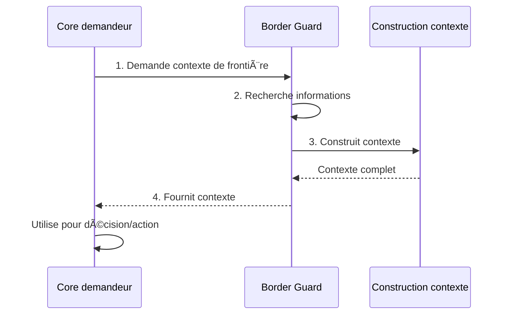

# Border Guard - Architecture & Flows

## 1. Contexte

Ce document définit l'**architecture conceptuelle** de Border Guard et les **flux de définition** qu'il orchestre dans l'écosystème Miyukini. Border Guard est le core de définition des frontières et des règles d'entrée/sortie.

Border Guard orchestre trois flux principaux :

1. **Flux de classification** — Attribution des niveaux de confiance
2. **Flux de définition** — Établissement des frontières et règles
3. **Flux de conseil** — Communication du contexte aux autres cores

Ce document est **dérivé de la Documentation Fondatrice de Border Guard** et constitue la référence architecturale pour la structure et les flux de définition.

**Document source :** [Border Guard - Documentation Fondatrice](../foundation/Border%20Guard%20-%20Documentation%20Fondatrice.md)

---

## 2. Portée / Scope

- **Applicable à :** Toute définition de frontière et classification de confiance dans l'écosystème Miyukini
- **Audience :** Architectes, développeurs, intégrateurs
- **Statut :** Documentation architecturale — Normative
- **Dépendances :** Documentation Fondatrice Border Guard, Security Protocols, Lois Autonomie Système

---

## 3. Vue d'ensemble architecturale

### 3.1 Composants conceptuels

Border Guard est structuré en **composants conceptuels** distincts. Ces composants n'ont aucune capacité d'exécution — ils définissent, classifient et établissent des règles.

```mermaid
graph TB
    subgraph BorderGuard[Border Guard]
        REG[Registre<br/>des Frontières]
        CLASS[Classificateur<br/>de Confiance]
        RULES[Définisseur<br/>de Règles]
        INTEG[Gouverneur<br/>d'Intégrations]
    end

    subgraph Consommateurs
        SF[StrongFather<br/>contexte]
        BB[BondingBrother<br/>règles]
        CN[Caring Nanny<br/>état]
    end

    REG --> RULES
    CLASS --> RULES
    RULES --> BB
    CLASS --> SF
    REG --> CN
    INTEG --> CLASS
    INTEG --> REG

    classDef core fill:#ede7f6
    classDef consumer fill:#e1f5fe
    class REG,CLASS,RULES,INTEG core
    class SF,BB,CN consumer
```



### 3.2 Composants détaillés

#### 3.2.1 Registre des Frontières

Le **Registre des Frontières** maintient la définition formelle de toutes les frontières du système.

| Responsabilité | Description |
|----------------|-------------|
| **Identification** | Nommer et identifier chaque frontière de manière unique |
| **Classification** | Classifier la nature (externe, interne, intégration) |
| **Direction** | Définir la direction (entrée, sortie, bidirectionnelle) |
| **Perméabilité** | Établir le niveau de perméabilité (ouverte, contrôlée, fermée) |
| **Persistance** | Transmettre à KindMother pour stockage |

**Données gérées :**

| Donnée | Description |
|--------|-------------|
| `boundary_id` | Identifiant unique de la frontière |
| `boundary_type` | external, internal, integration |
| `direction` | inbound, outbound, bidirectional |
| `permeability` | open, controlled, closed |
| `description` | Description de la frontière |
| `created_at` | Horodatage de création (local) |

#### 3.2.2 Classificateur de Confiance

Le **Classificateur de Confiance** attribue les niveaux de confiance aux sources, destinations et interactions.

| Responsabilité | Description |
|----------------|-------------|
| **Attribution** | Attribuer un niveau de confiance à chaque source/destination |
| **Transition** | Gérer les transitions entre niveaux de confiance |
| **Défaut** | Appliquer le niveau "unknown" par défaut |
| **Révocation** | Signaler les passages vers "hostile" |

**Niveaux de confiance (canoniques) :**

| Niveau | Description | Critères |
|--------|-------------|----------|
| **Trusted** | Confiance totale | Composants internes validés, autorités système |
| **Verified** | Confiance vérifiée | Authentification réussie, intégrations certifiées |
| **Unknown** | Confiance inconnue | Défaut pour tout ce qui arrive de l'extérieur |
| **Hostile** | Confiance nulle | Sources blacklistées, patterns d'attaque détectés |

#### 3.2.3 Définisseur de Règles

Le **Définisseur de Règles** établit les règles de franchissement des frontières.

| Responsabilité | Description |
|----------------|-------------|
| **Définition** | Définir les règles associées à chaque frontière |
| **Conditions** | Spécifier les conditions de franchissement |
| **Exceptions** | Établir les exceptions et cas particuliers |
| **Cohérence** | Maintenir la cohérence entre règles |

**Structure d'une règle :**

| Élément | Description |
|---------|-------------|
| `rule_id` | Identifiant unique de la règle |
| `boundary_id` | Frontière associée |
| `trust_level_required` | Niveau de confiance minimal requis |
| `conditions` | Conditions déclaratives de franchissement |
| `exceptions` | Exceptions autorisées |
| `documentation` | Référence vers la documentation |

**Principe fondamental :** Les règles sont **déclaratives**, pas procédurales. Elles expriment ce qui est requis, pas comment le vérifier techniquement.

#### 3.2.4 Gouverneur d'Intégrations

Le **Gouverneur d'Intégrations** gère conceptuellement les relations avec les systèmes externes.

| Responsabilité | Description |
|----------------|-------------|
| **Classification** | Classifier chaque intégration selon sa nature et son risque |
| **Cadre** | Définir le cadre d'interaction avec chaque système externe |
| **Suspension** | Établir les conditions de suspension ou révocation |
| **Registre** | Maintenir le registre des intégrations et leur état |

**États d'une intégration :**

| État | Description |
|------|-------------|
| **Active** | Intégration fonctionnelle et autorisée |
| **Suspendue** | Intégration temporairement désactivée |
| **Révoquée** | Intégration définitivement interdite |

---

## 4. Architecture des flux

### 4.1 Vue d'ensemble des flux

Border Guard orchestre trois flux principaux qui fonctionnent de manière coordonnée mais indépendante.

```mermaid
graph TB
    subgraph FluxClass[Flux de Classification]
        CL1[Réception source]
        CL2[Évaluation critères]
        CL3[Attribution niveau]
        CL4[Notification]
    end

    subgraph FluxDef[Flux de Définition]
        DF1[Identification frontière]
        DF2[Définition règles]
        DF3[Validation cohérence]
        DF4[Enregistrement]
    end

    subgraph FluxCons[Flux de Conseil]
        CO1[Demande contexte]
        CO2[Recherche informations]
        CO3[Construction contexte]
        CO4[Fourniture]
    end

    CL1 --> CL2 --> CL3 --> CL4
    DF1 --> DF2 --> DF3 --> DF4
    CO1 --> CO2 --> CO3 --> CO4

    CL4 --> CO2
    DF4 --> CO2
```



### 4.2 Caractéristiques communes

| Caractéristique | Valeur |
|-----------------|--------|
| **Synchronicité** | Tous les flux sont non bloquants |
| **Traçabilité** | Chaque opération est enregistrée (INV-BG-8) |
| **Cohérence** | Les flux maintiennent la cohérence globale (INV-BG-9) |
| **Neutralité** | Aucune supposition sur la technologie (INV-BG-10) |
| **Priorité** | Classification > Définition > Conseil |

---

## 5. Flux de classification

### 5.1 Description

Le flux de classification est le flux par lequel Border Guard attribue les niveaux de confiance. Ce flux est **réactif** : il se déclenche à la demande de classification d'une source ou interaction.

### 5.2 Étapes du flux

```mermaid
sequenceDiagram
    participant Source as Demandeur
    participant BG as Border Guard
    participant Class as Classificateur
    participant Notif as Notification

    Source->>BG: 1. Soumet source à classifier
    BG->>Class: 2. Évalue selon critères
    Class-->>BG: Niveau déterminé
    BG->>BG: 3. Attribue niveau de confiance
    BG->>Notif: 4. Notifie les cores concernés
    Notif-->>Source: Confirmation de classification
```



#### Étape 1 : Réception de la source

Border Guard **reçoit** une demande de classification d'une source, destination ou interaction.

| Information fournie | Description |
|---------------------|-------------|
| **Identifiant** | ID unique de la source/interaction |
| **Type** | Source, destination, ou interaction |
| **Origine** | D'où vient la demande |
| **Contexte** | Informations de contexte disponibles |

**Sources typiques de demande :**

| Demandeur | Cas d'usage |
|-----------|-------------|
| **BondingBrother** | Nouvelle intégration, nouvelle source externe |
| **Produit (via BB)** | Connexion utilisateur, appel API externe |
| **Caring Nanny** | Source détectée sans classification |

#### Étape 2 : Évaluation selon critères

Border Guard **évalue** la source selon des critères définis.

| Critère | Description |
|---------|-------------|
| **Authentification** | La source est-elle authentifiée ? |
| **Historique** | Y a-t-il un historique de comportement ? |
| **Certification** | La source est-elle certifiée/validée ? |
| **Pattern** | Des patterns d'attaque sont-ils détectés ? |

**Matrice de classification :**

| Authentification | Certification | Historique | Pattern malveillant | → Niveau |
|------------------|---------------|------------|---------------------|----------|
| ✅ Interne validé | ✅ | N/A | ❌ | **Trusted** |
| ✅ Authentifiée | ✅ | ✅ Positif | ❌ | **Verified** |
| ❌ Non authentifiée | ❌ | ? | ❌ | **Unknown** |
| ? | ? | ❌ Négatif | ✅ | **Hostile** |

#### Étape 3 : Attribution du niveau de confiance

Border Guard **attribue** le niveau de confiance déterminé.

| Donnée enregistrée | Description |
|--------------------|-------------|
| **source_id** | Identifiant de la source |
| **trust_level** | Niveau attribué (trusted, verified, unknown, hostile) |
| **reason** | Justification de la classification |
| **classified_at** | Horodatage local |
| **valid_until** | Durée de validité (si applicable) |

**Invariant applicable :** INV-BG-4 (Classification exhaustive)

#### Étape 4 : Notification

Border Guard **notifie** les cores concernés de la nouvelle classification.

| Destinataire | Information envoyée |
|--------------|---------------------|
| **StrongFather** | Contexte de confiance pour les décisions futures |
| **BondingBrother** | Règles applicables selon le niveau |
| **Caring Nanny** | Mise à jour de l'état des frontières |

### 5.3 Garanties du flux de classification

| Garantie | Description |
|----------|-------------|
| **Exhaustivité** | Toute source non classifiée est "unknown" (INV-BG-4) |
| **Traçabilité** | Chaque classification est enregistrée avec justification |
| **Cohérence** | Pas de classification contradictoire |
| **Non-autorité** | Border Guard classifie mais ne bloque pas lui-même |

---

## 6. Flux de définition

### 6.1 Description

Le flux de définition est le flux par lequel Border Guard établit les frontières et leurs règles. Ce flux est **proactif** : Border Guard initie la définition selon les besoins architecturaux.

### 6.2 Étapes du flux

```mermaid
sequenceDiagram
    participant Archi as Architecte/Système
    participant BG as Border Guard
    participant Reg as Registre
    participant Valid as Validation

    Archi->>BG: 1. Identifie nouvelle frontière
    BG->>Reg: 2. Définit frontière et règles
    Reg-->>BG: Définition enregistrée
    BG->>Valid: 3. Valide cohérence globale
    alt Cohérent
        Valid-->>BG: Validation OK
        BG->>BG: 4. Enregistre définition
    else Incohérence détectée
        Valid-->>BG: Incohérence signalée
        BG-->>Archi: Demande clarification
    end
```



#### Étape 1 : Identification de la frontière

Border Guard **identifie** une nouvelle frontière à formaliser.

| Source d'identification | Exemple |
|-------------------------|---------|
| **Architecture** | Nouvelle zone de confiance définie |
| **Intégration** | Nouveau système externe à connecter |
| **Évolution** | Modification de périmètre d'une zone existante |

**Données d'identification :**

| Donnée | Description |
|--------|-------------|
| **Nom** | Nom explicite de la frontière |
| **Type** | Externe, interne, ou intégration |
| **Zones séparées** | Quelles zones de confiance sont séparées |
| **Justification** | Pourquoi cette frontière existe |

#### Étape 2 : Définition des règles

Border Guard **définit** les règles de franchissement associées à la frontière.

| Élément défini | Description |
|----------------|-------------|
| **Direction** | Entrée, sortie, bidirectionnelle |
| **Perméabilité** | Ouverte, contrôlée, fermée |
| **Niveau requis** | Niveau de confiance minimal pour franchir |
| **Conditions** | Conditions déclaratives supplémentaires |

**Exemple de règle déclarative :**

```
Frontière : BND-EXT-API
Direction : Entrée
Perméabilité : Contrôlée
Niveau requis : Verified
Conditions :
  - Authentification valide
  - Origine dans la liste blanche
  - Quota non dépassé
```

**Invariant applicable :** INV-BG-6 (Règles déclaratives)

#### Étape 3 : Validation de cohérence

Border Guard **valide** que la nouvelle définition est cohérente avec l'existant.

| Vérification | Description |
|--------------|-------------|
| **Pas de contradiction** | La règle ne contredit pas une règle existante |
| **Couverture complète** | Pas de "trou" dans la définition des frontières |
| **Hiérarchie respectée** | Les zones de confiance restent cohérentes |

**Invariant applicable :** INV-BG-9 (Cohérence globale)

#### Étape 4 : Enregistrement de la définition

Border Guard **enregistre** la définition validée.

| Donnée enregistrée | Description |
|--------------------|-------------|
| **boundary_definition** | Définition complète de la frontière |
| **associated_rules** | Règles de franchissement |
| **created_at** | Horodatage local |
| **created_by** | Source de la définition |
| **documentation** | Référence vers la documentation |

**Invariants applicables :** INV-BG-5 (Frontières explicites), INV-BG-8 (Traçabilité complète)

### 6.3 Garanties du flux de définition

| Garantie | Description |
|----------|-------------|
| **Explicite** | Aucune frontière implicite (INV-BG-5) |
| **Cohérent** | Validation de cohérence obligatoire (INV-BG-9) |
| **Traçable** | Toute définition est traçable (INV-BG-8) |
| **Déclaratif** | Règles déclaratives uniquement (INV-BG-6) |

---

## 7. Flux de conseil

### 7.1 Description

Le flux de conseil est le flux par lequel Border Guard fournit le contexte de frontière aux autres cores. Ce flux est **passif** : Border Guard répond aux demandes.

### 7.2 Étapes du flux



#### Étape 1 : Demande de contexte

Un core **demande** le contexte de frontière pour une interaction.

| Demandeur | Type de demande |
|-----------|-----------------|
| **StrongFather** | Contexte de confiance pour évaluer une intention |
| **BondingBrother** | Règles de franchissement à appliquer |
| **Caring Nanny** | État des frontières pour observation |

**Paramètres de demande :**

| Paramètre | Description |
|-----------|-------------|
| **interaction_id** | ID de l'interaction concernée |
| **source_id** | Source de l'interaction |
| **boundary_id** | Frontière traversée (si connue) |
| **context_depth** | Profondeur du contexte demandé |

#### Étape 2 : Recherche des informations

Border Guard **recherche** les informations pertinentes.

| Source | Information extraite |
|--------|----------------------|
| **Registre des frontières** | Définition de la frontière |
| **Classificateur** | Niveau de confiance de la source |
| **Définisseur de règles** | Règles applicables |
| **Gouverneur d'intégrations** | État de l'intégration (si applicable) |

#### Étape 3 : Construction du contexte

Border Guard **construit** le contexte de frontière.

| Élément du contexte | Description |
|---------------------|-------------|
| **boundary_info** | Définition de la frontière traversée |
| **source_trust_level** | Niveau de confiance de la source |
| **applicable_rules** | Règles de franchissement applicables |
| **integration_state** | État de l'intégration (si applicable) |
| **recommendations** | Recommandations (informatives) |

#### Étape 4 : Fourniture du contexte

Border Guard **fournit** le contexte au demandeur.

| Destinataire | Utilisation du contexte |
|--------------|-------------------------|
| **StrongFather** | Intègre dans l'évaluation de l'intention |
| **BondingBrother** | Applique les règles lors de la médiation |
| **Caring Nanny** | Inclut dans l'état global observé |

**Invariant applicable :** INV-BG-3 (Aucune décision autonome) — Border Guard informe, ne décide pas.

### 7.3 Garanties du flux de conseil

| Garantie | Description |
|----------|-------------|
| **Non-bloquant** | La fourniture de contexte n'impose pas de décision |
| **Complet** | Le contexte inclut toutes les informations pertinentes |
| **Actualisé** | Le contexte reflète l'état actuel |
| **Traçable** | Les consultations peuvent être auditées |

---

## 8. Intégration avec les Security Protocols

Border Guard joue un rôle clé dans les [Security Protocols](..//..//..//miyukini-webway-system//reference//_index.md).

### 8.1 Protocoles temps réel (Online / Sync)

| Protocole | Rôle de Border Guard |
|-----------|----------------------|
| **RT-SEC-1** (Session éphémère) | Classification de la session selon l'origine |
| **RT-SEC-2** (Authentification en couches) | Fournit la classification de la source dans le flux d'authentification |
| **RT-SEC-4** (Détection d'anomalie) | Classification des patterns détectés comme "hostile" |

```
Requête
    ↓
Border Guard (classification source)
    ↓
Master Butler (capacités ?)
    ↓
Caring Nanny (état système ?)
    ↓
StrongFather (décision finale)
```

### 8.2 Protocoles asynchrones (Offline / Async)

| Protocole | Rôle de Border Guard |
|-----------|----------------------|
| **AS-SEC-2** (Signature locale faible) | Classification du risque des intentions asynchrones |
| **NET-SEC-1** (Handshake conformité) | Validation de l'état des frontières à la reconnexion |
| **NET-SEC-2** (Mise à jour sécurisée) | Validation des frontières pour les mises à jour |

### 8.3 Invariants de sécurité portés

Border Guard est porteur des invariants de sécurité suivants :

| Invariant | Responsabilité Border Guard |
|-----------|----------------------------|
| **Aucun client n'est source de vérité** | Classification systématique des sources |
| **Toute action justifiée et traçable** | Traçabilité des classifications et définitions |
| **Tout est révocable** | Capacité de passage vers "hostile" |

---

## 9. Diagramme d'architecture complète

```
┌─────────────────────────────────────────────────────────────────────────────────┐
│                              BORDER GUARD                                        │
│                                                                                  │
│  ┌──────────────────┐  ┌──────────────────┐  ┌──────────────────┐              │
│  │    REGISTRE      │  │  CLASSIFICATEUR  │  │   DÉFINISSEUR    │              │
│  │  DES FRONTIÈRES  │  │   DE CONFIANCE   │  │    DE RÈGLES     │              │
│  │                  │  │                  │  │                  │              │
│  │ • Frontières     │  │ • Niveaux        │  │ • Règles         │              │
│  │ • Types          │  │ • Transitions    │  │ • Conditions     │              │
│  │ • Perméabilité   │  │ • Critères       │  │ • Exceptions     │              │
│  └────────┬─────────┘  └────────┬─────────┘  └────────┬─────────┘              │
│           │                     │                     │                         │
│           └─────────────────────┼─────────────────────┘                         │
│                                 │                                               │
│                    ┌────────────┴────────────┐                                  │
│                    │     GOUVERNEUR          │                                  │
│                    │    D'INTÉGRATIONS       │                                  │
│                    │                         │                                  │
│                    │ • Classifications       │                                  │
│                    │ • États                 │                                  │
│                    │ • Conditions            │                                  │
│                    └────────────┬────────────┘                                  │
│                                 │                                               │
│  ┌──────────────────────────────┼──────────────────────────────────┐           │
│  │                              │                                   │           │
│  │  ┌────────────┐  ┌───────────▼──────────┐  ┌────────────────┐  │           │
│  │  │   FLUX     │  │        FLUX          │  │      FLUX      │  │           │
│  │  │CLASSIFICATION│  │    DÉFINITION       │  │    CONSEIL     │  │           │
│  │  └──────┬─────┘  └──────────┬───────────┘  └───────┬────────┘  │           │
│  │         │                   │                      │           │           │
│  │         └───────────────────┼──────────────────────┘           │           │
│  └─────────────────────────────┼──────────────────────────────────┘           │
│                                │                                               │
└────────────────────────────────┼───────────────────────────────────────────────┘
                                 │
              ┌──────────────────┼──────────────────┐
              │                  │                  │
              â–¼                  â–¼                  â–¼
    ┌─────────────────┐ ┌─────────────────┐ ┌─────────────────┐
    │  StrongFather   │ │  BondingBrother │ │  Caring Nanny   │
    │  (contexte)     │ │  (règles)       │ │  (état)         │
    └─────────────────┘ └────────┬────────┘ └─────────────────┘
                                 │
                                 â–¼
                      ┌─────────────────────┐
                      │     FRONTIÈRES      │
                      │     DU SYSTÈME      │
                      └─────────────────────┘
                                 │
                                 â–¼
                      ┌─────────────────────┐
                      │   MONDE EXTÉRIEUR   │
                      └─────────────────────┘
```

---

## 10. Conformité aux Lois d'Autonomie

Les flux de Border Guard respectent les [Lois d'Autonomie Système](..//..//..//miyukini-webway-system//reference//_index.md) :

| Loi | Conformité | Mécanisme dans l'architecture |
|-----|------------|-------------------------------|
| **LOI-1** | ✅ Rôle critique | Définitions locales, aucun appel externe requis |
| **LOI-2** | ✅ | L'isolement est un état normal des frontières |
| **LOI-3** | ✅ | État local souverain des définitions |
| **LOI-4** | ✅ | Horodatage local, pas de temps global requis |
| **LOI-5** | ✅ | Core conceptuel léger, sans exécution |
| **LOI-6** | ✅ Rôle critique | Contrôle explicite des échanges fédérés |

**Border Guard est critique pour l'autonomie** car :

- Il contrôle tout ce qui entre et sort du système
- Les règles de franchissement sont locales et chargées au démarrage
- Il valide explicitement les échanges fédérés (LOI-6)

---

## 11. Invariants architecturaux

Ce document est gouverné par les invariants de la Documentation Fondatrice :

| Invariant | Énoncé | Application architecturale |
|-----------|--------|---------------------------|
| **INV-BG-1** | Aucune capacité d'exécution | Les composants définissent, ils n'exécutent pas |
| **INV-BG-4** | Classification exhaustive | Le Classificateur classifie toute source |
| **INV-BG-5** | Frontières explicites | Le Registre formalise toute frontière |
| **INV-BG-6** | Règles déclaratives | Le Définisseur utilise des règles déclaratives |
| **INV-BG-7** | Séparation définition/application | Border Guard définit, BondingBrother applique |
| **INV-BG-8** | Traçabilité complète | Tous les flux sont traçables |
| **INV-BG-9** | Cohérence globale | Validation de cohérence obligatoire |
| **INV-BG-10** | Neutralité conceptuelle | Architecture indépendante de la technologie |

---

## 12. Références

### Documents fondateurs

- [Border Guard - Documentation Fondatrice](../foundation/Border%20Guard%20-%20Documentation%20Fondatrice.md)

### Contrats associés

- [Border Guard - Core Interaction Contract](./Border%20Guard%20-%20Core%20Interaction%20Contract.md)

### Documents de référence

- [Miyukini Conceptual References - Security Protocols](..//..//..//miyukini-webway-system//reference//_index.md)
- [Miyukini Conceptual References - Lois Autonomie Systeme](..//..//..//miyukini-webway-system//reference//_index.md)
- [Miyukini Conceptual References - Security Levels](..//..//..//miyukini-webway-system//reference//_index.md)

---

**Version :** 1.0  
**Date :** 2026-01-28  
**Statut :** Documentation architecturale — Normative  
**Dérivé de :** Border Guard - Documentation Fondatrice v1.5, Sections 4, 5 et 8

