# Caring Nanny — Index de Navigation

## Contexte

Caring Nanny est le **core d'observation d'état** (Strate 4) du Miyukini Core System. Il incarne la capacité conceptuelle du système à observer, détecter, classer et propager les états du système, sans jamais modifier, décider ou exécuter.

Caring Nanny représente la **nounou attentive** du système : elle observe ce qui se passe, détecte les anomalies, et informe ceux qui ont l'autorité d'agir, garantissant que chaque composant dispose d'une vision cohérente et traçable de l'état du système.

**Strate :** 4 (Cores Système)  
**Rôle :** Observation d'état  
**Terminologie officielle :** [Miyukini Conceptual References - Glossaire](..//..//miyukini-webway-system//reference//_index.md)

---

## Structure de la documentation

### Foundation

Documents fondateurs définissant l'identité et le rôle de Caring Nanny.

| Document | Description |
|----------|-------------|
| [Documentation Fondatrice](./foundation/Caring%20Nanny%20-%20Documentation%20Fondatrice.md) | Définition conceptuelle, rôle, positionnement, invariants fondamentaux |

---

### Architecture

Documentation architecturale.

| Document | Description |
|----------|-------------|
| [Architecture et Composants](./architecture/Caring%20Nanny%20-%20Architecture%20et%20Composants.md) | Architecture interne, composants, flux d'observation |

---

### Contracts

Contrats FONDATION normatifs et non négociables.

#### Integration

| Document | Description |
|----------|-------------|
| [KindMother Integration Contract](./contracts/integration/Caring%20Nanny%20-%20KindMother%20Integration%20Contract.md) | Relation d'observation avec KindMother |
| [StrongFather Integration Contract](./contracts/integration/Caring%20Nanny%20-%20StrongFather%20Integration%20Contract.md) | Relation d'information avec StrongFather |
| [BondingBrother Integration Contract](./contracts/integration/Caring%20Nanny%20-%20BondingBrother%20Integration%20Contract.md) | Collaboration pour la propagation des états |

#### Observability

| Document | Description |
|----------|-------------|
| [State Model Contract](./contracts/observability/Caring%20Nanny%20-%20State%20Model%20Contract.md) | Modèle formel des états |
| [Observation Flow Contract](./contracts/observability/Caring%20Nanny%20-%20Observation%20Flow%20Contract.md) | Flux d'observation : détection → évaluation → agrégation → transition |
| [Propagation Flow Contract](./contracts/observability/Caring%20Nanny%20-%20Propagation%20Flow%20Contract.md) | Flux de propagation : changement → destinataires → message → dispatch |

#### Governance

| Document | Description |
|----------|-------------|
| [Invariants et Garanties](./contracts/governance/Caring%20Nanny%20-%20Invariants%20et%20Garanties.md) | Catalogue consolidé des invariants INV-CN-1 à INV-CN-7 |
| [Violations & Anti-Patterns](./contracts/governance/Caring%20Nanny%20-%20Violations%20%26%20Anti-Patterns.md) | Violations cataloguées, anti-patterns |
| [Error & Rejection Model](./contracts/governance/Caring%20Nanny%20-%20Error%20%26%20Rejection%20Model.md) | Modèle d'erreur et de rejet |

#### Lifecycle

| Document | Description |
|----------|-------------|
| [Performance & Scalability Contract](./contracts/lifecycle/Caring%20Nanny%20-%20Performance%20%26%20Scalability%20Contract.md) | Garanties de performance |
| [Testing & Validation Contract](./contracts/lifecycle/Caring%20Nanny%20-%20Testing%20%26%20Validation%20Contract.md) | Stratégie de test et validation |
| [Versioning & Evolution Contract](./contracts/lifecycle/Caring%20Nanny%20-%20Versioning%20%26%20Evolution%20Contract.md) | Règles d'évolution et compatibilité |

#### Security

| Document | Description |
|----------|-------------|
| [Security Implications Contract](./contracts/security/Caring%20Nanny%20-%20Security%20Implications%20Contract.md) | Implications securitaires, protocoles RT-SEC/AS-SEC/NET-SEC, adaptation T0-T4 |

---

### Implementation

Guides d'implémentation.

| Document | Description |
|----------|-------------|
| [Reference Implementation Guidelines](./implementation/Caring%20Nanny%20-%20Reference%20Implementation%20Guidelines.md) | Guidelines d'implémentation de référence |

---

### Reference

Documentation de référence et exemples.

| Document | Description |
|----------|-------------|
| [Glossaire et Terminologie](./reference/Caring%20Nanny%20-%20Glossaire%20et%20Terminologie.md) | Vocabulaire canonique de Caring Nanny |
| [FAQ & Common Questions](./reference/Caring%20Nanny%20-%20FAQ%20%26%20Common%20Questions.md) | Questions fréquentes |
| [Examples & Use Cases](./reference/Caring%20Nanny%20-%20Examples%20%26%20Use%20Cases.md) | Exemples et cas d'usage |

---

## Invariants clés

| Invariant | Description |
|-----------|-------------|
| **INV-CN-1** | Observateur pur — Caring Nanny observe et rapporte, elle ne modifie jamais |
| **INV-CN-2** | Aucune capacité d'exécution — Ne peut déclencher d'action, ni directement ni indirectement |
| **INV-CN-3** | Non-autoritaire — Ne détient aucune autorité sur aucun aspect du système |
| **INV-CN-4** | État cohérent — L'état rapporté est toujours cohérent, sans contradiction |
| **INV-CN-5** | Traçabilité complète — Chaque observation et transition est traçable |
| **INV-CN-6** | Non-bloquant — N'interfère jamais avec le fonctionnement normal du système |
| **INV-CN-7** | Propagation fidèle — Propage les changements d'état sans modification |

---

## Interdictions

| Code | Interdiction |
|------|--------------|
| **INTERD-CN-1** | Caring Nanny ne peut pas modifier de données |
| **INTERD-CN-2** | Caring Nanny ne peut pas prendre de décisions |
| **INTERD-CN-3** | Caring Nanny ne peut pas exécuter d'actions correctives |
| **INTERD-CN-4** | Caring Nanny ne peut pas médiatiser les intentions |
| **INTERD-CN-5** | Caring Nanny ne peut pas valider ou invalider des opérations |
| **INTERD-CN-6** | Caring Nanny ne peut pas définir de règles de classification |

---

## États système

| État | Description |
|------|-------------|
| **healthy** | Tous les composants fonctionnent normalement, aucune anomalie détectée |
| **degraded** | Certains composants fonctionnent en mode dégradé, le système reste opérationnel |
| **offline** | Le système fonctionne en mode déconnecté, sans accès aux autorités centrales |
| **syncing** | Une synchronisation est en cours, certaines opérations peuvent être différées |
| **error** | Une erreur critique a été détectée, certaines opérations ne sont pas possibles |

---

## Relations avec les autres Cores

| Core | Relation |
|------|----------|
| **KindMother** | Observation — Caring Nanny observe l'état de santé, de synchronisation et de disponibilité |
| **StrongFather** | Information — Caring Nanny informe StrongFather de l'état pour enrichir le contexte des décisions |
| **BondingBrother** | Collaboration — Caring Nanny fournit les notifications de changement d'état pour propagation |
| **Ever Buddy** | Réception — Caring Nanny reçoit les indicateurs d'évolution d'Ever Buddy |
| **Border Guard** | Observation — Caring Nanny observe l'état des frontières et des validations |
| **Master Butler** | Observation — Caring Nanny observe l'état des capacités exposées |

### Diagramme de relations

```mermaid
graph TB
    subgraph Strate4[Strate 4 - Cores Système]
        SF[StrongFather<br/>Décision]
        KM[KindMother<br/>Persistance]
        EB[Ever Buddy<br/>Évolution]
    end

    subgraph Strate3[Strate 3 - Supervision]
        CN[Caring Nanny<br/>Monitoring]
    end

    subgraph Strate5[Strate 5 - Liaison]
        BB[BondingBrother<br/>Médiation]
    end

    subgraph Strate2[Strate 2 - Frontière]
        BG[Border Guard<br/>Frontières]
        MB[Master Butler<br/>Exposition]
    end

    KM -->|"État santé/sync"| CN
    SF -->|"Consultation état"| CN
    CN -->|"Notifications état"| BB
    EB -->|"Indicateurs évolution"| CN
    BG -->|"État frontières"| CN
    MB -->|"État capacités"| CN

    classDef coreObservation fill:#fce4ec
    classDef coreData fill:#e1f5fe
    classDef coreDecision fill:#fff3e0
    classDef coreEvolution fill:#e8f5e9
    classDef liaison fill:#f3e5f5
    classDef frontier fill:#ede7f6

    class CN coreObservation
    class KM coreData
    class SF coreDecision
    class EB coreEvolution
    class BB liaison
    class BG,MB frontier
```

---

## Conformité aux Lois d'Autonomie Système

Caring Nanny est **entièrement conforme** aux [Lois d'Autonomie Système](..//..//miyukini-webway-system//reference//_index.md) :

| Loi | Conformité | Note |
|-----|------------|------|
| **LOI-1** | ✅ | Registre d'états local, règles de classification statiques |
| **LOI-2** | ✅ | Transitions observées localement sans dépendance externe |
| **LOI-3** | ✅ | Historique d'observations local immuable (INV-CN-5) |
| **LOI-4** | ✅ | États discrets, pas de temps global |
| **LOI-5** | ✅ | Observation pure, pas d'exécution — impact nul (INV-CN-6) |
| **LOI-6** | ✅ | Propagation via BondingBrother optionnelle |

---

## Protocoles applicables

Toute évolution de la documentation Caring Nanny et tout code dérivé sont soumis aux protocoles Miyukini suivants :

| Protocole | Description |
|-----------|-------------|
| [Miyukini Prompt Protocol — Écriture Documentation Conceptuelle](..//..//contrats//Miyukini%20Prompt%20Protocol%20-%20Ecriture%20Documentation%20Conceptuelle.md) | Cycle planification → distribution → vérification → gel ; usage obligatoire pour toute évolution de la doc Caring Nanny. |
| [Miyukini Prompt Protocol — MIP v1 MSCM Index Protocol](..//..//contrats//Miyukini%20Prompt%20Protocol%20-%20Ecriture%20Documentation%20Conceptuelle.md) | Indexation du code (MSCM → MIP) ; tout code Caring Nanny doit être balisé MSCM ; l'index MIP est la structure de gouvernance. |

---

## Références conceptuelles

Références [docs/reference](..//..//_index.md) pertinentes pour Caring Nanny :

| Document | Description |
|----------|-------------|
| [Miyukini Conceptual References - Glossaire](..//..//miyukini-webway-system//reference//_index.md) | Terminologie officielle |
| [Miyukini Conceptual References - Lois Autonomie Systeme](..//..//miyukini-webway-system//reference//_index.md) | Conformité LOI-1 à LOI-6 |
| [Miyukini Conceptual References - Doctrine Securite Fondamentale](..//..//miyukini-webway-system//reference//_index.md) | Principes fondateurs de la sécurité |
| [Miyukini Conceptual References - Integrity Degradation System](..//..//miyukini-webway-system//reference//_index.md) | Niveaux T0–T4 (contexte observation) |
| [Miyukini Conceptual References - Security Levels](..//..//miyukini-webway-system//reference//_index.md) | Niveaux 0–4 |
| [Miyukini Conceptual References - Security Protocols](..//..//miyukini-webway-system//reference//_index.md) | RT-SEC, AS-SEC, NET-SEC |
| [Miyukini Conceptual References - Kernel Maintenance Observability Contract](..//..//miyukini-webway-system//reference//_index.md) | Observabilité kernel (alignement observation) |

---

## Audit et qualité

**Référence :** [Audit - Qualite et Risques Derive Implementation v1](..//..//_index.md)

Caring Nanny présente un **score documentation 60/100** et un **risque élevé** de dérive. Principaux gaps : contrats d'intégration (StrongFather, KindMother, BondingBrother), contrats observability (State Model, Observation Flow, Propagation Flow), FAQ & Common Questions, Examples & Use Cases. Voir les actions **A-05** (contrats d'intégration CN), **A-09** (contrats observability CN) et la **Phase 2 — Observabilité et Intervention** du plan d'action de l'audit.

---

## Concepts clés

| Concept | Description |
|---------|-------------|
| **État système** | Condition globale du MCS à un instant donné, agrégé des états partiels |
| **État applicatif** | Condition d'un module ou composant spécifique |
| **Transition** | Passage observable d'un état à un autre |
| **Condition** | Fait observable qui peut influencer l'état |
| **Propagation** | Communication d'un changement d'état aux composants concernés |
| **Observation** | Détection passive et enregistrement d'un fait |
| **Anomalie** | Condition qui s'écarte du comportement attendu |

---

## Phrase fondatrice

> **Caring Nanny est la nounou attentive qui observe, détecte, classe et propage les états du système, garantissant que chaque composant dispose d'une vision cohérente, traçable et non contradictoire de ce qui se passe, sans jamais modifier, décider ou exécuter.**

---

## Documentation Security Associée

Caring Nanny joue un rôle critique dans la sécurité de l'écosystème Miyukini en tant que **Gardienne de la Santé**. Voir la documentation Security pour les détails :

| Document | Description |
|----------|-------------|
| [Security - Core Integration Map](..//WorrySentinel//_index.md) | Cartographie des responsabilités sécuritaires par Core |
| [Security - Documentation Fondatrice](..//WorrySentinel//_index.md) | Vision opérationnelle de la sécurité Miyukini |
| [Doctrine Securite Fondamentale](..//..//miyukini-webway-system//reference//_index.md) | Principes fondateurs de la sécurité |

**Responsabilités sécuritaires clés :**
- Détection d'anomalies et consolidation des signaux
- Calcul du niveau de confiance global (T0-T4)
- Participation aux protocoles RT-SEC-2, RT-SEC-3, RT-SEC-4, AS-SEC-5, NET-SEC-1, NET-SEC-3

---

**Date de création :** 2026-01-27  
**Dernière mise à jour :** 2026-01-28  
**Version :** 1.1  
**Statut :** Index de navigation

