# Ever Buddy - Evolution Flows

## 1. Contexte

Ce document définit les **flux d'évolution** gouvernés par Ever Buddy. Ces flux décrivent comment l'information de cycle de vie circule dans l'écosystème Miyukini, depuis l'observation des éléments jusqu'à l'alerte en cas de conditions anormales.

Ever Buddy orchestre quatre flux principaux :

1. **Flux d'observation** — Surveillance continue de l'état du système
2. **Flux de consultation** — Fourniture du contexte de cycle de vie aux autres cores
3. **Flux de planification** — Communication et coordination des transitions planifiées
4. **Flux d'alerte** — Détection et signalement des conditions anormales

Ce document est **dérivé de la Documentation Fondatrice d'Ever Buddy** (Section 8 - Interactions avec l'écosystème) et constitue la référence architecturale pour les flux d'évolution.

**Document source :** [Ever Buddy - Documentation Fondatrice](../foundation/Ever%20Buddy%20-%20Documentation%20Fondatrice.md)

---

## 2. Portée / Scope

- **Applicable à :** Tous les échanges d'information de cycle de vie dans l'écosystème Miyukini
- **Audience :** Architectes, développeurs, intégrateurs, cores système
- **Statut :** Documentation architecturale — Normative
- **Dépendances :** Documentation Fondatrice Ever Buddy, Core Interaction Contract, Glossaire Miyukini

---

## 3. Vue d'ensemble des flux

### 3.1 Diagramme synthétique

```mermaid
graph TB
    subgraph EverBuddy[Ever Buddy]
        REG[Registre<br/>des états]
        RUL[Règles<br/>d'évolution]
        HIS[Historique<br/>immuable]
        ALE[Alertes<br/>et plans]
    end

    subgraph FluxObs[Flux d'Observation]
        O1[Réception déclarations]
        O2[Enregistrement état]
        O3[Surveillance transitions]
        O4[Validation transitions]
        O5[Enregistrement transition]
    end

    subgraph FluxCons[Flux de Consultation]
        C1[Demande de contexte]
        C2[Recherche état]
        C3[Fourniture contexte]
        C4[Utilisation demandeur]
    end

    subgraph FluxPlan[Flux de Planification]
        P1[Définition plan]
        P2[Communication]
        P3[Période transition]
        P4[Suivi adoption]
        P5[Complétion]
    end

    subgraph FluxAle[Flux d'Alerte]
        A1[Détection]
        A2[Évaluation gravité]
        A3[Émission alerte]
        A4[Recommandation]
        A5[Suivi résolution]
    end

    O1 --> O2 --> O3 --> O4 --> O5
    C1 --> C2 --> C3 --> C4
    P1 --> P2 --> P3 --> P4 --> P5
    A1 --> A2 --> A3 --> A4 --> A5

    O2 --> REG
    O5 --> HIS
    O4 --> RUL
    P1 --> ALE
    A3 --> ALE

    REG --> C2
    HIS --> C3
    RUL --> O4
    ALE --> A3
```



### 3.2 Caractéristiques communes des flux

| Caractéristique | Valeur |
|-----------------|--------|
| **Synchronicité** | Tous les flux sont asynchrones et non bloquants |
| **Traçabilité** | Chaque opération est enregistrée (INV-EB-2) |
| **Idempotence** | Les opérations peuvent être rejouées sans effet secondaire |
| **Isolation** | Chaque flux fonctionne indépendamment des autres |
| **Priorité** | Alerte > Observation > Consultation > Planification |

---

## 4. Flux d'observation

### 4.1 Description

Le flux d'observation est le flux principal par lequel Ever Buddy maintient sa connaissance de l'état du système. Ce flux est **passif** : Ever Buddy reçoit les déclarations, il ne les sollicite pas activement.

### 4.2 Étapes du flux

```mermaid
sequenceDiagram
    participant Source as Core/Produit
    participant EB as Ever Buddy
    participant Reg as Registre États
    participant His as Historique

    Source->>EB: 1. Déclare élément/transition
    EB->>Reg: 2. Enregistre état initial
    
    loop Surveillance continue
        EB->>Reg: 3. Surveille demandes de transition
        Reg-->>EB: Transition demandée
        EB->>EB: 4. Valide selon règles
        alt Transition valide
            EB->>Reg: Met à jour état
            EB->>His: 5. Enregistre transition
        else Transition invalide
            EB-->>Source: Rejette avec raison
        end
    end
```



#### Étape 1 : Réception des déclarations

Les cores et produits **déclarent** leurs éléments et leurs versions à Ever Buddy.

| Élément déclaré | Information fournie |
|-----------------|---------------------|
| **Nouvel élément** | ID, type, catégorie, version initiale, état demandé |
| **Demande de transition** | ID élément, état actuel, état cible, justification |
| **Mise à jour de version** | ID élément, version précédente, nouvelle version, type de changement |

**Contraintes :**

- La déclaration est **obligatoire** pour tout nouvel élément
- Un élément non déclaré est considéré comme **inexistant** par Ever Buddy
- Les déclarations sont **horodatées localement** (LOI-4 : pas de temps global requis)

#### Étape 2 : Enregistrement de l'état

Ever Buddy **enregistre** l'état de cycle de vie de chaque élément déclaré.

| Donnée enregistrée | Description |
|--------------------|-------------|
| **ID unique** | Identifiant de l'élément |
| **État actuel** | DRAFT, ACTIVE, DEPRECATED, RETIRED, ou ARCHIVED |
| **Version** | Version sémantique (majeur.mineur.correctif) |
| **Catégorie** | FONDATION, Opérationnel, Technique, Interne |
| **Horodatage local** | Moment de l'enregistrement |
| **Source** | Core ou produit ayant effectué la déclaration |

**Invariant applicable :** INV-EB-3 (Aucun état ambigu — un seul état par élément)

#### Étape 3 : Surveillance des transitions

Ever Buddy **surveille** les demandes de transition d'état qui arrivent dans le système.

| Type de surveillance | Mécanisme |
|----------------------|-----------|
| **Polling passif** | Ever Buddy attend les demandes (pas de scan actif) |
| **Queue de transitions** | Les demandes sont traitées dans l'ordre d'arrivée |
| **Priorisation** | Les transitions critiques (sécurité) sont prioritaires |

#### Étape 4 : Validation des transitions

Ever Buddy **vérifie** que chaque transition demandée respecte les règles.

| Vérification | Règle appliquée |
|--------------|-----------------|
| **Matrice de transition** | La transition est-elle autorisée ? (ACTIVE → DEPRECATED ✓, ACTIVE → RETIRED ✗) |
| **Période minimale** | La période minimale dans l'état actuel est-elle respectée ? |
| **Documentation** | La transition est-elle correctement documentée ? (INV-EB-7) |
| **Successeur identifié** | Pour DEPRECATED, un successeur est-il déclaré ? (INV-EB-10) |

**Résultats possibles :**

| Résultat | Action |
|----------|--------|
| **Validée** | La transition est acceptée et enregistrée |
| **Rejetée** | La transition est refusée avec raison explicite |
| **Différée** | La transition est mise en attente (condition non remplie) |

#### Étape 5 : Enregistrement de la transition

Si la transition est validée, Ever Buddy l'**enregistre** dans l'historique immuable.

| Donnée enregistrée | Description |
|--------------------|-------------|
| **ID élément** | Élément concerné |
| **État précédent** | État avant transition |
| **État nouveau** | État après transition |
| **Horodatage** | Moment de la transition |
| **Raison** | Justification de la transition |
| **Source** | Demandeur de la transition |
| **Documentation** | Référence vers la documentation |

**Invariant applicable :** INV-EB-2 (Traçabilité complète et immuable)

### 4.3 Garanties du flux d'observation

| Garantie | Description |
|----------|-------------|
| **Exhaustivité** | Toute déclaration est traitée |
| **Atomicité** | Une transition est totale ou nulle (pas d'état intermédiaire) |
| **Immuabilité** | L'historique enregistré ne peut être modifié |
| **Traçabilité** | Chaque opération est attribuable à une source |

---

## 5. Flux de consultation

### 5.1 Description

Le flux de consultation permet aux autres cores d'**obtenir** des informations de cycle de vie auprès d'Ever Buddy. Ce flux est **synchrone** du point de vue du demandeur : il envoie une requête et attend une réponse.

### 5.2 Étapes du flux

```mermaid
sequenceDiagram
    participant Core as Core demandeur
    participant EB as Ever Buddy
    participant Reg as Registre États
    participant His as Historique

    Core->>EB: 1. Demande contexte (ID élément)
    EB->>Reg: 2. Recherche état actuel
    Reg-->>EB: État trouvé
    EB->>His: Recherche historique (optionnel)
    His-->>EB: Historique
    EB-->>Core: 3. Fournit contexte complet
    Core->>Core: 4. Utilise contexte pour décision
```



#### Étape 1 : Demande de contexte

Un core (StrongFather, BondingBrother, etc.) **demande** le contexte de cycle de vie d'un élément.

| Paramètre de demande | Description |
|----------------------|-------------|
| **ID élément** | Identifiant de l'élément concerné |
| **Profondeur** | État seul, avec historique, avec recommandations |
| **Contexte** | Raison de la demande (optionnel, pour audit) |

**Demandeurs typiques :**

| Core | Raison de consultation |
|------|------------------------|
| **StrongFather** | Décider si une action sur un élément déprécié est autorisée |
| **BondingBrother** | Adapter une traduction selon la version de l'élément |
| **Border Guard** | Vérifier si une version externe est compatible |
| **Master Butler** | Filtrer les capacités exposées selon leur état |
| **Caring Nanny** | Évaluer l'impact d'un état sur la santé système |

#### Étape 2 : Recherche de l'état

Ever Buddy **recherche** l'état actuel et l'historique de l'élément demandé.

| Source de données | Information extraite |
|-------------------|----------------------|
| **Registre des états** | État actuel, version, catégorie |
| **Historique** | Chaîne d'évolution, transitions passées |
| **Règles** | Recommandations applicables |

**Cas particuliers :**

| Situation | Réponse |
|-----------|---------|
| **Élément inconnu** | Erreur : élément non déclaré |
| **Élément archivé** | Contexte minimal (tombstone) |
| **Élément en transition** | État actuel (pas d'état transitoire — INV-EB-3) |

#### Étape 3 : Fourniture du contexte

Ever Buddy **retourne** le contexte complet au demandeur.

| Élément de réponse | Description |
|--------------------|-------------|
| **État actuel** | DRAFT, ACTIVE, DEPRECATED, RETIRED, ARCHIVED |
| **Version** | Version sémantique actuelle |
| **Catégorie** | Catégorie de l'élément |
| **Successeur** | Si DEPRECATED/RETIRED, référence au successeur |
| **Date de transition prévue** | Si planifiée |
| **Historique** | Si demandé, chaîne d'évolution |
| **Recommandations** | Actions suggérées selon le contexte |

#### Étape 4 : Utilisation par le demandeur

Le core demandeur **utilise** le contexte fourni pour sa propre décision.

| Core | Utilisation du contexte |
|------|-------------------------|
| **StrongFather** | Peut refuser une action sur un élément RETIRED |
| **BondingBrother** | Peut adapter la traduction pour compatibilité |
| **Border Guard** | Peut refuser une intégration incompatible |
| **Master Butler** | Peut masquer une capacité DEPRECATED |
| **Caring Nanny** | Peut inclure l'état dans le rapport de santé |

### 5.3 Garanties du flux de consultation

| Garantie | Description |
|----------|-------------|
| **Cohérence** | La réponse reflète l'état au moment de la demande |
| **Disponibilité** | Le flux fonctionne même en mode isolé (LOI-2) |
| **Non-autorité** | Ever Buddy fournit le contexte mais ne décide pas |
| **Traçabilité** | Les consultations peuvent être auditées |

---

## 6. Flux de planification

### 6.1 Description

Le flux de planification permet à Ever Buddy de **communiquer** les plans de transition aux consommateurs concernés. Ce flux est **proactif** : Ever Buddy initie la communication.

### 6.2 Étapes du flux

```mermaid
sequenceDiagram
    participant EB as Ever Buddy
    participant Cons as Consommateurs
    participant Reg as Registre États

    EB->>EB: 1. Définit plan de transition
    EB->>Cons: 2. Communique le plan
    
    rect rgb(240, 240, 240)
        Note over EB,Cons: 3. Période de transition (coexistence)
        loop Surveillance continue
            EB->>Cons: Rappels périodiques
            Cons-->>EB: Statut de migration
        end
    end
    
    EB->>Reg: 4. Surveille adoption
    
    alt Adoption suffisante
        EB->>Reg: 5. Complète la transition
        EB->>Cons: Notifie fin de transition
    else Adoption insuffisante
        EB->>Cons: Alerte retardataires
        Note over EB,Cons: Extension possible
    end
```



#### Étape 1 : Définition du plan

Ever Buddy **définit** un plan de transition pour un élément.

| Élément du plan | Description |
|-----------------|-------------|
| **Élément concerné** | ID, version actuelle, état actuel |
| **Transition planifiée** | État cible (DEPRECATED, RETIRED, ARCHIVED) |
| **Successeur** | Élément de remplacement (si applicable) |
| **Date de début** | Quand la transition commence |
| **Date de fin prévue** | Quand la transition devrait être complétée |
| **Critères de complétion** | Conditions pour considérer la transition terminée |
| **Guide de migration** | Référence vers la documentation de migration |

**Types de plans :**

| Type | Description |
|------|-------------|
| **Dépréciation** | ACTIVE → DEPRECATED |
| **Retirement** | DEPRECATED → RETIRED |
| **Archivage** | RETIRED → ARCHIVED |
| **Évolution majeure** | Nouvelle version avec rupture de compatibilité |

#### Étape 2 : Communication

Ever Buddy **communique** le plan à tous les consommateurs concernés.

| Canal de communication | Destinataire |
|------------------------|--------------|
| **Cores système** | Notification directe aux cores concernés |
| **Produits** | Via BondingBrother (les produits ne parlent jamais directement à Ever Buddy) |
| **Adaptateurs** | Via BondingBrother |

**Contenu de la communication :**

| Information | Obligatoire | Description |
|-------------|-------------|-------------|
| **Résumé du changement** | ✅ | Ce qui change et pourquoi |
| **Impact sur les consommateurs** | ✅ | Ce que les consommateurs doivent faire |
| **Calendrier** | ✅ | Dates clés de la transition |
| **Guide de migration** | ✅ | Comment migrer vers le successeur |
| **Contact support** | ⚠️ | Si applicable |

#### Étape 3 : Période de transition

La **période de transition** commence : l'ancien et le nouveau coexistent.

| Caractéristique | Description |
|-----------------|-------------|
| **Coexistence** | L'ancien élément reste fonctionnel |
| **Support réduit** | L'ancien élément ne reçoit que des corrections critiques |
| **Rappels** | Les consommateurs non migrés reçoivent des rappels |
| **Métriques** | Ever Buddy surveille le taux d'adoption |

**Période minimale selon la catégorie :**

| Catégorie | Période minimale de dépréciation |
|-----------|----------------------------------|
| **FONDATION** | Plusieurs générations |
| **Opérationnel** | Standard (plusieurs cycles de release) |
| **Technique** | Court (quelques cycles de release) |
| **Interne** | Optionnel |

#### Étape 4 : Suivi de l'adoption

Ever Buddy **surveille** l'adoption du successeur par les consommateurs.

| Métrique suivie | Description |
|-----------------|-------------|
| **Taux d'adoption** | % de consommateurs ayant migré |
| **Consommateurs restants** | Liste des consommateurs non migrés |
| **Blocages identifiés** | Problèmes empêchant la migration |
| **Tendance** | Évolution du taux d'adoption |

**Seuils d'adoption :**

| Seuil | Action |
|-------|--------|
| **< 50%** | Rappels intensifiés |
| **50-80%** | Suivi normal |
| **> 80%** | Préparation de la complétion |
| **100%** | Complétion possible |

#### Étape 5 : Complétion

À la fin de la période, Ever Buddy **complète** la transition.

| Condition de complétion | Description |
|-------------------------|-------------|
| **Période minimale écoulée** | La période de dépréciation minimale est atteinte |
| **Adoption suffisante** | Le taux d'adoption est acceptable |
| **Aucun blocage critique** | Pas de problème technique bloquant |

**Actions de complétion :**

| Action | Description |
|--------|-------------|
| **Transition d'état** | L'élément passe à l'état suivant |
| **Notification finale** | Les consommateurs sont informés |
| **Clôture du plan** | Le plan est marqué comme complété |
| **Archivage documentation** | La documentation de migration est archivée |

### 6.3 Garanties du flux de planification

| Garantie | Description |
|----------|-------------|
| **Prévisibilité** | Les plans sont communiqués à l'avance (INV-EB-9) |
| **Transparence** | Les critères de complétion sont publics |
| **Accompagnement** | Les consommateurs reçoivent un guide de migration |
| **Flexibilité** | Les périodes peuvent être étendues si nécessaire |

---

## 7. Flux d'alerte

### 7.1 Description

Le flux d'alerte permet à Ever Buddy de **signaler** les conditions anormales détectées dans l'écosystème. Ce flux est **réactif** : il se déclenche quand une anomalie est détectée.

### 7.2 Étapes du flux

```mermaid
sequenceDiagram
    participant Mon as Monitoring
    participant EB as Ever Buddy
    participant Dest as Destinataires
    
    Mon->>EB: 1. Détecte condition anormale
    EB->>EB: 2. Évalue gravité et urgence
    
    alt Alerte justifiée
        EB->>Dest: 3. Émet alerte
        EB->>Dest: 4. Fournit recommandations
        loop Suivi
            Dest-->>EB: Actions entreprises
            EB->>EB: 5. Évalue résolution
        end
        EB->>Dest: Clôture alerte
    else Condition normale
        Note over EB: Pas d'alerte
    end
```



#### Étape 1 : Détection

Ever Buddy **détecte** une condition anormale.

| Type de condition | Description |
|-------------------|-------------|
| **Dette excessive** | Le debt ratio dépasse le seuil défini |
| **Transition bloquée** | Une transition dépasse sa durée prévue |
| **Incompatibilité** | Détection d'une incompatibilité non gérée |
| **Violation de règle** | Une règle d'évolution est violée |
| **Consommateur en retard** | Un consommateur n'a pas migré à l'approche du retirement |

**Mécanismes de détection :**

| Mécanisme | Description |
|-----------|-------------|
| **Surveillance périodique** | Vérification régulière des seuils |
| **Événement déclencheur** | Alerte immédiate sur certains événements |
| **Agrégation** | Détection de patterns sur plusieurs métriques |

#### Étape 2 : Évaluation

Ever Buddy **évalue** la gravité et l'urgence de la condition.

| Niveau de gravité | Critères |
|-------------------|----------|
| **CRITIQUE** | Impact immédiat sur la production, action immédiate requise |
| **MAJEUR** | Impact significatif, action rapide requise |
| **MINEUR** | Impact limité, action planifiable |
| **INFO** | Information à suivre, pas d'action immédiate |

| Niveau d'urgence | Critères |
|------------------|----------|
| **IMMÉDIATE** | Action requise dans l'heure |
| **HAUTE** | Action requise dans la journée |
| **NORMALE** | Action requise dans la semaine |
| **BASSE** | Action planifiable librement |

**Matrice gravité × urgence :**

| Gravité \ Urgence | IMMÉDIATE | HAUTE | NORMALE | BASSE |
|-------------------|-----------|-------|---------|-------|
| **CRITIQUE** | 🔴 P0 | 🔴 P0 | 🟠 P1 | 🟠 P1 |
| **MAJEUR** | 🟠 P1 | 🟠 P1 | 🟡 P2 | 🟡 P2 |
| **MINEUR** | 🟡 P2 | 🟢 P3 | 🟢 P3 | 🟢 P4 |
| **INFO** | 🟢 P3 | 🟢 P4 | 🟢 P4 | ⚪ P5 |

#### Étape 3 : Émission de l'alerte

Ever Buddy **émet** l'alerte vers les destinataires concernés.

| Destinataire | Type d'alerte reçu |
|--------------|-------------------|
| **Cores système** | Toutes les alertes les concernant |
| **Produits** | Via BondingBrother, alertes de dépréciation et incompatibilité |
| **Caring Nanny** | Alertes impactant la santé système |
| **TAMR** | Alertes nécessitant une intervention humaine (INV-EB-6 : vision long terme) |

**Contenu de l'alerte :**

| Élément | Obligatoire | Description |
|---------|-------------|-------------|
| **ID alerte** | ✅ | Identifiant unique |
| **Type** | ✅ | Catégorie de l'alerte |
| **Gravité** | ✅ | Niveau de gravité |
| **Urgence** | ✅ | Niveau d'urgence |
| **Description** | ✅ | Ce qui se passe |
| **Éléments concernés** | ✅ | IDs des éléments impactés |
| **Recommandations** | ✅ | Actions suggérées |
| **Horodatage** | ✅ | Moment de l'alerte |

#### Étape 4 : Recommandation

Ever Buddy **fournit** des recommandations pour résoudre la situation.

| Type de recommandation | Exemple |
|------------------------|---------|
| **Migration** | "Migrer vers le successeur X avant la date Y" |
| **Nettoyage** | "Archiver les éléments RETIRED suivants..." |
| **Extension** | "Étendre la période de dépréciation de Z semaines" |
| **Révision** | "Réviser le plan de transition pour l'élément W" |
| **Escalade** | "Escalader vers TAMR pour décision humaine" |

#### Étape 5 : Suivi de la résolution

Ever Buddy **suit** la résolution de l'alerte.

| État de l'alerte | Description |
|------------------|-------------|
| **OUVERTE** | Alerte émise, en attente d'action |
| **ACQUITTÉE** | Action en cours |
| **RÉSOLUE** | Condition normale rétablie |
| **ESCALADÉE** | Transmise à TAMR |
| **CLOSE** | Alerte terminée |

**Critères de clôture :**

| Condition | Clôture automatique |
|-----------|---------------------|
| **Seuil revenu sous limite** | ✅ |
| **Transition complétée** | ✅ |
| **Migration effectuée** | ✅ |
| **Acquittement manuel** | ⚠️ Avec justification |

### 7.3 Types d'alertes

#### 7.3.1 Alerte de dette structurelle

| Paramètre | Valeur |
|-----------|--------|
| **Déclencheur** | debt_ratio > seuil_max |
| **Gravité** | MAJEUR |
| **Urgence** | NORMALE |
| **Recommandation** | Plan de nettoyage des éléments RETIRED |

**Seuils de dette :**

| Seuil | Niveau | Action |
|-------|--------|--------|
| **< 20%** | ✅ Sain | Aucune |
| **20-40%** | ⚠️ Attention | Surveillance |
| **40-60%** | 🟡 Élevé | Plan de réduction |
| **> 60%** | 🔴 Critique | Alerte immédiate |

#### 7.3.2 Alerte de transition bloquée

| Paramètre | Valeur |
|-----------|--------|
| **Déclencheur** | Durée transition > durée_prévue × 1.5 |
| **Gravité** | MINEUR à MAJEUR (selon impact) |
| **Urgence** | HAUTE |
| **Recommandation** | Investiguer les blocages, étendre ou forcer |

#### 7.3.3 Alerte de consommateur en retard

| Paramètre | Valeur |
|-----------|--------|
| **Déclencheur** | Consommateur non migré à 80% de la période |
| **Gravité** | MINEUR |
| **Urgence** | NORMALE |
| **Recommandation** | Contacter le consommateur, proposer assistance |

#### 7.3.4 Alerte de violation de règle

| Paramètre | Valeur |
|-----------|--------|
| **Déclencheur** | Tentative de transition invalide |
| **Gravité** | MAJEUR |
| **Urgence** | IMMÉDIATE |
| **Recommandation** | Rejeter la transition, notifier l'auteur |

### 7.4 Garanties du flux d'alerte

| Garantie | Description |
|----------|-------------|
| **Réactivité** | Les alertes critiques sont émises immédiatement |
| **Non-blocage** | Les alertes informent mais ne bloquent pas le système |
| **Traçabilité** | L'historique des alertes est conservé |
| **Actionnabilité** | Chaque alerte inclut des recommandations |

---

## 8. Relation avec les produits

### 8.1 Principe fondamental

> **Les produits ne parlent JAMAIS directement à Ever Buddy.**

Toute interaction entre les produits et Ever Buddy passe par **BondingBrother** qui :

- Traduit les demandes de contexte de cycle de vie
- Filtre les informations selon les droits du produit
- Adapte les alertes au contexte du produit
- Transforme les recommandations en actions concrètes

### 8.2 Diagramme des flux produits

```mermaid
graph LR
    subgraph Produits
        P1[Produit A]
        P2[Produit B]
        P3[Produit C]
    end

    subgraph Strate5[Strate 5 - Liaison]
        BB[BondingBrother]
    end

    subgraph Strate4[Strate 4 - Cores]
        EB[Ever Buddy]
    end

    P1 -->|Demande contexte| BB
    P2 -->|Demande contexte| BB
    P3 -->|Demande contexte| BB

    BB -->|Consultation| EB
    EB -->|Contexte| BB

    BB -->|Contexte filtré| P1
    BB -->|Contexte filtré| P2
    BB -->|Contexte filtré| P3

    EB -->|Alertes| BB
    BB -->|Alertes adaptées| P1
    BB -->|Alertes adaptées| P2
    BB -->|Alertes adaptées| P3
```



### 8.3 Traduction des flux par BondingBrother

| Flux Ever Buddy | Traduction BondingBrother |
|-----------------|---------------------------|
| **État de cycle de vie** | Information de version et support |
| **Alerte de dépréciation** | Notification de mise à jour nécessaire |
| **Guide de migration** | Instructions concrètes adaptées au produit |
| **Recommandation d'action** | Tâche à planifier dans le backlog produit |

### 8.4 Ce que les produits reçoivent

| Information | Format produit |
|-------------|----------------|
| **État d'une fonctionnalité** | "Cette fonctionnalité est supportée / dépréciée / retirée" |
| **Compatibilité de version** | "Votre version X.Y est compatible jusqu'à la date Z" |
| **Alerte de migration** | "Une mise à jour vers X est recommandée avant Z" |
| **Impact d'évolution** | "Les changements suivants vous affectent..." |

---

## 9. Diagramme d'architecture des flux

### 9.1 Vue d'ensemble complète

```
┌─────────────────────────────────────────────────────────────────────────────┐
│                              EVER BUDDY                                       │
│                                                                               │
│  ┌──────────────────┐  ┌──────────────────┐  ┌──────────────────┐           │
│  │    REGISTRE      │  │     RÈGLES       │  │   HISTORIQUE     │           │
│  │    DES ÉTATS     │  │   D'ÉVOLUTION    │  │    IMMUABLE      │           │
│  │                  │  │                  │  │                  │           │
│  │ • État actuel    │  │ • Matrice trans. │  │ • Transitions    │           │
│  │ • Version        │  │ • Périodes min.  │  │ • Raisons        │           │
│  │ • Catégorie      │  │ • Compatibilité  │  │ • Sources        │           │
│  └────────┬─────────┘  └────────┬─────────┘  └────────┬─────────┘           │
│           │                     │                     │                      │
│           └─────────────────────┼─────────────────────┘                      │
│                                 │                                            │
│  ┌──────────────────────────────┼──────────────────────────────────┐        │
│  │                              │                                   │        │
│  │  ┌────────────┐  ┌───────────▼──────────┐  ┌────────────────┐  │        │
│  │  │   FLUX     │  │        FLUX          │  │      FLUX      │  │        │
│  │  │OBSERVATION │  │    CONSULTATION      │  │  PLANIFICATION │  │        │
│  │  └──────┬─────┘  └──────────┬───────────┘  └───────┬────────┘  │        │
│  │         │                   │                      │           │        │
│  │         └───────────────────┼──────────────────────┘           │        │
│  │                             │                                   │        │
│  │                    ┌────────▼────────┐                         │        │
│  │                    │   FLUX ALERTE   │                         │        │
│  │                    │                 │                         │        │
│  │                    │ • Détection     │                         │        │
│  │                    │ • Évaluation    │                         │        │
│  │                    │ • Émission      │                         │        │
│  │                    │ • Suivi         │                         │        │
│  │                    └────────┬────────┘                         │        │
│  └─────────────────────────────┼──────────────────────────────────┘        │
│                                │                                            │
└────────────────────────────────┼────────────────────────────────────────────┘
                                 │
              ┌──────────────────┼──────────────────┐
              │                  │                  │
              â–¼                  â–¼                  â–¼
    ┌─────────────────┐ ┌─────────────────┐ ┌─────────────────┐
    │  StrongFather   │ │  BondingBrother │ │  Caring Nanny   │
    │  (décisions)    │ │  (médiation)    │ │  (monitoring)   │
    └─────────────────┘ └────────┬────────┘ └─────────────────┘
                                 │
                                 â–¼
                      ┌─────────────────────┐
                      │      PRODUITS       │
                      │ (via BondingBrother)│
                      └─────────────────────┘
```

### 9.2 Flux temporel d'une évolution complète

```
Temps →
────────────────────────────────────────────────────────────────────────────────►

PHASE 1: CONCEPTION
├── Élément créé en DRAFT
├── [Flux Observation] Déclaration reçue, état DRAFT enregistré
└── Développement interne

PHASE 2: ACTIVATION
├── Élément prêt pour production
├── [Flux Observation] Transition DRAFT → ACTIVE validée et enregistrée
├── [Flux Consultation] Autres cores consultent l'état
└── Élément utilisé normalement

PHASE 3: DÉPRÉCIATION
├── Décision de déprécier (successeur disponible)
├── [Flux Planification] Plan de dépréciation défini et communiqué
├── [Flux Observation] Transition ACTIVE → DEPRECATED enregistrée
├── [Flux Alerte] Consommateurs alertés via BondingBrother
└── Période de coexistence ancien/nouveau

PHASE 4: RETIREMENT
├── Période de dépréciation terminée
├── [Flux Planification] Suivi de l'adoption complété
├── [Flux Observation] Transition DEPRECATED → RETIRED enregistrée
├── [Flux Alerte] Derniers consommateurs alertés
└── Support minimal (sécurité uniquement)

PHASE 5: ARCHIVAGE
├── Période de grâce terminée
├── [Flux Observation] Transition RETIRED → ARCHIVED enregistrée
├── [Flux Consultation] Tombstone disponible pour référence
└── Élément non fonctionnel, conservé pour traçabilité
```

---

## 10. Métriques surveillées

Ever Buddy surveille en permanence plusieurs métriques pour piloter les flux d'évolution.

### 10.1 Métriques d'état

| Métrique | Description | Seuil d'alerte |
|----------|-------------|----------------|
| **count_by_state** | Nombre d'éléments par état | — |
| **debt_ratio** | (DEPRECATED + RETIRED) / ACTIVE | > 40% |
| **avg_age_by_state** | Âge moyen des éléments par état | Variable |
| **draft_stale_count** | DRAFT sans activité > 90 jours | > 0 |

### 10.2 Métriques de transition

| Métrique | Description | Seuil d'alerte |
|----------|-------------|----------------|
| **transitions_in_progress** | Nombre de transitions en cours | > seuil_capacité |
| **avg_deprecation_duration** | Durée moyenne de dépréciation | Variable |
| **adoption_rate** | Taux d'adoption des successeurs | < 50% à mi-période |
| **reactivation_count** | Nombre de réactivations | > 0 (à investiguer) |
| **blocked_transitions** | Transitions bloquées | > 0 |

### 10.3 Métriques d'alerte

| Métrique | Description | Seuil d'alerte |
|----------|-------------|----------------|
| **open_alerts** | Alertes ouvertes | > seuil_capacité |
| **alert_resolution_time** | Temps moyen de résolution | > SLA |
| **escalation_rate** | Taux d'escalade vers TAMR | > 10% |
| **recurring_alerts** | Alertes récurrentes | > 0 (à investiguer) |

### 10.4 Agrégation et reporting

| Rapport | Fréquence | Destinataires |
|---------|-----------|---------------|
| **Snapshot d'état** | Continue | Caring Nanny |
| **Rapport de dette** | Hebdomadaire | Architectes |
| **Bilan des transitions** | Mensuel | Parties prenantes |
| **Alertes ouvertes** | Quotidien | Équipes concernées |

---

## 11. Conformité aux Lois d'Autonomie

Les flux d'évolution respectent les Lois d'Autonomie Système :

| Loi | Conformité | Mécanisme dans les flux |
|-----|------------|-------------------------|
| **LOI-1** | ✅ | Tous les flux fonctionnent localement |
| **LOI-2** | ✅ | Les flux continuent en mode isolé |
| **LOI-3** | ✅ | L'état local des flux est souverain |
| **LOI-4** | ✅ | Pas de dépendance au temps global |
| **LOI-5** | ✅ | Flux légers, pas de workers permanents |
| **LOI-6** | ✅ | Fédération des flux via BondingBrother |

**Référence :** [Miyukini Conceptual References - Lois Autonomie Systeme](..//..//..//miyukini-webway-system//reference//_index.md)

---

## 12. Invariants applicables

Ce document est gouverné par les invariants suivants de la Documentation Fondatrice :

| Invariant | Énoncé | Application aux flux |
|-----------|--------|----------------------|
| **INV-EB-1** | Aucune exécution de migration | Les flux observent et guident, ils n'exécutent pas |
| **INV-EB-2** | Traçabilité complète et immuable | Toute opération de flux est enregistrée |
| **INV-EB-3** | Aucun état ambigu | Les flux maintiennent un état unique par élément |
| **INV-EB-7** | Documentation obligatoire | Chaque transition dans les flux est documentée |
| **INV-EB-9** | Prédictibilité des transitions | Les flux de planification sont prévisibles |
| **INV-EB-12** | Responsabilité de l'annonce | Ever Buddy annonce, les consommateurs réagissent |

---

## 13. Références croisées

- **Document source :** [Ever Buddy - Documentation Fondatrice](../foundation/Ever%20Buddy%20-%20Documentation%20Fondatrice.md) (Section 8)
- **Contrat complémentaire :** [Ever Buddy - Core Interaction Contract](./Ever%20Buddy%20-%20Core%20Interaction%20Contract.md)
- **Métriques détaillées :** [Ever Buddy - Metrics & Alerting Contract](../contracts/observability/Ever%20Buddy%20-%20Metrics%20&%20Alerting%20Contract.md)
- **Dette structurelle :** [Ever Buddy - Debt Tracking Contract](../contracts/observability/Ever%20Buddy%20-%20Debt%20Tracking%20Contract.md)
- **Glossaire :** [Miyukini Conceptual References - Glossaire](..//..//..//miyukini-webway-system//reference//_index.md)
- **Lois d'Autonomie :** [Miyukini Conceptual References - Lois Autonomie Systeme](..//..//..//miyukini-webway-system//reference//_index.md)

---

**Version :** 1.0  
**Date :** 2026-01-27  
**Statut :** Documentation architecturale — Normative  
**Dérivé de :** Ever Buddy - Documentation Fondatrice v1.3, Section 8  
**Type :** Architecture des flux d'évolution

