# KindMother — Index de Navigation

## Contexte

KindMother est le **moteur interne de données** du Miyukini Core System. Il constitue la couche d'abstraction et d'orchestration de la persistance pour l'ensemble du système. KindMother gère l'identité des instances de base de données (mère et filles), garantit la cohérence des données, supporte le mode offline-first avec synchronisation automatique, et centralise la gestion des permissions conceptuelles.

**Strate :** 4 (Cores Système)  
**Rôle :** Persistance et gestion des données  
**Terminologie officielle :** [Miyukini Conceptual References - Glossaire](..//..//miyukini-webway-system//reference//_index.md)

---

## Structure de la documentation

### Foundation

Documents fondateurs définissant l'identité et le rôle de KindMother.

| Document | Description |
|----------|-------------|
| [Documentation Fondatrice](./foundation/KindMother%20-%20Documentation%20Fondatrice.md) | Définition conceptuelle, rôle, positionnement, responsabilités |

---

### Contracts

Contrats FONDATION normatifs et non négociables.

#### API

| Document | Description |
|----------|-------------|
| [CoreDataAPI Contract](./contracts/api/KindMother%20-%20CoreDataAPI%20Contract.md) | Contrat principal de l'API de données |
| [CoreDataAPI (_index.md).md) | Surface d'appel et opérations disponibles |
| [Interface & Contrat d'Intégration](_index.md) | Contrat d'intégration avec les adaptateurs produits |

#### Instance

| Document | Description |
|----------|-------------|
| [Instance Model Contract](./contracts/instance/KindMother%20-%20Instance%20Model%20Contract.md) | Modèle d'instances (DB Mère, DB Filles) |
| [Instance & Authority Domain Model Contract](./contracts/instance/KindMother%20-%20Instance%20&%20Authority%20Domain%20Model%20Contract.md) | Domaines d'autorité et relations entre instances |

#### Lifecycle

| Document | Description |
|----------|-------------|
| [Write Intent Lifecycle Contract](./contracts/lifecycle/KindMother%20-%20Write%20Intent%20Lifecycle%20Contract.md) | Cycle de vie des intentions d'écriture |

#### Sync

| Document | Description |
|----------|-------------|
| [Sync & Conflict Resolution Contract](./contracts/sync/KindMother%20-%20Sync%20&%20Conflict%20Resolution%20Contract.md) | Synchronisation mère/fille, résolution de conflits |

#### Authority

| Document | Description |
|----------|-------------|
| [Authority Graph & Cross-Domain Contract](./contracts/authority/KindMother%20-%20Authority%20Graph%20&%20Cross-Domain%20Contract.md) | Graphe d'autorité, relations inter-domaines |
| [Identity & Cross-Domain Trust Contract](./contracts/authority/KindMother%20-%20Identity%20&%20Cross-Domain%20Trust%20Contract.md) | Identité des instances, confiance inter-domaines |

#### Boundaries

| Document | Description |
|----------|-------------|
| [Runtime Boundary & Enforcement Contract](./contracts/boundaries/KindMother%20-%20Runtime%20Boundary%20&%20Enforcement%20Contract.md) | Frontières d'exécution, application des règles |
| [Internal Boundary Contract](./contracts/boundaries/KindMother%20-%20Internal%20Boundary%20Contract.md) | Frontières internes, isolation des couches |

#### Persistence

| Document | Description |
|----------|-------------|
| [Persistence & Storage Contract](./contracts/persistence/KindMother%20-%20Persistence%20&%20Storage%20Contract.md) | Contrat de persistance, abstraction SQLite |

#### Security

| Document | Description |
|----------|-------------|
| [Threat Model & Attack Surface Contract](./contracts/security/KindMother%20-%20Threat%20Model%20&%20Attack%20Surface%20Contract.md) | Modèle de menaces, surface d'attaque |

#### Compliance

| Document | Description |
|----------|-------------|
| [Adapter Compliance Contract](./contracts/compliance/KindMother%20-%20Adapter%20Compliance%20Contract.md) | Conformité des adaptateurs produits |

#### Observability

| Document | Description |
|----------|-------------|
| [Observability & Audit Contract](./contracts/observability/KindMother%20-%20Observability%20&%20Audit%20Contract.md) | Observabilité, traçabilité, audit |
| [Failure & Degradation Contract](./contracts/observability/KindMother%20-%20Failure%20&%20Degradation%20Contract.md) | Gestion des pannes, modes dégradés |

---

### Architecture

Documentation architecturale.

| Document | Description |
|----------|-------------|
| [Internal State Machine (_index.md).md) | Machine à états interne (informatif) |
| [Core Server](./architecture/KindMother%20-%20Core%20Server.md) | **NOUVEAU** — Architecture du serveur isolé, mécaniques d'arbitrage, gestion multi-bases |
| [Client (Délégation)](./architecture/KindMother%20-%20Client.md) | **NOUVEAU** — Pattern de délégation, API client, intégration dans les services COG |

---

### Implementation

Guides d'implémentation.

| Document | Description |
|----------|-------------|
| [Reference Implementation Guidelines](./implementation/KindMother%20-%20Reference%20Implementation%20Guidelines.md) | Guidelines d'implémentation de référence |
| [Systeme Persistance libSQL Migration](./implementation/KindMother%20-%20Systeme%20Persistance%20libSQL%20Migration.md) | **NOUVEAU** — Migration vers libSQL chiffré, architecture processus isolé, guide technique complet |

---

### Reference

Documentation de référence et exemples.

| Document | Description |
|----------|-------------|
| [Adapter Examples (_index.md).md) | Exemples d'adaptateurs (non-normatif) |

---

## Invariants clés

| Invariant | Description |
|-----------|-------------|
| **INV-KM-1** | KindMother ne décide jamais — la décision appartient à StrongFather |
| **INV-KM-2** | KindMother ne contient aucune logique métier |
| **INV-KM-3** | SQLite est un détail d'implémentation — jamais exposé |
| **INV-KM-4** | Aucun module SPM ne parle directement à une base de données |
| **INV-KM-5** | Offline-first est un principe fondamental non négociable |

---

## Interdictions

| Code | Interdiction |
|------|--------------|
| **INTERD-KM-1** | KindMother ne peut pas prendre de décisions stratégiques |
| **INTERD-KM-2** | KindMother ne peut pas exposer SQLite ou ses schémas |
| **INTERD-KM-3** | KindMother ne peut pas bloquer le système en attente de réseau |
| **INTERD-KM-4** | KindMother ne peut pas contenir de logique métier spécifique |

---

## Relations avec les autres Cores

| Core | Relation |
|------|----------|
| **StrongFather** | Complémentaire — StrongFather décide, KindMother persiste |
| **BondingBrother** | Interface — Traduction et délégation via KindMother Integration Contract |
| **WorrySentinel** | Sécurité — Révocation de mandats, autorité sécurité |
| **Caring Nanny** | Monitoring — Détection d'anomalies patterns KindMother |

### Diagramme de relations

```mermaid
graph TB
    subgraph Strate4[Strate 4 - Cores Système]
        SF[StrongFather<br/>Décision]
        KM[KindMother<br/>Persistance]
        WS[WorrySentinel<br/>Sécurité]
    end

    subgraph Strate5[Strate 5 - Liaison]
        BB[BondingBrother<br/>Médiation]
    end

    subgraph Strate3[Strate 3 - Supervision]
        CN[Caring Nanny<br/>Monitoring]
    end

    BB -->|"Délègue données (KM-DELEG-*)"| KM
    BB -->|"Délègue décisions"| SF
    SF -.->|"Complémentaire (INV-SF-2)"| KM
    KM -.->|"Monitoring patterns"| CN
    WS -.->|"Révocation mandats"| KM

    classDef coreData fill:#e1f5fe
    classDef coreDecision fill:#fff3e0
    classDef liaison fill:#f3e5f5
    classDef supervision fill:#e8f5e9

    class KM coreData
    class SF coreDecision
    class BB liaison
    class CN supervision
```

---

## Conformité aux Lois d'Autonomie Système

KindMother est **entièrement conforme** aux [Lois d'Autonomie Système](..//..//miyukini-webway-system//reference//_index.md) :

| Loi | Conformité | Note |
|-----|------------|------|
| **LOI-1** | ✅ | Persistance locale toujours disponible (offline-first) |
| **LOI-2** | ✅ | WriteIntent acceptés localement, synchronisés plus tard |
| **LOI-3** | ✅ | DB Fille souveraine localement |
| **LOI-4** | ✅ | Deltas et points de sync, pas de temps global |
| **LOI-5** | ✅ | SQLite optimisé pour ressources limitées |
| **LOI-6** | ✅ | Synchronisation explicite et réversible |

---

## Concepts clés

| Concept | Description |
|---------|-------------|
| **DB Mère** | Source de vérité unique, autorité finale |
| **DB Fille** | Instance locale dérivée, mode offline-first |
| **WriteIntent** | Intention d'écriture avant validation |
| **Delta** | Différence entre états pour synchronisation |
| **Authority Domain** | Domaine d'autorité d'une instance |

---

**Date de création :** 2026-01-27  
**Version :** 1.1  
**Statut :** Index de navigation  
**Dernière mise à jour :** 2026-01-27 (correction chemins vers sous-dossiers)

