# Miyukini Core System — KindMother Documentation Fondatrice

## 1. Introduction

### Rôle de KindMother

KindMother (KM) est le moteur interne de données du Miyukini Core System (MCS) version 2.4. Il constitue la couche d'abstraction et d'orchestration de la persistance pour l'ensemble du système.

KindMother n'est pas un produit public. Il est conçu avec une discipline de produit futur, mais reste strictement interne au système. Son existence est transparente pour les modules SPM CMS et les produits qui consomment ces modules.

### Problème que KindMother résout

Dans l'architecture actuelle de MCS, les modules SPM CMS exposent des traits fonctionnels (ContentManager, MediaManager, etc.) que les produits implémentent via des adaptateurs. Ces adaptateurs gèrent directement la persistance selon les besoins du produit (PostgreSQL, MongoDB, fichiers, etc.).

Cette approche présente plusieurs limitations :

1. **Absence de cohérence globale** : Chaque adaptateur gère sa propre persistance sans garantie de cohérence entre modules ou instances.

2. **Pas de support offline-first** : Aucun mécanisme pour fonctionner sans connexion réseau ou avec des instances locales dérivées.

3. **Synchronisation manuelle** : Les produits doivent implémenter eux-mêmes la synchronisation entre instances, ce qui conduit à de la duplication et des incohérences.

4. **Gestion d'identité dispersée** : Chaque adaptateur gère ses propres identifiants d'instances, sans vision globale.

5. **Permissions conceptuelles non centralisées** : Les vérifications de permissions sont dispersées dans les adaptateurs sans cohérence systémique.

KindMother résout ces problèmes en fournissant un moteur unifié qui :
- Gère l'identité des instances de base de données (mère et filles)
- Garantit la cohérence des données à travers les modules et les instances
- Supporte le mode offline-first avec synchronisation automatique
- Centralise la gestion des permissions conceptuelles
- Abstraction complète de la persistance (SQLite interne, jamais exposé)

### Positionnement

KindMother est un **moteur interne** :
- Il n'est pas exposé comme API publique
- Il n'est pas un module SPM CMS
- Il n'est pas dans le kernel
- Il est utilisé par les adaptateurs produits pour gérer la persistance de manière unifiée

KindMother est conçu avec une **discipline de produit** :
- Architecture claire et documentée
- Contrats stables et évolutifs
- Prêt pour une implémentation future en Rust
- Mais reste strictement interne au système

---

## 2. Positionnement dans Miyukini Core System

### Relation avec le Kernel

KindMother utilise les capacités du kernel pour ses opérations fondamentales :

- **Id / IdGenerator** : Génération et gestion des identifiants uniques pour les instances, les entités, et les opérations de synchronisation
- **Clock** : Horodatage des opérations, détection des conflits, gestion des deltas temporels
- **Logger** : Logging structuré des opérations de persistance, synchronisation, et résolution de conflits

KindMother **ne modifie pas** le kernel. Il consomme uniquement les contrats existants (traits, types) sans introduire de dépendances inverses.

### Relation avec les Modules SPM

Les modules SPM CMS (Content, Hierarchy, Taxonomies, Media, Publication, Search) **ne connaissent pas** KindMother. Ils continuent d'exposer leurs traits fonctionnels (ContentManager, HierarchyManager, etc.) sans aucune référence à la persistance ou à la synchronisation.

Les **adaptateurs produits** qui implémentent ces traits utilisent KindMother pour gérer la persistance. L'adaptateur reçoit une demande du module SPM, la traduit en opération KindMother, puis retourne le résultat au module.

**Règle fondamentale :** Aucun module SPM ne parle directement à une base de données. Toute interaction avec la persistance passe par KindMother via les adaptateurs produits.

### Relation avec l'Auth

KindMother gère les **permissions conceptuelles**, pas l'authentification technique.

**Permissions conceptuelles** : Vérifications au niveau des données (qui peut lire/écrire quelles entités selon les règles métier). Ces permissions sont définies par le produit et appliquées par KindMother lors des opérations de lecture/écriture. KindMother ne définit aucune règle de permission par défaut ; il exécute des règles fournies par le produit.

**Authentification technique** : Gestion des tokens, sessions, OAuth, JWT, etc. Cela reste du ressort du produit ou d'un module auth dédié, en dehors de KindMother.

KindMother reçoit un contexte d'autorisation (utilisateur, rôles, permissions) du produit via l'adaptateur, puis applique les règles de permissions conceptuelles lors des opérations.

### Architecture de dépendances

```
┌─────────────────────────────────────────┐
│           PRODUIT                        │
│  ┌───────────────────────────────────┐  │
│  │  Adaptateurs SPM                    │  │
│  │  (implémentent les traits)         │  │
│  └───────────────────────────────────┘  │
│           │                               │
│           ▼                               │
│  ┌───────────────────────────────────┐  │
│  │  KindMother                        │  │
│  │  (moteur de données)               │  │
│  └───────────────────────────────────┘  │
└─────────────────────────────────────────┘
           │
           â–¼
┌─────────────────────────────────────────┐
│         MODULES SPM CMS                  │
│  (traits fonctionnels, pas de DB)       │
└─────────────────────────────────────────┘
           │
           â–¼
┌─────────────────────────────────────────┐
│           KERNEL                         │
│  (Id, Clock, Logger)                     │
└─────────────────────────────────────────┘
```

**Flux de dépendance :** Produit → KindMother → Modules SPM → Kernel

**Règle :** Les dépendances sont strictement unidirectionnelles. KindMother ne dépend pas des modules SPM, et les modules SPM ne dépendent pas de KindMother.

---

## 3. Concepts fondamentaux

### DB Mère

La **DB Mère** est la source de vérité unique et l'autorité centrale pour toutes les données du système. Elle détient l'autorité finale pour valider et appliquer les changements. Toutes les instances filles synchronisent leurs données avec la DB Mère.

**Caractéristiques :**
- Source de vérité unique
- Autorité finale pour toutes les opérations d'écriture
- Point de référence pour la synchronisation
- Une seule DB Mère par système MCS

### DB Fille

Une **DB Fille** est une instance locale dérivée de la DB Mère. Elle peut fonctionner de manière autonome (offline-first) et synchronise périodiquement ses données avec la DB Mère.

**Caractéristiques :**
- Instance locale dérivée
- Fonctionne en mode offline
- Synchronise avec la DB Mère
- Peut avoir plusieurs DB Filles par système
- Autorité limitée (écritures locales, validation par la Mère)

### Instance Identity

L'**Instance Identity** est l'identité unique d'une instance de base de données (mère ou fille). Cette identité permet de distinguer les instances, de tracer l'origine des données, et de gérer la synchronisation.

**Caractéristiques :**
- Identifiant unique et immuable
- Généré par le kernel (Id)
- Associé à chaque instance au moment de sa création
- Utilisé pour la traçabilité et la synchronisation

### WriteIntent

Un **WriteIntent** est une intention d'écriture avant validation et synchronisation. Il représente une demande de modification qui doit être validée selon les règles de permissions et de cohérence avant d'être appliquée.

**Caractéristiques :**
- Représente une intention, pas une modification immédiate
- Contient les données à modifier et le contexte (utilisateur, permissions)
- Doit être validé avant application
- Peut être rejeté si les permissions ou la cohérence ne sont pas respectées
- En mode offline, les WriteIntent sont stockés localement et synchronisés plus tard

### Delta

Un **Delta** est la différence entre deux états de données pour la synchronisation. Il représente les changements qui doivent être propagés d'une instance à une autre (Mère → Fille ou Fille → Mère).

**Caractéristiques :**
- Représente uniquement les différences, pas l'état complet
- Contient les opérations (création, modification, suppression) avec leurs données
- Utilisé pour optimiser la synchronisation (transférer seulement les changements)
- Peut être calculé entre deux points dans le temps ou entre deux instances

### Autorité

L'**Autorité** est la capacité d'une instance à valider et appliquer des changements. La DB Mère a l'autorité finale, tandis que les DB Filles ont une autorité limitée (écritures locales, validation différée par la Mère).

**Caractéristiques :**
- DB Mère : autorité finale, toutes les écritures sont validées immédiatement
- DB Fille : autorité limitée, écritures locales validées localement, validation finale par la Mère lors de la synchronisation
- Les conflits sont résolus selon l'autorité (priorité à la Mère, ou résolution selon les règles du produit)

### Offline-first

L'**Offline-first** est la capacité à fonctionner sans connexion à la DB Mère. Une DB Fille peut continuer à fonctionner normalement (lectures et écritures locales) même si la connexion à la Mère est indisponible, puis synchroniser les changements une fois la connexion rétablie.

**Caractéristiques :**
- Fonctionnement autonome sans connexion réseau
- Écritures locales stockées et synchronisées plus tard
- Lectures depuis la copie locale
- Détection et résolution de conflits lors de la synchronisation
- Garantie de cohérence locale même en mode offline

---

## 4. Architecture logique (conceptuelle)

### Couches du moteur

KindMother est organisé en couches logiques distinctes :

**1. Couche d'abstraction**
- Interface unifiée pour les opérations de données
- Masque les détails de persistance aux adaptateurs
- Définit les contrats d'opérations (lecture, écriture, synchronisation)

**2. Couche d'orchestration**
- Coordonne les opérations entre les différentes parties du moteur
- Gère les WriteIntent et leur validation
- Orchestre la synchronisation entre instances
- Applique les règles de permissions conceptuelles

**3. Couche de persistance**
- Gère le stockage physique des données (SQLite interne)
- Abstraction complète : SQLite n'est jamais exposé aux adaptateurs
- Gère les transactions et la cohérence locale
- Optimise les accès et les requêtes

**4. Couche de synchronisation**
- Détecte les deltas entre instances
- Gère la propagation des changements (Mère → Fille, Fille → Mère)
- Résout les conflits selon les règles définies
- Assure la cohérence globale après synchronisation

### Flux de lecture

**1. Demande de lecture**
- L'adaptateur produit reçoit une demande du module SPM
- L'adaptateur traduit la demande en opération KindMother (lecture d'entité)

**2. Vérification des permissions**
- KindMother vérifie les permissions conceptuelles (l'utilisateur peut-il lire cette entité ?)
- Si refusé, retourne une erreur de permission

**3. Résolution de l'instance**
- KindMother détermine quelle instance contient les données (Mère ou Fille locale)
- En mode offline, utilise uniquement la Fille locale

**4. Lecture depuis la persistance**
- KindMother lit les données depuis la couche de persistance (SQLite interne)
- Les données sont formatées selon le contrat du module SPM

**5. Retour du résultat**
- Les données sont retournées à l'adaptateur
- L'adaptateur les retourne au module SPM
- Le module SPM les retourne au produit

### Flux d'écriture

**1. Demande d'écriture**
- L'adaptateur produit reçoit une demande du module SPM
- L'adaptateur traduit la demande en WriteIntent KindMother

**2. Création du WriteIntent**
- KindMother crée un WriteIntent avec les données à modifier et le contexte (utilisateur, permissions, horodatage)

**3. Validation des permissions**
- KindMother vérifie les permissions conceptuelles (l'utilisateur peut-il écrire cette entité ?)
- Si refusé, le WriteIntent est rejeté et une erreur est retournée

**4. Validation de la cohérence**
- KindMother vérifie les contraintes de cohérence (références valides, règles métier, etc.)
- Si invalide, le WriteIntent est rejeté

**5. Application du WriteIntent**
- **DB Mère :** Le WriteIntent est appliqué immédiatement dans la persistance
- **DB Fille :** Le WriteIntent est appliqué localement et marqué pour synchronisation

**6. Retour du résultat**
- Le résultat (succès ou erreur) est retourné à l'adaptateur
- L'adaptateur le retourne au module SPM
- Le module SPM le retourne au produit

### Flux de synchronisation

**1. Déclenchement de la synchronisation**
- La synchronisation peut être déclenchée automatiquement (périodique) ou manuellement
- Peut être Mère → Fille (propagation) ou Fille → Mère (remontée)

**2. Détection des deltas**
- KindMother compare l'état de l'instance source avec l'instance cible
- Calcule les deltas (différences) depuis le dernier point de synchronisation

**3. Validation des deltas**
- Chaque delta est validé selon les permissions et la cohérence
- Les deltas invalides sont rejetés ou mis en quarantaine

**4. Détection de conflits**
- Si un même élément a été modifié dans les deux instances, un conflit est détecté
- Les conflits sont résolus selon les règles (priorité Mère, dernier gagnant, fusion, etc.)

**5. Application des deltas**
- Les deltas validés sont appliqués à l'instance cible
- Les transactions garantissent la cohérence (tout ou rien)

**6. Mise à jour du point de synchronisation**
- Le point de synchronisation est mis à jour pour les prochaines synchronisations
- Les métadonnées de synchronisation sont mises à jour

---

## 5. Responsabilités de KindMother

### Gestion de l'identité des instances

KindMother génère et gère l'identité unique de chaque instance de base de données (DB Mère et DB Filles). Cette identité permet de :
- Distinguer les instances lors de la synchronisation
- Tracer l'origine des données et des modifications
- Gérer les relations entre instances (Mère ↔ Filles)
- Assurer la traçabilité des opérations

### Garantie de cohérence des données

KindMother garantit la cohérence des données à plusieurs niveaux :

**Cohérence locale :** Au sein d'une instance, toutes les opérations respectent les contraintes de cohérence (références valides, intégrité référentielle, règles métier).

**Cohérence globale :** Entre les instances (Mère et Filles), la synchronisation assure que les données convergent vers un état cohérent.

**Cohérence transactionnelle :** Les opérations sont atomiques (tout ou rien) pour éviter les états incohérents.

### Support offline-first

KindMother permet aux DB Filles de fonctionner de manière autonome sans connexion à la DB Mère :
- Lectures depuis la copie locale
- Écritures locales stockées et synchronisées plus tard
- Détection automatique de la disponibilité de la connexion
- Synchronisation automatique ou manuelle une fois la connexion rétablie

### Synchronisation mère/fille

KindMother orchestre la synchronisation bidirectionnelle entre la DB Mère et les DB Filles :
- Propagation des changements de la Mère vers les Filles
- Remontée des changements des Filles vers la Mère
- Détection et résolution de conflits
- Optimisation des transferts (deltas uniquement, pas l'état complet)

**Règle de souveraineté :** Même en synchronisation bidirectionnelle, la DB Mère conserve l'autorité finale sur l'état global. Cette souveraineté évite toute interprétation CRDT ou peer-to-peer où les instances auraient une autorité équivalente.

### Gestion des permissions conceptuelles

KindMother applique les règles de permissions conceptuelles définies par le produit :
- Vérification des permissions avant chaque opération de lecture/écriture
- Support de contextes d'autorisation complexes (utilisateur, rôles, ressources)
- Rejet des opérations non autorisées avec erreurs explicites
- Traçabilité des vérifications de permissions

### Abstraction de la persistance

KindMother abstrait complètement la persistance :
- Utilise SQLite en interne pour le stockage
- SQLite n'est jamais exposé aux adaptateurs ou aux modules
- L'interface est purement conceptuelle (opérations, pas SQL)
- Permet un changement futur de moteur de persistance sans impact sur les adaptateurs

---

## 6. Ce que KindMother ne fait PAS

### N'est pas un ORM

KindMother n'est pas un Object-Relational Mapping. Il ne fournit pas de mapping automatique entre objets et tables de base de données. Les adaptateurs produits sont responsables de la traduction entre les types des modules SPM et les structures de données de KindMother.

### N'expose pas SQLite directement

SQLite est utilisé en interne par KindMother, mais n'est jamais exposé aux adaptateurs ou aux modules. Aucune requête SQL, aucun schéma SQLite, aucune API SQLite n'est accessible depuis l'extérieur de KindMother.

### Ne gère pas l'authentification technique

KindMother ne gère pas l'authentification technique (tokens, sessions, OAuth, JWT, etc.). Il reçoit un contexte d'autorisation du produit via l'adaptateur et applique les permissions conceptuelles, mais l'authentification reste du ressort du produit ou d'un module auth dédié.

### N'est pas un framework applicatif

KindMother n'est pas un framework applicatif complet. Il ne fournit pas de routes HTTP, de middlewares, de validation de payloads, ou d'autres fonctionnalités applicatives. Il se concentre uniquement sur la gestion des données.

### Ne contient pas de logique métier

KindMother ne contient aucune logique métier spécifique. Il applique les règles de permissions et de cohérence définies par le produit, mais ne définit pas ces règles. Toute logique métier (validation, règles business, workflows) reste dans le produit.

### N'est pas un module SPM

KindMother n'est pas un module SPM CMS. Il ne fournit pas de capacités fonctionnelles réutilisables comme Content ou Media. Il est un moteur interne de données, utilisé par les adaptateurs produits pour gérer la persistance.

### Ne gère pas le rendu ou l'UI

KindMother ne gère aucun aspect de rendu ou d'interface utilisateur. Il se concentre uniquement sur la gestion des données et leur persistance.

### Ne fournit pas de recherche full-text

KindMother ne fournit pas de capacités de recherche full-text. La recherche reste du ressort du module Search SPM CMS, qui peut utiliser KindMother pour la persistance mais gère sa propre indexation et recherche.

---

## 7. Relations avec les autres Cores

### Vue d'ensemble

KindMother s'intègre dans l'écosystème Miyukini Core System en collaboration étroite avec les autres Cores de la Strate 4 et les couches adjacentes. Cette section définit les relations structurelles et les contrats inter-Cores.

### StrongFather — Complémentarité Décision/Persistance

KindMother et StrongFather sont **complémentaires par conception** :

| Responsabilité | StrongFather | KindMother |
|---------------|--------------|------------|
| Décision stratégique | ✅ | ❌ |
| Persistance des données | ❌ | ✅ |
| Validation des intentions | ✅ (PolicyEngine) | ❌ |
| Exécution des écritures | ❌ | ✅ |

**Invariant INV-SF-2 :** StrongFather ne persiste jamais directement — la persistance appartient à KindMother.

**Interdictions structurelles :**

| Code | Interdiction |
|------|--------------|
| **INTERD-KM-1** | KindMother ne peut pas prendre de décisions stratégiques |
| **INTERD-KM-2** | KindMother ne peut pas exposer SQLite ou ses schémas |
| **INTERD-KM-3** | KindMother ne peut pas bloquer le système en attente de réseau |
| **INTERD-KM-4** | KindMother ne peut pas contenir de logique métier spécifique |

### BondingBrother — Délégation des intentions de données

BondingBrother (Strate 5 - Liaison gouvernée) délègue les opérations de données à KindMother selon les contrats de délégation :

| Code | Contrat de délégation |
|------|----------------------|
| **KM-DELEG-01** | BondingBrother délègue les WriteIntent à KindMother après validation StrongFather |
| **KM-DELEG-02** | BondingBrother ne contourne jamais KindMother pour la persistance |
| **KM-DELEG-03** | BondingBrother transmet le contexte d'autorisation complet à KindMother |

**Flux de délégation :**

```
BondingBrother → StrongFather (validation) → KindMother (persistance)
```

### WorrySentinel — Intégration sécurité

WorrySentinel (autorité sécurité) peut interagir avec KindMother pour :

- **Révocation de mandats** : Invalider des autorisations stockées
- **Audit de sécurité** : Consultation des traces d'opérations
- **Blocage d'urgence** : Suspension temporaire d'opérations (via StrongFather)

### Caring Nanny — Monitoring et détection d'anomalies

Caring Nanny (Strate 3 - Supervision) surveille les patterns de KindMother pour :

- **Détection d'anomalies** : Patterns d'accès inhabituels, volumes anormaux
- **Santé du système** : Métriques de synchronisation, latences
- **Alertes proactives** : Dégradation de performance, conflits récurrents

### Diagramme de relations

```mermaid
graph TB
    subgraph Strate4[Strate 4 - Cores Système]
        SF[StrongFather<br/>Décision]
        KM[KindMother<br/>Persistance]
        WS[WorrySentinel<br/>Sécurité]
    end

    subgraph Strate5[Strate 5 - Liaison]
        BB[BondingBrother<br/>Médiation]
    end

    subgraph Strate3[Strate 3 - Supervision]
        CN[Caring Nanny<br/>Monitoring]
    end

    BB -->|"Délègue données (KM-DELEG-*)"| KM
    BB -->|"Délègue décisions"| SF
    SF -.->|"Complémentaire (INV-SF-2)"| KM
    KM -.->|"Monitoring patterns"| CN
    WS -.->|"Révocation mandats"| KM

    classDef coreData fill:#e1f5fe
    classDef coreDecision fill:#fff3e0
    classDef liaison fill:#f3e5f5
    classDef supervision fill:#e8f5e9

    class KM coreData
    class SF coreDecision
    class BB liaison
    class CN supervision
```



### Références croisées

- [StrongFather - Documentation Fondatrice](../../StrongFather/foundation/StrongFather%20-%20Documentation%20Fondatrice.md)
- [BondingBrother - Strate de Liaison Gouvernée](..//..//BondingBrother//_index.md)
- [Connexion Inter-COG](..//..//..//miyukini-webway-system//reference//_index.md)
- [Ecosystem Dependency Contract](..//..//..//miyukini-webway-system//reference//_index.md)

---

## 8. Profils d'usage

### Application locale

**Contexte :** Application desktop ou mobile qui fonctionne principalement en local, avec synchronisation occasionnelle.

**Configuration :** DB Fille seule, mode offline-first.

**Comportement :**
- Toutes les opérations (lecture et écriture) se font localement
- Les données sont stockées dans la DB Fille locale
- Synchronisation périodique ou manuelle avec la DB Mère
- Fonctionne même sans connexion réseau

**Exemples :** Application de prise de notes, gestionnaire de tâches local, éditeur de documents offline.

### Site web / CMS

**Contexte :** Site web ou CMS qui fonctionne principalement en ligne, avec accès via KindMother en mode DB Mère.

**Configuration :** Accès direct via KindMother en mode DB Mère.

**Comportement :**
- Toutes les opérations transitent par KindMother en mode DB Mère
- Pas de mode offline (le site nécessite une connexion serveur)
- Synchronisation en temps réel (pas de délai)
- Autorité finale pour toutes les écritures

**Exemples :** CMS web classique, site e-commerce, application SaaS.

### Jeu solo

**Contexte :** Jeu vidéo solo qui fonctionne entièrement en local, sans synchronisation avec un serveur.

**Configuration :** DB Fille locale, pas de synchronisation.

**Comportement :**
- Toutes les données sont stockées localement
- Pas de synchronisation avec une DB Mère
- Fonctionne entièrement offline
- Pas de partage de données entre instances

**Exemples :** Jeu solo avec sauvegarde locale, simulateur local, application de création solo.

### Jeu asynchrone

**Contexte :** Jeu multijoueur asynchrone où les joueurs interagissent de manière décalée dans le temps.

**Configuration :** DB Fille par joueur, synchronisation périodique avec DB Mère.

**Comportement :**
- Chaque joueur a sa propre DB Fille locale
- Les actions sont effectuées localement et synchronisées périodiquement
- La DB Mère maintient l'état global du jeu
- Résolution de conflits lors de la synchronisation (ex. deux joueurs modifient la même ressource)

**Exemples :** Jeu de stratégie asynchrone, jeu de gestion multijoueur, application collaborative avec sync périodique.

### Jeu temps réel (cache only)

**Contexte :** Jeu multijoueur temps réel où la latence est critique et la persistance est secondaire.

**Configuration :** Pas de persistance KindMother, cache uniquement.

**Comportement :**
- Les données sont en mémoire uniquement (cache)
- Pas de persistance via KindMother (trop de latence)
- Persistance éventuelle via d'autres mécanismes (sauvegarde périodique, snapshots)
- KindMother n'est pas utilisé pour ce profil d'usage

**Exemples :** Jeu d'action temps réel, jeu de combat multijoueur, application temps réel avec cache mémoire.

---

## 9. Décisions fondatrices

### Principes non négociables

**Offline-first :** KindMother doit supporter le mode offline-first pour les DB Filles. C'est un principe fondamental qui ne peut pas être compromis. Toute implémentation doit garantir que les DB Filles fonctionnent de manière autonome.

**Cohérence garantie :** KindMother doit garantir la cohérence des données à tous les niveaux (local, global, transactionnel). Aucune opération ne doit laisser le système dans un état incohérent.

**Abstraction complète :** SQLite (ou tout autre moteur de persistance) ne doit jamais être exposé aux adaptateurs ou aux modules. L'abstraction doit être complète et totale.

**Aucun module ne parle directement à une DB :** Règle fondamentale de l'architecture MCS. Toute interaction avec la persistance passe par KindMother via les adaptateurs produits.

**Permissions conceptuelles centralisées :** Les vérifications de permissions conceptuelles doivent être centralisées dans KindMother, pas dispersées dans les adaptateurs.

### Décisions verrouillées

**Décision D1 — KindMother est le SEUL point d'entrée data :**

Toute opération de lecture ou d'écriture persistée dans MCS doit transiter par KindMother. Toute exception est considérée comme une violation architecturale. Cette décision protège contre les contournements "juste pour tester" ou les optimisations prématurées qui bypasseraient KindMother.

**Décision D2 — SQLite est un détail d'implémentation :**

SQLite est un détail d'implémentation interne à KindMother. Aucune hypothèse sur SQLite ne doit apparaître hors de KindMother. Les adaptateurs et modules ne doivent jamais faire d'hypothèses sur la structure, les schémas, ou les capacités de SQLite. L'abstraction doit être totale.

**Décision D3 — KindMother ne garantit PAS la compatibilité rétroactive (v0.x) :**

KindMother ne garantit aucune compatibilité rétroactive tant qu'il est en version interne (v0.x). Cette décision libère l'implémentation de contraintes de compatibilité prématurées et permet des évolutions architecturales significatives sans impact sur les produits consommateurs.

### Contraintes assumées

**SQLite interne :** KindMother utilise SQLite comme moteur de persistance interne. Cette contrainte est assumée pour la v2.4, mais l'abstraction permet un changement futur sans impact sur les adaptateurs.

**Rust (futur) :** KindMother sera implémenté en Rust, mais cette étape est strictement documentaire. Aucune implémentation technique n'est requise pour cette documentation.

**Discipline produit :** KindMother est conçu avec une discipline de produit (architecture claire, contrats stables, documentation complète) même s'il reste interne au système.

**Pas de dépendance au kernel :** KindMother utilise les capacités du kernel (Id, Clock, Logger) mais ne modifie pas le kernel et n'introduit pas de dépendances inverses.

**Pas de logique métier :** KindMother ne contient aucune logique métier spécifique. Toute logique métier reste dans le produit.

### Libertés laissées à l'implémentation

**Stratégies de synchronisation :** L'implémentation peut choisir la stratégie de synchronisation (push, pull, hybride, périodique, événementielle) selon les besoins et les contraintes.

**Résolution de conflits :** L'implémentation peut choisir la stratégie de résolution de conflits (priorité Mère, dernier gagnant, fusion, résolution manuelle) selon les besoins du produit.

**Optimisations de persistance :** L'implémentation peut optimiser la persistance (indexation, cache, requêtes optimisées) tant que l'abstraction reste complète.

**Gestion des transactions :** L'implémentation peut choisir le niveau d'isolation et la gestion des transactions selon les besoins de cohérence et de performance.

**Métriques et observabilité :** L'implémentation peut ajouter des métriques et de l'observabilité (logs détaillés, métriques de performance, traces) tant que cela reste interne et n'expose pas SQLite.

**Évolution du moteur de persistance :** L'implémentation peut changer le moteur de persistance (de SQLite à autre chose) tant que l'abstraction reste complète et que les adaptateurs ne sont pas impactés.

---

## 10. Conformité aux Lois d'Autonomie Système

Ce core respecte les **Lois d'Autonomie Système** définies dans [Miyukini Conceptual References - Lois Autonomie Systeme](..//..//..//miyukini-webway-system//reference//_index.md). KindMother est **compatible** avec ces lois si les principes offline-first sont respectés.

### LOI-1 : Aucune dépendance externe critique à l'exécution

**Conformité :** ✅ **Conforme**

KindMother respecte intégralement LOI-1 :
- La **persistance locale est toujours disponible** (DB Fille en mode offline-first)
- Les opérations de lecture et d'écriture fonctionnent sans connexion réseau
- SQLite interne garantit l'autonomie de la persistance
- L'absence de connexion ne bloque jamais le démarrage ni le fonctionnement de KindMother

**Architecture :** La DB Fille peut fonctionner de manière autonome sans connexion à la DB Mère.

### LOI-2 : Le système accepte l'isolement comme état normal

**Conformité :** ✅ **Conforme**

KindMother respecte intégralement LOI-2 :
- Les **WriteIntent sont acceptés localement** et synchronisés plus tard
- Pas de blocage en attente de validation distante
- L'isolement active un mode offline explicite, pas une cascade d'erreurs
- Les opérations locales continuent normalement en mode isolé

**Architecture :** Le mode offline-first est un principe fondamental de KindMother (Section 8, Décisions fondatrices).

### LOI-3 : L'état local est souverain

**Conformité :** ✅ **Conforme**

KindMother respecte intégralement LOI-3 :
- La **DB Fille détient l'autorité locale** sur ses données
- Les décisions prises localement sont valides localement
- La réconciliation avec la DB Mère est **explicite et traçable** (voir Sync & Conflict Resolution Contract)
- À la reconnexion : réconciliation, comparaison, explication — jamais de "correction en douce"

**Architecture :** La souveraineté de la DB Mère est préservée, mais la DB Fille est souveraine localement.

### LOI-4 : Pas de temps global requis

**Conformité :** ✅ **Conforme**

KindMother respecte intégralement LOI-4 :
- La synchronisation utilise des **deltas et des points de synchronisation**, pas des timestamps absolus
- Les conflits ne se résolvent pas par "le plus récent gagne" de manière implicite
- Le kernel Clock fournit un temps local, pas global
- Les comparaisons temporelles entre instances sont explicitement encadrées

**Architecture :** La synchronisation est basée sur des deltas et des points de synchronisation, pas sur des timestamps absolus.

### LOI-5 : Le coût doit être proportionnel au hardware

**Conformité :** ✅ **Conforme**

KindMother respecte intégralement LOI-5 :
- **SQLite interne**, optimisé pour les ressources limitées
- Mémoire maîtrisée (pas de cache massif par défaut)
- CPU prévisible (opérations transactionnelles, pas de workers inutiles)
- Pas de services fantômes consommant des ressources en arrière-plan

**Architecture :** SQLite est un choix délibéré pour la compatibilité avec hardware simple (Raspberry Pi, mini PC, etc.).

### LOI-6 : L'autonomie n'empêche pas la fédération

**Conformité :** ✅ **Conforme**

KindMother respecte intégralement LOI-6 :
- La synchronisation Mère/Fille est **explicite et contrôlée**
- Un nœud peut fonctionner sans synchronisation (DB Fille autonome)
- La synchronisation est **réversible** (un nœud peut se déconnecter)
- Les échanges de synchronisation sont **traçables** (deltas, journaux)

**Architecture :** La synchronisation est optionnelle et contrôlée, jamais obligatoire pour le fonctionnement local.

### Points de vigilance

Pour maintenir la conformité aux lois d'autonomie :
- La synchronisation Mère/Fille doit rester **explicite et non-bloquante**
- La résolution de conflits ne doit pas présupposer de **temps global**
- Les WriteIntent doivent toujours être acceptés localement, même en mode isolé

---

## Conclusion

KindMother est le moteur interne de données du Miyukini Core System v2.4. Il résout les problèmes de cohérence, de synchronisation, et d'offline-first en fournissant une abstraction complète de la persistance et une orchestration unifiée des données.

Cette documentation fondatrice définit les concepts, l'architecture, et les responsabilités de KindMother sans entrer dans les détails d'implémentation. Elle sert de référence pour une future implémentation en Rust et garantit que chaque concept est compréhensible indépendamment.

KindMother reste strictement interne au système, conçu avec une discipline de produit mais sans être un produit public. Il s'intègre dans l'architecture MCS en respectant les principes fondamentaux : dépendances unidirectionnelles, séparation des responsabilités, et abstraction complète.

---

**Document créé le :** 2026-01-24  
**Version :** 1.2  
**Statut :** Documentation fondatrice validée  
**Dernière mise à jour :** 2026-01-27 (ajout section Relations inter-Cores, correction liens)  
**Référence :** Miyukini Core System v2.4, [Miyukini Conceptual References - Integrity Degradation System](..//..//..//miyukini-webway-system//reference//_index.md) (sondes environnementales, corruption disque)


