# LogisticsSteward — Index de Navigation

## Contexte

LogisticsSteward est le **core responsable de la gouvernance de l'allocation, de la priorisation et de la limitation des ressources** au sein d'un environnement Miyukini. Il arbitre l'usage des ressources selon des règles explicites, des politiques déclarées et un état système certifié — sans jamais les contrôler techniquement (séparation stricte avec le Kernel).

LogisticsSteward représente le **ministère du budget et des ressources** du système : il connaît les règles d'allocation, il sait qui peut utiliser quoi, il définit les priorités et les limites — sans jamais mesurer, allouer, ou optimiser lui-même.

**Strate :** 3 (Gouvernance Ressources)  
**Rôle :** Arbitrage et gouvernance de l'allocation des ressources  
**Terminologie officielle :** [Miyukini Conceptual References - Glossaire](..//..//miyukini-webway-system//reference//_index.md)

---

## Question fondamentale

> **"Qui a le droit d'utiliser quoi, quand, et à quel niveau de priorité ?"**

Cette question se décline en :
- Quels quotas s'appliquent à chaque entité (opérateurs, équipes, services) ?
- Quelles priorités relatives gouvernent l'arbitrage ?
- Quels plafonds d'usage sont en vigueur ?
- Quelle stratégie de dégradation appliquer en cas de surcharge ?

---

## Structure de la documentation

### Foundation

Documents fondateurs définissant l'identité et le rôle de LogisticsSteward.

| Document | Description |
|----------|-------------|
| [Documentation Fondatrice](./foundation/LogisticsSteward%20-%20Documentation%20Fondatrice.md) | Définition conceptuelle, rôle, positionnement, invariants fondamentaux |

---

### Architecture

Documentation architecturale.

| Document | Description |
|----------|-------------|
| [Architecture & Flows](./architecture/LogisticsSteward%20-%20Architecture%20&%20Flows.md) | Architecture conceptuelle, composants, flux d'arbitrage |
| [Core Interaction Contract](./architecture/LogisticsSteward%20-%20Core%20Interaction%20Contract.md) | Modèle d'interaction avec les autres cores |

---

### Contracts

Contrats FONDATION normatifs et non négociables.

#### Resources

| Document | Description |
|----------|-------------|
| [Quota Definition Contract](./contracts/resources/LogisticsSteward%20-%20Quota%20Definition%20Contract.md) | Définition formelle des quotas, types, règles d'attribution |
| [Priority Management Contract](./contracts/resources/LogisticsSteward%20-%20Priority%20Management%20Contract.md) | Niveaux de priorité, règles de préemption |
| [Resource Arbitration Contract](./contracts/resources/LogisticsSteward%20-%20Resource%20Arbitration%20Contract.md) | Processus d'arbitrage, entrées/sorties, garanties |

#### Degradation

| Document | Description |
|----------|-------------|
| [Degradation Strategy Contract](./contracts/degradation/LogisticsSteward%20-%20Degradation%20Strategy%20Contract.md) | Logique de dégradation contrôlée, paliers, restauration |

#### Governance

| Document | Description |
|----------|-------------|
| [Invariants & Guarantees](./contracts/governance/LogisticsSteward%20-%20Invariants%20&%20Guarantees.md) | Catalogue consolidé des invariants INV-LS-1 à INV-LS-N |
| [Violations & Anti-Patterns](./contracts/governance/LogisticsSteward%20-%20Violations%20&%20Anti-Patterns.md) | Violations cataloguées, anti-patterns |

#### Integration

| Document | Description |
|----------|-------------|
| [Kernel Integration Contract](./contracts/integration/LogisticsSteward%20-%20Kernel%20Integration%20Contract.md) | État système abstrait, lecture seule, exécution des arbitrages |
| [StrongFather Integration Contract](./contracts/integration/LogisticsSteward%20-%20StrongFather%20Integration%20Contract.md) | Validation des arbitrages, résolution des conflits |
| [MasterButler Integration Contract](./contracts/integration/LogisticsSteward%20-%20MasterButler%20Integration%20Contract.md) | Limitation de l'usage des capacités exposées |
| [WorrySentinel Integration Contract](./contracts/integration/LogisticsSteward%20-%20WorrySentinel%20Integration%20Contract.md) | Surveillance, détection de dérives, durcissement |
| [BondingBrother Integration Contract](./contracts/integration/LogisticsSteward%20-%20BondingBrother%20Integration%20Contract.md) | Transport des décisions d'arbitrage |
| [MiyukiniAdmin Integration Contract](_index.md) | Règles spécifiques admin, priorités maximales, exceptions |

#### Security

| Document | Description |
|----------|-------------|
| [Threat Model Contract](./contracts/security/LogisticsSteward%20-%20Threat%20Model%20Contract.md) | Modèle de menaces pour l'arbitrage des ressources |

---

### Implementation

Guides d'implémentation.

| Document | Description |
|----------|-------------|
| [Reference Implementation Guidelines](./implementation/LogisticsSteward%20-%20Reference%20Implementation%20Guidelines.md) | Guidelines d'implémentation de référence |

---

### Reference

Documentation de référence et exemples.

| Document | Description |
|----------|-------------|
| [Vocabulary & Glossary](./reference/LogisticsSteward%20-%20Vocabulary%20&%20Glossary.md) | Vocabulaire canonique de LogisticsSteward |
| [FAQ & Common Questions](./reference/LogisticsSteward%20-%20FAQ%20&%20Common%20Questions.md) | Questions fréquentes |
| [Examples & Use Cases](./reference/LogisticsSteward%20-%20Examples%20&%20Use%20Cases.md) | Exemples et cas d'usage |

---

## Invariants clés

| Invariant | Description |
|-----------|-------------|
| **INV-LS-1** | Aucune capacité d'exécution — LogisticsSteward ne mesure pas, n'alloue pas, ne planifie pas |
| **INV-LS-2** | Aucune autorité technique — Pas de contrôle sur CPU, mémoire, réseau, IO |
| **INV-LS-3** | Lecture seule sur l'état système — Reçoit un état certifié du Kernel, ne le modifie jamais |
| **INV-LS-4** | Aucune optimisation locale — Gouverne par règles explicites, pas par heuristiques |
| **INV-LS-5** | Décisions déterministes — À entrées identiques, arbitrage identique |
| **INV-LS-6** | Traçabilité complète — Toute décision d'arbitrage est traçable avec origine et justification |
| **INV-LS-7** | Séparation gouvernance/exécution — LogisticsSteward décide, Kernel exécute |

---

## Interdictions

| Code | Interdiction |
|------|--------------|
| **INTERD-LS-1** | LogisticsSteward ne peut pas mesurer les ressources système |
| **INTERD-LS-2** | LogisticsSteward ne peut pas allouer de mémoire |
| **INTERD-LS-3** | LogisticsSteward ne peut pas planifier de threads |
| **INTERD-LS-4** | LogisticsSteward ne peut pas piloter de scheduler bas niveau |
| **INTERD-LS-5** | LogisticsSteward ne peut pas optimiser l'exécution |
| **INTERD-LS-6** | LogisticsSteward ne peut pas persister de données directement |
| **INTERD-LS-7** | LogisticsSteward ne peut pas auto-appliquer ses décisions |

---

## Types de règles gérées

| Type | Description |
|------|-------------|
| **Quotas** | Limites conceptuelles d'usage de ressources par entité |
| **Priorités** | Niveaux relatifs déterminant l'ordre d'arbitrage |
| **Plafonds** | Limites maximales absolues non dépassables |
| **Restrictions** | Limitations temporaires contextuelles |
| **Dégradations** | Politiques de réduction contrôlée des capacités |

---

## Entités concernées

| Entité | Description |
|--------|-------------|
| **Opérateurs** | Acteurs individuels du système |
| **Équipes d'opérateurs** | Groupes d'opérateurs partageant des règles |
| **Outils / Toolkits** | Services ou ensembles de services |
| **Services exposés** | Points d'accès utilisateur final |
| **MiyukiniAdmin** | Administration système (règles spécifiques) |

---

## Relations avec les autres Cores

| Core | Relation |
|------|----------|
| **Kernel** | Fournisseur — Kernel fournit l'état système abstrait (lecture seule), exécute les arbitrages décidés |
| **StrongFather** | Validateur — StrongFather valide/invalide les décisions d'arbitrage, tranche en cas de conflit |
| **MasterButler** | Limitation — MasterButler expose les capacités, LogisticsSteward limite leur usage (pas leur existence) |
| **WorrySentinel** | Surveillance — WorrySentinel supervise les dérives, peut invalider un état jugé incohérent, déclenche durcissement |
| **BondingBrother** | Transport — BondingBrother transporte les décisions d'arbitrage sans les interpréter |
| **MiyukiniAdmin** | Gouverné spécial — MiyukiniAdmin peut obtenir priorités maximales, soumis à gouvernance sauf protocole d'exception |

### Diagramme de relations

```mermaid
graph TB
    subgraph Strate4[Strate 4 - Cores Système]
        SF[StrongFather<br/>Validation]
        KM[KindMother<br/>Persistance]
        WS[WorrySentinel<br/>Surveillance]
    end

    subgraph Strate3[Strate 3 - Gouvernance Ressources]
        LS[LogisticsSteward<br/>Arbitrage]
    end

    subgraph Strate2[Strate 2 - Capacités]
        MB[MasterButler<br/>Capacités]
    end

    subgraph Strate5[Strate 5 - Liaison]
        BB[BondingBrother<br/>Transport]
    end

    subgraph Kernel[Kernel]
        K[Kernel<br/>État système]
    end

    subgraph Admin[Administration]
        MA[MiyukiniAdmin<br/>Priorités spéciales]
    end

    K -->|"état système abstrait"| LS
    LS -->|"décisions à valider"| SF
    SF -->|"validation/invalidation"| LS
    LS -->|"limite usage"| MB
    WS -->|"surveillance, durcissement"| LS
    LS -->|"décisions d'arbitrage"| BB
    LS -->|"règles spécifiques"| MA

    classDef coreGouvernance fill:#e8f5e9
    classDef coreData fill:#e1f5fe
    classDef coreDecision fill:#fff3e0
    classDef liaison fill:#f3e5f5
    classDef supervision fill:#fce4ec
    classDef kernel fill:#e0e0e0
    classDef admin fill:#ede7f6

    class LS coreGouvernance
    class KM coreData
    class SF coreDecision
    class BB liaison
    class WS supervision
    class K kernel
    class MA admin
    class MB coreDecision
```

---

## Conformité aux Lois d'Autonomie Système

LogisticsSteward est **critique pour l'autonomie** selon les [Lois d'Autonomie Système](..//..//miyukini-webway-system//reference//_index.md) :

| Loi | Conformité | Note |
|-----|------------|------|
| **LOI-1** | ✅ Rôle critique | Gouvernance locale des ressources, règles chargées au démarrage |
| **LOI-2** | ✅ | Permet la gestion des ressources en environnement isolé |
| **LOI-3** | ✅ | Politiques d'arbitrage locales et souveraines |
| **LOI-5** | ✅ | Core conceptuel léger, sans exécution technique, optimisé ressources |

---

## Concepts clés

| Concept | Description |
|---------|-------------|
| **Quota** | Limite conceptuelle d'usage attribuée à une entité |
| **Priorité** | Niveau relatif déterminant l'ordre d'accès aux ressources |
| **Arbitrage** | Processus de décision sur l'allocation selon règles et état |
| **État système abstrait** | Représentation normalisée de l'état réel fournie par le Kernel |
| **Dégradation contrôlée** | Réduction volontaire et prévisible des capacités |
| **Plafond** | Limite maximale absolue d'usage |
| **Préemption** | Capacité à interrompre un usage au profit d'une priorité supérieure |

---

## Phrase fondatrice

> **LogisticsSteward est le core qui empêche le chaos silencieux. Il garantit que aucun acteur ne prend trop, le système reste stable, la performance est préservée par la gouvernance, et la dégradation est un choix, pas un accident. Il ne connaît pas le hardware. Il connaît les limites.**

---

## Documents de référence

- [Miyukini Conceptual References - Glossaire](..//..//miyukini-webway-system//reference//_index.md)
- [Miyukini Conceptual References - Lois Autonomie Systeme](..//..//miyukini-webway-system//reference//_index.md)
- [Miyukini Conceptual References - Pyramide Architecture Complete](..//..//miyukini-webway-system//reference//_index.md)
- [Miyukini Conceptual References - Definition COG](..//..//miyukini-webway-system//reference//_index.md)

---

**Date de création :** 2026-01-28  
**Version :** 0.1 (Draft)  
**Statut :** Index de navigation — En cours de documentation

