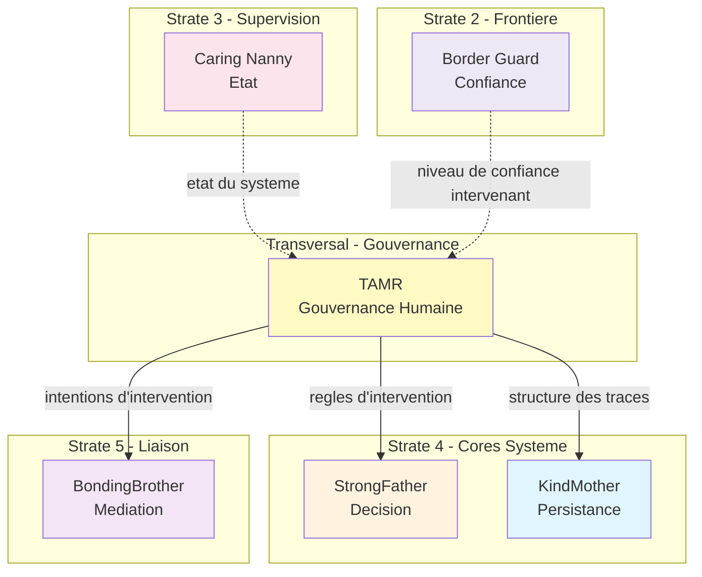

# TAMR — Index de Navigation

## Contexte

TAMR (The Authority Must Rest) est le **Human Interaction Core** du Miyukini Core System. Il definit le cadre conceptuel de l'intervention humaine dans le systeme : ou, quand, et comment l'humain intervient, avec quelles limites, et avec quelle tracabilite.

TAMR represente le **gardien de la place de l'humain** : il rappelle que certaines decisions necessitent un jugement humain, garantit que l'intervention reste possible, et assure que toute action humaine est tracee et responsabilisante.

**Strate :** Transversal (Gouvernance)  
**Role :** Gardien de la Gouvernance Humaine  
**Terminologie officielle :** [Miyukini Conceptual References - Glossaire](..//..//miyukini-webway-system//reference//_index.md)

---

## Question fondamentale

> **"Quand l'humain a-t-il le droit d'intervenir dans le systeme, et quelles sont les limites de cette intervention ?"**

Cette question se decline en :

- Quels types d'intervention humaine sont autorises ?
- Dans quelles conditions une intervention humaine est-elle necessaire ou possible ?
- Quelles sont les limites de l'autorite humaine ?
- Comment tracer et responsabiliser les interventions ?

---

## Structure de la documentation

### Foundation

Documents fondateurs definissant l'identite et le role de TAMR.

| Document | Description |
|----------|-------------|
| [Documentation Fondatrice](./foundation/TAMR%20-%20Documentation%20Fondatrice.md) | Definition conceptuelle, role, positionnement, invariants fondamentaux |

---

### Contracts

Contrats normatifs et non negociables.

#### Intervention

| Document | Description |
|----------|-------------|
| [Intervention Types Contract](./contracts/intervention/TAMR%20-%20Intervention%20Types%20Contract.md) | Types d'intervention (Approval, Override, Escalation, Supervision) |
| [Intervention Points Contract](./contracts/intervention/TAMR%20-%20Intervention%20Points%20Contract.md) | Definition des points d'intervention, conditions, declencheurs |

#### Boundaries

| Document | Description |
|----------|-------------|
| [Authority Limits Contract](./contracts/boundaries/TAMR%20-%20Authority%20Limits%20Contract.md) | Limites d'autorite humaine, restrictions contextuelles |
| [Inviolable Limits Contract](./contracts/boundaries/TAMR%20-%20Inviolable%20Limits%20Contract.md) | Limites infranchissables, protections absolues |

#### Governance

| Document | Description |
|----------|-------------|
| [Invariants & Guarantees](./contracts/governance/TAMR%20-%20Invariants%20&%20Guarantees.md) | Catalogue consolide INV-TAMR-1 a INV-TAMR-8 |
| [Violations & Anti-Patterns](./contracts/governance/TAMR%20-%20Violations%20&%20Anti-Patterns.md) | Violations cataloguees, anti-patterns d'intervention |
| [Conformance & Certification Rules](./contracts/governance/TAMR%20-%20Conformance%20&%20Certification%20Rules.md) | Criteres de conformite |

#### Audit

| Document | Description |
|----------|-------------|
| [Trace Contract](./contracts/audit/TAMR%20-%20Trace%20Contract.md) | Structure des traces d'intervention, exigences de tracabilite |
| [Error & Rejection Model](./contracts/audit/TAMR%20-%20Error%20&%20Rejection%20Model.md) | Distinction erreur/rejet d'intervention |

#### Integration

| Document | Description |
|----------|-------------|
| [StrongFather Integration Contract](./contracts/integration/TAMR%20-%20StrongFather%20Integration%20Contract.md) | Relation TAMR/StrongFather (regles vs decisions) |
| [KindMother Integration Contract](./contracts/integration/TAMR%20-%20KindMother%20Integration%20Contract.md) | Persistance des traces d'intervention |
| [BondingBrother Integration Contract](./contracts/integration/TAMR%20-%20BondingBrother%20Integration%20Contract.md) | Mediation des intentions d'intervention |

#### Security

| Document | Description |
|----------|-------------|
| [Security Contract](./contracts/security/TAMR%20-%20Security%20Contract.md) | Implications de securite, adaptation par niveaux T0-T4 et 0-4 |

---

### Architecture

| Document | Description |
|----------|-------------|
| [Architecture & Flows](./architecture/TAMR%20-%20Architecture%20&%20Flows.md) | Flux Approval, Override, Escalation, Supervision |
| [Integration Readiness Contract](./architecture/TAMR%20-%20Integration%20Readiness%20Contract.md) | Conditions d'integration |

---

### Lifecycle

| Document | Description |
|----------|-------------|
| [Versioning & Evolution Contract](./lifecycle/TAMR%20-%20Versioning%20&%20Evolution%20Contract.md) | Versioning, compatibilite, depreciation |
| [Release & Freeze Contract](./lifecycle/TAMR%20-%20Release%20&%20Freeze%20Contract.md) | Gel des contrats, inventaire |
| [Migration & Compatibility Contract](./lifecycle/TAMR%20-%20Migration%20&%20Compatibility%20Contract.md) | Migration progressive, rollback |

---

### Operations

| Document | Description |
|----------|-------------|
| [Operational Runbook](./operations/TAMR%20-%20Operational%20Runbook.md) | Guide SRE/Ops pour interventions humaines |
| [Performance & Scalability Contract](./operations/TAMR%20-%20Performance%20&%20Scalability%20Contract.md) | Contraintes conceptuelles performance et scalabilite |

---

### Implementation

| Document | Description |
|----------|-------------|
| [Reference Implementation Guidelines](./implementation/TAMR%20-%20Reference%20Implementation%20Guidelines.md) | Traduction conceptuelle vers implementation |
| [Testing & Validation Contract](./implementation/TAMR%20-%20Testing%20&%20Validation%20Contract.md) | Regles de test des interventions |

---

### Reference

| Document | Description |
|----------|-------------|
| [Examples Interventions](./reference/TAMR%20-%20Examples%20Interventions.md) | Exemples d'approbations, overrides, escalades, supervisions |
| [FAQ & Common Questions](./reference/TAMR%20-%20FAQ%20&%20Common%20Questions.md) | Questions frequentes |

---

## Invariants cles

| Invariant | Description |
|-----------|-------------|
| **INV-TAMR-1** | Tracabilite absolue — Toute intervention humaine est tracee, sans exception |
| **INV-TAMR-2** | Responsabilite explicite — L'humain qui intervient assume explicitement la responsabilite |
| **INV-TAMR-3** | Limites infranchissables — Certaines limites sont absolues et ne peuvent etre depassees |
| **INV-TAMR-4** | Separation conceptuel/technique — TAMR reste purement conceptuel |
| **INV-TAMR-5** | Non-decision — TAMR ne prend jamais de decision, ne valide jamais d'intervention |
| **INV-TAMR-6** | Automatisation par defaut — L'intervention humaine est l'exception controlee |
| **INV-TAMR-7** | Justification obligatoire pour override — Tout override necessite une justification explicite |
| **INV-TAMR-8** | Escalade non bloquante — Une escalade ne bloque pas indefiniment le systeme |

---

## Interdictions

| Code | Interdiction |
|------|--------------|
| **INTERD-TAMR-1** | TAMR ne peut pas prendre de decision |
| **INTERD-TAMR-2** | TAMR ne peut pas persister de donnees |
| **INTERD-TAMR-3** | TAMR ne peut pas definir d'interface utilisateur |
| **INTERD-TAMR-4** | TAMR ne peut pas gerer l'authentification |
| **INTERD-TAMR-5** | TAMR ne peut pas contenir de logique metier |
| **INTERD-TAMR-6** | TAMR ne peut pas remplacer l'automatisation |
| **INTERD-TAMR-7** | TAMR ne peut pas gerer la notification |

---

## Types d'intervention

| Type | Description |
|------|-------------|
| **Approbation (Approval)** | L'humain valide une action avant son execution |
| **Override (Derogation)** | L'humain force ou empeche une action malgre la decision automatique |
| **Escalade (Escalation)** | L'humain eleve une decision vers un niveau d'autorite superieur |
| **Supervision (Monitoring)** | L'humain observe et surveille avec capacite d'intervention |

---

## Relations avec les autres Cores

| Core | Relation |
|------|----------|
| **StrongFather** | Complementarite — TAMR definit les regles d'intervention, StrongFather decide si l'intervention est autorisee |
| **KindMother** | Service — KindMother persiste les traces d'intervention definies par TAMR |
| **BondingBrother** | Mediation — Toute intention d'intervention transite par BondingBrother |
| **CaringNanny** | Observation — CaringNanny observe l'etat du systeme pendant l'intervention |
| **BorderGuard** | Confiance — BorderGuard definit si l'intervenant est de confiance |
| **MasterButler** | Capacites — MasterButler expose les capacites d'intervention disponibles |
| **EverBuddy** | Evolution — EverBuddy gere l'evolution des regles d'intervention |

### Diagramme de relations

---

## Adaptation par niveau de confiance (T0-T4)

| Niveau | Etat | Comportement TAMR |
|--------|------|-------------------|
| **T0** | Normal | Non requis — Interventions optionnelles |
| **T1** | Instable | Optionnel — Surveillance humaine recommandee |
| **T2** | Degrade | Possible — Intervention humaine disponible |
| **T3** | Restreint | **Requis pour override** — Seul TAMR peut autoriser un deblocage |
| **T4** | Bloque | **Intervention humaine obligatoire** — Canal unique d'intervention |

---

## Adaptation par niveau de securite (0-4)

| Niveau | Profil | Comportement TAMR |
|--------|--------|-------------------|
| **0** | PUBLIC / DISPLAY | Non requis |
| **1** | STANDARD / CMS | Optionnel |
| **2** | SENSITIVE DATA | Possible |
| **3** | CRITICAL SYSTEM | Requis si doute |
| **4** | HARDENED / ISOLATED | Systematique |

---

## Conformite aux Lois d'Autonomie Systeme

TAMR est **intrinsequement compatible** avec les [Lois d'Autonomie Systeme](..//..//miyukini-webway-system//reference//_index.md) de par sa nature purement conceptuelle :

| Loi | Conformite | Note |
|-----|------------|------|
| **LOI-1** | ✅ Conforme | Cadre conceptuel pur, aucune dependance externe |
| **LOI-2** | ✅ Conforme | Intervention humaine possible en mode isole |
| **LOI-3** | ✅ Conforme | Interventions locales valides localement |
| **LOI-4** | ✅ Conforme | Aucune logique temporelle technique |
| **LOI-5** | ✅ Conforme | Cadre conceptuel sans ressource consommee |
| **LOI-6** | ✅ Conforme | Regles d'intervention restent locales par noeud |

---

## Concepts cles

| Concept | Description |
|---------|-------------|
| **Intervention** | Action deliberee d'un humain qui modifie, valide, suspend, ou annule un processus automatise |
| **Intervenant** | L'humain qui effectue une intervention, dont l'identite est toujours tracee |
| **Point d'intervention** | Moment defini dans un processus ou l'intervention humaine est possible ou requise |
| **Limite d'autorite** | Restriction sur ce que l'humain peut faire lors d'une intervention |
| **Limite infranchissable** | Limite absolue que meme un override ne peut depasser |
| **Trace d'intervention** | Enregistrement complet d'une intervention (identite, type, moment, contexte, resultat) |
| **Justification** | Explication fournie par l'humain pour une intervention exceptionnelle |
| **Responsabilite partagee** | Partage de responsabilite entre systeme et humain |

---

## Phrase fondatrice

> **TAMR definit ou, quand, et comment l'humain intervient dans le systeme Miyukini, garantissant que l'intervention humaine reste possible la ou elle est necessaire, impossible la ou elle est dangereuse, et tracable dans tous les cas.**

---

## Documents de reference

### Documentation de securite

- [Security - Core Integration Map](..//WorrySentinel//_index.md)
- [Security - Invariants & Guarantees](..//WorrySentinel//_index.md)
- [Doctrine Securite Fondamentale](..//..//miyukini-webway-system//reference//_index.md)

### Documentation conceptuelle

- [Miyukini Conceptual References - Security Levels](..//..//miyukini-webway-system//reference//_index.md)
- [Miyukini Conceptual References - Integrity Degradation System](..//..//miyukini-webway-system//reference//_index.md)
- [Miyukini Conceptual References - Lois Autonomie Systeme](..//..//miyukini-webway-system//reference//_index.md)

---

**Date de creation :** 2026-01-28  
**Version :** 1.0  
**Statut :** Document de navigation

