# Miyukini COG — Étude App Android Terminal

## Contexte

L’écosystème Miyukini COG prévoit, pour les **COGs TERMINAL** (type `TERMINAL`, `os_type` `ANDROID`), un client mobile embarqué **enfant d’un COG STABLE** du même utilisateur. Cette étude pose les bases d’une **app Android** permettant aux utilisateurs en mobilité d’interagir avec leur environnement COG via un terminal léger.

**Références :**

- [MWS - Passeport et Visa](../miyukini-webway-system/verification/MWS%20-%20Passeport%20et%20Visa.md)
- [Glossaire](..//miyukini-webway-system//reference//_index.md)
- [Comportement COG Environnements](..//miyukini-webway-system//reference//_index.md)

---

## Portée / Scope

- Définition architecturale du COG TERMINAL Android
- Contraintes MWS (relation parent-enfant, Passeport, Permis)
- Options techniques (stack UI, binaires, IPC)
- Fonctionnalités cibles pour utilisateurs nomades
- Scénarios de synchronisation et offline
- Pistes de roadmap MVP

**Public :** Architectes, développeurs, décisions produit.

---

## 1. Définition du COG Terminal Android

### 1.1 Rôle

| Aspect | Description |
|--------|-------------|
| **Type** | `TERMINAL` (cog_type = 0x05) |
| **OS** | `ANDROID` (os_type) |
| **Rôle** | Extension mobile du COG Stable ; capacités réduites |
| **Parent** | Obligatoire : `parent_cog_id` = cog_id du STABLE |
| **Limite** | 5 terminaux max par COG Stable (MWS) |

### 1.2 Contraintes MWS

| Règle | Description |
|-------|-------------|
| `parent_cog_id` | Toujours présent dans le Passeport |
| Même utilisateur | Parent et enfant = même identité utilisateur |
| Connexion | Via parent ou directe avec dépendance au parent |
| Blacklist | Si parent blacklisté → terminaux blacklistés |
| Passeport | STANDARD (émission automatique, comme STABLE) |

### 1.3 Flux de provisionnement (depuis le STABLE)

```mermaid
sequenceDiagram
    participant U as Utilisateur
    participant C as Miyukini Central (STABLE)
    participant T as App Android (TERMINAL)
    participant R as Relay MWS

    U->>C: "Créer un Terminal mobile"
    C->>C: Vérifier limite 5 terminaux
    C->>C: Générer cog_id pour TERMINAL
    C->>C: Créer liaison parent_cog_id
    C->>T: QR / lien de liaison (token temporaire)
    T->>T: Premier lancement : saisie token
    T->>T: Charger parent_cog_id, cog_id
    T->>R: Passeport (cog_type=TERMINAL, parent_cog_id)
    R->>R: Vérifier parent valide
    R->>T: Permis de circulation
    T->>C: Synchronisation initiale (services, préférences)
```



---

## 2. Options techniques

### 2.1 Stack UI — Dioxus (retenue)

**Décision :** Stack **Dioxus** retenue pour compatibilité maximale avec Miyukini Central (Rust partagé, patterns UI, réutilisation du thème).

| Option | Avantages | Inconvénients |
|--------|-----------|---------------|
| **Dioxus Mobile** ✓ | Code Rust partagé avec Central ; patterns connus ; hot-reload ; compatibilité maximale | Expérimental Android ; WebView ou WGPU ; config NDK/SDK lourde |
| ~~Kotlin + Compose~~ | — | Pas de partage avec Central ; deux codebases UI |

**Référence :** [Dioxus Mobile](https://dioxus.dev/learn/0.6/guides/mobile/) — rendu WebView ou WGPU, `dx serve` pour émulateurs.

### 2.2 Binaires et dépendances

| Composant | Option 1 | Option 2 |
|-----------|----------|----------|
| **Logique MWS** | Réutiliser `miyuwebway_participant` (Rust) via JNI | Port Kotlin des protocoles MWS |
| **Base locale** | SQLite / libSQL (KindMother) via FFI | Room (Kotlin) |
| **Réseau** | TCP/TLS via Rust (relay port 7000) | OkHttp / Ktor |
| **Authentification** | Token fourni par Central via lien/QR | Idem |

### 2.3 Architecture proposée (Dioxus)

```
┌─────────────────────────────────────────────────────┐
│  App Android (COG TERMINAL)                          │
├─────────────────────────────────────────────────────┤
│  UI Dioxus Mobile                                    │
│  - Écrans : liaison, salon, services, paramètres    │
├─────────────────────────────────────────────────────┤
│  Couche Services                                     │
│  - Provisionnement (parent_cog_id, Passeport)        │
│  - Synchronisation avec parent                      │
│  - Consommation services (JayKonta, JayKoa, etc.)   │
├─────────────────────────────────────────────────────┤
│  MWS Client (Rust, miyuwebway_participant)           │
│  - MiyuWebwayParticipant (allégé)                    │
│  - Relay connect (port 7000)                        │
│  - Tracker discovery (port 21000)                   │
├─────────────────────────────────────────────────────┤
│  Stockage local (SQLite / KindMother)                │
└─────────────────────────────────────────────────────┘
```

---

## 3. Fonctionnalités cibles (utilisateurs nomades)

### 3.1 Priorité haute (MVP)

| Fonctionnalité | Description |
|----------------|-------------|
| **Liaison au parent** | Scanner QR / saisir token depuis Central ; stockage sécurisé `parent_cog_id` |
| **Connexion MWS** | Présentation Passeport → obtention Permis ; heartbeats |
| **Vue services limitée** | Accès consultatif aux services du parent (JayKonta, JayKoa) |
| **Mode offline** | Cache local ; queue des actions différées ; sync à la reconnexion |
| **Notifications** | Alertes importantes (ex. rappels JayKoa, seuils JayKonta) |

### 3.2 Priorité moyenne

| Fonctionnalité | Description |
|----------------|-------------|
| **Actions simples** | Saisie dépense, création événement (délégué au parent) |
| **Découverte réseau** | Voir COGs accessibles (Lobbys, amis) via Tracker |
| **Sécurité** | Verrouillage app ; biométrie optionnelle |

### 3.3 Priorité basse

| Fonctionnalité | Description |
|----------------|-------------|
| **Multi-compte** | Plusieurs COG Stable liés (changement de contexte) |
| **Jeux mobiles** | Intégration Miyukini Survivor / Clicker (léger) |

---

## 4. Scénarios de synchronisation

### 4.1 Connexion directe au Relay

Le TERMINAL peut se connecter directement au Relay (comme un STABLE), en présentant un Passeport avec `parent_cog_id`. Le Relay vérifie que le parent est valide et délivre le Permis.

### 4.2 Connexion via parent (tunnel)

Alternative : le TERMINAL se connecte au parent STABLE (même réseau local ou tunnel), et le parent transmet les requêtes MWS. Moins de surface d’attaque, mais dépendance forte à la disponibilité du parent.

### 4.3 Mode offline

| État | Comportement |
|------|--------------|
| **Données en cache** | Lecture seule sur cache local (dernière sync) |
| **Actions différées** | Écrire en local ; queue sync ; rejouer à la reconnexion |
| **Conflict** | Politique : dernier écrit gagnant ou merge manuel (TAMR) |

---

## 5. Respect des Lois d’Autonomie

| Loi | Application au Terminal |
|-----|-------------------------|
| **LOI-1** | Pas de dépendance externe critique : fonctionne en offline limité |
| **LOI-2** | Isolement accepté : sync différée, pas de blocage |
| **LOI-3** | État local souverain : cache et queue locaux |
| **LOI-4** | Pas de temps global : horodatage local, sync asynchrone |
| **LOI-5** | Coût proportionnel : app légère, pas de services cloud obligatoires |
| **LOI-6** | Fédération : connexion MWS via Relay/Tracker |
| **LOI-7** | Cores immuables : Terminal = client d’un environnement versionné |
| **LOI-8** | Migration : via le parent ; pas de migration directe Terminal |

---

## 6. Dépendances projet existant

### 6.1 Crates à réutiliser ou adapter

| Crate | Usage |
|-------|-------|
| `miyuwebway_participant` | Transport, déclaration, discovery (port Android/JNI si Rust) |
| `apps/origin` (protocol) | Types `CogType`, `OsType`, messages Relay |
| `kindmother`, `kindmother-client` | Persistance optionnelle (si Rust backend) |

### 6.2 Modifications à prévoir

| Composant | Modification |
|-----------|--------------|
| **Relay (Origin)** | Déjà supporte `parent_cog_id` ; vérification parent valide à confirmer |
| **Central** | Nouvel écran "Gérer mes Terminaux" ; génération token/QR liaison |
| **Passeport** | Génération côté STABLE pour le TERMINAL ; transmission sécurisée |

---

## 7. Pistes de roadmap

### Phase 0 — Préparation (étude actuelle)

- [x] Document d’étude
- [x] Stack Dioxus retenue
- [ ] Documentation exhaustive (voir Plan de développement Phase 1)
- [ ] Spécification flux liaison Central → Terminal

### Phase 1 — Proof of concept

- [ ] App Android minimale (écran liaison + affichage statut)
- [ ] Connexion Relay avec Passeport TERMINAL
- [ ] Obtention Permis de circulation
- [ ] Stockage local `parent_cog_id`, `cog_id`

### Phase 2 — MVP

- [ ] Écran "Salon" avec liste services du parent
- [ ] Vue consultative (ex. JayKonta, JayKoa)
- [ ] Mode offline basique (cache)
- [ ] Intégration Central : création Terminal, QR/lien

### Phase 3 — Production

- [ ] Notifications push
- [ ] Actions simples (dépenses, événements)
- [ ] Tests E2E, signature release
- [ ] Documentation utilisateur

---

## 8. Risques et points de vigilance

| Risque | Mitigation |
|--------|------------|
| Dioxus Android instable | POC rapide (Phase 3) ; documentation Env Dev pour dépannage |
| Fatigue batterie (sync continue) | Sync par batch ; intervalles adaptatifs |
| Sécurité token liaison | Token à usage unique ; expiration courte ; chiffrement stockage |
| Fragmentation Android | Cibler API 24+ (Android 7) ; tests sur émulateurs multiples |

---

## 9. Références

- **MWS Passeport/Visa** : `docs/miyukini-webway-system/verification/MWS - Passeport et Visa.md`
- **Protocole Relay** : `docs/miyukini-webway-system/protocole/MWS - Protocole Relay.md`
- **Architecture** : `.cursor/skills/miyukini-architecture/SKILL.md`
- **Glossaire** : `.cursor/skills/miyukini-glossary/SKILL.md`
- **Dioxus Mobile** : [dioxus.dev/learn/0.6/guides/mobile](https://dioxus.dev/learn/0.6/guides/mobile/)

