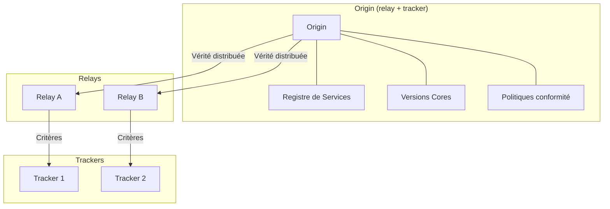
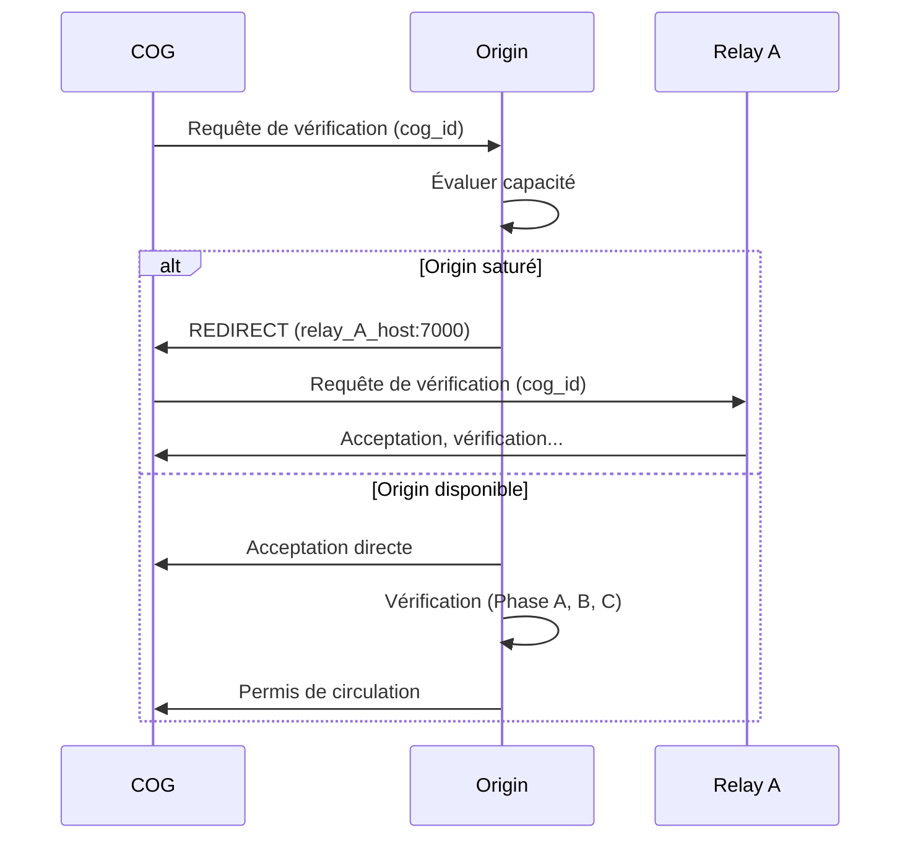

# MWS — Origin (Source de Vérité)

## Contexte

**Origin** est le **point d'origine** du Miyukini Webway System (MWS). Il cumule les fonctions de **relay** et de **tracker**, et constitue la **source de vérité unique** de l'écosystème. Toute information officielle (versions des Cores, Services, politiques de conformité, Passeports spéciaux) émane d'Origin.

**Référence fondatrice :** [MWS - Document Fondateur](../MWS%20-%20Document%20Fondateur.md)

## Portée / Scope

- Définition et rôle d'Origin dans l'architecture MWS
- Fonctions relay d'Origin (vérification, distribution)
- Fonctions tracker d'Origin (pools, catalogue, connexions)
- Source de vérité (Registre de Services, versions, politiques)
- Délivrance des Passeports spéciaux
- Protocole de présentation et redirection

---

## 1. Position d'Origin dans l'architecture

Origin est l'**unique point d'origine** du MWS. Tous les autres acteurs (relays, trackers, COGs) sont **subordonnés** à Origin, directement ou indirectement.



| Caractéristique | Description |
|-----------------|-------------|
| **Point d'entrée initial** | Tout COG se présente **d'abord à Origin** pour sa première vérification. |
| **Fonction duale** | Origin cumule les capacités **relay** (vérification de conformité) et **tracker** (connexions, pools). |
| **Source de vérité** | Toutes les informations officielles (versions, checksums, politiques) émanent d'Origin. |
| **Subordination** | Les relays et trackers héritent leur vérité d'Origin et lui sont subordonnés. |

### 1.2 Comment les clients obtiennent l'adresse d'Origin

L'adresse d'Origin **ne doit pas être falsifiable**. Les distributions (packages, installateurs) fournissent cette adresse via un **Manifeste Origin signé** : un fichier contenant l'URL canonique et le pin TLS, signé par l'autorité MWS. La clé publique de vérification est intégrée dans le client. Toute modification du manifeste invalide la signature et est rejetée. Voir [MWS - Manifeste Origin et Adresse Canonique](../securite/MWS%20-%20Manifeste%20Origin%20et%20Adresse%20Canonique.md).

---

## 2. Fonctions relay d'Origin

En tant que relay, Origin effectue les opérations suivantes :

### 2.1 Vérification de conformité

| Étape | Description |
|-------|-------------|
| **Réception du Passeport COG** | Origin reçoit le Passeport complet du COG (`cog_id`, `core_version`, `service_list`, `environment_health`, `previous_permis`, `passport_type`). |
| **Phase A : Clé de conformité des Cores** | Origin compare la clé cachée dans le code des Cores avec la clé attendue pour la version déclarée. |
| **Phase B : Blocs de code des Services** | Origin demande des blocs de code MIP aléatoires pour chaque Service et vérifie le déchiffrement. |
| **Phase C : Santé de l'environnement** | Origin vérifie le rapport de santé produit par WorrySentinel et KindMother. |
| **Décision** | Conforme → Permis de circulation (accord relay). Non-conforme → Quarantaine. |

### 2.2 Distribution des versions

| Capacité | Description |
|----------|-------------|
| **Versions des Cores** | Origin publie toutes les versions officielles des Cores (`core_version`, changelog, seuils minimaux). |
| **Services officiels** | Origin distribue les Services officiels Miyukini avec checksums et URLs de téléchargement. |
| **Services tiers** | Origin maintient un Registre des services tiers répertoriés et redirige vers leurs sources officielles. |

### 2.3 Redirection en cas de saturation

Si Origin est **saturé** (puissance de calcul insuffisante, trop de requêtes simultanées) :

1. Origin évalue la requête entrante.
2. Si impossible de traiter → Origin renvoie un message `REDIRECT` vers un relay disponible.
3. Le COG se reconnecte au relay désigné pour poursuivre la vérification.



---

## 3. Fonctions tracker d'Origin

En tant que tracker, Origin gère :

| Capacité | Description |
|----------|-------------|
| **Pools par version des Cores** | Dirige les COGs vers des pools isolés par `core_version.MAJOR`. |
| **Contrôle d'identité et contrôle tracker** | Vérifie le Permis de circulation avant connexion au maillage. |
| **Whitelists / Blacklists / Quarantaines** | Maintient les listes maîtres (partagées avec les trackers). |
| **Catalogue web (port 80)** | Catalogue des services WEB publics (URLs, recherche) ; catalogue de Lobbys tenu mais visible depuis les services COG, pas depuis le portail web. |
| **Monitoring réseau** | Surveille l'état du réseau, détecte les congestions. |

---

## 4. Source de vérité unique

### 4.1 Registre de Services

Le **Registre de Services** d'Origin contient :

#### Services officiels Miyukini

| Champ | Description |
|-------|-------------|
| `service_id` | Identifiant unique (ex. `webway.tracker`, `bridge`) |
| `current_version` | Version courante officielle (`MAJOR.MINOR.PATCH`) |
| `min_version` | Version minimale acceptée sur le réseau |
| `checksum` | Hash SHA-256 du binaire/package |
| `download_url` | URL de téléchargement officielle |
| `changelog_url` | URL du journal des modifications |
| `core_compatibility` | Liste des `core_version.MAJOR` compatibles |
| `status` | `ACTIVE`, `DEPRECATED`, `RETIRED` |

#### Services tiers répertoriés

| Champ | Description |
|-------|-------------|
| `service_id` | Identifiant unique (préfixe `third.` ou namespace éditeur) |
| `publisher` | Nom de l'éditeur |
| `official_source_url` | URL de la source officielle de l'éditeur |
| `current_version` | Dernière version connue |
| `checksum` | Hash SHA-256 de la version répertoriée |
| `core_compatibility` | `core_version.MAJOR` compatibles |
| `review_status` | `APPROVED`, `PENDING_REVIEW`, `SUSPENDED` |
| `registration_date` | Date d'enregistrement |

### 4.2 Versions des Cores

Origin publie et maintient :

| Élément | Description |
|---------|-------------|
| **Version courante** | La dernière version stable des Cores |
| **Historique** | Toutes les versions précédentes avec changelogs |
| **Clés de conformité** | Clés cachées associées à chaque `core_version` |
| **Seuils minimaux** | `min_core_version` pour le réseau |

### 4.3 Politiques de conformité

| Politique | Description |
|-----------|-------------|
| **Critères de sécurité** | Règles de vérification (Phase A, B, C) |
| **Seuils de quarantaine** | Délais et escalade (1h, 2h, blacklist) |
| **Règles de blacklistage** | Conditions de mise en blacklist |
| **Passeports spéciaux** | Registre des COGs avec Passeport spécial |

---

## 5. Passeports spéciaux

**Origin est le seul** à pouvoir délivrer des **Passeports spéciaux**. Ces passeports concernent les COGs à usage **professionnel** ou à **fort trafic**.

| Caractéristique | Description |
|-----------------|-------------|
| **ID spéciale** | Identifiant unique renforcé |
| **Clé spéciale** | Clé cryptographique attestant le statut professionnel |
| **Contrôle allégé quotidien** | Vérification simplifiée au quotidien |
| **Contrôle renforcé lors des audits** | Vérifications approfondies planifiées |
| **Cas d'usage** | Sites de grandes entreprises, serveurs de services, jeux MMO |
| **Protocole de délivrance** | Audit préalable, attestation, processus spécifique avec Origin |

### 5.1 Protocole de délivrance

1. **Demande** : Le COG soumet une demande de Passeport spécial à Origin.
2. **Audit préalable** : Origin audite le COG (conformité, historique, cas d'usage).
3. **Attestation** : Si approuvé, Origin génère une clé spéciale et l'enregistre.
4. **Délivrance** : Le COG reçoit son Passeport spécial avec l'ID et la clé.
5. **Renouvellement** : Audits périodiques pour maintenir le statut.

---

## 6. Services sur Origin (exclusivement MWS)

Origin est **exclusivement dédié au MWS**. Aucun service hors périmètre MWS n'est installé ni exécuté sur la VM Origin.

### 6.1 Services MWS présents

| Service | Port | Description |
|---------|------|-------------|
| **Origin Relay** | 7000 | Vérification de conformité, délivrance de Permis |
| **Origin Tracker** | 21000 | Pools, découverte, Lobbys, catalogue |
| **Portail web Origin** | 80/443 (`/`) | Site public MWS (voir § 6.2) + bouton d'accès MiyukiniAdmin Origin |
| **MiyukiniAdmin Origin** | 443 (`/admin`) | Panneau d'administration spécifique à Origin : tests, monitoring, gestion (accès restreint) |
| **Registre de Services** | interne | Liste officielle des services autorisés |

### 6.2 Portail web Origin (racine `/`)

La racine du serveur web d'Origin (`https://origin.miyukini.com/` ou l'URL du VPS Hostinger) affiche le **portail public MWS** avec le contenu suivant :

| Contenu | Description |
|---------|-------------|
| **Présentation du projet** | Présentation globale de Miyukini COG |
| **Documentation** | Documentation officielle complète |
| **Téléchargement** | Versions des COGs, Cores, packages officiels |
| **Dev blog** | Blog de développement et actualités |
| **Annonces globales** | Nouvelles versions, alertes, communications officielles |

En bas ou en en-tête du portail, un **bouton d'accès** renvoie vers la page d'authentification de **MiyukiniAdmin Origin** (`/admin`). Ce bouton est visible publiquement mais la page `/admin` elle-même est protégée par le protocole d'identification (e-mail + mot de passe Argon2id).

```
┌──────────────────────────────────────────────────────────────┐
│  origin.miyukini.com                                         │
│══════════════════════════════════════════════════════════════│
│                                                              │
│   ╔══════════════════════════════════════════════════════╗   │
│   ║            Miyukini COG — Webway System              ║   │
│   ╚══════════════════════════════════════════════════════╝   │
│                                                              │
│   ┌──────────────┐  ┌──────────────┐  ┌──────────────────┐  │
│   │ Présentation │  │ Documentation│  │  Téléchargement  │  │
│   └──────────────┘  └──────────────┘  └──────────────────┘  │
│                                                              │
│   ┌──────────────┐  ┌──────────────────────────────────────┐ │
│   │   Dev Blog   │  │       Annonces globales              │ │
│   └──────────────┘  └──────────────────────────────────────┘ │
│                                                              │
│                              ┌──────────────────────────┐    │
│                              │  MiyukiniAdmin Origin ➜  │    │
│                              │     (Authentification)    │    │
│                              └──────────────────────────┘    │
│                                                              │
└──────────────────────────────────────────────────────────────┘
```

### 6.3 Services exclus

| Exclusion | Raison |
|-----------|--------|
| Services applicatifs tiers | S'exécutent sur les COGs, pas sur Origin |
| Jeux, streaming, messagerie | Services utilisateurs — hors périmètre |
| CDN de contenu | Origin ne sert pas de CDN (sauf catalogue MWS) |
| CI/CD, monitoring externe | Le monitoring est intégré dans MiyukiniAdmin |
| Base de données externe | Origin utilise son propre stockage embarqué |

### 6.4 MiyukiniAdmin Origin

**MiyukiniAdmin Origin** est le panneau d'administration **spécifique à Origin**, accessible uniquement à l'administrateur authentifié (détenteur de la distribution stable). Il fournit :

- **Batterie complète de tests** (connectivité, fonctionnel MWS, sécurité, réseau)
- **Monitoring en temps réel** (métriques système et MWS, alertes 3 niveaux)
- **Gestion des services** (restart, Registre, versions Cores, quarantaines, blacklists, alertes réseau)

> **Note :** MiyukiniAdmin est un concept générique ; chaque acteur MWS peut disposer de son propre MiyukiniAdmin adapté à son rôle. Celui d'Origin est le plus complet car Origin est la source de vérité.

Voir [MWS - MiyukiniAdmin](../administration/MWS%20-%20MiyukiniAdmin.md) pour la documentation complète.

---

## 7. Résilience et haute disponibilité

| Aspect | Description |
|--------|-------------|
| **Point unique** | Origin est unique ; sa disponibilité est critique. |
| **Redirection** | En cas de saturation, redirection vers les relays. |
| **Mode lecture seule** | En cas d'alerte réseau, Origin reste accessible en lecture seule. |
| **Reconstruction** | En cas de défaillance, les relays maintiennent la vérité héritée jusqu'à restauration. |

### 7.1 Implémentation actuelle

Origin est hébergé sur un **VPS Hostinger** (Debian 13) :

| Paramètre | Valeur |
|-----------|--------|
| **IP publique** | `46.202.129.65` |
| **Domaine** | `origin.miyukini.com` (à configurer) |
| **Port relay** | 7000 |
| **Port tracker** | 21000 |
| **Port web** | 80 / 443 |

Pour le guide complet d'installation et de configuration, voir [MWS - Implémentation Origin Hostinger](../deploiement/MWS%20-%20Implementation%20Origin%20Hostinger.md).

---

## 8. Schéma récapitulatif

```
+------------------------+
|        ORIGIN          |
|------------------------|
| Fonction RELAY :       |
| - Vérification (A,B,C) |
| - Permis de circulation  |
| - Distribution versions|
| - Passeports spéciaux  |
|------------------------|
| Fonction TRACKER :     |
| - Pools par version    |
| - Catalogue web (services WEB publics) ; catalogue de Lobbys (visible depuis les services) |
| - Whitelists/Blacklists|
| - Monitoring réseau    |
|------------------------|
| Source de VÉRITÉ :     |
| - Registre de Services |
| - Versions des Cores   |
| - Politiques conformité|
| - Clés de conformité   |
+------------------------+
         |
         | Vérité distribuée
         v
+--------+--------+
| Relays | Trackers|
+--------+--------+
```

---

## Références

- [MWS - Document Fondateur](../MWS%20-%20Document%20Fondateur.md)
- [MWS - Relays](./MWS%20-%20Relays.md)
- [MWS - Trackers](./MWS%20-%20Trackers.md)
- [MWS - Manifeste Origin et Adresse Canonique](../securite/MWS%20-%20Manifeste%20Origin%20et%20Adresse%20Canonique.md)
- [MWS - MiyukiniAdmin](../administration/MWS%20-%20MiyukiniAdmin.md) — panneau d'administration Origin
- [MWS - Implémentation Origin Hostinger](../deploiement/MWS%20-%20Implementation%20Origin%20Hostinger.md) — guide complet de déploiement
- [MWS - Haute Disponibilité Origin](../securite/MWS%20-%20Haute%20Disponibilite%20Origin.md) — architecture actif-passif, failover
- [Miyukini Webway Relay](../../reference/Miyukini%20Conceptual%20References%20-%20Miyukini%20Webway%20Relay.md) — sections 1, 3, 6

---

**Version :** 3.0  
**Mise à jour :** Services MWS uniquement, MiyukiniAdmin, scope restreint  
**Classification :** Documentation MWS — Acteurs
