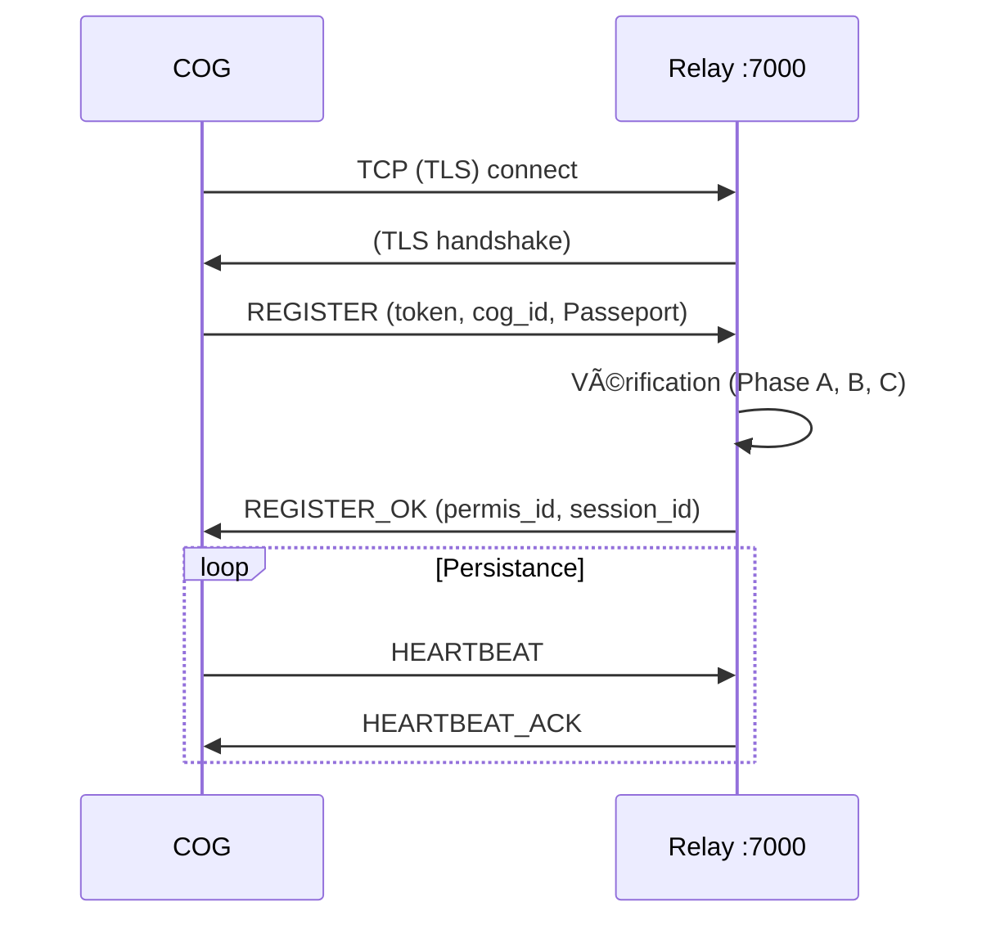

# MWS — Relays (Duplications d'Origin)

## Contexte

Les **relays** sont des **duplications d'Origin**, placés sous l'autorité d'Origin. Ils garantissent la **conformité en substance** des COGs, la **maintenance des environnements** et la **distribution des versions** (mises à jour). Chaque relay héberge une copie de la vérité d'Origin et peut effectuer les mêmes vérifications de conformité.

**Référence fondatrice :** [MWS - Document Fondateur](../MWS%20-%20Document%20Fondateur.md)

## Portée / Scope

- Position des relays dans l'architecture MWS
- Fonctions de vérification de conformité
- Distribution des versions et mises à jour
- Transport et routing des tunnels
- Synchronisation avec Origin
- Services web des relays

---

## 1. Position dans l'architecture

Les relays sont des **extensions d'Origin** réparties géographiquement ou par capacité. Ils permettent de :

- **Décharger Origin** : absorber le trafic de vérification
- **Rapprocher géographiquement** : réduire la latence pour les COGs
- **Assurer la continuité** : maintenir le service si Origin est temporairement saturé

```mermaid
flowchart TB
    subgraph Origin["Origin"]
        O[Origin]
    end

    subgraph Relays["Relays (duplications)"]
        R1[Relay A<br>Europe]
        R2[Relay B<br>Amérique]
        R3[Relay C<br>Asie]
    end

    subgraph COGs["COGs"]
        C1[COG EU]
        C2[COG US]
        C3[COG ASIA]
    end

    O -->|Vérité| R1
    O -->|Vérité| R2
    O -->|Vérité| R3

    C1 -->|Vérification| R1
    C2 -->|Vérification| R2
    C3 -->|Vérification| R3
```



| Caractéristique | Description |
|-----------------|-------------|
| **Subordination** | Tous les relays sont sous l'autorité d'Origin. |
| **Vérité héritée** | Chaque relay possède une copie synchronisée de la vérité d'Origin. |
| **Autonomie de vérification** | Un relay peut vérifier un COG sans contacter Origin en temps réel. |
| **Pas de divergence** | Un relay ne peut pas modifier la vérité ; il l'applique telle que reçue d'Origin. |

---

## 2. Fonctions de vérification

Les relays effectuent la **vérification de conformité** des COGs selon le même protocole qu'Origin.

### 2.1 Réception du Passeport COG

Le COG transmet son **Passeport complet** :

| Champ | Description |
|-------|-------------|
| `cog_id` | Identifiant unique du COG |
| `core_version` | Version des Cores (`MAJOR.MINOR`) |
| `service_list` | Services installés avec versions et checksums |
| `environment_health` | Rapport de santé (WorrySentinel, KindMother) |
| `previous_permis` | Historique des Permis de circulation précédents |
| `passport_type` | `STANDARD` ou `SPECIAL` |
| `special_key` | (Passeports spéciaux) Clé délivrée par Origin |

### 2.2 Vérification en trois phases

#### Phase A : Clé de conformité des Cores

| Étape | Description |
|-------|-------------|
| Le relay possède la clé attendue | Héritée d'Origin, stockée dans le cache du relay |
| Le COG transmet la clé cachée | Générée par les Cores, non accessible de l'extérieur |
| **Concordance** | Cores authentiques → passer à Phase B |
| **Discordance** | Cores potentiellement corrompus → quarantaine |

#### Phase B : Blocs de code des Services

1. Le relay sélectionne un **bloc de code aléatoire** (au sens MIP) pour chaque Service.
2. Le Service envoie un **paquet chiffré** contenant ce bloc.
3. Le relay **déchiffre** en utilisant les références d'Origin.
4. **Concordance** → Service authentique. **Discordance** → Service suspect.
5. En cas de doute → vérification étendue à tout le code (sécurité renforcée).

> **Note :** Si la version du Service est simplement en retard (valide mais non-courante), le relay émet une **notification de mise à jour**, pas une alerte de non-conformité.

#### Phase C : Santé de l'environnement

Le relay vérifie le rapport `environment_health` :

| Vérification | Description |
|--------------|-------------|
| Intégrité du stockage | Pas de corruption détectée par KindMother |
| Configuration cohérente | Strates intactes, configuration valide |
| Attestation signée | Rapport signé par WorrySentinel |

### 2.3 Résultat de la vérification

| Résultat | Action |
|----------|--------|
| **Conforme** | Permis de circulation délivré (accord relay) |
| **Version en retard** | Notification de mise à jour (pas d'alerte) |
| **Non-conforme** | Quarantaine (voir [MWS - Quarantaine et Blacklist](../securite/MWS%20-%20Quarantaine%20et%20Blacklist.md)) |

---

## 3. Délivrance du Permis de circulation (accord relay)

En cas de conformité, le relay délivre un **Permis de circulation** (accord relay) :

| Champ | Description |
|-------|-------------|
| `permis_id` | Identifiant unique du permis |
| `cog_id` | COG concerné |
| `issued_by` | Relay (ou Origin) émetteur |
| `issued_at` | Date et heure d'émission |
| `expires_at` | Date et heure d'expiration |
| `scope` | Portée (intentions déclarées par le COG) |
| `core_version` | Version des Cores validée |
| `passport_type` | `STANDARD` ou `SPECIAL` |

Le COG peut alors se connecter au Webway par les **trackers officiels** dont les adresses sont remises avec le Permis (liste fournie par le relay, trackers connus d'Origin). Le Permis est valable sur tout le réseau accessible au COG. Un COG ne peut et ne doit pas se connecter à un tracker inconnu d'Origin. Les trackers effectuent le contrôle tracker (vérification du Permis de circulation) avant d'autoriser les connexions.

---

## 4. Distribution des versions et mises à jour

Les relays sont la **source de distribution** des versions pour les COGs.

### 4.1 Liste officielle des Services

Chaque relay possède une copie du **Registre de Services** d'Origin :

| Contenu | Description |
|---------|-------------|
| Services officiels | `service_id`, `current_version`, `min_version`, `checksum`, `download_url` |
| Services tiers | `service_id`, `publisher`, `official_source_url`, `review_status` |

### 4.2 Versions des Cores

| Contenu | Description |
|---------|-------------|
| `core_version` courante | Dernière version stable |
| Clés de conformité | Clés attendues pour chaque version |
| Historique | Versions précédentes et changelogs |

### 4.3 Notifications de mise à jour

Le relay peut informer un COG d'une mise à jour disponible :

| Mécanisme | Description |
|-----------|-------------|
| **Dans REGISTER_OK** | Inclure `UPDATE_RECOMMENDED` avec les versions disponibles |
| **Message UPDATE_AVAILABLE** | Notification push via le tunnel actif |

Contenu de la notification :

| Champ | Description |
|-------|-------------|
| `service_id` | Service concerné |
| `current_version` | Version installée sur le COG |
| `available_version` | Version disponible |
| `severity` | `critical`, `recommended`, `optional` |
| `download_url` | URL de téléchargement |
| `checksum` | Hash SHA-256 |

### 4.4 Redirection vers les sources

| Type de service | Action du relay |
|-----------------|-----------------|
| Service officiel | Fournit l'URL de téléchargement Miyukini |
| Service tiers | Redirige vers la source officielle de l'éditeur |

Le relay **ne distribue pas** les binaires tiers ; il redirige vers les sources officielles.

---

## 5. Transport et routing

### 5.1 Enregistrement du tunnel



### 5.2 Table de routage

Le relay maintient une **table de routage** :

| Clé | Valeur |
|-----|--------|
| `cog_id` | Tunnel actif, empreinte de version |

Lorsqu'une connexion arrive avec une cible `cog_id` :

1. Consulter la table de routage
2. Si tunnel enregistré → transmettre les données
3. Sinon → erreur (COG non enregistré)

### 5.3 Multi-COG et isolation

| Principe | Description |
|----------|-------------|
| **Multi-COG** | Plusieurs `cog_id` peuvent s'enregistrer sur le même relay |
| **Isolation stricte** | Le trafic d'un `cog_id` ne doit jamais être routé vers un autre |
| **Pas d'énumération** | Le relay ne révèle pas la liste des `cog_id` enregistrés |

---

## 6. Synchronisation avec Origin

### 6.1 Mécanisme de synchronisation

| Aspect | Description |
|--------|-------------|
| **Push depuis Origin** | Origin pousse les mises à jour (nouvelles versions, politiques) vers les relays |
| **Pull périodique** | Les relays interrogent Origin périodiquement pour vérifier les mises à jour |
| **Invalidation** | Si une entrée du Registre est modifiée, Origin notifie tous les relays |

### 6.2 Cohérence

| Principe | Description |
|----------|-------------|
| **Cohérence éventuelle** | Les relays peuvent avoir un léger retard sur Origin (quelques secondes) |
| **Pas de divergence** | Un relay ne peut pas avoir une vérité différente ; seulement en retard |
| **Fallback vers Origin** | En cas de doute, le relay peut interroger Origin en temps réel |

---

## 7. Services web des relays

Chaque relay expose un **serveur web** (port 80/443) :

| Contenu | Description |
|---------|-------------|
| **Présentation du projet** | Présentation globale de Miyukini COG |
| **Documentation** | Documentation officielle |
| **Téléchargement** | Versions des COGs (héritées d'Origin) |
| **Dev blog** | Blog de développement |
| **Annonces globales** | Nouvelles versions, alertes |

Les relays sont **source de vérité pour ces contenus** mais restent **subordonnés à Origin**.

---

## 8. Sécurité des relays

### 8.1 TLS obligatoire

| Exigence | Description |
|----------|-------------|
| TLS 1.2+ | Minimum TLS 1.2, recommandé TLS 1.3 |
| PFS | Perfect Forward Secrecy obligatoire |
| Certificat validé | Signé par une CA reconnue |

### 8.2 Authentification

| Mécanisme | Description |
|-----------|-------------|
| Token 256+ bits | Entropie minimale pour l'authentification |
| Replay protection | Nonce + timestamp obligatoires |
| Rotation possible | Tokens révocables et renouvelables |

### 8.3 Rate limiting

| Seuil | Description |
|-------|-------------|
| Enregistrements | Limiter par adresse source et par token |
| Connexions | Limiter les connexions simultanées |
| Débit par tunnel | Limiter bytes/s et connexions/s |

---

## 9. Ports et déploiement

| Port | Usage |
|------|-------|
| **7000** | Protocole relay (TCP + TLS) |
| **80/443** | Services web (site, téléchargements) |

Voir [Miyukini - Webway Relay Deployment Guide](..//setup//Miyukini%20-%20Webway%20Relay%20Deployment%20Guide.md) pour le déploiement complet.

---

## 10. Schéma récapitulatif

```
+------------------------+
|        RELAY           |
|------------------------|
| VÉRIFICATION :         |
| - Phase A : Clé Cores  |
| - Phase B : Blocs MIP  |
| - Phase C : Santé env. |
| - Permis de circulation  |
|------------------------|
| DISTRIBUTION :         |
| - Versions Cores       |
| - Services officiels   |
| - Redirection tiers    |
| - Notifications MAJ    |
|------------------------|
| TRANSPORT :            |
| - Table de routage     |
| - Multi-COG            |
| - Isolation stricte    |
|------------------------|
| SERVICES WEB :         |
| - Documentation        |
| - Téléchargements      |
| - Annonces             |
+------------------------+
         ^
         | Vérité héritée
         |
+--------+--------+
|     ORIGIN      |
+-----------------+
```

---

## Références

- [MWS - Document Fondateur](../MWS%20-%20Document%20Fondateur.md)
- [MWS - Origin](./MWS%20-%20Origin.md)
- [MWS - Trackers](./MWS%20-%20Trackers.md)
- [Miyukini Webway Relay](..//reference//_index.md)
- [Miyukini Webway Relay Protocol](..//reference//_index.md)

---

**Version :** 1.0  
**Classification :** Documentation MWS — Acteurs


