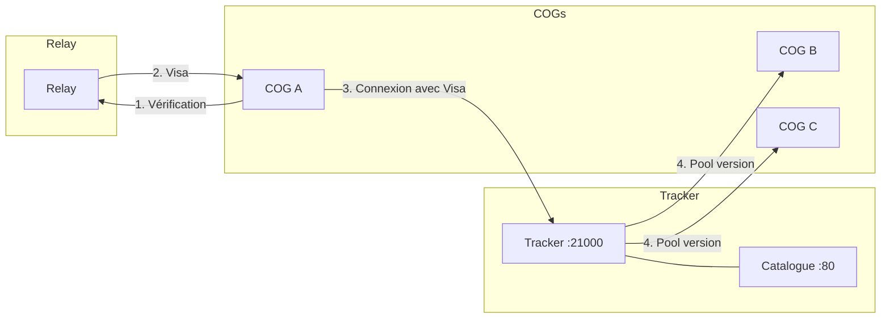
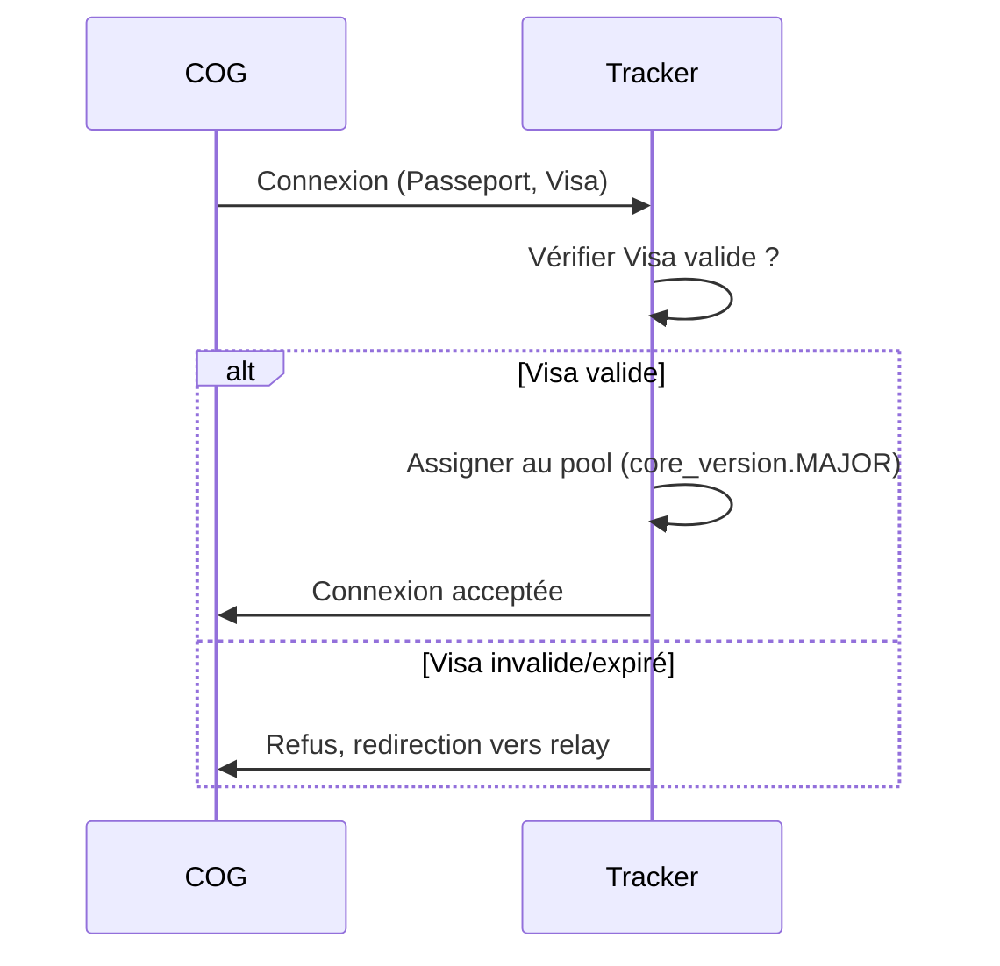
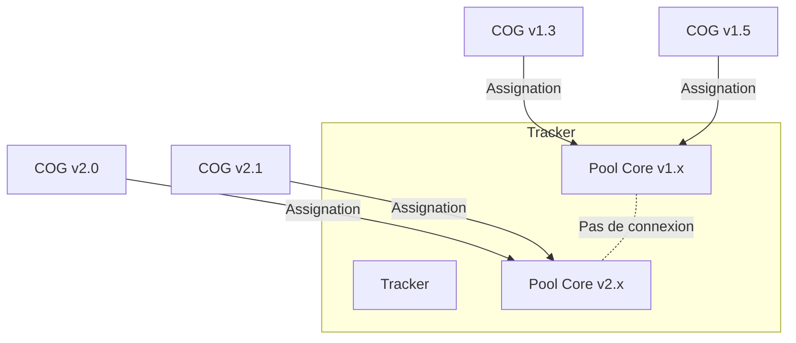
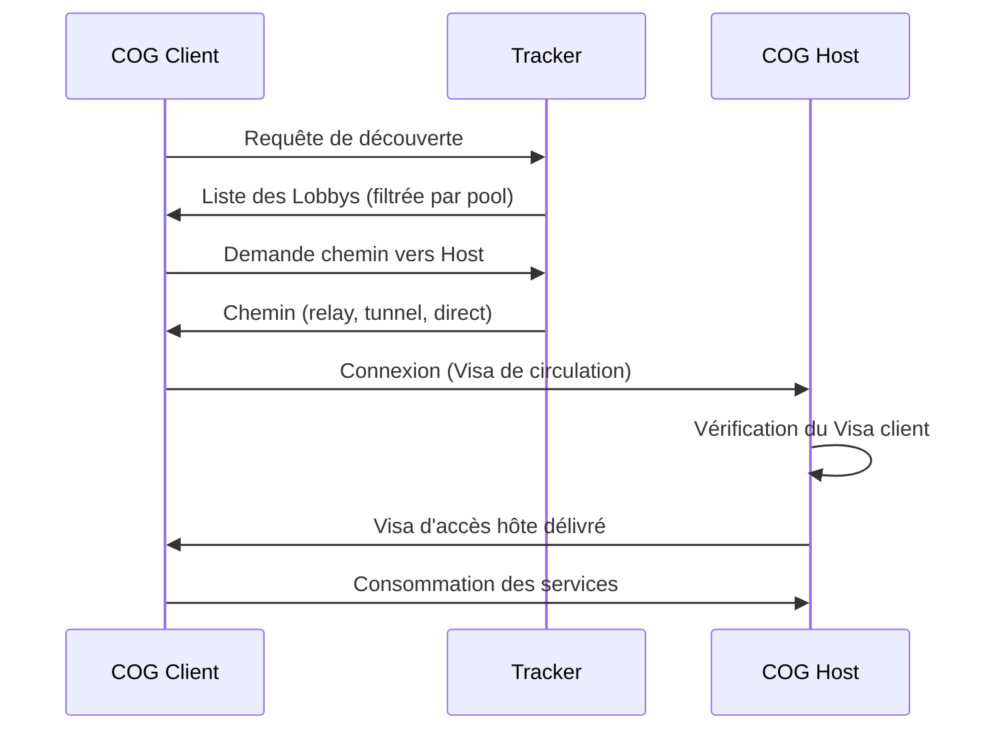

# MWS — Trackers (Douaniers du Réseau)

## Contexte

Les **trackers** sont les **douaniers du réseau** Miyukini Webway. Ils assurent les **connexions entre COGs** et en garantissent la sécurité par des **contrôles d'identité et de Visa**. Ils gèrent les **pools par version des Cores**, les **whitelists/blacklists/quarantaines**, le **catalogue** des COGs connectés et les **Lobbys** d'exposition de services.

> **Principe fondamental :** Le Tracker **ne fait pas** de vérification lourde de conformité (Passeport, clé Cores, blocs de code Services). Cette responsabilité incombe aux **relays** qui délivrent les Visas. Le Tracker vérifie uniquement l'identité et le Visa de circulation.

**Référence fondatrice :** [MWS - Document Fondateur](../MWS%20-%20Document%20Fondateur.md)

## Portée / Scope

- Rôle de douanier : contrôle d'identité et de Visa
- Pools par version des Cores
- Gestion des whitelists, blacklists, quarantaines
- Catalogue et Lobbys (port 80)
- Monitoring réseau et congestion
- Fermeture de connexions (confinement)
- Systèmes passifs et actifs

---

## 1. Position dans l'architecture

Les trackers sont le **point d'entrée** des COGs sur le maillage MWS après obtention de leur Visa de circulation auprès d'un relay.



| Caractéristique | Description |
|-----------------|-------------|
| **Douanier** | Le Tracker contrôle l'identité et le Visa, comme un douanier à une frontière. |
| **Passerelle** | Il permet aux COGs vérifiés de se découvrir et de se connecter. |
| **Pools isolés** | Il maintient des pools séparés par `core_version.MAJOR`. |
| **Catalogue** | Il expose un catalogue web des COGs et leurs Lobbys (port 80). |

---

## 2. Contrôle d'identité et de Visa

### 2.1 Présentation au Tracker

Quand un COG se présente au Tracker :

1. **Présentation du Passeport** : Le COG montre son Passeport pour un contrôle initial.
2. **Vérification du Visa** : Le Tracker vérifie que le COG possède un **Visa de circulation valide** :
   - Non expiré
   - Émis par un relay ou Origin reconnu
   - Scope cohérent avec la requête
3. **Assignation au pool** : Le COG est dirigé vers le pool correspondant à sa `core_version.MAJOR`.



### 2.2 Ce que le Tracker NE fait PAS

| Le Tracker NE fait PAS | Responsable |
|------------------------|-------------|
| Vérification de la clé de conformité des Cores | Relay / Origin |
| Vérification des blocs de code des Services | Relay / Origin |
| Vérification de la santé de l'environnement | Relay / Origin |
| Délivrance du Visa de circulation | Relay / Origin |
| Délivrance des Passeports spéciaux | Origin uniquement |

Le Tracker **fait confiance au Visa** délivré par le relay. S'il y a un doute, il redirige vers un relay pour re-vérification.

---

## 3. Pools par version des Cores

### 3.1 Principe d'isolation

Les COGs sont **isolés par version majeure des Cores** :

| Principe | Description |
|----------|-------------|
| **Pools séparés** | Chaque `core_version.MAJOR` forme un pool distinct. |
| **Pas de connexion inter-pool** | Un COG en `core_version 1.x` ne peut **jamais** se connecter à un COG en `core_version 2.x`. |
| **Compatibilité Services** | Les Services peuvent différer (MINOR, PATCH) dans le même pool ; seul le MAJOR des Cores compte. |

### 3.2 Assignation et filtrage



### 3.3 Réponses de découverte filtrées

Quand un COG demande la liste des COGs (découverte) :

1. Le Tracker identifie la `core_version.MAJOR` du demandeur.
2. Il ne retourne que les COGs du **même pool** (même `core_version.MAJOR`).
3. Les COGs d'autres pools sont **exclus** automatiquement.

---

## 4. Gestion des listes (Whitelists, Blacklists, Quarantaines)

### 4.1 Whitelists

| Champ | Description |
|-------|-------------|
| `cog_id` ou `IP` | Identifiant du COG ou adresse IP |
| `source` | Origin, relay, ou local |
| `reason` | Raison de la whitelist |
| `added_at` | Date d'ajout |

Les COGs whitelistés bénéficient de contrôles allégés.

### 4.2 Blacklists

| Champ | Description |
|-------|-------------|
| `cog_id` ou `IP` | Identifiant du COG ou adresse IP |
| `source` | Origin, relay, ou local |
| `reason` | Raison de la blacklist (non-conformité, attaque...) |
| `added_at` | Date d'ajout |
| `expires_at` | Date d'expiration (si temporaire) |

Les COGs blacklistés sont **refusés** par le Tracker. Voir [MWS - Quarantaine et Blacklist](../securite/MWS%20-%20Quarantaine%20et%20Blacklist.md).

### 4.3 Quarantaines

| Champ | Description |
|-------|-------------|
| `cog_id` | Identifiant du COG |
| `reason` | Raison de la quarantaine |
| `started_at` | Date de début |
| `duration` | Durée (1h, 2h, ...) |
| `attempt` | Numéro de tentative (1, 2, 3) |

Les COGs en quarantaine sont temporairement isolés et ne peuvent pas se connecter au maillage.

### 4.4 Synchronisation des listes

| Source | Description |
|--------|-------------|
| **Origin** | Liste maître, synchronisée vers tous les relays et trackers |
| **Relays** | Propagent les décisions de quarantaine/blacklist |
| **Trackers** | Appliquent les listes et peuvent ajouter des entrées locales |

---

## 5. Catalogue et Lobbys (port 80)

### 5.1 Service web de portail

Les trackers exposent un **service web de portail** (port 80) qui catalogue les COGs connectés et leurs **surfaces de connexion** exposées.

| Caractéristique | Description |
|-----------------|-------------|
| **Catalogue global** | Mis à jour et diffusé automatiquement |
| **Facilitateur** | Les COGs n'ont pas besoin de nom de domaine ni d'IP fixe |
| **Chemins** | Le Tracker indique les chemins pour joindre les COGs hôtes |

### 5.2 Présentation des surfaces au Tracker

Quand un COG se présente au Tracker (après validation du Visa), il déclare :

| Déclaration | Description |
|-------------|-------------|
| **Surfaces de connexion** | Quels services sont exposés, sur quels ports |
| **Attentes et désirs** | Ce que le COG propose et/ou cherche à joindre |
| **Acceptation de connexions** | Si le COG accepte des connexions entrantes |

### 5.3 Création de Lobbys

Si le COG **accepte des connexions** pour certains services et ports, cela crée un **Lobby** dans le catalogue :

| Champ | Description |
|-------|-------------|
| `lobby_id` | Identifiant unique du Lobby |
| `host_cog_id` | COG hébergeur |
| `services` | Services exposés |
| `ports` | Ports concernés |
| `visibility` | `public` ou `private` |
| `password_protected` | Booléen (si privé) |
| `core_version` | Version des Cores du hôte |

### 5.4 Lobbys privés

| Règle | Description |
|-------|-------------|
| **Accès privé** | Le COG hôte peut protéger un Lobby par mot de passe |
| **Limite d'échecs** | 5 échecs maximum → ban du COG client |
| **Notification** | En cas de ban, notification à l'utilisateur hôte |
| **Dé-ban** | Manuel uniquement par l'utilisateur du COG hôte |

Voir [MWS - Lobbys, Favoris et Amis](../lobbys/MWS%20-%20Lobbys%20Favoris%20et%20Amis.md) pour les détails.

---

## 6. Connexions entre COGs

### 6.1 Flow client → hôte



### 6.2 Visa d'accès hôte

Distinct du **Visa de circulation** (relay), le **Visa d'accès hôte** est délivré par le COG hôte :

| Champ | Description |
|-------|-------------|
| `access_visa_id` | Identifiant unique |
| `client_cog_id` | COG client autorisé |
| `host_cog_id` | COG hôte |
| `services_authorized` | Services accessibles |
| `issued_at` | Date d'émission |
| `expires_at` | Date d'expiration |

---

## 7. Monitoring réseau et congestion

### 7.1 Responsabilités du Tracker

| Capacité | Description |
|----------|-------------|
| **Journalisation** | Journaliser les connexions, requêtes, événements |
| **Monitoring** | Surveiller l'état du réseau et des COGs |
| **Détection de congestion** | Identifier les COGs qui accumulent des connexions |
| **Alertes** | Émettre des alertes vers les Cores (WorrySentinel) |

### 7.2 Seuils de surveillance

| Seuil | Action |
|-------|--------|
| COG > N connexions | Surveillance renforcée |
| COG avec Passeport spécial > N connexions | Alerte + surveillance |
| Pattern anormal | Signalement vers les Cores |

---

## 8. Fermeture de connexions (confinement)

En cas d'**alerte réseau** des relays (multiples rejets, attaque détectée) :

### 8.1 Protocole de confinement

| Phase | Action |
|-------|--------|
| **Alerte reçue** | Le Tracker reçoit l'alerte des relays |
| **Confinement** | Fermeture de tout ou partie des connexions inter-COG |
| **Contrôle renforcé** | Vérification obligatoire de tous les COGs |
| **Reconstruction** | Réouverture progressive après re-vérification |

### 8.2 Actions possibles

| Action | Description |
|--------|-------------|
| Fermeture partielle | Fermer les connexions vers/depuis les COGs suspects |
| Fermeture totale | Fermer toutes les connexions inter-COG |
| Isolation de pool | Isoler un pool de version spécifique |

---

## 9. Systèmes passifs et actifs

### 9.1 Systèmes passifs

Les systèmes passifs **observent et signalent** sans modifier les flux :

| Mécanisme | Description |
|-----------|-------------|
| Validation syntaxique | Vérifier la conformité des messages |
| Vérification de signature | Vérifier l'authenticité des annonces |
| Journalisation | Tracer les événements |
| Filtrage par statut | Consulter les listes pour alimenter les décisions |
| Signalement | Émettre des alertes vers les Cores |

Voir [MiyuWebwayTracker - Passive Systems Contract](../../tools/MiyuWebwayTracker/contracts/security/MiyuWebwayTracker%20-%20Passive%20Systems%20Contract.md).

### 9.2 Systèmes actifs

Les systèmes actifs **agissent sur les flux** pour filtrer, dégrader ou bloquer :

| Mécanisme | Description |
|-----------|-------------|
| Refus d'annonce | Ne pas enregistrer ni relayer |
| Refus de connexion | Fermer ou refuser la connexion |
| Throttling | Limiter le débit ou les réponses |
| Blocage | Ajouter à la blacklist |
| Confinement | Fermer les connexions sur alerte |

Voir [MiyuWebwayTracker - Active Systems Contract](../../tools/MiyuWebwayTracker/contracts/security/MiyuWebwayTracker%20-%20Active%20Systems%20Contract.md).

---

## 10. Ports et déploiement

| Port | Usage |
|------|-------|
| **21000** | Protocole MWS (découverte, connexions) |
| **80** | Catalogue web et Lobbys |

---

## 11. Schéma récapitulatif

```
+--------------------------------+
|           TRACKER              |
|--------------------------------|
| CONTRÔLE :                     |
| - Identité et Visa             |
| - Whitelists / Blacklists      |
| - Quarantaines                 |
|--------------------------------|
| POOLS :                        |
| - Isolation par core_version   |
| - Pas de connexion inter-pool  |
|--------------------------------|
| CATALOGUE (port 80) :          |
| - COGs connectés               |
| - Lobbys (services exposés)    |
| - Chemins vers les hôtes       |
|--------------------------------|
| MONITORING :                   |
| - Journalisation               |
| - Congestion                   |
| - Alertes                      |
|--------------------------------|
| CONFINEMENT :                  |
| - Fermeture de connexions      |
| - Sur alerte des relays        |
+--------------------------------+
```

---

## Références

- [MWS - Document Fondateur](../MWS%20-%20Document%20Fondateur.md)
- [MWS - Origin](./MWS%20-%20Origin.md)
- [MWS - Relays](./MWS%20-%20Relays.md)
- [MWS - Lobbys, Favoris et Amis](../lobbys/MWS%20-%20Lobbys%20Favoris%20et%20Amis.md)
- [MiyuWebwayTracker - Passive Systems Contract](../../tools/MiyuWebwayTracker/contracts/security/MiyuWebwayTracker%20-%20Passive%20Systems%20Contract.md)
- [MiyuWebwayTracker - Active Systems Contract](../../tools/MiyuWebwayTracker/contracts/security/MiyuWebwayTracker%20-%20Active%20Systems%20Contract.md)

---

**Version :** 1.0  
**Classification :** Documentation MWS — Acteurs
