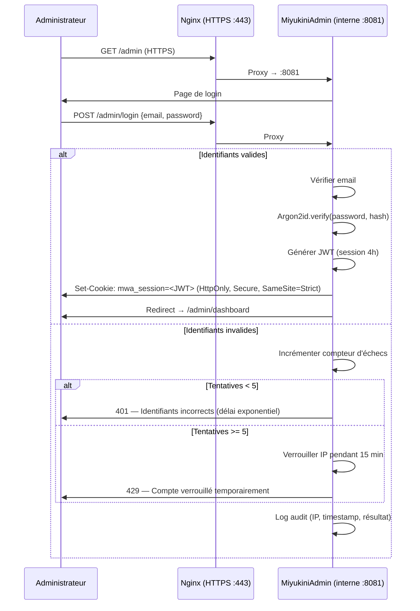

# MWS — MiyukiniAdmin Origin (Panneau d'Administration Origin)

## Contexte

**MiyukiniAdmin Origin** est le **panneau d'administration spécifique à Origin**. Il est accessible uniquement au détenteur de la distribution stable (administrateur unique du réseau MWS). MiyukiniAdmin Origin fournit la **batterie complète de tests**, le **monitoring en temps réel** du réseau et de ses services MWS, ainsi que les **commandes d'administration** d'Origin.

> **MiyukiniAdmin** est un concept générique : chaque acteur MWS (Origin, Relay, Tracker) peut disposer de son propre MiyukiniAdmin adapté à son rôle. Ce document décrit celui d'**Origin**, le plus complet car Origin est la source de vérité.

Origin est **exclusivement dédié au MWS** : aucun service hors périmètre MWS n'est installé ni exécuté sur la VM Origin. MiyukiniAdmin Origin gère uniquement les fonctions relay, tracker, source de vérité, et les services web MWS associés.

### Accès depuis le portail web

MiyukiniAdmin Origin est accessible via le bouton **« MiyukiniAdmin Origin »** affiché sur le portail web public d'Origin (`https://origin.miyukini.com/` ou l'URL du VPS Hostinger). Ce bouton redirige vers `/admin`, où la page d'authentification est présentée.

**Référence fondatrice :** [MWS - Document Fondateur](../MWS%20-%20Document%20Fondateur.md)  
**Liens :** [MWS - Origin](../acteurs/MWS%20-%20Origin.md), [MWS - Implémentation Origin Hostinger](../deploiement/MWS%20-%20Implementation%20Origin%20Hostinger.md)

---

## 1. Protocole d'identification

### 1.1 Principe

L'accès à MiyukiniAdmin Origin est protégé par un protocole d'identification **simple et sécurisé** :

- **Un seul compte administrateur** (pas de multi-utilisateurs).
- Authentification par **adresse e-mail** + **mot de passe chiffré**.
- Le mot de passe est **jamais stocké en clair** ; seul le **hash Argon2id** est conservé.
- Toute tentative d'accès est journalisée.

### 1.2 Identifiants

| Champ | Valeur |
|-------|--------|
| **E-mail** | `miyukini@gmail.com` |
| **Mot de passe** | Stocké sous forme de hash Argon2id (voir § 1.3) |

### 1.3 Chiffrement du mot de passe (Argon2id)

Le mot de passe est haché avec **Argon2id** (recommandation OWASP), l'algorithme le plus résistant aux attaques par force brute et par GPU/ASIC.

**Paramètres de hachage :**

| Paramètre | Valeur |
|-----------|--------|
| **Algorithme** | Argon2id |
| **Mémoire** | 64 Mo (`m=65536`) |
| **Itérations** | 3 (`t=3`) |
| **Parallélisme** | 4 (`p=4`) |
| **Longueur du sel** | 16 octets (aléatoire) |
| **Longueur du hash** | 32 octets |

**Génération du hash au déploiement :**

```bash
# Installer argon2 (Ubuntu)
sudo apt install -y argon2

# Générer le hash du mot de passe
echo -n '!!REDACTED_PASSWORD!!' | argon2 $(openssl rand -base64 16) -id -m 16 -t 3 -p 4 -l 32 -e
```

Le résultat est une chaîne au format :

```
$argon2id$v=19$m=65536,t=3,p=4$<SEL_BASE64>$<HASH_BASE64>
```

Ce hash est stocké dans le fichier de configuration admin (voir § 1.5).

### 1.4 Fichier de configuration admin

Créer `/etc/miyukini/admin.toml` :

```toml
# ═══════════════════════════════════════════════════
#  MiyukiniAdmin — Configuration d'authentification
#  CONFIDENTIEL — ne pas versionner
# ═══════════════════════════════════════════════════

[admin]
email = "miyukini@gmail.com"
password_hash = "$argon2id$v=19$m=65536,t=3,p=4$<SEL>$<HASH>"

# ─── Session ──────────────────────────────────────
[session]
# Durée de session (en secondes) : 4 heures
session_ttl_seconds = 14400
# Token de session : JWT signé HMAC-SHA256
jwt_secret_file = "/etc/miyukini/admin_jwt.key"
# Renouvellement automatique si activité dans les 30 dernières minutes
auto_renew_minutes = 30

# ─── Sécurité ─────────────────────────────────────
[security]
# Tentatives maximales avant verrouillage temporaire
max_login_attempts = 5
# Durée du verrouillage (en secondes) : 15 minutes
lockout_duration_seconds = 900
# Délai exponentiel entre les tentatives échouées
exponential_backoff = true
# IP whitelist (optionnel — vide = toutes les IPs autorisées)
ip_whitelist = []
# Forcer HTTPS
force_https = true
```

**Sécuriser les fichiers :**

```bash
# Générer la clé JWT
openssl rand -base64 64 > /etc/miyukini/admin_jwt.key

# Permissions restrictives
sudo chown miyukini:miyukini /etc/miyukini/admin.toml /etc/miyukini/admin_jwt.key
sudo chmod 600 /etc/miyukini/admin.toml /etc/miyukini/admin_jwt.key
```

### 1.5 Flux d'authentification



### 1.6 Règles de sécurité

| Règle | Description |
|-------|-------------|
| **HTTPS obligatoire** | MiyukiniAdmin n'est accessible qu'en HTTPS (port 443). Toute requête HTTP est redirigée. |
| **Cookie sécurisé** | `HttpOnly`, `Secure`, `SameSite=Strict` — pas d'accès JavaScript, pas de cross-site. |
| **Durée de session** | 4 heures maximum ; renouvellement auto si activité récente (30 min). |
| **Verrouillage** | 5 tentatives échouées → verrouillage 15 min avec backoff exponentiel. |
| **Journalisation** | Chaque tentative (réussie ou échouée) est enregistrée dans le log d'audit avec IP et timestamp. |
| **Pas de "rappeler moi"** | Pas de session persistante ; reconnexion requise après expiration. |
| **Déconnexion explicite** | Bouton de déconnexion invalide le JWT côté serveur (blacklist du token). |

---

## 2. Tableau de bord (Dashboard)

### 2.1 Vue d'ensemble

Le dashboard MiyukiniAdmin affiche en temps réel l'état global du réseau MWS :

```
┌─────────────────────────────────────────────────────────────┐
│  MiyukiniAdmin — Dashboard Origin (VPS Hostinger)          │
├─────────────────────────────────────────────────────────────┤
│                                                             │
│  ┌─── État Origin ───┐  ┌─── Réseau MWS ────────────────┐  │
│  │ Relay    : ● UP   │  │ COGs connectés    : 42         │  │
│  │ Tracker  : ● UP   │  │ Relays actifs     : 3          │  │
│  │ Web      : ● UP   │  │ Trackers actifs   : 2          │  │
│  │ CPU      : 23%    │  │ Permis délivrés/h : 128        │  │
│  │ RAM      : 456 Mo │  │ Quarantaines      : 1          │  │
│  │ Uptime   : 14j 6h │  │ Blacklists        : 0          │  │
│  └───────────────────┘  └────────────────────────────────┘  │
│                                                             │
│  ┌─── Dernières alertes ─────────────────────────────────┐  │
│  │ 14:32  INFO   Permis délivré cog-a7f2 (STABLE)       │  │
│  │ 14:28  WARN   Échec Phase B cog-9e01 → Quarantaine   │  │
│  │ 14:15  INFO   Relay EU-2 synchronisé                  │  │
│  │ 13:50  INFO   Registre mis à jour (v2.1.0)           │  │
│  └───────────────────────────────────────────────────────┘  │
│                                                             │
│  [Tests]  [Monitoring]  [Registre]  [Sécurité]  [Logs]     │
└─────────────────────────────────────────────────────────────┘
```

### 2.2 Sections du dashboard

| Section | Contenu |
|---------|---------|
| **État Origin** | Statut des services (relay, tracker, web), métriques système (CPU, RAM, disque, uptime) |
| **Réseau MWS** | COGs connectés, relays/trackers actifs, débit de Permis, quarantaines/blacklists en cours |
| **Dernières alertes** | Fil d'événements en temps réel (logs d'audit filtré) |
| **Navigation** | Accès aux sous-sections : Tests, Monitoring, Registre, Sécurité, Logs |

---

## 3. Batterie de tests

MiyukiniAdmin intègre une **batterie complète de tests** exécutables à la demande ou programmés en automatique.

### 3.1 Tests de connectivité

| Test | Description | Commande interne |
|------|-------------|-----------------|
| **Ping relay** | Vérifie que le port 7000 répond (TLS handshake) | `test::relay_ping()` |
| **Ping tracker** | Vérifie que le port 21000 répond | `test::tracker_ping()` |
| **Ping web** | Vérifie que nginx répond (HTTP 200 / 301) | `test::web_ping()` |
| **TLS valide** | Vérifie la validité du certificat TLS (expiration, chaîne) | `test::tls_check()` |
| **NTP drift** | Vérifie que le décalage NTP est < 5 secondes | `test::ntp_drift()` |
| **DNS résolution** | Vérifie la résolution de `origin.miyukini.com` → IP du VPS Origin | `test::dns_resolve()` |

### 3.2 Tests fonctionnels MWS

| Test | Description | Commande interne |
|------|-------------|-----------------|
| **REGISTER simulé** | Simule l'enregistrement d'un COG de test (REGISTER → vérification → Permis) | `test::mock_register()` |
| **Phase A** | Vérifie que la validation de clé Cores fonctionne | `test::phase_a_check()` |
| **Phase B** | Vérifie la demande de blocs MIP aléatoires | `test::phase_b_check()` |
| **Phase C** | Vérifie la validation du rapport de santé | `test::phase_c_check()` |
| **Quarantaine** | Vérifie qu'un COG non-conforme est mis en quarantaine | `test::quarantine_flow()` |
| **Blacklist** | Vérifie qu'un COG récidiviste est blacklisté | `test::blacklist_flow()` |
| **Permis de circulation** | Vérifie la délivrance et la validité d'un Permis | `test::permis_check()` |
| **REDIRECT** | Vérifie la redirection vers un relay quand Origin est saturé | `test::redirect_check()` |
| **PERMIT_REVOKE** | Vérifie la révocation en temps réel d'un Permis | `test::revoke_check()` |

### 3.3 Tests de sécurité

| Test | Description | Commande interne |
|------|-------------|-----------------|
| **Rate limiting** | Vérifie les seuils de rate limiting (R-002) | `test::rate_limit()` |
| **PoW challenge** | Vérifie que le PoW est exigé et validé | `test::pow_challenge()` |
| **Replay protection** | Envoie un message avec nonce/timestamp expiré → rejet attendu | `test::replay_reject()` |
| **MAC validation** | Vérifie le HMAC-SHA256 sur les paquets DATA (R-003) | `test::mac_validate()` |
| **Manifeste Origin** | Vérifie la signature du manifeste embarqué | `test::manifest_verify()` |
| **Certificate pin** | Vérifie le certificate pinning (R-014) | `test::cert_pin_check()` |
| **Brute force login** | Vérifie le verrouillage après 5 tentatives échouées | `test::brute_force_lockout()` |

### 3.4 Tests réseau

| Test | Description | Commande interne |
|------|-------------|-----------------|
| **Relay sync** | Vérifie que chaque relay est synchronisé avec Origin | `test::relay_sync_all()` |
| **Tracker sync** | Vérifie que chaque tracker a les pools à jour | `test::tracker_sync_all()` |
| **Latence relays** | Mesure la latence vers chaque relay connu | `test::relay_latency()` |
| **Latence trackers** | Mesure la latence vers chaque tracker connu | `test::tracker_latency()` |
| **Registre cohérent** | Vérifie la cohérence du Registre de Services entre Origin et les relays | `test::registry_consistency()` |

### 3.5 Exécution

| Mode | Description |
|------|-------------|
| **Manuel** | Depuis le dashboard, lancer un test individuel ou toute la batterie en un clic. |
| **Automatique** | Planifier l'exécution récurrente (cron intégré, ex. toutes les 15 min). |
| **Résultat** | Chaque test retourne `PASS` / `FAIL` / `WARN` avec détails et timestamp. |
| **Historique** | Les résultats sont conservés (30 jours) pour suivre l'évolution. |

---

## 4. Monitoring en temps réel

### 4.1 Métriques système Origin

| Métrique | Source | Seuil d'alerte |
|----------|--------|----------------|
| **CPU usage** | `/proc/stat` | > 80% pendant 5 min |
| **RAM usage** | `/proc/meminfo` | > 90% |
| **Disque** | `df` | > 85% |
| **Réseau I/O** | `/proc/net/dev` | > 90% de la bande passante |
| **Open files** | `/proc/sys/fs/file-nr` | > 50 000 |
| **Uptime** | `/proc/uptime` | Informatif |

### 4.2 Métriques MWS

| Métrique | Description | Seuil d'alerte |
|----------|-------------|----------------|
| `connections_active` | Connexions TCP actives sur les ports relay/tracker | > 8 000 |
| `register_per_minute` | REGISTER reçus par minute | > 500 (possible DDoS) |
| `permis_delivered_per_hour` | Permis de circulation délivrés par heure | Informatif |
| `verifications_total` | Total des vérifications effectuées | Informatif |
| `verifications_failed` | Vérifications échouées (Phase A/B/C) | > 10% du total → alerte |
| `quarantines_active` | COGs actuellement en quarantaine | > 50 → alerte |
| `blacklist_count` | COGs en blacklist | Informatif |
| `relay_count_active` | Relays actifs et synchronisés | < 1 → alerte critique |
| `tracker_count_active` | Trackers actifs et synchronisés | < 1 → alerte critique |
| `pow_challenges_issued` | Challenges PoW émis (indicateur d'attaque) | > 100/min → alerte |
| `permit_revocations` | Révocations de Permis en temps réel | > 10/min → alerte |

### 4.3 Graphiques et visualisation

| Graphique | Type | Période |
|-----------|------|---------|
| **Connexions actives** | Ligne (temps réel, 1h, 24h, 7j) | Configurable |
| **Débit de Permis** | Barres (par heure) | 24h / 7j |
| **Taux d'échec vérification** | Ligne (%) | 24h / 7j |
| **Utilisation CPU/RAM** | Aire empilée | 1h / 24h |
| **Carte réseau** | Topologie (Origin → Relays → Trackers → COGs) | Temps réel |

### 4.4 Alertes

| Niveau | Action |
|--------|--------|
| **INFO** | Journalisé uniquement |
| **WARN** | Affiché sur le dashboard + log audit |
| **CRITICAL** | Affiché + notification (log + optionnel e-mail) |

---

## 5. Gestion des services MWS

### 5.1 Services présents sur Origin (exclusivement MWS)

| Service | Description | Statut gérable |
|---------|-------------|----------------|
| **Origin Relay** | Vérification de conformité, délivrance de Permis | Start / Stop / Restart |
| **Origin Tracker** | Pools, découverte, Lobbys, catalogue | Start / Stop / Restart |
| **Registre de Services** | Liste officielle des services autorisés | Lecture / Mise à jour |
| **Catalogue web** | Portail web public (nginx) | Start / Stop / Restart |
| **MiyukiniAdmin** | Panneau d'administration (ce service) | Lecture seule (auto) |

### 5.2 Services exclus d'Origin

Origin **ne contient aucun** service hors périmètre MWS :

| Exclusion | Raison |
|-----------|--------|
| ~~Base de données externe~~ | Origin utilise son propre stockage fichier/embarqué |
| ~~Services applicatifs tiers~~ | Les services tiers s'exécutent sur les COGs, pas sur Origin |
| ~~Jeux, streaming, messagerie~~ | Services utilisateurs — hors périmètre Origin |
| ~~CDN de contenu~~ | Origin ne sert pas de CDN (sauf pour le catalogue MWS) |
| ~~CI/CD, monitoring externe~~ | Le monitoring est intégré dans MiyukiniAdmin |

**Règle :** Tout processus non lié au MWS doit être **supprimé** de la VM Origin. La surface d'attaque est minimale.

### 5.3 Commandes d'administration

Depuis MiyukiniAdmin, l'administrateur peut :

| Action | Description |
|--------|-------------|
| **Restart Relay** | Redémarrer le service relay sans interruption longue |
| **Restart Tracker** | Redémarrer le service tracker |
| **Restart Nginx** | Redémarrer le reverse proxy web |
| **Mettre à jour le Registre** | Ajouter, modifier ou retirer un service du Registre officiel |
| **Publier une version Cores** | Déclarer une nouvelle version des Cores avec clés et checksums |
| **Émettre une alerte réseau** | Diffuser une alerte à tous les relays/trackers |
| **Quarantaine manuelle** | Placer un COG en quarantaine depuis le dashboard |
| **Blacklist manuelle** | Ajouter un COG à la blacklist |
| **Lever une quarantaine** | Retirer un COG de quarantaine |
| **Révoquer un Permis** | Révoquer un Permis de circulation en temps réel (R-009) |
| **Renouveler le manifeste** | Regénérer et signer un nouveau Manifeste Origin |

---

## 6. Journalisation admin

### 6.1 Log d'administration

Toutes les actions effectuées depuis MiyukiniAdmin sont enregistrées dans un log dédié :

**Fichier :** `/var/log/miyukini/origin-admin.log`

| Champ | Description |
|-------|-------------|
| `timestamp` | Date/heure UTC |
| `event` | Type d'événement (`LOGIN`, `LOGIN_FAIL`, `LOGOUT`, `ACTION`, `TEST`) |
| `ip` | Adresse IP de l'administrateur |
| `detail` | Description de l'action (ex. `restart_relay`, `quarantine cog-xyz`) |
| `result` | `OK` / `FAIL` |

### 6.2 Exemples d'entrées

```
2026-02-13T14:32:00Z | LOGIN      | 88.120.45.12 | miyukini@gmail.com     | OK
2026-02-13T14:33:15Z | ACTION     | 88.120.45.12 | restart_relay          | OK
2026-02-13T14:35:00Z | TEST       | 88.120.45.12 | test::mock_register    | PASS
2026-02-13T14:40:00Z | ACTION     | 88.120.45.12 | quarantine cog-9e01    | OK
2026-02-13T18:32:00Z | LOGOUT     | 88.120.45.12 | session_expired        | OK
2026-02-13T19:00:00Z | LOGIN_FAIL | 192.168.1.99 | tentative brute force  | LOCKOUT
```

---

## 7. Architecture technique

### 7.1 Composant interne

MiyukiniAdmin est un **service web léger** intégré au binaire Origin ou déployé comme binaire séparé, écoutant sur le port interne **8081** (jamais exposé directement).

```
Internet (HTTPS :443)
    │
    ▼
  Nginx (TLS termination)
    │
    ├── /admin/*  →  proxy_pass http://127.0.0.1:8081  (MiyukiniAdmin)
    └── /*        →  proxy_pass http://127.0.0.1:8080  (Catalogue web MWS)
```

### 7.2 Stack technique

| Composant | Technologie |
|-----------|-------------|
| **Backend** | Rust (intégré au binaire `miyukini-origin` ou micro-service `miyukini-admin`) |
| **Serveur HTTP** | `axum` ou `actix-web` (léger, async) |
| **Templating** | Templates HTML serveur (Askama/Tera) — pas de SPA lourde |
| **Auth** | Argon2id (vérification) + JWT HMAC-SHA256 (session) |
| **Stockage session** | En mémoire (HashMap) — pas de BDD externe |
| **Métriques** | Collectées depuis `/proc` et les APIs internes Origin |

### 7.3 Configuration Nginx pour MiyukiniAdmin

Ajouter dans la configuration HTTPS existante :

```nginx
# Dans le bloc server { listen 443 ssl ... }

# MiyukiniAdmin (accès restreint)
location /admin {
    proxy_pass http://127.0.0.1:8081;
    proxy_set_header Host $host;
    proxy_set_header X-Real-IP $remote_addr;
    proxy_set_header X-Forwarded-For $proxy_add_x_forwarded_for;
    proxy_set_header X-Forwarded-Proto $scheme;

    # Rate limiting pour la page de login
    limit_req zone=admin_login burst=5 nodelay;

    # Headers de sécurité renforcés
    add_header Content-Security-Policy "default-src 'self'; script-src 'self'; style-src 'self' 'unsafe-inline'" always;
    add_header X-Content-Type-Options nosniff always;
    add_header X-Frame-Options DENY always;
    add_header Referrer-Policy no-referrer always;
}
```

Ajouter en haut du fichier nginx la zone de rate limiting :

```nginx
# En dehors du bloc server {}
limit_req_zone $binary_remote_addr zone=admin_login:10m rate=5r/m;
```

---

## 8. Récapitulatif

| Élément | Valeur |
|---------|--------|
| **Nom** | MiyukiniAdmin Origin (spécifique à Origin) |
| **Accès public** | Bouton sur le portail web Origin (`/`) → redirige vers `/admin` |
| **URL d'accès** | `https://origin.miyukini.com/admin` (ou `https://<IP_VPS>/admin`) |
| **Port interne** | 8081 (derrière nginx, jamais exposé) |
| **E-mail admin** | `miyukini@gmail.com` |
| **Mot de passe** | Hash Argon2id (`/etc/miyukini/admin.toml`) — **jamais en clair** |
| **Session** | JWT HMAC-SHA256, durée 4h, cookie HttpOnly/Secure/SameSite=Strict |
| **Verrouillage** | 5 tentatives → lockout 15 min |
| **Tests** | Batterie complète : connectivité, fonctionnel MWS, sécurité, réseau |
| **Monitoring** | Métriques système + MWS en temps réel, alertes 3 niveaux |
| **Administration** | Gestion services, Registre, versions, quarantaines, blacklists, alertes |
| **Logs** | `/var/log/miyukini/origin-admin.log` — toutes actions journalisées |
| **Scope Origin** | MWS uniquement — aucun service hors périmètre |

---

## Références

- [MWS - Document Fondateur](../MWS%20-%20Document%20Fondateur.md)
- [MWS - Origin](../acteurs/MWS%20-%20Origin.md)
- [MWS - Implémentation Origin Hostinger](../deploiement/MWS%20-%20Implementation%20Origin%20Hostinger.md)
- [MWS - Quarantaine et Blacklist](../securite/MWS%20-%20Quarantaine%20et%20Blacklist.md)
- [MWS - Chiffrement et TLS](../securite/MWS%20-%20Chiffrement%20et%20TLS.md)
- [MWS - Contre-Mesures de Sécurité](../securite/MWS%20-%20Contre-Mesures%20de%20Securite.md)

---

**Version :** 2.0  
**Mise à jour :** MiyukiniAdmin Origin (spécifique), accès depuis le portail web  
**Classification :** Documentation MWS — Administration
