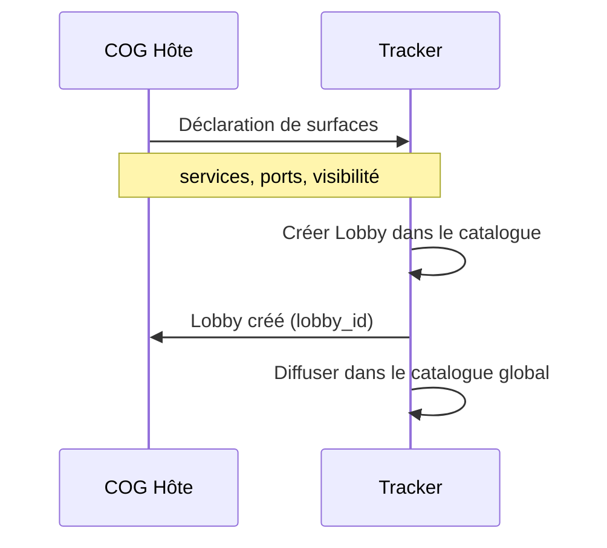
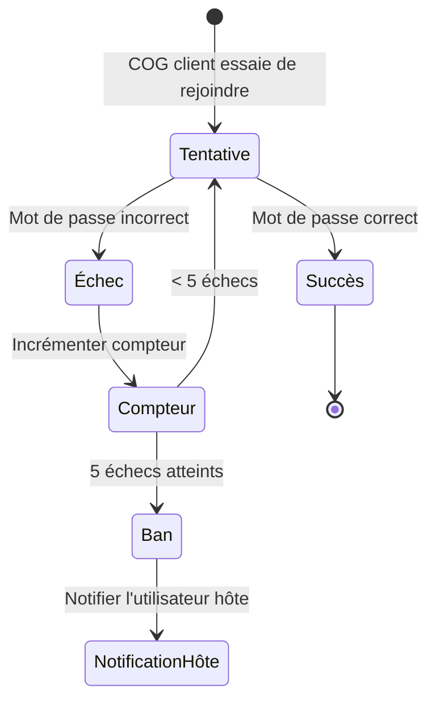
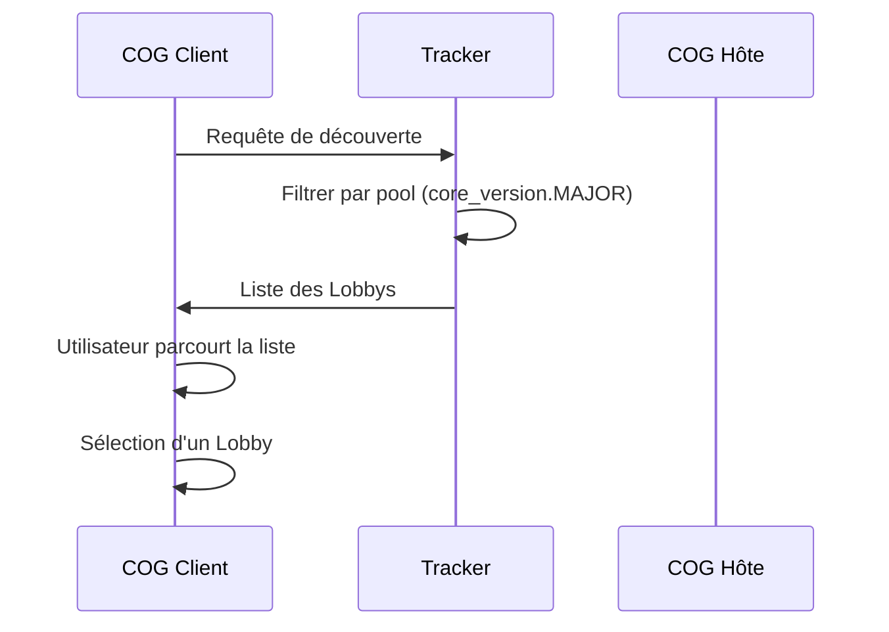
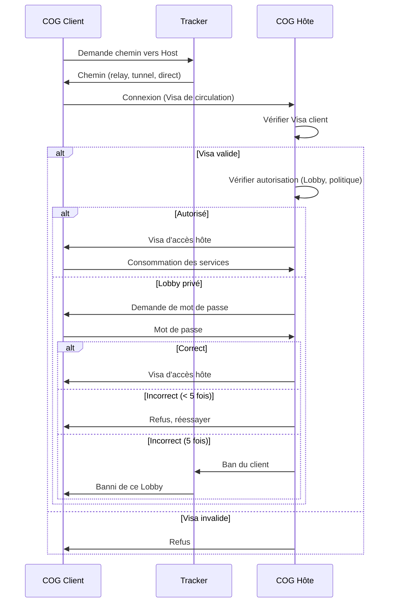
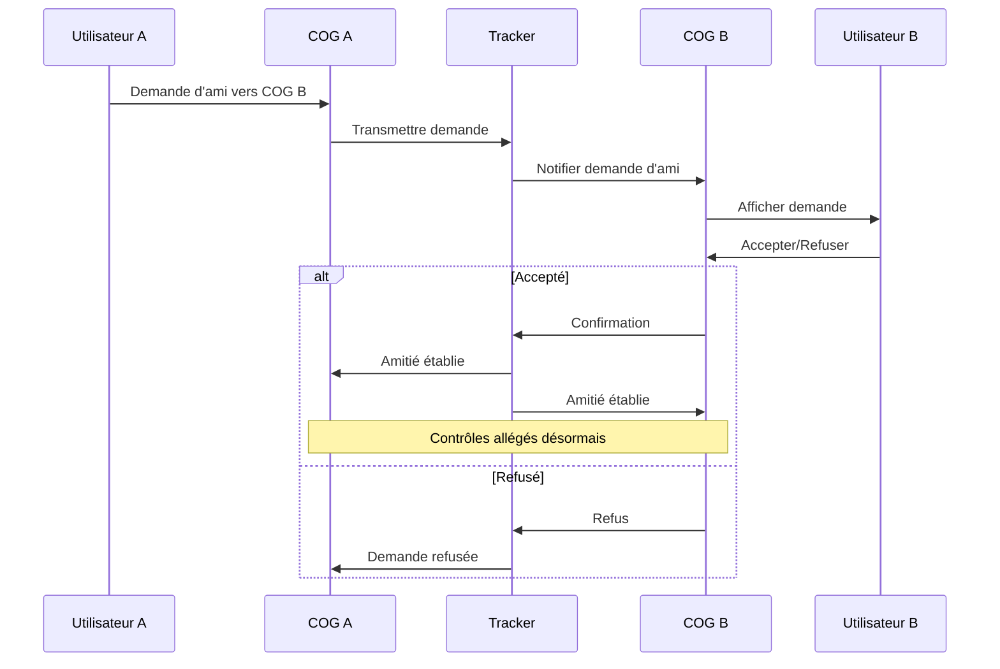

# MWS — Lobbys, Favoris et Amis

## Contexte

Les **Lobbys**, **favoris** et **amis** sont les mécanismes de découverte et de connexion sociale du MWS. Ils permettent aux COGs d'exposer leurs services, de trouver d'autres COGs, et d'établir des relations de confiance facilitant les connexions futures.

**Référence fondatrice :** [MWS - Document Fondateur](../MWS%20-%20Document%20Fondateur.md)

## Portée / Scope

- Lobbys : définition, création, visibilité, accès
- Lobbys privés : mot de passe, bans, dé-ban
- Surfaces de connexion : déclaration, limites
- Flow client → hôte : découverte, connexion, Visa d'accès
- Favoris : marquage, retrouver rapidement un hôte
- Amis : relation de confiance, contrôles allégés

---

## 1. Lobbys

### 1.1 Définition

Un **Lobby** est une entrée dans le **catalogue des trackers** représentant les services qu'un COG hôte expose pour des connexions entrantes. C'est le point de rendez-vous entre les COGs qui offrent des services et ceux qui souhaitent les consommer.

### 1.2 Création d'un Lobby

Quand un COG se présente à un Tracker (après validation du Visa de circulation), il peut déclarer ses **surfaces de connexion** :



### 1.3 Structure d'un Lobby

| Champ | Type | Description |
|-------|------|-------------|
| `lobby_id` | string | Identifiant unique du Lobby |
| `host_cog_id` | string | COG hébergeur |
| `host_username` | string | Nom/pseudo de l'utilisateur hôte |
| `services` | array | Services exposés (service_id, description) |
| `ports` | array | Ports concernés |
| `visibility` | enum | `public` ou `private` |
| `password_protected` | bool | Si privé, protégé par mot de passe |
| `core_version` | string | Version des Cores du hôte |
| `created_at` | datetime | Date de création |
| `max_connections` | int | Nombre max de connexions (si limité) |
| `current_connections` | int | Nombre de connexions actives |

### 1.4 Visibilité des Lobbys

| Visibilité | Description |
|------------|-------------|
| **Public** | Visible dans le catalogue, accessible à tous les COGs du même pool |
| **Privé** | Visible dans le catalogue mais nécessite un mot de passe pour rejoindre |
| **Caché** | Non listé dans le catalogue, accessible uniquement par ID direct (fonctionnalité avancée) |

---

## 2. Lobbys privés

### 2.1 Protection par mot de passe

Un COG hôte peut protéger son Lobby avec un **mot de passe** :

| Aspect | Description |
|--------|-------------|
| **Définition** | Le hôte définit un mot de passe lors de la création du Lobby |
| **Transmission** | Le mot de passe est partagé hors-bande (message, invitation) |
| **Vérification** | Le Tracker vérifie le mot de passe avant d'autoriser la connexion |

### 2.2 Limite d'échecs et ban



| Règle | Valeur | Description |
|-------|--------|-------------|
| **Limite d'échecs** | 5 | Après 5 mots de passe incorrects |
| **Action** | Ban | Le COG client est banni de ce Lobby |
| **Notification** | Utilisateur hôte | L'hôte est notifié du ban |
| **Dé-ban** | Manuel uniquement | Seul l'utilisateur hôte peut dé-bannir |

### 2.3 Dé-ban manuel

| Acteur | Action |
|--------|--------|
| **Utilisateur hôte** | Peut voir la liste des COGs bannis de ses Lobbys |
| **Utilisateur hôte** | Peut dé-bannir manuellement un COG |
| **Tracker** | Exécute le dé-ban après demande du hôte |
| **Système** | Aucun dé-ban automatique |

---

## 3. Surfaces de connexion

### 3.1 Déclaration des surfaces

Quand un COG se présente au Tracker, il déclare ses **surfaces de connexion** :

| Déclaration | Description |
|-------------|-------------|
| **Services exposés** | Quels services sont accessibles (service_id) |
| **Ports** | Sur quels ports ces services écoutent |
| **Acceptation** | Si le COG accepte des connexions entrantes |
| **Attentes** | Ce que le COG propose (ex. jeu, SaaS, portail) |
| **Désirs** | Ce que le COG cherche à joindre (optionnel) |

### 3.2 Surface stricte

| Principe | Description |
|----------|-------------|
| **Surface explicite** | Seuls les services et ports déclarés acceptent des connexions |
| **Rejet hors surface** | Toute connexion sur un port/service non déclaré est rejetée |
| **Intégrité prioritaire** | Les Cores et la DB ne sont jamais exposés directement |

### 3.3 Limite de connexions

| Type de COG | Limite | Exclusions |
|-------------|--------|------------|
| **COG classique** | 100 connexions simultanées | Ports 80 et 8080 exclus |
| **COG spécial** | Configurable (supérieur) | Selon Passeport spécial |

> Les COGs ne sont pas des services type torrent. Cette limite garantit la qualité de suivi des organes de sécurité.

### 3.4 Serveur web embarqué

Un COG peut exposer des services web sur les ports 80 et/ou 8080 :

| Aspect | Description |
|--------|-------------|
| **Headless** | Le COG peut fonctionner sans interface utilisateur |
| **Permanence** | Services disponibles en continu |
| **Navigateur** | Accessible depuis un navigateur web |
| **Cas d'usage** | Sites web, SaaS, portails, applications web |

Ces ports **ne sont pas comptés** dans la limite des 100 connexions simultanées.

---

## 4. Flow client → hôte

### 4.1 Découverte



### 4.2 Connexion



### 4.3 Visa d'accès hôte

Le **Visa d'accès hôte** est délivré par le COG hôte au COG client :

| Champ | Description |
|-------|-------------|
| `access_visa_id` | Identifiant unique |
| `client_cog_id` | COG client autorisé |
| `host_cog_id` | COG hôte |
| `services_authorized` | Services accessibles |
| `lobby_id` | Lobby concerné |
| `issued_at` | Date d'émission |
| `expires_at` | Date d'expiration |

Ce Visa est **distinct** du Visa de circulation (délivré par les relays).

---

## 5. Favoris

### 5.1 Définition

Les **favoris** permettent à un utilisateur de marquer des COGs hôtes pour les retrouver rapidement.

### 5.2 Fonctionnement

| Aspect | Description |
|--------|-------------|
| **Marquage** | L'utilisateur ajoute un COG hôte à ses favoris |
| **Stockage** | Liste stockée localement dans le COG client |
| **Affichage** | Les favoris apparaissent en haut de la liste de découverte |
| **Persistance** | Les favoris persistent entre les sessions |

### 5.3 Informations stockées

| Champ | Description |
|-------|-------------|
| `host_cog_id` | Identifiant du COG hôte |
| `host_username` | Nom/pseudo de l'utilisateur hôte |
| `services` | Services souvent utilisés |
| `added_at` | Date d'ajout aux favoris |
| `last_connected` | Dernière connexion |
| `notes` | Notes personnelles (optionnel) |

### 5.4 Synchronisation avec le Tracker

| Option | Description |
|--------|-------------|
| **Local uniquement** | Les favoris restent dans le COG client |
| **Signalé au Tracker** | Le COG client peut signaler ses favoris au Tracker pour optimiser les suggestions |

---

## 6. Amis entre COGs

### 6.1 Définition

La relation **amis** entre deux COGs permet des connexions **plus rapides**, avec des **protocoles de contrôle allégés** et une **périodicité de re-vérification plus longue**.

### 6.2 Caractéristiques

| Caractéristique | Description |
|-----------------|-------------|
| **Demande humaine** | Les demandes d'amis sont initiées par les utilisateurs |
| **Confirmation humaine** | L'acceptation est manuelle, pas automatique |
| **Contrôles allégés** | Les contrôles douaniers (Tracker) et d'accès (hôte) sont simplifiés |
| **Périodicité longue** | La re-présentation et le renouvellement de preuves sont moins fréquents |
| **Noms/pseudos** | Les COGs exposent les noms de leurs utilisateurs pour la reconnaissance |

### 6.3 Flow de demande d'amis



### 6.4 Structure de la relation

| Champ | Description |
|-------|-------------|
| `friend_pair_id` | Identifiant unique de la paire |
| `cog_a_id` | Premier COG |
| `cog_a_username` | Nom de l'utilisateur A |
| `cog_b_id` | Second COG |
| `cog_b_username` | Nom de l'utilisateur B |
| `established_at` | Date d'établissement |
| `control_level` | Niveau de contrôle (allégé) |
| `recheck_period` | Période de re-vérification (ex. 7 jours) |

### 6.5 Avantages des amis

| Avantage | Description |
|----------|-------------|
| **Connexion rapide** | Pas besoin de parcourir le catalogue |
| **Contrôles allégés** | Vérifications simplifiées au Tracker |
| **Confiance mutuelle** | Les deux COGs se font confiance explicitement |
| **Périodicité longue** | Re-vérification moins fréquente (ex. tous les 7 jours au lieu de 24h) |

### 6.6 Limites et sécurité

| Limite | Description |
|--------|-------------|
| **Pas de contournement** | Les amis restent soumis aux règles de surface et de sécurité |
| **Révocable** | Chaque utilisateur peut mettre fin à la relation |
| **Surveillance** | Les Trackers peuvent surveiller les abus |
| **Passeport requis** | Les deux COGs doivent avoir un Visa de circulation valide |

---

## 7. Catalogue web des Trackers

### 7.1 Service web de portail (port 80)

Les Trackers exposent un **catalogue web** accessible via navigateur :

| Fonction | Description |
|----------|-------------|
| **Liste des Lobbys** | Affichage des Lobbys publics |
| **Recherche** | Recherche par service, nom, tags |
| **Filtrage** | Filtrage par version des Cores |
| **Redirection** | Les utilisateurs web sont redirigés vers les COGs hôtes |

### 7.2 Fonctionnement "No-IP"

| Aspect | Description |
|--------|-------------|
| **Pas de domaine requis** | Les COGs n'ont pas besoin de nom de domaine |
| **Pas d'IP fixe** | Les COGs n'ont pas besoin d'IP fixe |
| **Facilitateur** | Le Tracker agit comme facilitateur et tunnel |
| **Redirection** | Le Tracker redirige le trafic vers le COG hôte |

> Le catalogue web du Tracker n'a **pas de fonction de contrôle** sur les connexions web ; il redirige uniquement.

### 7.3 Mise à jour automatique

| Aspect | Description |
|--------|-------------|
| **Temps réel** | Le catalogue est mis à jour en temps réel |
| **Global** | Le catalogue est global et accessible par n'importe quel Tracker |
| **Diffusion** | Les mises à jour sont diffusées automatiquement |

---

## 8. Exemples

### 8.1 Exemple de Lobby public

```json
{
  "lobby_id": "lobby-game-001",
  "host_cog_id": "550e8400-e29b-41d4-a716-446655440000",
  "host_username": "GameServer42",
  "services": [
    {"service_id": "game.server", "description": "Serveur de jeu multijoueur"}
  ],
  "ports": [25565],
  "visibility": "public",
  "password_protected": false,
  "core_version": "1.0",
  "max_connections": 50,
  "current_connections": 12
}
```

### 8.2 Exemple de Lobby privé

```json
{
  "lobby_id": "lobby-private-001",
  "host_cog_id": "660f9500-f30c-52e5-b827-557766551111",
  "host_username": "PrivateClub",
  "services": [
    {"service_id": "chat.server", "description": "Salon de discussion privé"}
  ],
  "ports": [8888],
  "visibility": "private",
  "password_protected": true,
  "core_version": "1.0",
  "max_connections": 20,
  "current_connections": 5
}
```

### 8.3 Exemple de relation amis

```json
{
  "friend_pair_id": "friends-001",
  "cog_a_id": "550e8400-e29b-41d4-a716-446655440000",
  "cog_a_username": "Alice",
  "cog_b_id": "660f9500-f30c-52e5-b827-557766551111",
  "cog_b_username": "Bob",
  "established_at": "2026-02-13T10:00:00Z",
  "control_level": "relaxed",
  "recheck_period": "P7D"
}
```

---

## Références

- [MWS - Document Fondateur](../MWS%20-%20Document%20Fondateur.md)
- [MWS - Trackers](../acteurs/MWS%20-%20Trackers.md)
- [MWS - Passeport et Visa](../verification/MWS%20-%20Passeport%20et%20Visa.md)
- [Miyukini Webway Relay](../../reference/Miyukini%20Conceptual%20References%20-%20Miyukini%20Webway%20Relay.md) — sections 8, 9

---

**Version :** 1.0  
**Classification :** Documentation MWS — Lobbys et Connexions
