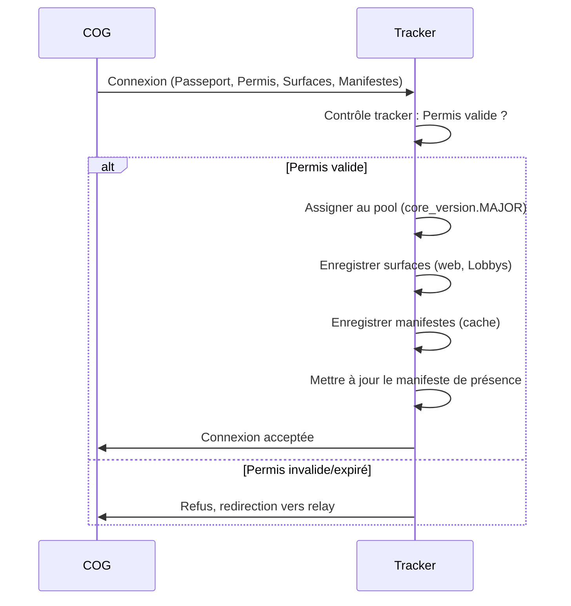
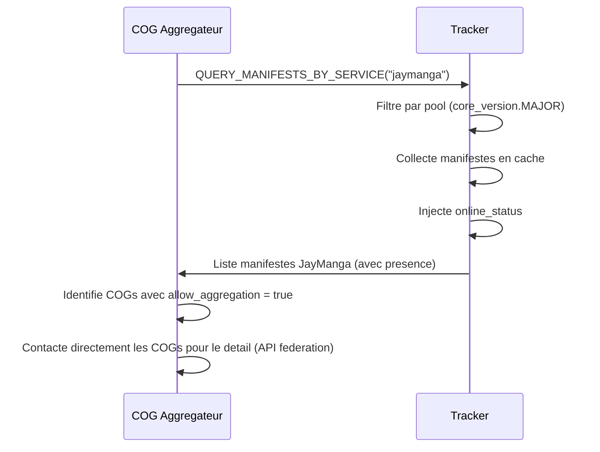

# MWS — Manifestes de Services

## Contexte

Les **manifestes de services** sont un mecanisme du MWS permettant aux COGs de **declarer des metadonnees structurees** sur les services qu'ils exposent. Le Tracker met en cache ces manifestes et les rend accessibles aux autres COGs via une API de decouverte, permettant une **decouverte enrichie** du reseau sans multiplier les connexions directes entre COGs.

Ce mecanisme repond a un besoin identifie par les services inter-COG (Type 3) comme le Portail Agrege de JayManga : au lieu de devoir interroger chaque COG vendeur individuellement pour collecter les metadonnees de catalogue, un COG aggregateur peut interroger le Tracker qui centralise temporairement ces informations.

> **Principe fondamental :** Les manifestes ne contiennent que des **metadonnees publiques** declarees volontairement par chaque COG. Le Tracker les cache et les distribue sans modification. Les manifestes **ne remplacent pas** les APIs specifiques de chaque service ; ils les **complementent** en offrant un point de decouverte centralise au niveau du Tracker.

**Reference fondatrice :** [MWS - Document Fondateur](../MWS%20-%20Document%20Fondateur.md)
**Reference Tracker :** [MWS - Trackers](../acteurs/MWS%20-%20Trackers.md) (section 5.5)

## Portee / Scope

- Definition du concept de manifeste de service
- Structure generique de l'enveloppe de manifeste
- Cycle de vie : declaration, mise a jour, expiration, purge
- Protocole de requete (interrogation des manifestes en cache)
- Manifeste de presence (implicite)
- Schemas specifiques par service (JayManga comme premier consommateur)
- Securite, limites et protection
- Compatibilite avec l'architecture existante

---

## 1. Concept et positionnement

### 1.1 Pourquoi les manifestes ?

Le MWS permet deja la **decouverte de COGs** (presence, Lobbys, surfaces web). Cependant, la decouverte actuelle se limite a savoir **qu'un COG existe et quels services il declare dans son Passeport**. Elle ne fournit pas de metadonnees sur le **contenu** de ces services.

| Sans manifestes | Avec manifestes |
|----------------|-----------------|
| Le COG A sait que le COG B propose JayManga | Le COG A sait que le COG B propose JayManga **avec 42 oeuvres, dont 12 gratuites, majoritairement en format webtoon** |
| Pour en savoir plus, le COG A doit contacter directement le COG B | Le COG A obtient ces informations depuis le **cache du Tracker**, sans contacter le COG B |
| N COGs a interroger = N connexions directes | 1 requete au Tracker = N manifestes retournes |

### 1.2 Positionnement dans l'architecture

Les manifestes s'inscrivent dans la couche de **decouverte** du MWS, aux cotes du catalogue web et du catalogue de Lobbys :

```
                         TRACKER
                    ┌──────────────────┐
                    │  Controle tracker │
                    ├──────────────────┤
                    │  Pools            │
                    ├──────────────────┤
Decouverte ──────→  │  Catalogue web    │  (surfaces web publiques)
                    │  Catalogue Lobbys │  (surfaces de connexion)
                    │  Manifestes       │  (metadonnees par service)
                    ├──────────────────┤
                    │  Monitoring       │
                    │  Confinement      │
                    └──────────────────┘
```

### 1.3 Principes

| Principe | Description |
|----------|-------------|
| **Metadonnees publiques uniquement** | Les manifestes ne contiennent que des informations que le COG accepte de rendre publiques sur le reseau. Aucune donnee utilisateur, aucune donnee sensible, aucune cle d'acces. |
| **Opt-in total** | Le COG choisit de declarer un manifeste ou non. Un service peut exister sans manifeste. |
| **Cache temporaire** | Le Tracker ne stocke pas les manifestes de maniere permanente. Ils sont caches et expires selon des regles configurables. |
| **Aucune modification** | Le Tracker ne modifie jamais le contenu d'un manifeste. Il le cache et le distribue tel quel. |
| **Filtrage par pool** | Les manifestes suivent les regles d'isolation par `core_version.MAJOR`. |
| **Complementaire, pas substitutif** | Les manifestes ne remplacent pas les APIs directes des services (ex. API de federation JayManga). Ils offrent un raccourci de decouverte. |

---

## 2. Structure du manifeste

### 2.1 Enveloppe commune

Tout manifeste, quel que soit le service, suit une **enveloppe commune** :

```json
{
  "service_id": "jaymanga",
  "manifest_version": "1.0",
  "cog_id": "cog-xxxx-yyyy-zzzz",
  "updated_at": "2026-02-24T15:30:00Z",
  "payload": {
    // Contenu specifique au service
  }
}
```

| Champ | Type | Requis | Description |
|-------|------|--------|-------------|
| `service_id` | TEXT | Oui | Identifiant normalise du service (ex. `jaymanga`, `jayshop`, `jayxpose`). Doit correspondre a un service declare dans le Passeport COG. |
| `manifest_version` | TEXT | Oui | Version du schema de manifeste pour ce service (semver). Permet l'evolution des schemas sans casser la compatibilite. |
| `cog_id` | TEXT | Oui | Identifiant du COG declarant. Injecte et verifie par le Tracker (pas auto-declare). |
| `updated_at` | TEXT (ISO 8601) | Oui | Horodatage de la derniere mise a jour du manifeste par le COG. |
| `payload` | JSON | Oui | Contenu specifique au service. Opaque pour le Tracker (valide en taille, pas en contenu). |

### 2.2 Regles de validation par le Tracker

Le Tracker effectue une **validation syntaxique** de l'enveloppe (systemes passifs) :

| Verification | Description |
|--------------|-------------|
| Champs requis presents | `service_id`, `manifest_version`, `updated_at`, `payload` tous presents. |
| `service_id` coherent | Le service est declare dans le Passeport COG presente lors du controle tracker. |
| `cog_id` injecte | Le Tracker ecrase le `cog_id` avec l'identite verifiee du COG (empeche l'usurpation). |
| Taille du payload | Le `payload` ne depasse pas la limite configuree (defaut : 64 Ko). |
| Format valide | Le JSON est syntaxiquement valide. |

Le Tracker **ne valide pas** le contenu du `payload`. La validation semantique est de la responsabilite du COG consommateur.

---

## 3. Cycle de vie

### 3.1 Declaration initiale

Lors de la presentation au Tracker (apres validation du Permis de circulation), le COG transmet ses manifestes dans la meme requete que ses declarations de surfaces :

```
COG → Tracker
  Passeport + Permis de circulation
  + Surfaces de connexion
  + Surfaces web publiques
  + Attentes et desirs
  + Manifestes de services     ← NOUVEAU
```

Le Tracker enregistre chaque manifeste en cache, indexe par `(cog_id, service_id)`.

### 3.2 Mise a jour

Un COG connecte peut mettre a jour un manifeste a tout moment via une **annonce de mise a jour** :

```
COG → Tracker : UPDATE_MANIFEST
  service_id: "jaymanga"
  manifest_version: "1.0"
  updated_at: "2026-02-24T16:00:00Z"
  payload: { ... }

Tracker:
  1. Verifie que le COG est connecte et en pool valide
  2. Verifie le throttling (max 1 maj / 5 min / service)
  3. Remplace le manifeste en cache
  4. Confirme au COG
```

### 3.3 Suppression volontaire

Un COG peut supprimer un manifeste :

```
COG → Tracker : DELETE_MANIFEST
  service_id: "jaymanga"

Tracker:
  1. Supprime le manifeste du cache
  2. Confirme au COG
```

### 3.4 Deconnexion et expiration

| Evenement | Comportement |
|-----------|-------------|
| COG se deconnecte proprement | Les manifestes restent en cache. Le statut de presence passe a `offline`. |
| COG disparait (timeout) | Idem. Le Tracker detecte la deconnexion et marque `offline`. |
| Cache expire sans reconnexion | Apres la duree de retention (defaut : 7 jours), les manifestes sont purges. |
| COG se reconnecte | Les anciens manifestes en cache sont remplaces par les nouveaux declares lors de la presentation. |

### 3.5 Parametres de cache

| Parametre | Defaut | Description |
|-----------|--------|-------------|
| `manifest_cache_ttl` | 7 jours | Duree de retention des manifestes apres deconnexion du COG. |
| `manifest_max_size` | 64 Ko | Taille maximale d'un manifeste (enveloppe complete). |
| `manifest_update_cooldown` | 5 minutes | Intervalle minimum entre deux mises a jour d'un meme manifeste. |
| `manifest_max_per_cog` | 20 | Nombre maximum de manifestes par COG (un par service). |

---

## 4. Protocole de requete

### 4.1 Types de requetes

Les COGs connectes au Tracker peuvent interroger les manifestes en cache via le protocole MWS (port 21000) :

| Requete | Parametres | Reponse |
|---------|-----------|---------|
| `QUERY_MANIFESTS_BY_SERVICE` | `service_id`, `since` (optionnel) | Liste de manifestes pour le service demande, filtre par pool. |
| `QUERY_MANIFESTS_BY_COG` | `target_cog_id` | Liste de tous les manifestes d'un COG specifique. |
| `QUERY_MANIFEST` | `target_cog_id`, `service_id` | Un manifeste specifique. |
| `QUERY_PRESENCE_BATCH` | `cog_ids[]` | Statut de presence de plusieurs COGs en une requete. |
| `QUERY_SERVICE_CENSUS` | `service_id` | Compteur de COGs declarant ce service, avec repartition online/offline. |

### 4.2 Filtrage par pool

Toutes les requetes de manifestes sont **automatiquement filtrees** par `core_version.MAJOR` du demandeur. Un COG en pool v1.x ne recevra que les manifestes des COGs en pool v1.x.

### 4.3 Requete incrementielle (`since`)

La requete `QUERY_MANIFESTS_BY_SERVICE` accepte un parametre `since` (ISO 8601). Le Tracker ne retourne alors que les manifestes dont le `updated_at` est posterieur au timestamp indique. Cela permet une **synchronisation incrementielle** efficace.

### 4.4 Reponse type

```json
{
  "service_id": "jaymanga",
  "results_count": 3,
  "pool": "1.x",
  "manifests": [
    {
      "service_id": "jaymanga",
      "manifest_version": "1.0",
      "cog_id": "cog-alpha-001",
      "updated_at": "2026-02-24T15:30:00Z",
      "online_status": "online",
      "payload": { ... }
    },
    {
      "service_id": "jaymanga",
      "manifest_version": "1.0",
      "cog_id": "cog-beta-002",
      "updated_at": "2026-02-23T10:00:00Z",
      "online_status": "offline",
      "payload": { ... }
    },
    ...
  ]
}
```

Le champ `online_status` est **injecte par le Tracker** (il ne fait pas partie du manifeste declare par le COG). Il reflete le statut de presence au moment de la requete.

---

## 5. Manifeste de presence

### 5.1 Principe

Le Tracker maintient un **manifeste de presence implicite** pour chaque COG connecte ou recemment connecte. Ce manifeste n'est pas declare par le COG ; il est genere et maintenu par le Tracker a partir de ses observations.

### 5.2 Structure

| Champ | Type | Description |
|-------|------|-------------|
| `cog_id` | TEXT | Identifiant du COG. |
| `online_status` | TEXT | `online` / `offline` / `unknown`. |
| `last_seen_at` | TEXT (ISO 8601) | Derniere activite detectee par le Tracker. |
| `services_declared` | JSON (liste) | Liste des `service_id` declares dans les manifestes actifs du COG. |
| `network_address` | TEXT | Adresse reseau du COG (pour redirection/connexion). Visible uniquement pour les COGs du meme pool. |
| `core_version` | TEXT | Version des Cores du COG. |
| `shop_name` | TEXT (optionnel) | Nom d'affichage du COG (si declare). |

### 5.3 Requete batch de presence

La requete `QUERY_PRESENCE_BATCH` permet de verifier la presence de multiples COGs en une seule requete :

```
COG → Tracker : QUERY_PRESENCE_BATCH
  cog_ids: ["cog-alpha-001", "cog-beta-002", "cog-gamma-003"]

Tracker → COG :
  {
    "results": [
      { "cog_id": "cog-alpha-001", "online_status": "online", "last_seen_at": "..." },
      { "cog_id": "cog-beta-002", "online_status": "offline", "last_seen_at": "..." },
      { "cog_id": "cog-gamma-003", "online_status": "unknown" }
    ]
  }
```

Ce mecanisme est utilise par les services inter-COG (bibliotheque JayManga, Portail Agrege) pour afficher les indicateurs de disponibilite.

---

## 6. Schemas de manifestes par service

Chaque service definit le schema de son `payload`. Le Tracker n'impose pas de schema ; la validation est de la responsabilite du consommateur.

### 6.1 Schema JayManga (`service_id: "jaymanga"`)

Le manifeste JayManga expose un **resume du catalogue** du COG vendeur :

```json
{
  "shop_name": "Ma Librairie Manga",
  "shop_description": "Collection de manga et webtoons originaux.",
  "avatar_url": "/api/jaymanga/federation/avatar",
  "work_count": 42,
  "free_work_count": 5,
  "chapter_count_total": 310,
  "formats": ["manga", "webtoon", "comics"],
  "languages": ["fr", "en"],
  "genres": ["action", "romance", "fantasy", "sci-fi"],
  "allow_aggregation": true,
  "federation_api_base": "/api/jaymanga/federation",
  "portal_url": "/jaymanga",
  "last_catalog_update": "2026-02-24T14:00:00Z",
  "pricing_models": ["free", "paid_per_work", "paid_per_chapter"],
  "default_currency": "EUR"
}
```

| Champ | Description |
|-------|-------------|
| `shop_name` | Nom de la librairie / boutique. |
| `shop_description` | Description courte du vendeur. |
| `avatar_url` | Chemin relatif vers l'avatar (sera resolu par le COG consommateur via l'adresse reseau du vendeur). |
| `work_count` | Nombre total d'oeuvres publiees. |
| `free_work_count` | Nombre d'oeuvres entierement gratuites. |
| `chapter_count_total` | Nombre total de chapitres (toutes oeuvres confondues). |
| `formats` | Formats de lecture proposes. |
| `languages` | Langues des oeuvres disponibles. |
| `genres` | Genres representes dans le catalogue. |
| `allow_aggregation` | Si le COG autorise l'indexation par les Portails Agreges. |
| `federation_api_base` | Chemin de base de l'API de federation (pour le detail du catalogue). |
| `portal_url` | Chemin relatif du Portail JayManga du vendeur. |
| `last_catalog_update` | Date de derniere modification du catalogue (ajout, modification, suppression d'oeuvre). |
| `pricing_models` | Modeles de tarification utilises. |
| `default_currency` | Devise par defaut. |

Ce manifeste permet a un COG aggregateur de :
1. Decouvrir tous les COGs proposant JayManga via une seule requete au Tracker.
2. Obtenir un apercu du catalogue de chaque vendeur (volume, genres, formats).
3. Identifier les vendeurs ayant opt-in a l'aggregation (`allow_aggregation = true`).
4. Connaitre l'URL de l'API de federation pour le detail du catalogue.
5. Verifier la fraicheur du catalogue (`last_catalog_update`) pour optimiser la synchronisation incrementielle.

### 6.2 Extension a d'autres services

Le mecanisme de manifeste est **generique** et peut etre adopte par tout service Jay* ou Miyukini*. Exemples potentiels :

| Service | Payload potentiel |
|---------|-------------------|
| **JayShop** | Nombre de produits, categories, statut boutique, devise. |
| **JayXpose** | Nombre de galeries, themes, formats d'image. |
| **MiyukiniChat** | Disponibilite pour le chat, statut. |

Chaque service definit son propre schema de payload dans sa documentation fondatrice ou dans un document de specification dedie.

---

## 7. Integration avec le flux existant

### 7.1 Presentation au Tracker (flux etendu)

Le flux de presentation (section 2.1 de MWS - Trackers) est etendu pour inclure les manifestes :



### 7.2 Decouverte enrichie (flux etendu)

Le flux de decouverte (section 6.1 de MWS - Trackers) est enrichi par les manifestes :



L'aggregateur utilise les manifestes pour la **decouverte initiale** et la verification de presence, puis contacte directement les COGs vendeurs via l'API de federation pour obtenir le **detail du catalogue** (liste des oeuvres, metadonnees completes).

### 7.3 Comparaison avant/apres

| Aspect | Sans manifestes | Avec manifestes |
|--------|----------------|-----------------|
| Decouverte des COGs JayManga | Tracker retourne la liste des COGs declarant "jaymanga" (Passeport) — pas de metadonnees | Tracker retourne les manifestes complets avec resume du catalogue |
| Presence | L'aggregateur doit interroger chaque COG ou utiliser l'API `/api/jaymanga/presence/batch` | Le Tracker injecte `online_status` dans chaque manifeste |
| Premiere synchronisation | L'aggregateur doit contacter chaque COG individuellement pour recuperer les infos vendeur | L'aggregateur obtient `shop_name`, `work_count`, `genres`, etc. depuis le Tracker |
| Optimisation de la synchronisation | L'aggregateur synchronise aveuglement tous les COGs connus | L'aggregateur compare `last_catalog_update` avec son cache et ne contacte que les COGs modifies |

---

## 8. Securite et limites

### 8.1 Securite

| Mesure | Description |
|--------|-------------|
| **Injection du `cog_id`** | Le Tracker ecrase le `cog_id` declare avec l'identite verifiee lors du controle tracker. Empeche l'usurpation d'identite. |
| **Validation syntaxique** | L'enveloppe est validee par les systemes passifs du Tracker. |
| **Pas de donnees sensibles** | Les manifestes ne contiennent que des metadonnees publiques (niveau de securite 0 — Public). |
| **Throttling** | Les mises a jour sont limitees pour eviter le spam. |
| **Taille maximale** | Les manifestes sont limites en taille pour eviter l'abus de stockage. |
| **Isolation par pool** | Les manifestes sont strictement filtres par pool. Pas de fuite inter-pool. |

### 8.2 Abus potentiels et mitigations

| Abus | Mitigation |
|------|------------|
| Manifeste frauduleux (faux compteurs, faux genres) | Le consommateur est responsable de la validation semantique. L'aggregateur peut verifier les donnees via l'API de federation directe. |
| Spam de mises a jour | Throttling (1 maj / 5 min / service). Au-dela : mise en quarantaine temporaire du manifeste. |
| Manifeste surdimensionne | Limite de taille (64 Ko). Rejet silencieux au-dela. |
| Usurpation d'identite | `cog_id` ecrase par le Tracker avec l'identite verifiee. |

### 8.3 Niveau de securite

Les manifestes en cache sur le Tracker sont classes **Niveau 0 — Public**. Ils ne contiennent aucune donnee sensible et sont destines a etre distribues librement au sein du meme pool.

---

## 9. Compatibilite et evolution

### 9.1 Retrocompatibilite

Les manifestes sont un **ajout optionnel** au protocole existant :

| Aspect | Impact |
|--------|--------|
| COGs sans manifestes | Fonctionnent normalement. Ils ne declarent simplement pas de manifestes et n'apparaissent pas dans les requetes de manifestes. |
| Trackers sans support manifestes | Les COGs declarant des manifestes voient leurs declarations ignorees. Pas de rejet. |
| Schemas de manifestes evolues | Le champ `manifest_version` permet la coexistence de versions de schemas. Les consommateurs peuvent gerer le multi-version. |

### 9.2 Evolution prevue

| Phase | Description |
|-------|-------------|
| **V1 (actuelle)** | Manifestes declares par les COGs, caches par le Tracker, requetables par service. |
| **V2** | Propagation inter-trackers : les manifestes peuvent etre echanges entre trackers pour une couverture plus large. |
| **V3** | Indexation structuree du payload : le Tracker peut indexer certains champs du payload pour un filtrage avance (ex. filtrer par genre, par langue). |

---

## 10. References

| Document | Role |
|----------|------|
| [MWS - Document Fondateur](../MWS%20-%20Document%20Fondateur.md) | Cadre fondateur du MWS. |
| [MWS - Trackers](../acteurs/MWS%20-%20Trackers.md) | Documentation du Tracker (section 5.5 — manifestes). |
| [JayManga - Document Fondateur](../../services/JayManga/JayManga%20-%20Document%20Fondateur.md) | Premier service consommateur des manifestes. |
| [JayManga - Portail Agrege et Decouverte](../../services/JayManga/JayManga%20-%20Portail%20Agrege%20et%20Decouverte.md) | Interface inter-COG utilisant les manifestes pour la decouverte. |
| [JayManga - Favoris et Bibliotheque](../../services/JayManga/JayManga%20-%20Favoris%20et%20Bibliotheque.md) | Presence MWS cote lecteur. |

---

**Document** : MWS — Manifestes de Services
**Version** : 1.0
**Date** : 2026-02-24
**Statut** : Specification de protocole MWS.
