# MWS — Protocole Relay

## Contexte

Le **protocole relay** définit le format des messages et les séquences d'échange entre un COG et le relay. Il est **minimal**, orienté **contrôle de tunnel** et **routage par `cog_id`**. Ce document est un condensé de la spécification complète.

**Référence fondatrice :** [MWS - Document Fondateur](../MWS%20-%20Document%20Fondateur.md)

## Portée / Scope

- Version du protocole
- Format binaire des trames
- Types de messages
- Séquences principales (enregistrement, vérification, données)
- Codes d'erreur

Pour la spécification complète, voir [Miyukini Webway Relay Protocol](..//reference//_index.md).

---

## 1. Version du protocole

| Élément | Valeur |
|---------|--------|
| **Nom** | Miyukini Webway Relay Protocol |
| **Version actuelle** | **1** |
| **Identifiant** | `protocol_version = 1` (1 octet) |

Les évolutions **compatibles** (champs optionnels) conservent la même version ; les changements **incompatibles** incrémentent la version majeure.

---

## 2. Format binaire des trames

### 2.1 Structure générale

```
+--------+--------+--------+------------------+
| Version|  Type  | Flags  | Payload length   |
+--------+--------+--------+------------------+
| Payload (variable)                           |
+----------------------------------------------+
```

| Champ | Taille | Description |
|-------|--------|-------------|
| **Version** | 1 octet | Numéro de version du protocole |
| **Type** | 1 octet | Type de message (voir section 3) |
| **Flags** | 1 octet | Bits optionnels (direction, fin de flux) |
| **Payload length** | 2 ou 4 octets | Longueur du payload (big-endian) |
| **Payload** | Variable | Contenu du message |

Les nombres multi-octets sont en **big-endian** (network byte order).

---

## 3. Types de messages

### 3.1 Messages principaux

| Code | Nom | Direction | Description |
|------|-----|-----------|-------------|
| 0x01 | **REGISTER** | COG → Relay | Enregistrement du tunnel |
| 0x02 | **REGISTER_OK** | Relay → COG | Enregistrement réussi |
| 0x03 | **REGISTER_ERR** | Relay → COG | Refus d'enregistrement |
| 0x04 | **CONNECT** | Client → Relay | Demande de connexion vers un cog_id |
| 0x05 | **CONNECT_OK** | Relay → Client | Tunnel établi |
| 0x06 | **CONNECT_ERR** | Relay → Client | Refus de connexion |
| 0x07 | **DATA** | Bidirectionnel | Données opaques |
| 0x08 | **HEARTBEAT** | Bidirectionnel | Garde la connexion vivante |
| 0x09 | **HEARTBEAT_ACK** | Réponse | Accusé de HEARTBEAT |
| 0x0A | **CLOSE** | Bidirectionnel | Fermeture propre |
| 0x0B | **ERROR** | Bidirectionnel | Erreur protocolaire |

### 3.2 Messages du Registre

| Code | Nom | Direction | Description |
|------|-----|-----------|-------------|
| 0x0C | **REGISTRY_QUERY** | COG → Relay | Interrogation du Registre de Services |
| 0x0D | **REGISTRY_RESPONSE** | Relay → COG | Réponse du Registre |
| 0x0E | **UPDATE_AVAILABLE** | Relay → COG | Notification de mise à jour |

### 3.3 Messages de vérification

| Code | Nom | Direction | Description |
|------|-----|-----------|-------------|
| 0x10 | **CORE_KEY** | COG → Relay | Clé de conformité des Cores (Phase A) |
| 0x11 | **SERVICE_BLOCK** | COG → Relay | Bloc de code MIP d'un Service (Phase B) |
| 0x12 | **VERIFY_RESULT** | Relay → COG | Résultat d'une phase de vérification |
| 0x13 | **REDIRECT** | Relay/Origin → COG | Redirection vers un autre relay |
| 0x30 | **PERMIT_REVOKE** | Relay/Origin → Tracker | Révocation d'un Permis de circulation (contremesure R-009). Propagation en < 1 min ; le COG révoqué reçoit CLOSE avec raison `permit_revoked`. |

---

## 4. Séquence d'enregistrement

### 4.1 Flow complet

```mermaid
sequenceDiagram
    participant COG as COG
    participant O as Origin/Relay

    COG->>O: TCP + TLS connect
    O->>COG: TLS handshake OK

    COG->>O: REGISTER (token, cog_id, Passeport)
    Note over O: Évaluer capacité
    alt Origin saturé
        O->>COG: REDIRECT (relay_host:port)
        COG->>O: (reconnexion au relay)
    end

    Note over O: Phase A : Clé Cores
    O->>COG: Demande CORE_KEY
    COG->>O: CORE_KEY (clé)
    O->>COG: VERIFY_RESULT (phase_a, OK/FAIL)

    Note over O: Phase B : Blocs Services
    loop Pour chaque Service
        O->>COG: Demande SERVICE_BLOCK (service_id, block_index)
        COG->>O: SERVICE_BLOCK (paquet chiffré)
        O->>COG: VERIFY_RESULT (phase_b, service_id, OK/FAIL)
    end

    Note over O: Phase C : Santé
    O->>O: Vérifier environment_health

    alt Tout conforme
        O->>COG: REGISTER_OK (permis_id, session_id)
    else Non-conforme
        O->>COG: REGISTER_ERR (code, raison)
    end
```



### 4.2 Format REGISTER

| Champ | Taille | Description |
|-------|--------|-------------|
| `token_len` | 2 octets | Longueur du token |
| `token` | Variable | Token d'authentification |
| `cog_id_len` | 2 octets | Longueur du cog_id |
| `cog_id` | Variable | Identifiant du COG |
| `cog_type` | 1 octet | Type de COG (voir ci-dessous) |
| `os_type` | 1 octet | Type d'OS (voir ci-dessous) |
| `core_version_len` | 1 octet | Longueur de core_version |
| `core_version` | Variable | Version des Cores |
| `svc_manifest_len` | 2 octets | Longueur du manifest |
| `svc_manifest` | Variable | Liste des Services (JSON) |
| `env_health_len` | 2 octets | Longueur du rapport de santé |
| `environment_health` | Variable | Rapport de santé |
| `permis_history_len` | 2 octets | Longueur de l'historique |
| `previous_permis` | Variable | Permis de circulation précédents (JSON) |
| `passport_type` | 1 octet | 0 = STANDARD, 1 = SPECIAL |
| `special_key_len` | 2 octets | Longueur de la clé spéciale |
| `special_key` | Variable | Clé spéciale (si SPECIAL) |
| `parent_cog_id_len` | 2 octets | Longueur du parent_cog_id (0 si non applicable) |
| `parent_cog_id` | Variable | cog_id du parent (TERMINAL uniquement) |
| `nonce` | 16 octets | Protection anti-rejeu |
| `timestamp` | 8 octets | Horodatage (secondes depuis epoch) |

#### Valeurs de `cog_type`

| Code | Valeur | Description |
|------|--------|-------------|
| 0x00 | `ORIGIN` | Point central de vérité (un seul par réseau) |
| 0x01 | `RELAY` | COG de contrôle d'intégrité |
| 0x02 | `TRACKER` | Mapping et contrôle |
| 0x03 | `STABLE` | COG d'utilisateur commun |
| 0x04 | `SPECIAL` | COG professionnel à forte utilisation |
| 0x05 | `TERMINAL` | COG mobile enfant d'un STABLE |
| 0x06 | `LONE` | COG isolé volontairement (ne devrait pas envoyer REGISTER) |

#### Valeurs de `os_type`

| Code | Valeur | Description |
|------|--------|-------------|
| 0x00 | `WINDOWS` | Microsoft Windows |
| 0x01 | `LINUX` | Distributions Linux |
| 0x02 | `MACOS` | Apple macOS |
| 0x03 | `ANDROID` | Google Android |
| 0x04 | `IOS` | Apple iOS |

### 4.3 Format REGISTER_OK

| Champ | Taille | Description |
|-------|--------|-------------|
| `session_id` | 16 octets | Identifiant de session |
| `permis_id_len` | 2 octets | Longueur du permis_id |
| `permis_id` | Variable | Identifiant du Permis de circulation délivré (accord relay) |
| `permis_expires_at` | 8 octets | Date d'expiration du Permis |
| `permis_scope_len` | 2 octets | Longueur du scope |
| `permis_scope` | Variable | Portée du Permis (JSON) |
| `tracker_addresses_len` | 2 octets | Longueur de la liste des adresses de trackers officiels |
| `tracker_addresses` | Variable | Liste des adresses des trackers officiels/sûrs (connus d'Origin) ; le COG ne doit se connecter qu'à ces trackers. |
| `tracker_signature` | 64 octets | **Signature Ed25519** par Origin de la liste des trackers (contremesure R-004 — protection Eclipse). Le COG doit vérifier cette signature avant d'utiliser les trackers. |
| `status` | 1 octet | 0 = OK, 1 = UPDATE_RECOMMENDED |
| `min_core_version_len` | 1 octet | Longueur (optionnel) |
| `min_core_version` | Variable | Version minimale recommandée |

### 4.4 Codes d'erreur REGISTER_ERR

| Code | Nom | Description |
|------|-----|-------------|
| 1 | `invalid_token` | Token invalide |
| 2 | `cog_id_conflict` | cog_id déjà enregistré |
| 3 | `unsupported_protocol_version` | Version de protocole non supportée |
| 4 | `auth_failed` | Échec d'authentification |
| 5 | `rate_limited` | Rate limiting |
| 6 | `internal_error` | Erreur interne |
| 7 | `incompatible_core_version` | Version des Cores incompatible |
| 8 | `unregistered_service` | Service non répertorié |
| 9 | `core_key_mismatch` | Clé de conformité Cores incorrecte |
| 10 | `service_block_mismatch` | Bloc de code Service incorrect |
| 11 | `environment_health_failed` | Santé de l'environnement non conforme |
| 12 | `quarantine` | COG mis en quarantaine |
| 13 | `blacklisted` | COG blacklisté |
| 14 | `redirect` | Redirection vers un autre relay |
| 15 | `special_key_invalid` | Clé spéciale invalide |

---

## 5. Messages de données

### 5.1 Format DATA

| Champ | Taille | Description |
|-------|--------|-------------|
| `session_id` | 16 octets | Identifiant de session |
| `sequence` | 4 octets | Numéro de séquence |
| `payload_len` | 4 octets | Longueur des données |
| `payload` | Variable | Données opaques |
| `mac` | 32 octets | **HMAC-SHA256** du message (session_key, header \|\| payload) — obligatoire même en mode temps réel non chiffré (contremesure R-003). Voir [MWS - Chiffrement et TLS](../securite/MWS%20-%20Chiffrement%20et%20TLS.md). |

### 5.2 Format HEARTBEAT

| Champ | Taille | Description |
|-------|--------|-------------|
| `session_id` | 16 octets | Identifiant de session |
| `timestamp` | 8 octets | Horodatage |

### 5.3 Format CLOSE

| Champ | Taille | Description |
|-------|--------|-------------|
| `session_id` | 16 octets | Identifiant de session |
| `reason` | 1 octet | Code de raison |
| `message_len` | 2 octets | Longueur du message |
| `message` | Variable | Message explicatif (optionnel) |

---

## 6. Messages du Registre

### 6.1 Format REGISTRY_QUERY

| Champ | Taille | Description |
|-------|--------|-------------|
| `query_type` | 1 octet | 1 = vérifier service, 2 = lister mises à jour |
| `service_id_len` | 2 octets | Longueur du service_id |
| `service_id` | Variable | Identifiant du service (ou liste) |

### 6.2 Format REGISTRY_RESPONSE

| Champ | Taille | Description |
|-------|--------|-------------|
| `status` | 1 octet | 0 = FOUND, 1 = NOT_FOUND, 2 = SUSPENDED |
| `service_id_len` | 2 octets | Longueur |
| `service_id` | Variable | Service concerné |
| `current_version_len` | 1 octet | Longueur |
| `current_version` | Variable | Version courante |
| `download_url_len` | 2 octets | Longueur |
| `download_url` | Variable | URL de téléchargement |
| `checksum` | 32 octets | SHA-256 |

### 6.3 Format UPDATE_AVAILABLE

| Champ | Taille | Description |
|-------|--------|-------------|
| `service_id_len` | 2 octets | Longueur |
| `service_id` | Variable | Service concerné |
| `current_version_len` | 1 octet | Version installée |
| `current_version` | Variable | |
| `available_version_len` | 1 octet | Version disponible |
| `available_version` | Variable | |
| `severity` | 1 octet | 0 = optional, 1 = recommended, 2 = critical |
| `download_url_len` | 2 octets | |
| `download_url` | Variable | |
| `checksum` | 32 octets | SHA-256 |

---

## 7. Messages de vérification

### 7.1 Format CORE_KEY

| Champ | Taille | Description |
|-------|--------|-------------|
| `session_id` | 16 octets | Identifiant de session |
| `key_len` | 2 octets | Longueur de la clé |
| `key` | Variable | Clé de conformité des Cores |

### 7.2 Format SERVICE_BLOCK

| Champ | Taille | Description |
|-------|--------|-------------|
| `session_id` | 16 octets | Identifiant de session |
| `service_id_len` | 2 octets | Longueur |
| `service_id` | Variable | Service concerné |
| `block_index` | 4 octets | Index du bloc MIP |
| `encrypted_block_len` | 4 octets | Longueur |
| `encrypted_block` | Variable | Bloc de code chiffré |

### 7.3 Format VERIFY_RESULT

| Champ | Taille | Description |
|-------|--------|-------------|
| `session_id` | 16 octets | Identifiant de session |
| `phase` | 1 octet | A = 1, B = 2, C = 3 |
| `result` | 1 octet | 0 = OK, 1 = FAIL, 2 = EXTENDED_REQUIRED |
| `service_id_len` | 2 octets | (Phase B uniquement) |
| `service_id` | Variable | (Phase B uniquement) |
| `message_len` | 2 octets | Message explicatif |
| `message` | Variable | |

### 7.4 Format REDIRECT

| Champ | Taille | Description |
|-------|--------|-------------|
| `relay_host_len` | 2 octets | Longueur |
| `relay_host` | Variable | Adresse du relay (ex. `relay.example.com`) |
| `relay_port` | 2 octets | Port (ex. 7000) |
| `reason` | 1 octet | 0 = saturated, 1 = maintenance, 2 = policy |

---

## 8. Limites et validation

### 8.1 Tailles maximales

| Champ | Maximum |
|-------|---------|
| `cog_id` | 256 octets |
| `token` | 512 octets |
| `svc_manifest` | 4096 octets |
| `payload` (DATA) | 64 Ko (configurable) |
| Trame de contrôle | 64 Ko |

### 8.2 Validation

| Règle | Description |
|-------|-------------|
| Longueur cohérente | Payload length doit correspondre aux champs |
| Encodage UTF-8 | Champs texte en UTF-8 valide |
| Version supportée | Rejet si version non supportée |
| Trames malformées | Fermeture + ERROR (`invalid_format`) |

### 8.3 Validation des payloads JSON (contremesure R-010)

Les payloads JSON (`svc_manifest`, `previous_permis`, `permis_scope`, etc.) doivent être validés avant traitement :

| Exigence | Description |
|----------|-------------|
| **Schéma** | Chaque type de payload possède un **JSON Schema** publié ; validation obligatoire côté relay/origin |
| **Profondeur max** | Imbrication limitée à **5 niveaux** ; rejet si dépassement |
| **Taille** | Respect des limites (ex. `svc_manifest` ≤ 4096 octets) |
| **Champs inconnus** | Politique définie (rejet ou `additionalProperties: false`) |

Les schémas sont disponibles dans la documentation MWS et dans le dépôt des spécifications.

---

## 9. Résumé des flux

| Flux | Messages | Description |
|------|----------|-------------|
| **Enregistrement** | REGISTER → (REDIRECT) → CORE_KEY → SERVICE_BLOCK → REGISTER_OK/ERR | Vérification et tunnel |
| **Données** | DATA (bidirectionnel) | Échange de données |
| **Maintien** | HEARTBEAT ↔ HEARTBEAT_ACK | Garder le tunnel actif |
| **Fermeture** | CLOSE | Fermeture propre |
| **Registre** | REGISTRY_QUERY → REGISTRY_RESPONSE | Consultation |
| **Mise à jour** | UPDATE_AVAILABLE (push) | Notification |

---

## Références

- [MWS - Document Fondateur](../MWS%20-%20Document%20Fondateur.md)
- [MWS - Contre-Mesures de Sécurité](../securite/MWS%20-%20Contre-Mesures%20de%20Securite.md) — R-003, R-004, R-009, R-010
- [Miyukini Webway Relay Protocol](..//reference//_index.md) — Spécification complète
- [MWS - Relays](../acteurs/MWS%20-%20Relays.md)

---

**Version :** 2.0  
**Mise à jour :** MAC DATA (R-003), tracker_signature (R-004), PERMIT_REVOKE (R-009), validation JSON (R-010)  
**Classification :** Documentation MWS — Protocole

