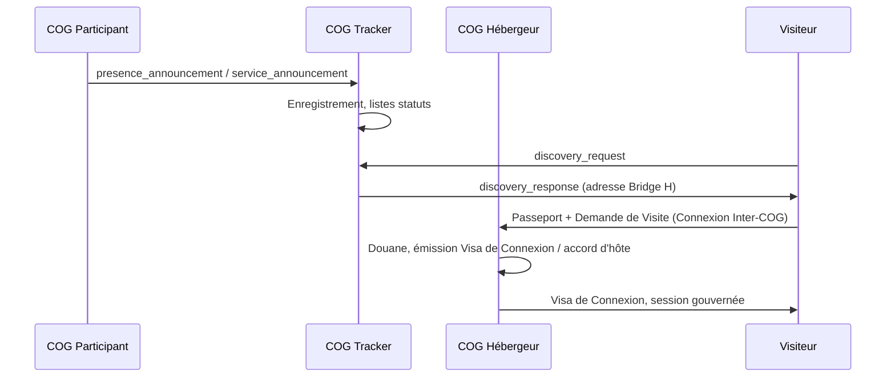
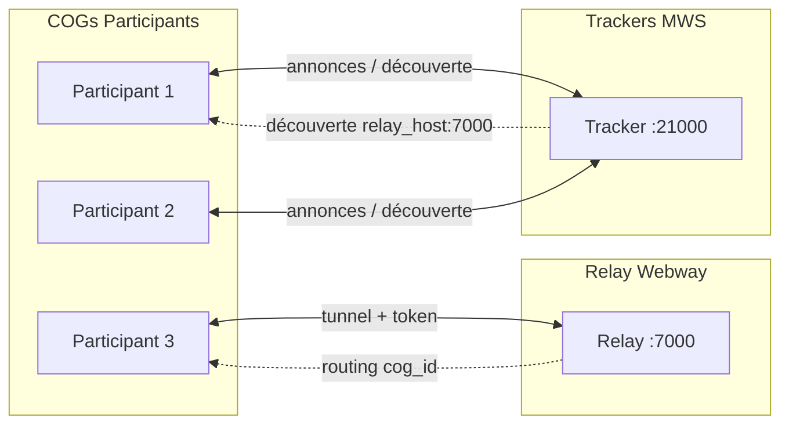
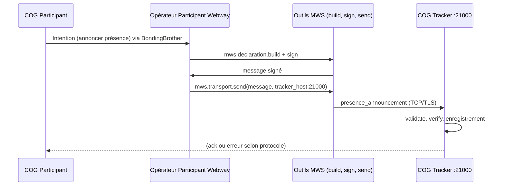

# Miyukini Conceptual References - Miyukini Webway System Complet

## Contexte

Ce document est le **document maître consolidé** du **Miyukini Webway System (MWS)**. Il offre une vision unifiée du système en un seul point d'entrée : vue d'ensemble, acteurs, protocole, relay, transport, découverte, sécurité et déploiement. Il ne remplace pas les documents de référence détaillés mais en synthétise le contenu et en assure la navigation.

**Principe fondamental :**

> **Le Webway normalise la présence et facilite l'échange entre environnements ; il ne transporte pas la gouvernance ni les données — il permet de savoir où et comment initier une visite gouvernée.**

## Portée / Scope

- **Entrée unique** pour comprendre l'ensemble du MWS (présence, découverte, relay, sécurité, déploiement).
- **Synthèse** des trois références conceptuelles MWS (document principal, Normes et Standards, Outils et Opérateurs) et du guide d'instance Hostinger VPS.
- **Diagrammes** : flux de connexion, topologie réseau, séquence d'enregistrement.
- **Références croisées** vers tous les documents MWS et connexes.

Ce document **ne remplace pas** les spécifications détaillées ; pour les normes, formats, contrats et implémentations, se reporter aux documents indiqués dans les références croisées.

---

## 1. Vue d'ensemble du Miyukini Webway System

### 1.1 Rôle du MWS

Le **Miyukini Webway System (MWS)** est la couche de **présence et de découverte** des environnements COG disposant d'un accès réseau. Il permet aux COGs de :

| Capacité | Description |
|----------|-------------|
| **Se déclarer** | Annoncer sa présence (identité COG, adresse du Bridge / point de contact) |
| **Découvrir** | Savoir quels COGs sont présents et où les joindre |
| **Faciliter l'échange** | Donner le point d'entrée pour initier une visite gouvernée (Passeport → Permis de circulation → Bridge → Visa de Connexion) |

**Le MWS ne sert pas à transférer des données métier.** Il est la transcription concrète des concepts de présence : il normalise *qui est là* et *où se présenter* pour demander un Permis de circulation (relay) ou un Visa de Connexion / accord d'hôte (COG hôte).

**Analogie :** à la manière d'un réseau de type BitTorrent, les COGs peuvent s'annoncer et interroger des **Trackers** (points de rendez-vous pour la découverte) ; le transfert réel et la gouvernance restent dans le cadre de la visite gouvernée (Bridge, Visa de Connexion).

### 1.2 Principes cardinaux

- **Le maillage ne fait pas confiance** — il transporte et expose des informations de présence.
- **La gouvernance (Passeport, Permis de circulation, Visa de Connexion) reste souveraine** ; le Webway ne gouverne pas.
- **Optionnel** : les environnements sans réseau ou qui refusent la découverte restent souverains (LOI-2, LOI-6).
- **Aucun core partagé** : la présence ne donne aucun accès aux Cores ; elle indique où aller pour initier une visite.
- **Une seule gouvernance active** : c'est toujours le COG Hébergeur qui décide (Visa de Connexion / accord d'hôte, refus, révocation) ; Origin/relays pour le Permis de circulation.

---

## 2. Acteurs du Webway

### 2.1 COG participant (Webway Participant)

Tout COG qui choisit de participer au maillage MWS (accès réseau et déclaration activée).

**Rôle :** se déclarer auprès d'un ou plusieurs Trackers, exposer les informations minimales de présence (identité COG, adresse du Bridge), consulter la présence d'autres COGs, participer à l'échange de listes de COGs avec statuts.

**Responsabilités :** ne pas exposer de données métier ni de gouvernance via le Webway ; respecter les règles de sécurité du maillage.

### 2.2 COG Tracker (Webway Tracker)

COG dont l'administrateur a choisi d'endosser le rôle de **Tracker** : exposer volontairement une adresse pour servir de point de rendez-vous pour la découverte.

**Port officiel :** les COGs Tracker MWS exposent leur endpoint sur le **port 21000** (voir [MWS Normes et Standards](./Miyukini%20Conceptual%20References%20-%20Miyukini%20Webway%20System%20Normes%20et%20Standards.md) section 2.7.4).

**Rôle :** point de rendez-vous (enregistrement des annonces, réponse aux requêtes de découverte), **protection du réseau** par des mécanismes **passifs** et **actifs**.

**Devoir fondamental :** les COGs Tracker ont le devoir de protéger le réseau par des systèmes passifs et actifs (observer, signaler, filtrer, rejeter selon les contrats dédiés).

---

## 3. Protocole MWS

### 3.1 Types de messages

| Type | Direction | Description |
|------|-----------|-------------|
| `presence_announcement` | COG → Tracker / maillage | Annonce de présence |
| `service_announcement` | COG → Tracker / maillage | Annonce de services et adresses |
| `host_session_declaration` | COG Hébergeur → Tracker / maillage | Déclaration d'hébergement de session |
| `discovery_request` | COG / Tracker → Tracker | Requête de découverte |
| `discovery_response` | Tracker → COG | Réponse (liste de COGs, services, sessions) |
| `cog_list` / `status_update` | COG ↔ COG, Tracker ↔ COG | Échange de listes de statuts |

### 3.2 Séquences typiques

- **Annonce :** le COG construit la déclaration conforme (format, signature/intégrité), envoie vers un ou plusieurs Trackers ; le(s) Tracker(s) vérifient conformité et intégrité.
- **Découverte :** le COG envoie une `discovery_request` ; le(s) Tracker(s) répondent par `discovery_response` en respectant les listes de statuts (ex. exclure Rejected).
- **Échange de statuts :** les COGs et Trackers s'échangent des `cog_list` ou `status_update` ; chaque COG met à jour sa liste locale et applique ses règles (filtrer, dégrader, rejeter).

Détails des formats, champs obligatoires/optionnels et ports : [MWS Normes et Standards](./Miyukini%20Conceptual%20References%20-%20Miyukini%20Webway%20System%20Normes%20et%20Standards.md).

---

## 4. Relay Webway

Le **relay Miyukini Webway** est un composant de **transport** (tunnel étendu multi-tenant) qui permet aux COGs derrière NAT ou sans IP publique d'être joignables : ils s'enregistrent auprès du relay avec un **token d'authentification** et une adresse logique (`cog_id`), et le relay route le trafic entrant vers le bon tunnel.

### 4.1 Rôle du relay

- **Enregistrement** : un COG se connecte au relay (ex. `relay_host:7000`), s'authentifie par token/secret et enregistre son tunnel associé à son `cog_id`.
- **Routing** : le relay route les connexions entrantes (ou les données) vers le tunnel du COG concerné (multi-COG, multi-service).
- **Intégration MWS** : les adresses annoncées sur le Webway peuvent être **relay_host:port + token** (ou identifiant dérivé), permettant à d'autres COGs de joindre un COG via le relay sans exposition directe d'IP.

### 4.2 Port et déploiement

- **Port relay (orientation)** : **7000** (TCP) — modifiable selon l'implémentation.
- **Port Tracker MWS** : **21000** (découverte) — peut être hébergé sur la même machine que le relay (ex. VPS Hostinger).

Documentation détaillée du relay : [Miyukini Webway Relay](./Miyukini%20Conceptual%20References%20-%20Miyukini%20Webway%20Relay.md) (architecture, sécurité) et [Miyukini Webway Relay Protocol](./Miyukini%20Conceptual%20References%20-%20Miyukini%20Webway%20Relay%20Protocol.md) (protocole binaire, handshake). Guide d'instance : [Hostinger VPS Origin Webway](../../setup/Miyukini%20-%20Hostinger%20VPS%20Origin%20Webway.md). Guide de déploiement complet : [Webway Relay Deployment Guide](../setup/Miyukini%20-%20Webway%20Relay%20Deployment%20Guide.md).

---

## 5. Transport

- **Bindings** : le protocole MWS ne impose pas un transport unique ; la norme peut spécifier un ou plusieurs bindings (transport + encodage). **TCP + TLS** est le binding principal recommandé pour confidentialité et intégrité en transit.
- **Port officiel Trackers** : **21000** (les participants se connectent aux Trackers sur `host:21000` par défaut).
- **Ports exclus** : les annonces MWS ne doivent pas utiliser les ports exclus (plage IANA 0–1023 + ports courants web/dev/DB) ; liste normative dans [MWS Normes et Standards](./Miyukini%20Conceptual%20References%20-%20Miyukini%20Webway%20System%20Normes%20et%20Standards.md) section 2.7.
- **Découverte des Trackers** : par configuration locale, bootstrap ou annuaire connu ; port par défaut **21000**.

---

## 6. Découverte

- **Annonces** : présence, services/adresses (IP/ports), déclaration d'hébergement de session (Host) — format et norme de déclaration sécurisée dans [MWS Normes et Standards](./Miyukini%20Conceptual%20References%20-%20Miyukini%20Webway%20System%20Normes%20et%20Standards.md).
- **Requêtes** : un COG envoie une `discovery_request` (critères : service_id, cog_id, sessions) ; les Trackers répondent par `discovery_response` (COGs, services, sessions) en appliquant les listes de statuts (ex. exclure Rejected).
- **Outils et Opérateurs** : construction et envoi des requêtes/réponses via les Outils MWS (Kit Participant, Kit Tracker) et les Opérateurs Participant Webway / Tracker Webway — voir [MWS Outils et Opérateurs](./Miyukini%20Conceptual%20References%20-%20Miyukini%20Webway%20System%20Outils%20et%20Operateurs.md).

---

## 7. Sécurité

### 7.1 Liste de COGs avec statuts (Webway COG List)

Chaque COG participant (et chaque Tracker) maintient une **liste de COGs** avec un **statut** par entrée : `cog_id`, `status`, `source`, `updated_at`. Les COGs s'échangent des listes ou mises à jour pour analyser et, le cas échéant, rejeter un COG ou une connexion considérée comme malveillante ou non fiable.

### 7.2 Statuts normatifs

| Statut | Code | Signification | Usage typique |
|--------|------|---------------|----------------|
| **Trusted** | `trusted` | COG fiable pour présence/découverte | Annonces acceptées, relayées |
| **Neutral** | `neutral` | Aucun signal positif ou négatif | Traité par défaut |
| **Under review** | `under_review` | En cours d'analyse | Limitation ou surveillance |
| **Distrusted** | `distrusted` | COG non fiable | Annonces/connexions dégradées ou filtrées |
| **Rejected** | `rejected` | COG ou connexion rejetée | Refus d'annonce, blocage Webway |

Règles de transition et comportement attendu par statut : [MWS Normes et Standards](./Miyukini%20Conceptual%20References%20-%20Miyukini%20Webway%20System%20Normes%20et%20Standards.md) section 4.

### 7.3 Norme de déclaration sécurisée

Pour les annonces (présence, services, adresses, sessions hébergées) : **authentification** de l'origine, **intégrité** (signature/MAC), **format unifié**, **limitation des abus**. Cadre défini dans [MWS](./Miyukini%20Conceptual%20References%20-%20Miyukini%20Webway%20System.md) section 3.3 et [MWS Normes et Standards](./Miyukini%20Conceptual%20References%20-%20Miyukini%20Webway%20System%20Normes%20et%20Standards.md) section 1.

### 7.4 Systèmes passifs et actifs des Trackers

- **Passifs** : observer, enregistrer, signaler, alimenter les listes de statuts — sans modifier le flux par eux-mêmes. Contrat : [MiyuWebwayTracker - Passive Systems Contract](../tools/MiyuWebwayTracker/contracts/security/MiyuWebwayTracker%20-%20Passive%20Systems%20Contract.md).
- **Actifs** : filtrer, dégrader, rejeter (annonces/connexions) selon listes de statuts et politiques. Contrat : [MiyuWebwayTracker - Active Systems Contract](../tools/MiyuWebwayTracker/contracts/security/MiyuWebwayTracker%20-%20Active%20Systems%20Contract.md).

---

## 8. Déploiement

- **VPS Hostinger (Debian 13)** : instance pour héberger **Origin** (relay 7000, Tracker 21000, catalogue web). Règles de sécurité : ouvrir TCP 22, 80, 443, 7000, 21000. Voir [Miyukini - Hostinger VPS Origin Webway](../../setup/Miyukini%20-%20Hostinger%20VPS%20Origin%20Webway.md).
- **Relay** : déploiement du binaire relay (crate Rust), configuration TLS et authentification par token/secret, enregistrement des tunnels par `cog_id`. Guide de déploiement complet : [Miyukini - Webway Relay Deployment Guide](../setup/Miyukini%20-%20Webway%20Relay%20Deployment%20Guide.md).
- **DNS (optionnel)** : nom de domaine pointant vers l'IP publique (ex. `webway.studiomiyukini.com`) pour une adresse stable du relay et du Tracker.

---

## 9. Diagrammes

### 9.1 Flux de connexion (MWS → Visite gouvernée)

### 9.2 Topologie réseau (Participants, Trackers, Relay)

### 9.3 Séquence d'enregistrement (Participant → Tracker)

---

## 10. Relation avec la Connexion Inter-COG

Le MWS **ne remplace pas** la visite gouvernée ; il la **précède** et la **rend possible** en environnement connecté.

| Étape | Couche | Rôle |
|-------|--------|------|
| 1 | **MWS** | Découverte : quels COGs sont présents, où contacter le Bridge du COG Hébergeur |
| 2 | **Connexion Inter-COG** | Pré-validation locale (COG Origine), émission du Passeport Utilisateur |
| 3 | **Connexion Inter-COG** | Présentation au Bridge (Passeport + Demande de Visite) |
| 4 | **Connexion Inter-COG** | Douane du Host COG, émission du Visa de Connexion / accord d'hôte, session gouvernée |

Référence : [Connexion Inter-COG](./Miyukini%20Conceptual%20References%20-%20Connexion%20Inter-COG.md).

---

## 11. Positionnement dans l'architecture

- **Border Guard** : règles de qui peut s'annoncer ou interroger le maillage ; politique des listes de statuts.
- **Bridge inter-COG** : une fois l'adresse connue via le MWS, le Bridge reste le canal diplomatique ; le MWS ne remplace pas le Bridge.
- **WorrySentinel** : peut être sollicité pour surveiller les signaux issus du Webway (statuts, alertes).
- **Outils et Opérateurs** : Kit Participant Webway, Kit Tracker Webway ; Opérateurs Participant Webway et Tracker Webway (Strates 6–7), gouvernés par les Cores. Voir [MWS Outils et Opérateurs](./Miyukini%20Conceptual%20References%20-%20Miyukini%20Webway%20System%20Outils%20et%20Operateurs.md).

Le MWS est une **couche de découverte et de présence** sous le contrôle des Cores existants ; il n'introduit pas de nouveau Core métier.

---

## Références croisées

### Documents MWS principaux

- [Miyukini Webway System](./Miyukini%20Conceptual%20References%20-%20Miyukini%20Webway%20System.md) — document conceptuel principal (acteurs, annonces, sécurité, devoir Trackers)
- [Miyukini Webway System - Normes et Standards](./Miyukini%20Conceptual%20References%20-%20Miyukini%20Webway%20System%20Normes%20et%20Standards.md) — formats, protocole, ports, matrice des statuts, conformité Trackers
- [Miyukini Webway System - Outils et Opérateurs](./Miyukini%20Conceptual%20References%20-%20Miyukini%20Webway%20System%20Outils%20et%20Operateurs.md) — Outils MWS, Kits Participant/Tracker, Opérateurs

### Relay et déploiement

- [Miyukini Webway Relay](./Miyukini%20Conceptual%20References%20-%20Miyukini%20Webway%20Relay.md) — architecture du relay custom (tunnel étendu multi-tenant)
- [Miyukini Webway Relay Protocol](./Miyukini%20Conceptual%20References%20-%20Miyukini%20Webway%20Relay%20Protocol.md) — protocole relay (messages, handshake, TLS)
- [Miyukini - Hostinger VPS Origin Webway](../../setup/Miyukini%20-%20Hostinger%20VPS%20Origin%20Webway.md) — instance Origin (Debian 13), Rust, systemd, ufw, monitoring
- [Miyukini - Webway Relay Deployment Guide](../setup/Miyukini%20-%20Webway%20Relay%20Deployment%20Guide.md) — guide de déploiement complet (VM, TLS, systemd, tests)

### Toolkits MWS

- [MiyuWebwayParticipant](../tools/MiyuWebwayParticipant/) — Documentation fondatrice, référence outils, implémentation, gouvernance
- [MiyuWebwayTracker](../tools/MiyuWebwayTracker/) — Documentation fondatrice, référence outils, implémentation, gouvernance
- Contrats systèmes passifs/actifs Tracker : [Passive Systems Contract](../tools/MiyuWebwayTracker/contracts/security/MiyuWebwayTracker%20-%20Passive%20Systems%20Contract.md), [Active Systems Contract](../tools/MiyuWebwayTracker/contracts/security/MiyuWebwayTracker%20-%20Active%20Systems%20Contract.md)

### Références conceptuelles connexes

- [Connexion Inter-COG](./Miyukini%20Conceptual%20References%20-%20Connexion%20Inter-COG.md)
- [Definition COG](./Miyukini%20Conceptual%20References%20-%20Definition%20COG.md)
- [Souverainete Environnement](./Miyukini%20Conceptual%20References%20-%20Souverainete%20Environnement.md)
- [Lois Autonomie Systeme](./Miyukini%20Conceptual%20References%20-%20Lois%20Autonomie%20Systeme.md)
- [Doctrine Securite Fondamentale](./Miyukini%20Conceptual%20References%20-%20Doctrine%20Securite%20Fondamentale.md)
- [Glossaire](./Miyukini%20Conceptual%20References%20-%20Glossaire.md) (Passeport Utilisateur, Visa de Connexion, Bridge inter-COG, COG Tracker, MWS)

---

*Document créé le 12/02/2026*  
*Classification : Reference conceptuelle — Document maître MWS (Miyukini Webway System Complet)*
