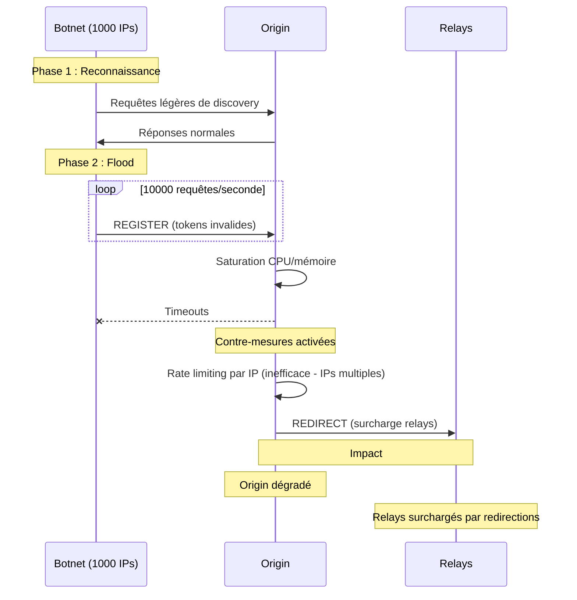
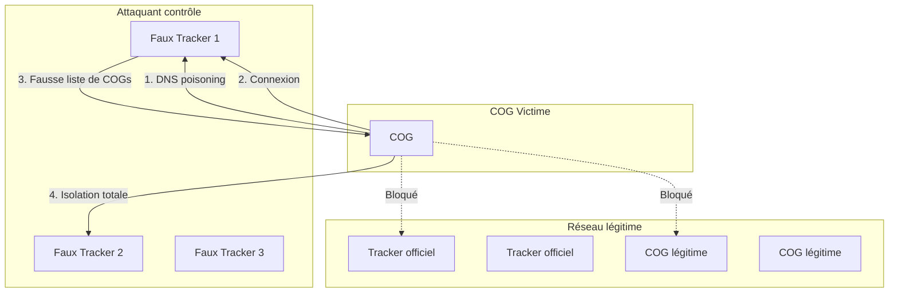
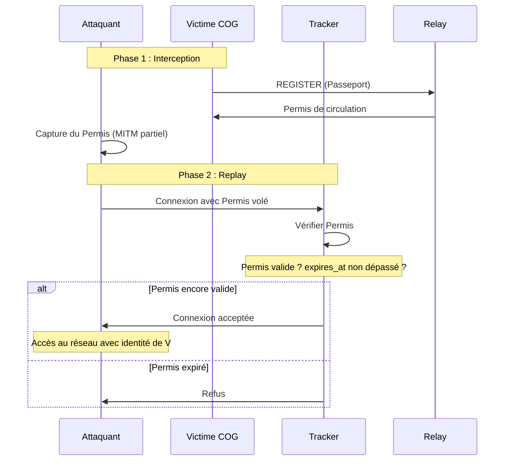
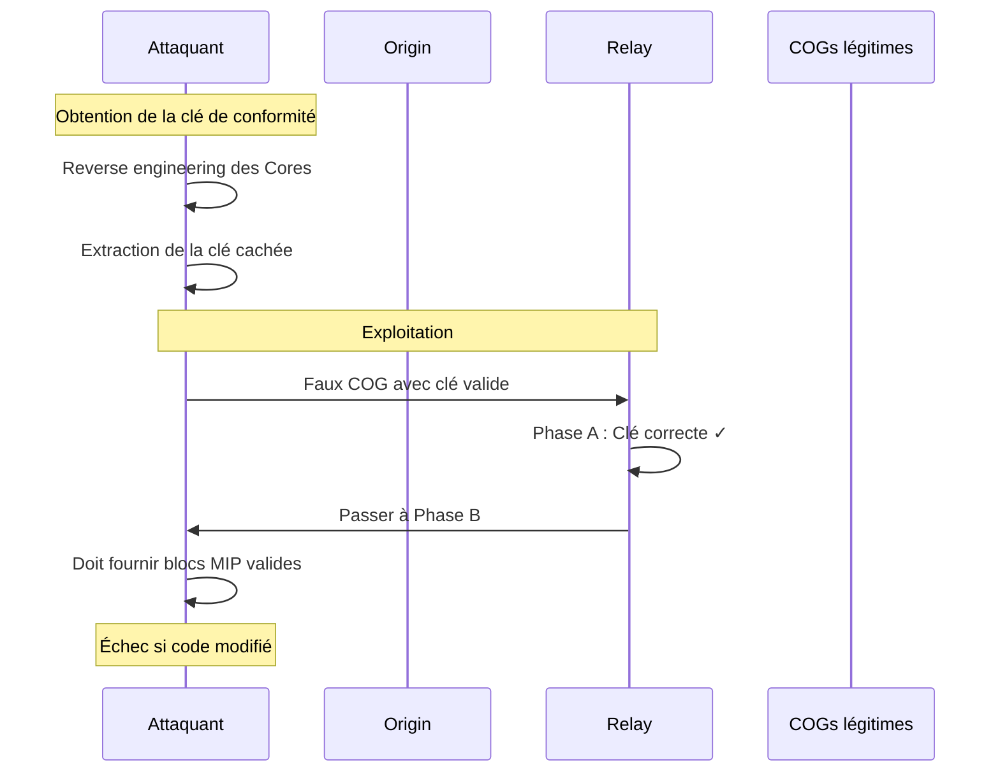
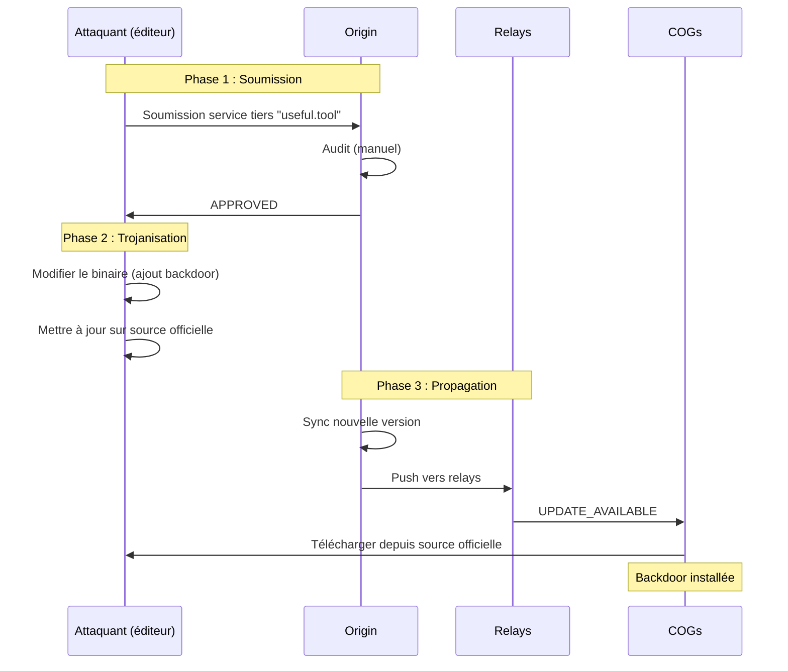

# MWS — Audit de Sécurité Complet

## Contexte

Ce document constitue un **audit de sécurité exhaustif** du Miyukini Webway System (MWS). Il analyse les vecteurs d'attaque potentiels, simule des scénarios d'intrusion, identifie les vulnérabilités et propose des contre-mesures.

**Date de l'audit :** 2026-02-13  
**Version MWS auditée :** 1.0  
**Classification :** CONFIDENTIEL — Sécurité

---

## Sommaire

1. [Synthèse exécutive](#1-synthèse-exécutive)
2. [Méthodologie d'audit](#2-méthodologie-daudit)
3. [Analyse des vecteurs d'attaque](#3-analyse-des-vecteurs-dattaque)
4. [Simulations d'attaques](#4-simulations-dattaques)
5. [Vulnérabilités identifiées](#5-vulnérabilités-identifiées)
6. [Recommandations et contre-mesures](#6-recommandations-et-contre-mesures)
7. [Matrice de risques](#7-matrice-de-risques)
8. [Plan de remédiation](#8-plan-de-remédiation)

---

## 1. Synthèse exécutive

### 1.1 Résumé global

| Catégorie | Vulnérabilités | Critiques | Élevées | Moyennes | Faibles |
|-----------|----------------|-----------|---------|----------|---------|
| Authentification | 4 | 0 | 2 | 1 | 1 |
| Réseau | 6 | 1 | 2 | 2 | 1 |
| Architecture | 3 | 1 | 1 | 1 | 0 |
| Protocole | 5 | 0 | 1 | 3 | 1 |
| Opérationnel | 4 | 0 | 1 | 2 | 1 |
| **TOTAL** | **22** | **2** | **7** | **9** | **4** |

### 1.2 Points forts du système

| Aspect | Évaluation |
|--------|------------|
| Chiffrement TLS obligatoire | ✅ Excellent |
| Système de quarantaine progressif | ✅ Excellent |
| Isolation par version des Cores | ✅ Très bon |
| Vérification en 3 phases | ✅ Très bon |
| Protection anti-replay | ✅ Bon |
| Gestion des blacklists | ✅ Bon |

### 1.3 Points critiques à adresser

| Vulnérabilité | Sévérité | Statut |
|---------------|----------|--------|
| Single Point of Failure (Origin) | 🔴 Critique | Non documenté |
| Absence de rate limiting détaillé sur Origin | 🔴 Critique | Partiellement documenté |
| Fenêtre d'acceptation timestamp trop large | 🟠 Élevée | ±30s actuellement |
| Absence de signature sur les messages DATA | 🟠 Élevée | Non documenté |
| Manque de protection contre Eclipse Attack | 🟠 Élevée | Non documenté |

---

## 2. Méthodologie d'audit

### 2.1 Approche

| Phase | Description |
|-------|-------------|
| **Analyse statique** | Revue complète de la documentation MWS |
| **Modélisation des menaces** | Identification des acteurs malveillants et motivations |
| **Simulation d'attaques** | Tests théoriques des vecteurs d'attaque |
| **Évaluation des contre-mesures** | Vérification des protections documentées |
| **Gap analysis** | Identification des lacunes |

### 2.2 Modèle de menaces (STRIDE)

| Menace | Description | Applicabilité MWS |
|--------|-------------|-------------------|
| **S**poofing | Usurpation d'identité | COG, Relay, Origin |
| **T**ampering | Modification de données | Passeport, Permis, DATA |
| **R**epudiation | Déni d'action | Transactions, Accords |
| **I**nformation disclosure | Fuite de données | Catalogues, Lobbys |
| **D**enial of Service | Déni de service | Origin, Relays, Trackers |
| **E**levation of privilege | Élévation de privilèges | Passeport Standard → Spécial |

---

## 3. Analyse des vecteurs d'attaque

### 3.1 Attaques sur l'authentification

#### 3.1.1 Usurpation d'identité COG (Spoofing)

**Scénario :** Un attaquant tente d'usurper le `cog_id` d'un COG légitime.

| Aspect | Analyse |
|--------|---------|
| **Vecteur** | Falsification du `cog_id` dans le message REGISTER |
| **Protection existante** | Vérification du token d'authentification (256+ bits) |
| **Protection existante** | Vérification de la clé de conformité des Cores (Phase A) |
| **Vulnérabilité** | ⚠️ Si le token est compromis, usurpation possible |
| **Sévérité** | 🟠 Élevée |

**Contre-mesure recommandée :**
```
Implémenter une authentification mutuelle avec certificat client TLS
pour les COGs, en plus du token. Le certificat serait lié au cog_id
et signé par Origin lors de la première vérification.
```

#### 3.1.2 Falsification de Passeport COG

**Scénario :** Un attaquant modifie les champs du Passeport pour contourner la vérification.

| Aspect | Analyse |
|--------|---------|
| **Vecteur** | Modification de `core_version`, `service_list`, `environment_health` |
| **Protection existante** | Phase A vérifie la clé cachée des Cores |
| **Protection existante** | Phase B vérifie les blocs de code MIP |
| **Protection existante** | Phase C vérifie la signature du rapport de santé |
| **Vulnérabilité** | ✅ Bien protégé — les 3 phases couvrent ce vecteur |
| **Sévérité** | 🟢 Faible |

#### 3.1.3 Vol de token d'authentification

**Scénario :** Un attaquant intercepte ou vole le token d'authentification.

| Aspect | Analyse |
|--------|---------|
| **Vecteur** | Interception réseau, accès au fichier de tokens |
| **Protection existante** | TLS obligatoire sur canal de contrôle |
| **Protection existante** | Droits restreints sur fichiers de secrets (`chmod 600`) |
| **Vulnérabilité** | ⚠️ Pas de rotation automatique documentée |
| **Sévérité** | 🟠 Moyenne |

**Contre-mesure recommandée :**
```
1. Implémenter une rotation automatique des tokens (ex: tous les 7 jours)
2. Ajouter un mécanisme de révocation immédiate
3. Notifier le COG si son token est utilisé depuis une nouvelle IP
```

#### 3.1.4 Falsification de Passeport Spécial

**Scénario :** Un attaquant tente d'obtenir frauduleusement un Passeport Spécial.

| Aspect | Analyse |
|--------|---------|
| **Vecteur** | Demande frauduleuse à Origin, falsification de `special_key` |
| **Protection existante** | Audit préalable par Origin |
| **Protection existante** | Clé cryptographique spéciale |
| **Vulnérabilité** | ⚠️ Processus d'audit non formalisé dans la documentation |
| **Sévérité** | 🟠 Moyenne |

---

### 3.2 Attaques réseau

#### 3.2.1 Man-in-the-Middle (MITM)

**Scénario :** Un attaquant s'interpose entre un COG et le relay.

| Aspect | Analyse |
|--------|---------|
| **Vecteur** | ARP spoofing, DNS poisoning, BGP hijacking |
| **Protection existante** | TLS 1.2+ obligatoire |
| **Protection existante** | PFS (Perfect Forward Secrecy) obligatoire |
| **Protection existante** | Validation des certificats côté client |
| **Vulnérabilité** | ✅ Bien protégé pour le canal de contrôle |
| **Vulnérabilité** | ⚠️ Canal DATA peut être exempt de TLS (temps réel) |
| **Sévérité** | 🟠 Élevée (pour l'exemption temps réel) |

**Contre-mesure recommandée :**
```
Pour les flux temps réel non chiffrés :
1. Exiger une signature HMAC sur chaque paquet DATA
2. Implémenter DTLS comme alternative légère à TLS pour le temps réel
3. Limiter strictement la durée des sessions non chiffrées (max 30 minutes)
```

#### 3.2.2 Replay Attack

**Scénario :** Un attaquant rejoue des messages capturés.

| Aspect | Analyse |
|--------|---------|
| **Vecteur** | Capture et rejeu de messages REGISTER, CORE_KEY |
| **Protection existante** | Nonce de 16 octets minimum |
| **Protection existante** | Timestamp avec fenêtre de ±30 secondes |
| **Protection existante** | Registre de nonces vus récemment |
| **Vulnérabilité** | ⚠️ Fenêtre de 30 secondes trop large |
| **Sévérité** | 🟠 Moyenne |

**Contre-mesure recommandée :**
```
1. Réduire la fenêtre d'acceptation à ±10 secondes
2. Implémenter une synchronisation NTP obligatoire pour tous les acteurs
3. Ajouter un compteur monotone côté serveur par session
```

#### 3.2.3 Denial of Service (DoS/DDoS)

**Scénario :** Un attaquant submerge Origin/Relays/Trackers de requêtes.

| Aspect | Analyse |
|--------|---------|
| **Vecteur** | Flood de connexions TCP, flood de REGISTER |
| **Protection existante** | Rate limiting par adresse source et token |
| **Protection existante** | Limite de connexions configurables |
| **Protection existante** | Redirection vers relays en cas de saturation |
| **Vulnérabilité** | 🔴 Rate limiting non détaillé pour Origin |
| **Vulnérabilité** | ⚠️ Pas de protection anti-amplification documentée |
| **Sévérité** | 🔴 Critique |

**Contre-mesure recommandée :**
```
1. Implémenter un système de preuve de travail (PoW) léger pour REGISTER
2. Ajouter une protection SYN cookies (documenté mais à renforcer)
3. Déployer Origin derrière un CDN/DDoS mitigation service
4. Implémenter un système de "challenge-response" avant d'allouer des ressources
5. Définir des seuils de rate limiting précis dans la documentation :
   - Max 10 REGISTER par minute par IP
   - Max 100 connexions simultanées par token
   - Max 1000 requêtes par heure par COG
```

#### 3.2.4 Eclipse Attack

**Scénario :** Un attaquant isole un COG du réseau légitime en contrôlant tous ses pairs.

| Aspect | Analyse |
|--------|---------|
| **Vecteur** | Contrôle de multiples trackers malveillants |
| **Protection existante** | Liste de trackers officiels remise avec le Permis |
| **Protection existante** | COG ne doit pas se connecter à un tracker inconnu |
| **Vulnérabilité** | ⚠️ Pas de vérification cryptographique des trackers |
| **Sévérité** | 🟠 Élevée |

**Contre-mesure recommandée :**
```
1. Signer la liste des trackers officiels avec une clé d'Origin
2. Implémenter un mécanisme de "tracker pinning" pour les COGs
3. Exiger que les trackers présentent un certificat signé par Origin
4. Ajouter une vérification périodique que le tracker est toujours officiel
```

#### 3.2.5 Downgrade Attack

**Scénario :** Un attaquant force l'utilisation de protocoles/ciphers faibles.

| Aspect | Analyse |
|--------|---------|
| **Vecteur** | Manipulation du handshake TLS |
| **Protection existante** | TLS 1.2 minimum, TLS 1.1 et inférieures refusés |
| **Protection existante** | Cipher suites sûres uniquement (AES-GCM, ChaCha20) |
| **Vulnérabilité** | ✅ Bien protégé |
| **Sévérité** | 🟢 Faible |

#### 3.2.6 DNS Poisoning ciblant Origin

**Scénario :** Un attaquant empoisonne le DNS pour rediriger vers un faux Origin.

| Aspect | Analyse |
|--------|---------|
| **Vecteur** | Attaque DNS pour usurper origin.miyukini.com |
| **Protection existante** | Validation certificat TLS |
| **Vulnérabilité** | ⚠️ Pas de DNSSEC mentionné |
| **Vulnérabilité** | ⚠️ Pas de certificate pinning documenté |
| **Sévérité** | 🟠 Moyenne |

**Contre-mesure recommandée :**
```
1. Déployer DNSSEC sur les domaines MWS
2. Implémenter le certificate pinning pour Origin dans tous les clients
3. Fournir une liste d'IP de fallback signée pour Origin
```

---

### 3.3 Attaques sur l'architecture

#### 3.3.1 Single Point of Failure (Origin)

**Scénario :** Origin devient indisponible (panne, attaque, catastrophe).

| Aspect | Analyse |
|--------|---------|
| **Vecteur** | Panne matérielle, DDoS massif, incident datacenter |
| **Protection existante** | Relays maintiennent la vérité héritée |
| **Protection existante** | Mode lecture seule en cas d'alerte |
| **Vulnérabilité** | 🔴 Origin est un SPOF — pas de haute disponibilité |
| **Vulnérabilité** | 🔴 Pas de procédure de failover documentée |
| **Sévérité** | 🔴 Critique |

**Contre-mesure recommandée :**
```
1. Déployer Origin en mode actif-passif avec réplication synchrone
2. Documenter une procédure de failover automatique
3. Implémenter un consensus distribué pour la source de vérité
4. Définir des relays "promotables" qui peuvent devenir Origin temporaire
5. Créer des sauvegardes géo-distribuées du Registre de Services
```

#### 3.3.2 Compromission d'Origin

**Scénario :** Un attaquant prend le contrôle d'Origin.

| Aspect | Analyse |
|--------|---------|
| **Vecteur** | Exploitation de vulnérabilité, compromission de credentials |
| **Protection existante** | Non documenté |
| **Vulnérabilité** | 🔴 Impact catastrophique — contrôle total du réseau |
| **Sévérité** | 🔴 Critique |

**Contre-mesure recommandée :**
```
1. Implémenter une authentification multi-facteur pour l'administration
2. Séparer les clés de signature (HSM) de l'infrastructure
3. Audits de sécurité réguliers (pentests)
4. Mise en place d'un système de détection d'intrusion (IDS)
5. Procédure de révocation d'urgence de toutes les clés
6. Multi-signature pour les opérations critiques (ajout au Registre, etc.)
```

#### 3.3.3 Attaque de la supply chain (Registre de Services)

**Scénario :** Un attaquant injecte un service malveillant dans le Registre.

| Aspect | Analyse |
|--------|---------|
| **Vecteur** | Compromission d'un éditeur tiers, soumission frauduleuse |
| **Protection existante** | Audit préalable par Origin |
| **Protection existante** | Checksums SHA-256 |
| **Vulnérabilité** | ⚠️ Pas de signature cryptographique des binaires |
| **Vulnérabilité** | ⚠️ Processus d'audit tiers non formalisé |
| **Sévérité** | 🟠 Élevée |

**Contre-mesure recommandée :**
```
1. Exiger une signature GPG/Sigstore de tous les binaires
2. Implémenter un système de "reproducible builds"
3. Mettre en place un "canary" automatisé qui teste les nouvelles versions
4. Délai de propagation obligatoire (72h) pour les nouveaux services tiers
5. Système de révocation rapide avec notification push
```

---

### 3.4 Attaques sur le protocole

#### 3.4.1 Exploitation du protocole binaire

**Scénario :** Un attaquant envoie des trames malformées.

| Aspect | Analyse |
|--------|---------|
| **Vecteur** | Buffer overflow, integer overflow dans payload_length |
| **Protection existante** | Validation longueur cohérente |
| **Protection existante** | Tailles maximales définies (cog_id: 256, token: 512) |
| **Protection existante** | Fermeture + ERROR pour trames malformées |
| **Vulnérabilité** | ⚠️ Pas de fuzzing documenté |
| **Sévérité** | 🟠 Moyenne |

**Contre-mesure recommandée :**
```
1. Campagne de fuzzing obligatoire sur le parser binaire
2. Implémenter des limites strictes côté parsing (fail-fast)
3. Sandboxing du parser de trames
```

#### 3.4.2 Injection dans le service_manifest (JSON)

**Scénario :** Un attaquant injecte du contenu malveillant dans les champs JSON.

| Aspect | Analyse |
|--------|---------|
| **Vecteur** | Injection JSON, caractères de contrôle |
| **Protection existante** | Encodage UTF-8 valide requis |
| **Vulnérabilité** | ⚠️ Pas de validation de schéma JSON documentée |
| **Sévérité** | 🟠 Moyenne |

**Contre-mesure recommandée :**
```
1. Définir un schéma JSON strict pour chaque payload
2. Valider contre le schéma avant traitement
3. Limiter la profondeur d'imbrication JSON (max 5 niveaux)
4. Échapper/valider tous les champs avant stockage/affichage
```

#### 3.4.3 Absence de signature sur DATA

**Scénario :** Un attaquant modifie les paquets DATA en transit.

| Aspect | Analyse |
|--------|---------|
| **Vecteur** | Modification des données opaques relayées |
| **Protection existante** | TLS protège l'intégrité (en mode normal) |
| **Vulnérabilité** | 🔴 Pas de protection en mode temps réel non chiffré |
| **Sévérité** | 🟠 Élevée |

**Contre-mesure recommandée :**
```
Même en mode temps réel non chiffré, ajouter :
1. Un MAC (Message Authentication Code) sur chaque paquet DATA
2. Format : DATA + HMAC-SHA256(shared_secret, DATA)
3. La clé partagée est négociée via le canal de contrôle TLS
```

#### 3.4.4 Timing Attack sur la comparaison de clés

**Scénario :** Un attaquant déduit la clé par timing des réponses.

| Aspect | Analyse |
|--------|---------|
| **Vecteur** | Mesure du temps de réponse lors de la vérification Phase A |
| **Protection existante** | "Comparaison cryptographique constante-time" documentée |
| **Vulnérabilité** | ✅ Bien protégé si correctement implémenté |
| **Sévérité** | 🟢 Faible (si implémentation correcte) |

#### 3.4.5 Enumération des COGs

**Scénario :** Un attaquant énumère les COGs enregistrés.

| Aspect | Analyse |
|--------|---------|
| **Vecteur** | Requêtes de découverte massives |
| **Protection existante** | "Le relay ne révèle pas la liste des cog_id enregistrés" |
| **Protection existante** | Filtrage par pool de version |
| **Vulnérabilité** | ⚠️ Le catalogue web expose les services WEB publics |
| **Sévérité** | 🟠 Moyenne |

---

### 3.5 Attaques Sybil

#### 3.5.1 Création massive de faux COGs

**Scénario :** Un attaquant crée de nombreux COGs pour influencer le réseau.

| Aspect | Analyse |
|--------|---------|
| **Vecteur** | Automatisation de création de COGs |
| **Protection existante** | Vérification des Cores (clé cachée) |
| **Protection existante** | Rate limiting |
| **Vulnérabilité** | ⚠️ Un attaquant avec accès aux Cores peut créer des COGs valides |
| **Sévérité** | 🟠 Moyenne |

**Contre-mesure recommandée :**
```
1. Lier le cog_id à une identité externe (email, téléphone) pour les comptes
2. Implémenter un système de réputation basé sur l'historique
3. Limiter le nombre de COGs par adresse IP source
4. Captcha ou preuve de travail pour la première vérification
```

---

### 3.6 Attaques sur les Lobbys

#### 3.6.1 Brute force de mots de passe Lobby

**Scénario :** Un attaquant tente de deviner le mot de passe d'un Lobby privé.

| Aspect | Analyse |
|--------|---------|
| **Vecteur** | Essais successifs de mots de passe |
| **Protection existante** | 5 échecs maximum → ban du COG client |
| **Protection existante** | Notification à l'hôte en cas de ban |
| **Vulnérabilité** | ⚠️ 5 essais peuvent suffire pour mots de passe faibles |
| **Sévérité** | 🟢 Faible |

**Contre-mesure recommandée :**
```
1. Implémenter un délai exponentiel entre les essais (1s, 2s, 4s, 8s...)
2. Recommander des mots de passe de minimum 12 caractères
3. Optionnel : support de clés cryptographiques pour l'accès aux Lobbys
```

#### 3.6.2 Phishing de Lobbys

**Scénario :** Un attaquant crée un faux Lobby imitant un Lobby légitime.

| Aspect | Analyse |
|--------|---------|
| **Vecteur** | Nom de Lobby similaire, description trompeuse |
| **Protection existante** | Vérification du `host_cog_id` |
| **Vulnérabilité** | ⚠️ Pas de système de vérification visuelle pour l'utilisateur |
| **Sévérité** | 🟠 Moyenne |

**Contre-mesure recommandée :**
```
1. Système de "Lobbys vérifiés" avec badge visuel
2. Afficher clairement le cog_id du hôte avant connexion
3. Historique des connexions pour détecter les changements
```

---

### 3.7 Attaques internes

#### 3.7.1 COG malveillant après admission

**Scénario :** Un COG légitime devient malveillant après avoir obtenu son Permis.

| Aspect | Analyse |
|--------|---------|
| **Vecteur** | Comportement malveillant pendant la durée du Permis |
| **Protection existante** | Permis expirent (1-24h standard, jusqu'à 7j spécial) |
| **Protection existante** | Monitoring par les trackers |
| **Protection existante** | Blacklist sur comportement malveillant |
| **Vulnérabilité** | ⚠️ Fenêtre d'attaque pendant la validité du Permis |
| **Sévérité** | 🟠 Moyenne |

**Contre-mesure recommandée :**
```
1. Implémenter une révocation de Permis en temps réel
2. Monitoring comportemental avec détection d'anomalies
3. Système de "strike" : 1er comportement suspect = surveillance renforcée
4. Capacité de confiner un COG individuel sans alerte réseau globale
```

#### 3.7.2 Exploitation de l'exemption temps réel

**Scénario :** Un attaquant abuse du mode temps réel non chiffré.

| Aspect | Analyse |
|--------|---------|
| **Vecteur** | Négocier l'exemption puis intercepter/modifier le trafic |
| **Protection existante** | Négociation via canal TLS |
| **Protection existante** | Journalisation obligatoire |
| **Protection existante** | Flux éphémère limité dans le temps |
| **Vulnérabilité** | ⚠️ Durée maximale non spécifiée |
| **Sévérité** | 🟠 Moyenne |

**Contre-mesure recommandée :**
```
1. Définir une durée maximale absolue (ex: 4 heures)
2. Renouvellement obligatoire de l'exemption avec nouvelle négociation
3. Monitoring du volume échangé en mode non chiffré
4. Alerte si le ratio non-chiffré/chiffré dépasse un seuil
```

---

## 4. Simulations d'attaques

### 4.1 Simulation : DDoS sur Origin



**Résultat :** ⚠️ Le système de redirection peut amplifier l'attaque vers les relays.

**Contre-mesure :**
```
1. Challenge-response (PoW) AVANT allocation de ressources
2. Anycast pour distribuer le trafic géographiquement
3. Liste blanche d'IP pour les relays connus
4. CDN/service anti-DDoS en frontal
```

---

### 4.2 Simulation : Attaque de type Eclipse



**Résultat :** ⚠️ Si l'attaquant contrôle le DNS et présente de faux trackers, le COG peut être isolé.

**Contre-mesure :**
```
1. Liste de trackers signée par Origin intégrée au Permis
2. Vérification du certificat du tracker (signé par CA MWS)
3. Fallback vers des trackers hardcodés si liste suspecte
4. Alerte utilisateur si changement soudain de trackers
```

---

### 4.3 Simulation : Replay d'un Permis volé



**Résultat :** ⚠️ Fenêtre d'exploitation pendant la validité du Permis.

**Contre-mesure :**
```
1. Lier le Permis à l'adresse IP source (binding)
2. Ajouter un jeton de session unique dans le Permis
3. Vérification du certificat client si implémenté
4. Réduction de la durée des Permis standard (6h au lieu de 24h)
```

---

### 4.4 Simulation : Compromission de la clé de conformité



**Résultat :** ✅ Protection en profondeur — Phase B bloque même si Phase A réussit.

---

### 4.5 Simulation : Injection de Service malveillant



**Résultat :** 🔴 Vulnérabilité supply chain — le checksum seul ne protège pas contre une source compromise.

**Contre-mesure :**
```
1. Signature obligatoire par l'éditeur (clé contrôlée par Origin)
2. Reproducible builds vérifiables
3. Délai de propagation de 72h pour les mises à jour
4. Système de "canary" qui teste les nouvelles versions
5. Alertes automatiques si trop de COGs signalent des anomalies
```

---

## 5. Vulnérabilités identifiées

### 5.1 Liste complète

| ID | Vulnérabilité | Sévérité | CVSS* | Statut |
|----|---------------|----------|-------|--------|
| V-001 | Single Point of Failure (Origin) | 🔴 Critique | 9.0 | Non adressé |
| V-002 | Absence de rate limiting détaillé sur Origin | 🔴 Critique | 8.5 | Partiel |
| V-003 | Pas de signature sur paquets DATA (temps réel) | 🟠 Élevée | 7.5 | Non adressé |
| V-004 | Eclipse Attack possible | 🟠 Élevée | 7.0 | Partiel |
| V-005 | Fenêtre timestamp trop large (±30s) | 🟠 Élevée | 6.5 | À corriger |
| V-006 | Supply chain - pas de signature binaires | 🟠 Élevée | 7.0 | Non adressé |
| V-007 | Absence de certificate pinning Origin | 🟠 Élevée | 6.5 | Non adressé |
| V-008 | Pas de rotation automatique des tokens | 🟠 Moyenne | 5.5 | Non documenté |
| V-009 | Durée max exemption temps réel non définie | 🟠 Moyenne | 5.0 | Non défini |
| V-010 | Pas de révocation Permis temps réel | 🟠 Moyenne | 5.5 | Non implémenté |
| V-011 | Schéma JSON non validé | 🟠 Moyenne | 5.0 | Non documenté |
| V-012 | Processus audit Passeport Spécial flou | 🟠 Moyenne | 4.5 | Non formalisé |
| V-013 | Pas de fuzzing documenté | 🟠 Moyenne | 5.0 | Manquant |
| V-014 | Enumération partielle via catalogue web | 🟠 Moyenne | 4.0 | Inhérent |
| V-015 | Création Sybil non limitée fortement | 🟠 Moyenne | 5.0 | Partiel |
| V-016 | 5 essais Lobby trop généreux | 🟢 Faible | 3.0 | À améliorer |
| V-017 | Pas de badge Lobby vérifié | 🟢 Faible | 2.5 | Manquant |
| V-018 | DNSSEC non mentionné | 🟢 Faible | 3.5 | Manquant |
| V-019 | Pas de procédure failover Origin | 🟢 Faible | 3.0 | Manquant |

*CVSS estimé basé sur l'impact et l'exploitabilité

---

## 6. Recommandations et contre-mesures

### 6.1 Priorité Critique (à adresser immédiatement)

#### R-001 : Haute disponibilité Origin

```
OBJECTIF : Éliminer le Single Point of Failure

ACTIONS :
1. Déployer Origin en cluster actif-passif (ou actif-actif)
2. Implémenter une réplication synchrone du Registre
3. Documenter et tester la procédure de failover
4. Définir des relays "promotables" en Origin temporaire
5. Objectif : RTO < 5 minutes, RPO = 0

DOCUMENTATION À CRÉER :
- MWS - Haute Disponibilité Origin.md
- MWS - Procédure de Failover.md
```

#### R-002 : Protection DDoS Origin

```
OBJECTIF : Protéger Origin contre les attaques volumétriques

ACTIONS :
1. Déployer Origin derrière un service anti-DDoS (Cloudflare, AWS Shield)
2. Implémenter un challenge-response (PoW léger) pour REGISTER
3. Définir des seuils de rate limiting stricts :
   - 10 REGISTER/minute/IP
   - 100 connexions simultanées/token
   - 1000 requêtes/heure/COG
4. Whitelist des IPs des relays connus

DOCUMENTATION À CRÉER :
- MWS - Protection DDoS.md
- Mise à jour de MWS - Guide de Déploiement.md
```

### 6.2 Priorité Élevée

#### R-003 : Signature des paquets DATA

```
OBJECTIF : Protéger l'intégrité même en mode temps réel non chiffré

ACTIONS :
1. Ajouter un champ MAC de 32 octets à la trame DATA
2. Format : HMAC-SHA256(session_key, header || payload)
3. La session_key est dérivée lors de la négociation TLS
4. Vérification obligatoire même si TLS désactivé

MODIFICATION PROTOCOLE :
| Champ | Taille | Description |
|-------|--------|-------------|
| ... (existant) | ... | ... |
| `mac` | 32 octets | HMAC-SHA256 du message |
```

#### R-004 : Protection Eclipse Attack

```
OBJECTIF : Empêcher l'isolation d'un COG par de faux trackers

ACTIONS :
1. Signer la liste tracker_addresses avec clé Origin
2. Inclure la signature dans REGISTER_OK
3. COG vérifie la signature avant d'utiliser les trackers
4. Trackers présentent un certificat signé par CA MWS
5. Fallback vers liste hardcodée si vérification échoue

FORMAT REGISTER_OK MODIFIÉ :
| Champ | Taille | Description |
|-------|--------|-------------|
| `tracker_addresses` | Variable | Liste des trackers |
| `tracker_signature` | 64 octets | Ed25519 signature par Origin |
```

#### R-005 : Signature des binaires (Supply Chain)

```
OBJECTIF : Vérifier l'intégrité et l'origine des Services

ACTIONS :
1. Exiger une signature GPG/Sigstore pour tous les Services
2. Stocker la clé publique de l'éditeur dans le Registre
3. Vérifier la signature avant installation
4. Implémenter "reproducible builds" pour les Services officiels

CHAMPS REGISTRE MODIFIÉS :
| Champ | Description |
|-------|-------------|
| `signature` | Signature Ed25519/GPG du binaire |
| `signing_key` | Clé publique de l'éditeur |
| `build_reproducible` | Booléen + hash de build |
```

### 6.3 Priorité Moyenne

#### R-006 : Réduire fenêtre timestamp

```
ACTUEL : ±30 secondes
RECOMMANDÉ : ±10 secondes

ACTIONS :
1. Modifier la fenêtre d'acceptation
2. Exiger synchronisation NTP pour tous les acteurs
3. Documenter l'exigence NTP dans le guide de déploiement
```

#### R-007 : Rotation automatique des tokens

```
OBJECTIF : Limiter l'impact d'un token compromis

ACTIONS :
1. Rotation automatique tous les 7 jours
2. Notification au COG 24h avant expiration
3. Période de transition où les deux tokens sont valides
4. Révocation immédiate possible par l'utilisateur
```

#### R-008 : Durée maximale exemption temps réel

```
OBJECTIF : Limiter l'exposition aux risques du non-chiffrement

ACTIONS :
1. Définir une durée maximale : 4 heures
2. Renouvellement obligatoire avec nouvelle négociation
3. Journaliser les sessions > 1 heure
4. Alerter si ratio non-chiffré/chiffré > 20%
```

#### R-009 : Révocation de Permis en temps réel

```
OBJECTIF : Réagir rapidement aux COGs malveillants

ACTIONS :
1. Ajouter un endpoint de révocation sur les trackers
2. Propagation de la révocation en < 1 minute
3. Notification push aux trackers connectés
4. COG révoqué reçoit CLOSE avec raison "permit_revoked"
```

#### R-010 : Validation schéma JSON

```
OBJECTIF : Prévenir les injections et malformations

ACTIONS :
1. Définir un JSON Schema pour chaque payload
2. Valider contre le schéma avant traitement
3. Limiter la profondeur d'imbrication (max 5)
4. Publier les schémas dans la documentation
```

### 6.4 Priorité Faible

| ID | Recommandation | Action |
|----|----------------|--------|
| R-011 | Améliorer limite essais Lobby | 3 essais + délai exponentiel |
| R-012 | Badge Lobby vérifié | Système de vérification visuelle |
| R-013 | DNSSEC | Déployer sur domaines MWS |
| R-014 | Certificate pinning | Implémenter pour Origin |
| R-015 | Fuzzing | Campagne de fuzzing sur parser binaire |

---

## 7. Matrice de risques

```
              │ Impact
              │ Faible     Moyen      Élevé      Critique
──────────────┼────────────────────────────────────────────
Probabilité   │
              │
Très probable │            V-015      V-002
              │
Probable      │ V-016,17   V-008,11   V-003,05   V-001
              │ V-018,19   V-009,10   V-004,06
              │            V-012,13   V-007
              │            V-014
              │
Peu probable  │                                  (Compromis
              │                                   Origin)
              │
Improbable    │
```

---

## 8. Plan de remédiation

### 8.1 Phase 1 : Immédiat (0-30 jours)

| Action | Responsable | Deadline |
|--------|-------------|----------|
| Documenter la procédure de failover Origin | Architecture | J+7 |
| Définir seuils rate limiting détaillés | Sécurité | J+7 |
| Réduire fenêtre timestamp à ±10s | Développement | J+14 |
| Déployer protection DDoS frontal | Ops | J+21 |
| Ajouter signature tracker_addresses | Développement | J+30 |

### 8.2 Phase 2 : Court terme (30-90 jours)

| Action | Responsable | Deadline |
|--------|-------------|----------|
| Implémenter HA Origin (actif-passif) | Infrastructure | J+60 |
| Ajouter MAC aux paquets DATA | Développement | J+45 |
| Rotation automatique tokens | Développement | J+60 |
| Signature binaires (Services officiels) | Build | J+75 |
| Validation schéma JSON | Développement | J+45 |

### 8.3 Phase 3 : Moyen terme (90-180 jours)

| Action | Responsable | Deadline |
|--------|-------------|----------|
| HA Origin (actif-actif) | Infrastructure | J+120 |
| Révocation Permis temps réel | Développement | J+90 |
| Signature binaires (Services tiers) | Écosystème | J+150 |
| Fuzzing complet du protocole | Sécurité | J+120 |
| Certificate pinning | Développement | J+90 |
| DNSSEC | Ops | J+100 |

### 8.4 Suivi et révision

| Fréquence | Action |
|-----------|--------|
| Hebdomadaire | Revue de progression |
| Mensuel | Rapport de sécurité |
| Trimestriel | Audit de vérification |
| Annuel | Pentest externe |

---

## Annexe A : Glossaire des attaques

| Attaque | Description |
|---------|-------------|
| **DDoS** | Distributed Denial of Service — submersion par trafic malveillant |
| **MITM** | Man-in-the-Middle — interception du trafic |
| **Replay** | Rejeu de messages capturés |
| **Eclipse** | Isolation d'un nœud par contrôle de tous ses pairs |
| **Sybil** | Création de multiples fausses identités |
| **Supply Chain** | Compromission de la chaîne d'approvisionnement |
| **Downgrade** | Forcer l'utilisation de protocoles faibles |

---

## Annexe B : Références

- [MWS - Document Fondateur](../MWS%20-%20Document%20Fondateur.md)
- [MWS - Chiffrement et TLS](./MWS%20-%20Chiffrement%20et%20TLS.md)
- [MWS - Quarantaine et Blacklist](./MWS%20-%20Quarantaine%20et%20Blacklist.md)
- [MWS - Flux de Vérification](../verification/MWS%20-%20Flux%20de%20Verification.md)
- [MWS - Protocole Relay](../protocole/MWS%20-%20Protocole%20Relay.md)
- OWASP Testing Guide
- NIST Cybersecurity Framework

---

**Version :** 1.0  
**Auditeur :** Audit automatisé  
**Classification :** CONFIDENTIEL — Documentation MWS — Sécurité
