# MWS — Chiffrement et TLS

## Contexte

Le **chiffrement** est un pilier fondamental de la sécurité du MWS. Toutes les communications entre les acteurs (COGs, relays, trackers, Origin) sont protégées par **TLS** par défaut. Ce document détaille la politique de chiffrement, les exemptions possibles, et les exigences de sécurité.

**Référence fondatrice :** [MWS - Document Fondateur](../MWS%20-%20Document%20Fondateur.md)

## Portée / Scope

- TLS obligatoire : versions, cipher suites, certificats
- Canal de contrôle vs canal de données
- Exemption temps réel : conditions et règles
- Authentification et replay protection
- Gestion des secrets et certificats

---

## 1. Principe fondamental

> **Le chiffrement n'est pas négociable sur le canal de contrôle. Sur le canal de données, il est obligatoire par défaut avec une exemption strictement encadrée pour les cas temps réel.**

| Canal | Chiffrement | Exemption possible |
|-------|-------------|-------------------|
| **Contrôle** | TLS obligatoire | **Jamais** |
| **Données** | TLS par défaut | Oui, sous conditions strictes |

---

## 2. TLS obligatoire

### 2.1 Versions supportées

| Version | Statut |
|---------|--------|
| TLS 1.3 | **Recommandé** |
| TLS 1.2 | Accepté (minimum) |
| TLS 1.1 et inférieures | **Refusé** |

### 2.2 Cipher suites

Les cipher suites acceptées doivent garantir :

| Exigence | Description |
|----------|-------------|
| **Perfect Forward Secrecy (PFS)** | Obligatoire (ECDHE, DHE) |
| **Algorithmes sûrs** | AES-GCM, ChaCha20-Poly1305 |
| **Taille de clé** | Minimum 128 bits (256 recommandé) |

**Cipher suites recommandées (TLS 1.3) :**
- `TLS_AES_256_GCM_SHA384`
- `TLS_CHACHA20_POLY1305_SHA256`
- `TLS_AES_128_GCM_SHA256`

**Cipher suites refusées :**
- RC4, 3DES, DES
- TLS_RSA_* (pas de PFS)
- MD5, SHA1 (pour les signatures)

### 2.3 Certificats

| Aspect | Exigence |
|--------|----------|
| **Certificat serveur** | Signé par une CA reconnue (Let's Encrypt recommandé) |
| **Validation côté client** | Obligatoire (chaîne de confiance, nom de domaine) |
| **Auto-signé** | Uniquement en test, avec certificate pinning |
| **Durée de validité** | Maximum 1 an (90 jours recommandé avec Let's Encrypt) |
| **Certificate pinning Origin** | Les clients se connectant à **Origin** doivent implémenter le **certificate pinning** (contremesure R-014) pour limiter les risques de DNS poisoning et MITM. |

### 2.4 Ports et endpoints

| Acteur | Port | Transport |
|--------|------|-----------|
| **Relay** | 7000 | TCP + TLS |
| **Tracker** | 21000 | TCP + TLS |
| **Catalogue web** | 80/443 | HTTP/HTTPS |
| **Origin** | Idem relay + tracker | TCP + TLS |

---

## 3. Canal de contrôle

### 3.1 Définition

Le **canal de contrôle** transporte les messages de gestion du MWS :

| Type de message | Description |
|-----------------|-------------|
| REGISTER | Enregistrement d'un tunnel |
| CONNECT | Demande de connexion |
| HEARTBEAT | Maintien de connexion |
| CLOSE | Fermeture de tunnel |
| ERROR | Erreurs protocolaires |
| CORE_KEY | Clé de conformité des Cores |
| SERVICE_BLOCK | Bloc de code des Services |
| VERIFY_RESULT | Résultat de vérification |
| REDIRECT | Redirection vers un autre relay |
| REGISTRY_QUERY | Interrogation du Registre |
| UPDATE_AVAILABLE | Notification de mise à jour |

### 3.2 Chiffrement obligatoire

| Règle | Description |
|-------|-------------|
| **TLS toujours actif** | Aucune exception possible |
| **Pas de mode plaintext** | Aucun endpoint de contrôle non chiffré |
| **Validation certificat** | Obligatoire des deux côtés |

---

## 4. Canal de données

### 4.1 Définition

Le **canal de données** transporte les données opaques échangées entre COGs :

| Type de message | Description |
|-----------------|-------------|
| DATA | Données relayées (contenu opaque) |

### 4.2 Chiffrement par défaut

| Règle | Description |
|-------|-------------|
| **TLS par défaut** | Les données sont chiffrées TLS |
| **Exemption possible** | Uniquement sous conditions strictes |

### 4.3 MAC sur paquets DATA (contremesure R-003)

Même en **mode temps réel non chiffré**, l'intégrité des paquets DATA doit être garantie :

| Exigence | Description |
|----------|-------------|
| **MAC obligatoire** | Chaque trame DATA inclut un champ **MAC** de 32 octets (HMAC-SHA256) |
| **Clé de session** | La clé est dérivée lors de la négociation TLS initiale : `session_key = HKDF(tls_master_secret, "MWS-DATA-MAC", session_id)` |
| **Vérification** | Le récepteur vérifie le MAC avant de traiter ; rejet si invalide |
| **Format** | Voir [MWS - Protocole Relay](../protocole/MWS%20-%20Protocole%20Relay.md) — format DATA avec champ `mac` |

---

## 5. Exemption temps réel

### 5.1 Cas d'usage

L'exemption temps réel est prévue pour les scénarios nécessitant une **latence minimale** :

| Cas d'usage | Description |
|-------------|-------------|
| **Jeu multijoueur** | Échanges rapides entre joueurs |
| **Streaming audio/vidéo** | Diffusion en direct |
| **Interactions temps réel** | Latence critique |

### 5.2 Conditions strictes

L'exemption n'est possible que si **toutes** les conditions suivantes sont remplies :

| Condition | Description |
|-----------|-------------|
| **Négociation préalable** | Les deux COGs ont négocié l'exemption via le canal de contrôle chiffré |
| **Permis valide** | Les deux COGs possèdent un Permis de circulation valide |
| **Vérification préalable** | Les deux COGs ont été vérifiés par un relay |
| **Flux éphémère** | La session non chiffrée est limitée dans le temps |
| **Durée maximale** | **4 heures** — au-delà, renouvellement obligatoire (contremesure R-008) |
| **Notification utilisateur** | L'utilisateur est explicitement informé du mode non chiffré |
| **Journalisation** | La session est journalisée (cog_ids, durée, volume) ; sessions > 1 h font l'objet d'une alerte si ratio non-chiffré/chiffré > 20 % |

### 5.3 Négociation

```mermaid
sequenceDiagram
    participant A as COG A
    participant B as COG B

    Note over A,B: Canal de contrôle TLS
    A->>B: Demande exemption temps réel
    B->>B: Vérifier conditions
    alt Conditions OK
        B->>A: Exemption accordée
        Note over A,B: Canal DATA sans TLS (éphémère)
    else Conditions non remplies
        B->>A: Exemption refusée
        Note over A,B: Canal DATA reste TLS
    end
```

### 5.4 Passeports spéciaux

Les COGs avec **Passeport spécial** peuvent négocier l'exemption plus facilement :

| Aspect | Description |
|--------|-------------|
| **Risques assumés** | Le hôte professionnel assume les risques |
| **Contrôles allégés** | Moins de vérifications préalables |
| **Audit renforcé** | Audits périodiques plus stricts |

### 5.5 Journalisation obligatoire

Toute session en mode temps réel non chiffré est journalisée :

| Champ | Description |
|-------|-------------|
| `cog_id_source` | COG initiant l'exemption |
| `cog_id_destination` | COG acceptant l'exemption |
| `started_at` | Début de la session |
| `ended_at` | Fin de la session |
| `duration` | Durée totale |
| `volume_bytes` | Volume échangé |
| `reason` | Raison de l'exemption |

---

## 6. Authentification

### 6.1 Token d'authentification

| Exigence | Description |
|----------|-------------|
| **Entropie** | Minimum 256 bits d'entropie |
| **Génération** | Aléatoire cryptographiquement sûr |
| **Transmission** | Une seule fois sur le canal TLS (dans REGISTER) |
| **Stockage** | Jamais en clair, droits restreints |

### 6.2 HMAC challenge-response (optionnel)

Au lieu d'envoyer le token brut, le relay peut utiliser un challenge-response :

```mermaid
sequenceDiagram
    participant COG as COG
    participant R as Relay

    COG->>R: Connexion TLS
    R->>COG: Challenge (nonce aléatoire)
    COG->>COG: Calculer HMAC(secret, challenge)
    COG->>R: Réponse HMAC
    R->>R: Vérifier HMAC
    alt HMAC valide
        R->>COG: Authentification réussie
    else HMAC invalide
        R->>COG: Authentification échouée
        R->>R: Fermer connexion
    end
```

### 6.3 Échec d'authentification

| Action | Description |
|--------|-------------|
| **Fermeture immédiate** | Connexion TLS fermée |
| **Journalisation** | Événement journalisé (sans exposer le token) |
| **Message générique** | Ne pas révéler si c'est le token ou le cog_id qui est invalide |

---

## 7. Replay protection

### 7.1 Mécanismes

| Mécanisme | Description |
|-----------|-------------|
| **Nonce** | Chaque message critique inclut un nonce unique (min 16 octets) |
| **Timestamp** | Horodatage avec précision seconde |
| **Fenêtre d'acceptation** | **±10 secondes** (obligatoire) — contremesure R-006 |
| **Synchronisation NTP** | Recommandée pour tous les acteurs (drift max 5 s) |
| **Registre de nonces** | Cache borné des nonces vus récemment |

### 7.2 Vérification

```mermaid
flowchart TB
    A[Message reçu] --> B{Timestamp dans fenêtre ?}
    B -->|Non| C[Rejeter : hors fenêtre]
    B -->|Oui| D{Nonce déjà vu ?}
    D -->|Oui| E[Rejeter : replay détecté]
    D -->|Non| F[Enregistrer nonce]
    F --> G[Traiter message]
```

### 7.3 Numéro de séquence

Pour les messages de session active (HEARTBEAT, CLOSE) :

| Exigence | Description |
|----------|-------------|
| **Monotonie** | Numéro de séquence incrémenté à chaque message |
| **Détection** | Détecter les doublons et messages hors-ordre |
| **Rejet** | Rejeter les numéros de séquence invalides |

---

## 8. Gestion des secrets

### 8.1 Fichiers sensibles

| Exigence | Description |
|----------|-------------|
| **Droits restreints** | `chmod 600` sur les fichiers de secrets |
| **Propriétaire** | Utilisateur du service uniquement |
| **Pas en clair** | Jamais de secrets en clair dans les logs |

### 8.2 Variables d'environnement

| Exigence | Description |
|----------|-------------|
| **Non visibles** | Pas visibles dans `/proc/*/environ` |
| **Pas dans les logs** | Pas dans les logs de démarrage |

### 8.3 Code source

| Exigence | Description |
|----------|-------------|
| **Pas de secrets** | Aucun token, clé privée ou secret dans le code |
| **Git ignore** | Fichiers de secrets dans `.gitignore` |
| **Audit** | Vérification périodique de l'absence de secrets |

### 8.4 Rotation des tokens (contremesure R-007)

| Exigence | Description |
|----------|-------------|
| **Révocable** | Les tokens doivent pouvoir être révoqués immédiatement |
| **Renouvelable** | Renouvellement sans interruption de service |
| **Transition** | Plusieurs tokens valides simultanés pendant la transition |
| **Rotation automatique** | Tous les **7 jours** ; notification au COG 24 h avant expiration |
| **Alerte nouvelle IP** | Notifier le COG si son token est utilisé depuis une nouvelle IP (optionnel) |

---

## 9. Résumé des exigences

| Domaine | Exigence | Niveau |
|---------|----------|--------|
| **TLS** | TLS 1.2+ obligatoire | **Obligatoire** |
| **PFS** | Perfect Forward Secrecy | **Obligatoire** |
| **Cipher suites** | Suites sûres uniquement | **Obligatoire** |
| **Certificats** | Validation côté client | **Obligatoire** |
| **Canal contrôle** | TLS sans exception | **Obligatoire** |
| **Canal données** | TLS par défaut | **Obligatoire** |
| **Exemption temps réel** | Conditions strictes | **Optionnel** |
| **Token** | 256+ bits d'entropie | **Obligatoire** |
| **Replay protection** | Nonce + timestamp | **Obligatoire** |
| **Secrets** | Droits restreints, pas dans le code | **Obligatoire** |
| **Rotation** | Tokens révocables et renouvelables | **Obligatoire** |

---

## Références

- [MWS - Document Fondateur](../MWS%20-%20Document%20Fondateur.md)
- [MWS - Relays](../acteurs/MWS%20-%20Relays.md)
- [MWS - Contre-Mesures de Sécurité](./MWS%20-%20Contre-Mesures%20de%20Securite.md) — R-003, R-006, R-007, R-008, R-014
- [Miyukini Webway Relay](..//reference//_index.md) — sections 3.3, 10
- [Miyukini Webway Relay Protocol](..//reference//_index.md) — section 2

---

**Version :** 2.0  
**Mise à jour :** Intégration contremesures R-003, R-006, R-007, R-008, R-014  
**Classification :** Documentation MWS — Sécurité

