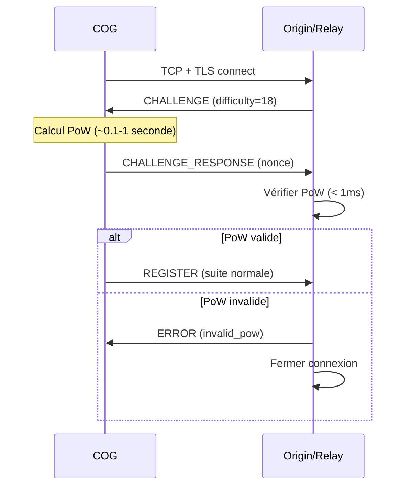
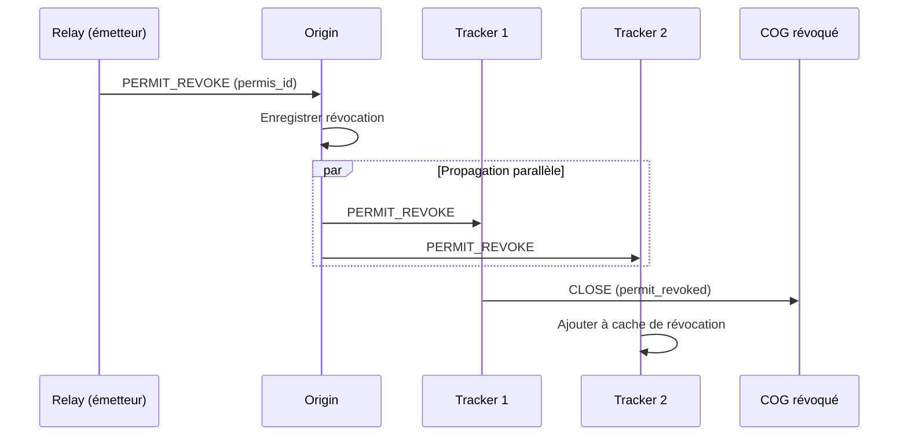

# MWS — Contre-Mesures Prioritaires

## Contexte

Ce document synthétise les **contre-mesures prioritaires** à implémenter suite à l'audit de sécurité du MWS. Chaque contre-mesure est présentée avec son implémentation technique détaillée.

**Référence :** [MWS - Audit de Sécurité Complet](./MWS%20-%20Audit%20de%20Securite%20Complet.md)

---

## 1. Protection DDoS - Challenge-Response (CRITIQUE)

### 1.1 Problème

Origin peut être submergé par des requêtes REGISTER malveillantes, consommant CPU et mémoire avant toute authentification.

### 1.2 Solution : Proof of Work léger

```rust
// Nouveau message : CHALLENGE (0x20)
struct Challenge {
    challenge_id: [u8; 16],     // Identifiant unique
    difficulty: u8,             // Bits de zéros requis (ex: 16-20)
    timestamp: u64,             // Horodatage
    expires_at: u64,            // Expiration du challenge
}

// Nouveau message : CHALLENGE_RESPONSE (0x21)
struct ChallengeResponse {
    challenge_id: [u8; 16],
    nonce: [u8; 32],            // Nonce trouvé par le COG
    // SHA256(challenge_id || nonce) doit commencer par `difficulty` bits à 0
}
```

### 1.3 Flux modifié



### 1.4 Configuration recommandée

| Paramètre | Valeur | Description |
|-----------|--------|-------------|
| `difficulty_normal` | 16 bits | En temps normal |
| `difficulty_attack` | 22 bits | Sous attaque |
| `challenge_ttl` | 30 secondes | Durée de validité |
| `max_challenges_per_ip` | 5/minute | Limite par IP |

---

## 2. Haute Disponibilité Origin (CRITIQUE)

### 2.1 Problème

Origin est un Single Point of Failure. Sa panne paralyse tout le réseau MWS.

### 2.2 Solution : Architecture Actif-Passif

```
                    ┌─────────────────┐
                    │   Load Balancer │
                    │   (Health Check)│
                    └────────┬────────┘
                             │
              ┌──────────────┴──────────────┐
              │                             │
       ┌──────▼──────┐               ┌──────▼──────┐
       │   Origin    │◄─────────────►│   Origin    │
       │   Primaire  │  Réplication  │   Secondaire│
       │             │   Synchrone   │             │
       └──────┬──────┘               └──────┬──────┘
              │                             │
              └──────────────┬──────────────┘
                             │
                    ┌────────▼────────┐
                    │  Base de données│
                    │  Distribuée     │
                    │  (PostgreSQL +  │
                    │   Patroni)      │
                    └─────────────────┘
```

### 2.3 Procédure de failover

```yaml
# Configuration Patroni pour failover automatique
failover:
  auto_failover: true
  failover_timeout: 30s
  health_check_interval: 5s
  health_check_threshold: 3

# Données à répliquer synchronement :
replicated_data:
  - registre_services
  - versions_cores
  - cles_conformite
  - politiques_securite
  - whitelists_blacklists
  - passeports_speciaux
```

### 2.4 RTO/RPO

| Métrique | Objectif |
|----------|----------|
| RTO (Recovery Time Objective) | < 30 secondes |
| RPO (Recovery Point Objective) | 0 (réplication synchrone) |

---

## 3. Signature des paquets DATA (ÉLEVÉ)

### 3.1 Problème

En mode temps réel non chiffré, les paquets DATA peuvent être modifiés en transit.

### 3.2 Solution : HMAC obligatoire

```rust
// Structure DATA modifiée
struct DataMessage {
    session_id: [u8; 16],
    sequence: u32,
    payload_len: u32,
    payload: Vec<u8>,
    // NOUVEAU : MAC obligatoire même sans TLS
    mac: [u8; 32],  // HMAC-SHA256
}

// Calcul du MAC
fn compute_mac(session_key: &[u8; 32], msg: &DataMessage) -> [u8; 32] {
    let mut hmac = HmacSha256::new_from_slice(session_key).unwrap();
    hmac.update(&msg.session_id);
    hmac.update(&msg.sequence.to_be_bytes());
    hmac.update(&msg.payload_len.to_be_bytes());
    hmac.update(&msg.payload);
    hmac.finalize().into_bytes().into()
}

// La session_key est dérivée lors de la négociation TLS initiale :
// session_key = HKDF(tls_master_secret, "MWS-DATA-MAC", session_id)
```

### 3.3 Vérification

```rust
fn verify_data(session_key: &[u8; 32], msg: &DataMessage) -> Result<(), Error> {
    let expected_mac = compute_mac(session_key, msg);
    // Comparaison constante-time
    if !constant_time_eq(&msg.mac, &expected_mac) {
        return Err(Error::InvalidMac);
    }
    Ok(())
}
```

---

## 4. Protection Eclipse Attack (ÉLEVÉ)

### 4.1 Problème

Un attaquant peut isoler un COG en lui présentant de faux trackers.

### 4.2 Solution : Signature de la liste des trackers

```rust
// Structure REGISTER_OK modifiée
struct RegisterOk {
    session_id: [u8; 16],
    permis_id: String,
    permis_expires_at: u64,
    permis_scope: String,  // JSON
    
    // Liste des trackers avec signature
    tracker_list: TrackerList,
}

struct TrackerList {
    trackers: Vec<TrackerAddress>,
    list_version: u64,          // Version pour invalidation
    generated_at: u64,
    signature: [u8; 64],        // Ed25519 signature par Origin
}

struct TrackerAddress {
    host: String,
    port: u16,
    cert_fingerprint: [u8; 32], // SHA256 du certificat du tracker
}
```

### 4.3 Vérification côté COG

```rust
fn verify_tracker_list(
    origin_public_key: &[u8; 32],
    list: &TrackerList
) -> Result<(), Error> {
    // 1. Vérifier la signature
    let data_to_sign = serialize_for_signing(&list.trackers, list.list_version, list.generated_at);
    if !ed25519_verify(origin_public_key, &data_to_sign, &list.signature) {
        return Err(Error::InvalidTrackerListSignature);
    }
    
    // 2. Vérifier la fraîcheur (max 24h)
    let now = current_timestamp();
    if now - list.generated_at > 86400 {
        return Err(Error::TrackerListExpired);
    }
    
    Ok(())
}

// Lors de la connexion au tracker :
fn connect_to_tracker(addr: &TrackerAddress) -> Result<Connection, Error> {
    let conn = tls_connect(&addr.host, addr.port)?;
    
    // Vérifier le fingerprint du certificat
    let cert = conn.peer_certificate()?;
    let fingerprint = sha256(cert.to_der()?);
    if fingerprint != addr.cert_fingerprint {
        return Err(Error::TrackerCertificateMismatch);
    }
    
    Ok(conn)
}
```

---

## 5. Fenêtre Timestamp réduite (ÉLEVÉ)

### 5.1 Problème

La fenêtre de ±30 secondes laisse trop de temps pour des attaques de replay.

### 5.2 Solution

```toml
# Configuration relay.toml
[security]
# Réduire de ±30s à ±10s
timestamp_window_seconds = 10

# Exiger NTP synchronisé
require_ntp_sync = true
ntp_max_drift_seconds = 5
```

### 5.3 Documentation NTP pour les COGs

```markdown
## Prérequis : Synchronisation NTP

Tous les COGs DOIVENT être synchronisés avec un serveur NTP.

### Configuration recommandée (systemd-timesyncd)

```bash
sudo systemctl enable systemd-timesyncd
sudo systemctl start systemd-timesyncd
timedatectl set-ntp true
```

### Vérification

```bash
timedatectl status
# Doit afficher "NTP service: active"
```
```

---

## 6. Signature des binaires Services (ÉLEVÉ)

### 6.1 Problème

Un éditeur compromis peut distribuer des binaires malveillants.

### 6.2 Solution : Signature obligatoire

```rust
// Structure Registre de Services modifiée
struct ServiceEntry {
    service_id: String,
    current_version: String,
    checksum: [u8; 32],         // SHA256
    download_url: String,
    
    // NOUVEAU : Signature
    signature: [u8; 64],        // Ed25519
    signing_key_id: String,     // Référence à la clé publique
}

// Registre des clés de signature
struct SigningKeyRegistry {
    keys: HashMap<String, SigningKey>,
}

struct SigningKey {
    key_id: String,
    public_key: [u8; 32],
    publisher: String,
    registered_at: u64,
    status: KeyStatus,  // Active, Revoked, Expired
}
```

### 6.3 Vérification côté COG

```rust
fn verify_and_install_service(
    registry: &ServiceRegistry,
    signing_keys: &SigningKeyRegistry,
    service_id: &str,
    binary_path: &Path
) -> Result<(), Error> {
    let entry = registry.get(service_id)?;
    let signing_key = signing_keys.get(&entry.signing_key_id)?;
    
    // 1. Vérifier statut de la clé
    if signing_key.status != KeyStatus::Active {
        return Err(Error::SigningKeyNotActive);
    }
    
    // 2. Calculer le checksum du binaire
    let binary_data = fs::read(binary_path)?;
    let computed_checksum = sha256(&binary_data);
    
    if computed_checksum != entry.checksum {
        return Err(Error::ChecksumMismatch);
    }
    
    // 3. Vérifier la signature
    if !ed25519_verify(&signing_key.public_key, &computed_checksum, &entry.signature) {
        return Err(Error::InvalidSignature);
    }
    
    Ok(())
}
```

---

## 7. Révocation de Permis temps réel (MOYEN)

### 7.1 Problème

Un COG malveillant peut opérer pendant toute la durée de validité de son Permis.

### 7.2 Solution : Endpoint de révocation

```rust
// Nouveau message : PERMIT_REVOKE (0x30)
struct PermitRevoke {
    permis_id: String,
    reason: RevokeReason,
    revoked_at: u64,
    signature: [u8; 64],    // Signé par le relay émetteur
}

enum RevokeReason {
    SecurityAlert = 1,
    AdminAction = 2,
    Blacklisted = 3,
    PolicyViolation = 4,
}
```

### 7.3 Propagation



### 7.4 Cache de révocation

```rust
struct RevocationCache {
    // TTL = durée max d'un Permis + marge
    revoked_permits: LruCache<String, RevocationEntry>,
}

impl RevocationCache {
    fn new() -> Self {
        // Capacité pour 100k révocations, TTL 8 jours
        Self {
            revoked_permits: LruCache::new(NonZeroUsize::new(100_000).unwrap())
        }
    }
    
    fn is_revoked(&self, permis_id: &str) -> bool {
        self.revoked_permits.contains(permis_id)
    }
}
```

---

## 8. Validation JSON Schema (MOYEN)

### 8.1 Problème

Les payloads JSON ne sont pas validés contre un schéma, permettant des injections.

### 8.2 Solution : Schémas stricts

```json
// schema/service_manifest.json
{
  "$schema": "http://json-schema.org/draft-07/schema#",
  "type": "array",
  "maxItems": 100,
  "items": {
    "type": "object",
    "required": ["service_id", "version", "checksum"],
    "additionalProperties": false,
    "properties": {
      "service_id": {
        "type": "string",
        "pattern": "^[a-z][a-z0-9._-]{2,63}$",
        "maxLength": 64
      },
      "version": {
        "type": "string",
        "pattern": "^\\d+\\.\\d+\\.\\d+$"
      },
      "checksum": {
        "type": "string",
        "pattern": "^sha256:[a-f0-9]{64}$"
      }
    }
  }
}
```

### 8.3 Implémentation

```rust
use jsonschema::{JSONSchema, Draft};

lazy_static! {
    static ref SERVICE_MANIFEST_SCHEMA: JSONSchema = {
        let schema = include_str!("../schema/service_manifest.json");
        let schema_value: serde_json::Value = serde_json::from_str(schema).unwrap();
        JSONSchema::options()
            .with_draft(Draft::Draft7)
            .compile(&schema_value)
            .unwrap()
    };
}

fn validate_service_manifest(data: &[u8]) -> Result<Vec<ServiceEntry>, Error> {
    // 1. Parser JSON (avec limite de profondeur)
    let value: serde_json::Value = serde_json::from_slice(data)
        .map_err(|_| Error::InvalidJson)?;
    
    // 2. Vérifier profondeur max
    if json_depth(&value) > 5 {
        return Err(Error::JsonTooDeep);
    }
    
    // 3. Valider contre le schéma
    let result = SERVICE_MANIFEST_SCHEMA.validate(&value);
    if let Err(errors) = result {
        let first_error = errors.into_iter().next().unwrap();
        return Err(Error::SchemaValidation(first_error.to_string()));
    }
    
    // 4. Désérialiser
    serde_json::from_value(value).map_err(|_| Error::InvalidJson)
}
```

---

## Checklist d'implémentation

### Phase 1 : Critique (0-30 jours)

- [ ] R-002 : Challenge-Response PoW pour REGISTER
- [ ] R-001 : Documentation failover Origin
- [ ] R-005 : Réduire fenêtre timestamp à ±10s
- [ ] R-004 : Signature liste tracker_addresses

### Phase 2 : Élevé (30-90 jours)

- [ ] R-001 : Déploiement HA Origin (actif-passif)
- [ ] R-003 : MAC sur paquets DATA
- [ ] R-006 : Signature binaires Services officiels
- [ ] R-010 : Validation schéma JSON

### Phase 3 : Moyen (90-180 jours)

- [ ] R-001 : HA Origin (actif-actif)
- [ ] R-009 : Révocation Permis temps réel
- [ ] R-007 : Rotation automatique tokens
- [ ] R-006 : Signature binaires Services tiers

---

## Références

- [MWS - Audit de Sécurité Complet](./MWS%20-%20Audit%20de%20Securite%20Complet.md)
- [MWS - Protocole Relay](../protocole/MWS%20-%20Protocole%20Relay.md)
- [MWS - Chiffrement et TLS](./MWS%20-%20Chiffrement%20et%20TLS.md)

---

**Version :** 1.0  
**Classification :** CONFIDENTIEL — Documentation MWS — Sécurité
