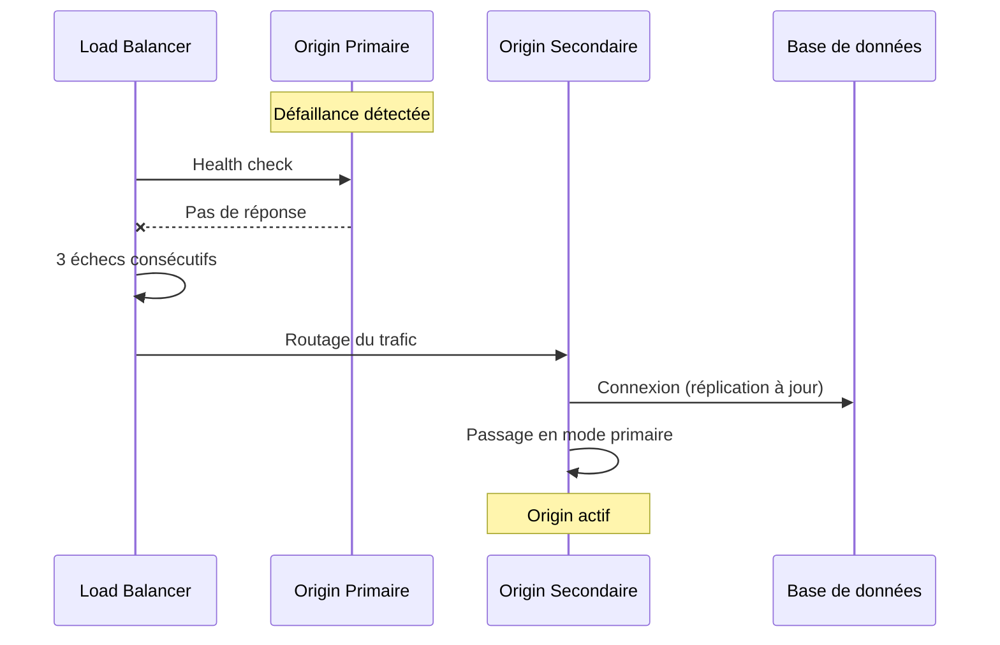

# MWS — Procédure de Failover Origin

## Contexte

Cette procédure décrit les **étapes de bascule (failover)** lorsque le nœud Origin primaire devient indisponible. Elle doit être connue des équipes opérationnelles et testée régulièrement.

**Référence :** [MWS - Haute Disponibilité Origin](./MWS%20-%20Haute%20Disponibilite%20Origin.md)  
**Audit :** [MWS - Audit de Sécurité Complet](./MWS%20-%20Audit%20de%20Securite%20Complet.md) — R-001

---

## 1. Déclenchement du failover

### 1.1 Conditions de déclenchement

| Condition | Détection | Action |
|-----------|-----------|--------|
| Origin primaire ne répond plus | Health check échoué 3 fois | Load balancer pointe vers le secondaire |
| Réplication en retard > seuil | Monitoring Patroni/BDD | Alerte ; évaluation manuelle |
| Panne datacenter | Surveillance infra | Bascule manuelle vers site secondaire |

### 1.2 Qui déclenche

| Mode | Responsable |
|------|-------------|
| **Automatique** | Load balancer / orchestrateur (actif-passif) |
| **Manuel** | Équipe Ops / Architecture (relay promu, site secondaire) |

---

## 2. Procédure actif-passif (automatique)

| Étape | Action | Vérification |
|-------|--------|--------------|
| 1 | Load balancer marque le primaire comme down | Logs LB |
| 2 | Trafic redirigé vers le secondaire | Connexions établies |
| 3 | Secondaire assume le rôle primaire | Health check OK sur nouveau primaire |
| 4 | Alerte envoyée aux équipes | Ticket créé |

---

## 3. Procédure avec relay promu (manuel)

Lorsque **ni le primaire ni le secondaire** ne sont disponibles, un **relay promu** peut servir d'Origin temporaire.

### 3.1 Prérequis

- Le relay est dans la liste des relays promotables (maintenue par Origin).
- Le relay possède une copie à jour du Registre et des politiques (dernier pull réussi).

### 3.2 Étapes

| Étape | Action | Responsable |
|-------|--------|-------------|
| 1 | Confirmer l'indisponibilité d'Origin (primaire + secondaire) | Ops |
| 2 | Choisir le relay à promouvoir (selon liste et critères) | Architecture / Ops |
| 3 | Passer le relay en mode « Origin temporaire » (configuration) | Ops |
| 4 | Annoncer aux autres relays/trackers l'adresse du relay promu (communication interne) | Ops |
| 5 | Limiter les écritures : pas de modification du Registre maître, pas de nouveaux Passeports spéciaux | Config / Politique |
| 6 | Dès retour d'Origin : synchroniser le relay promu avec Origin, puis le repasser en mode relay | Ops |

### 3.3 Limites du relay promu

| Autorisé | Non autorisé |
|----------|--------------|
| Vérification de conformité (3 phases) | Modifier le Registre de Services |
| Délivrance de Permis de circulation | Délivrer de nouveaux Passeports spéciaux |
| Réponse aux REGISTRY_QUERY (cache) | Ajouter/retirer des relays ou trackers officiels |
| Mise à jour des blacklists/quarantaines (dans la limite du cache) | Changer les clés de conformité des Cores |

---

## 4. Retour à la normale

| Étape | Action |
|-------|--------|
| 1 | Origin primaire (ou nouveau primaire) est de nouveau opérationnel |
| 2 | Vérifier la cohérence des données (réplication, logs) |
| 3 | Load balancer repointe vers le primaire (ou bascule contrôlée) |
| 4 | Si un relay était promu : le repasser en mode relay et synchroniser avec Origin |
| 5 | Post-mortem et mise à jour de la procédure si nécessaire |

---

## 5. Rôles et contacts

| Rôle | Responsabilité |
|------|----------------|
| **Ops** | Exécution du failover, surveillance, annonces |
| **Architecture** | Liste des relays promotables, validation des changements |
| **Sécurité** | Vérification des accès et des logs après incident |

---

## Références

- [MWS - Haute Disponibilité Origin](./MWS%20-%20Haute%20Disponibilite%20Origin.md)
- [MWS - Origin](../acteurs/MWS%20-%20Origin.md)
- [MWS - Audit de Sécurité Complet](./MWS%20-%20Audit%20de%20Securite%20Complet.md)

---

**Version :** 1.0  
**Classification :** Documentation MWS — Sécurité
