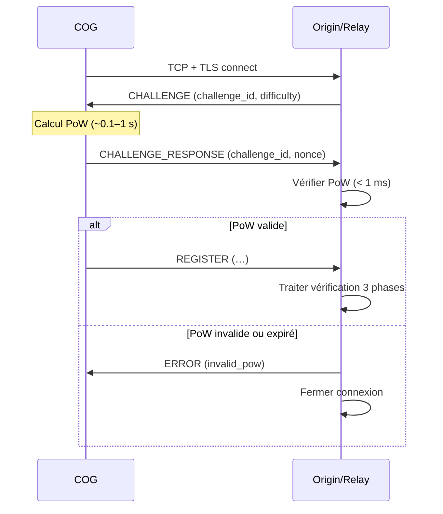

# MWS — Protection DDoS

## Contexte

Origin et les relays sont des cibles potentielles d'attaques par **déni de service distribué (DDoS)**. Ce document définit les **contre-mesures obligatoires** pour protéger l'infrastructure MWS contre les attaques volumétriques et l'épuisement des ressources.

**Référence fondatrice :** [MWS - Document Fondateur](../MWS%20-%20Document%20Fondateur.md)  
**Audit :** [MWS - Audit de Sécurité Complet](./MWS%20-%20Audit%20de%20Securite%20Complet.md) — R-002

---

## Portée / Scope

- Rate limiting détaillé (Origin et relays)
- Challenge-response (Proof of Work) avant REGISTER
- Déploiement derrière service anti-DDoS
- Whitelist des relays connus

---

## 1. Principes

| Principe | Description |
|----------|-------------|
| **Ne pas allouer de ressources avant preuve** | Un client doit prouver un effort minimal (PoW) avant que le serveur ne consacre du CPU/mémoire à la vérification complète |
| **Limiter par source** | Limiter le nombre de requêtes par IP et par token pour éviter l'épuisement |
| **Protection en profondeur** | Combiner rate limiting, PoW et service anti-DDoS en frontal |

---

## 2. Rate limiting obligatoire

### 2.1 Seuils (normatifs)

| Ressource | Seuil | Périmètre | Action en cas de dépassement |
|-----------|-------|-----------|------------------------------|
| REGISTER par minute | 10 | Par adresse IP source | Refus (429) + journalisation |
| Connexions simultanées | 100 | Par token | Refus de nouvelle connexion |
| Requêtes par heure | 1000 | Par COG (cog_id) | Throttling puis refus |
| Connexions TCP simultanées | 5000 | Par IP (Origin/relay) | Refus de nouvelle connexion |

### 2.2 Configuration recommandée

```toml
# relay.toml / origin.toml
[rate_limits]
register_per_minute_per_ip = 10
connections_per_token = 100
requests_per_hour_per_cog = 1000
tcp_connections_per_ip = 5000

# Comportement
[rate_limits.on_exceed]
response_code = 429
retry_after_seconds = 60
log_and_alert = true
```

### 2.3 Whitelist des relays

Les adresses IP (ou plages) des **relays officiellement enregistrés** peuvent être placées en whitelist pour assouplir le rate limiting (par exemple, pas de PoW ou seuils plus élevés). La liste est maintenue par Origin et propagée aux composants frontaux.

| Règle | Description |
|-------|-------------|
| **Source de vérité** | Origin maintient la liste des IP/plages des relays |
| **Propagation** | Liste distribuée aux relays et au dispositif anti-DDoS |
| **Révision** | Toute modification est journalisée et auditable |

---

## 3. Challenge-Response (Proof of Work)

Avant de traiter un message **REGISTER**, le serveur exige une **preuve de travail (PoW)** pour limiter l'impact des floods de requêtes.

### 3.1 Flux



### 3.2 Paramètres

| Paramètre | Valeur normale | Valeur sous attaque | Description |
|-----------|----------------|---------------------|-------------|
| `difficulty` (bits de zéros) | 16 | 22 | Nombre de bits de zéros requis pour SHA256(challenge_id \|\| nonce) |
| `challenge_ttl_seconds` | 30 | 30 | Durée de validité du challenge |
| `max_challenges_per_ip_per_minute` | 5 | 5 | Limite de demandes de challenge par IP |

### 3.3 Exemption

Les connexions dont l’IP source figure dans la **whitelist des relays** peuvent être exemptées de PoW (décision configurable).

---

## 4. Service anti-DDoS en frontal

| Exigence | Description |
|----------|-------------|
| **Déploiement** | Origin (et idéalement les relays publics) doit être placé derrière un service anti-DDoS (ex. Cloudflare, AWS Shield, Akamai) ou un dispositif dédié |
| **Filtrage** | Filtrage des paquets malformés, limitation des connexions SYN, absorption des pics volumétriques |
| **Anycast** | Recommandé pour distribuer le trafic géographiquement et rapprocher les points de présence des clients |

---

## 5. Synthèse des contre-mesures

| Couche | Mesure | Document / section |
|--------|--------|---------------------|
| Réseau | Service anti-DDoS, Anycast | Ce document §4 |
| Application | Rate limiting (REGISTER, connexions, requêtes) | Ce document §2 |
| Application | Challenge-response (PoW) avant REGISTER | Ce document §3 |
| Configuration | Whitelist des relays | Ce document §2.3 |

---

## Références

- [MWS - Document Fondateur](../MWS%20-%20Document%20Fondateur.md)
- [MWS - Guide de Déploiement](../deploiement/MWS%20-%20Guide%20de%20Deploiement.md)
- [MWS - Audit de Sécurité Complet](./MWS%20-%20Audit%20de%20Securite%20Complet.md)
- [MWS - Contre-Mesures Prioritaires](./MWS%20-%20Contre-Mesures%20Prioritaires.md)

---

**Version :** 1.0  
**Classification :** Documentation MWS — Sécurité
