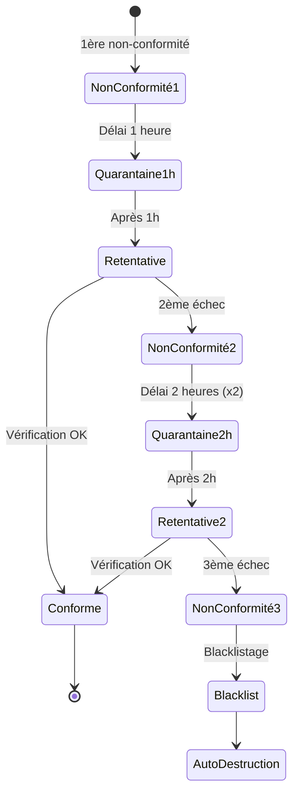
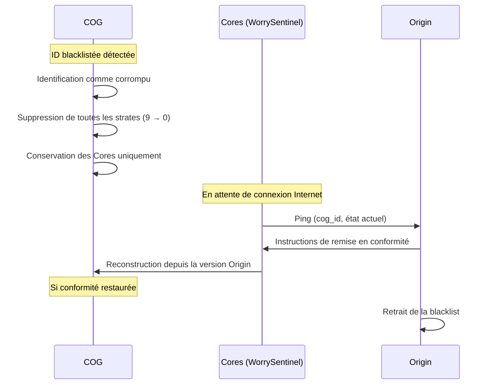
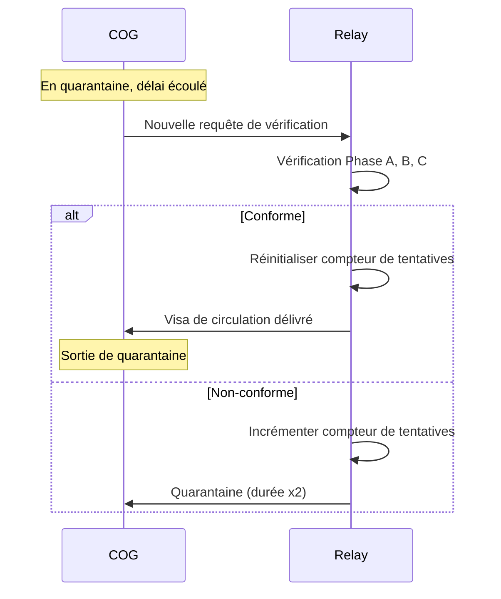
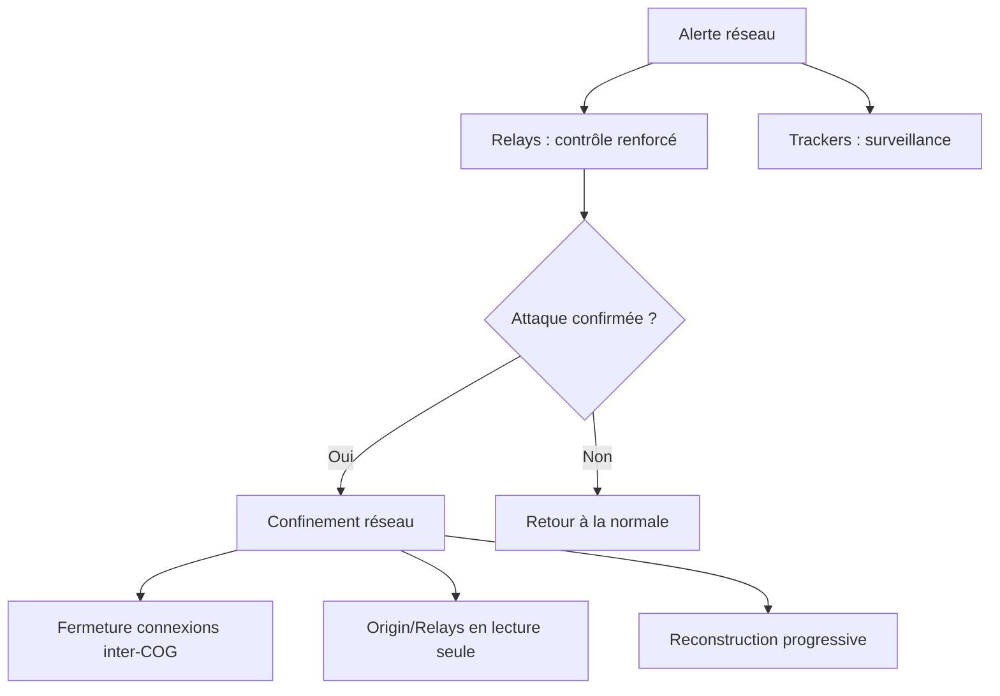
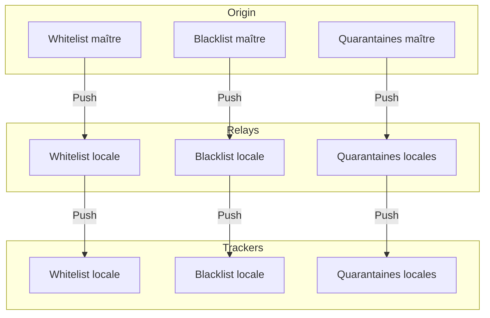

# MWS — Quarantaine et Blacklist

## Contexte

La **quarantaine** et la **blacklist** sont les mécanismes de sécurité du MWS qui permettent d'isoler les COGs non-conformes et de protéger le réseau contre les COGs malveillants ou corrompus. Ce système d'escalade progressive garantit une réponse proportionnée aux non-conformités.

**Référence fondatrice :** [MWS - Document Fondateur](../MWS%20-%20Document%20Fondateur.md)

## Portée / Scope

- Quarantaine : définition, déclencheurs, durées, escalade
- Blacklist : conditions, conséquences, auto-destruction
- Levée de quarantaine et reconstruction
- Alerte réseau et confinement
- Synchronisation des listes entre acteurs MWS

---

## 1. Quarantaine

### 1.1 Définition

La **quarantaine** est un état d'**isolement temporaire** d'un COG qui n'a pas passé la vérification de conformité. Un COG en quarantaine :

- Ne peut pas obtenir de Visa de circulation
- Ne peut pas se connecter aux trackers
- Ne peut pas participer au maillage MWS
- Peut retenter la vérification après le délai de quarantaine

### 1.2 Déclencheurs de quarantaine

| Déclencheur | Phase | Description |
|-------------|-------|-------------|
| **Échec Phase A** | Clé Cores | Clé de conformité incorrecte |
| **Échec Phase B** | Blocs Services | Un ou plusieurs Services suspects |
| **Échec Phase C** | Santé | Environnement dégradé ou corrompu |
| **Visa expiré/invalide** | Tracker | Tentative de connexion avec Visa invalide |
| **Service non répertorié** | Registre | Service absent du Registre Origin |

### 1.3 Escalade des durées

| Tentative | Durée | Action |
|-----------|-------|--------|
| **1ère non-conformité** | 1 heure | Isolation, journalisation, notification utilisateur |
| **2ème non-conformité** | 2 heures (x2) | Isolation, alerte réseau, surveillance renforcée |
| **3ème non-conformité** | **Blacklist** | COG et IP blacklistés pour tout le réseau |

### 1.4 Informations stockées

| Champ | Description |
|-------|-------------|
| `cog_id` | Identifiant du COG en quarantaine |
| `reason` | Raison de la quarantaine (phase échouée, déclencheur) |
| `started_at` | Date et heure de début |
| `duration` | Durée de la quarantaine |
| `attempt` | Numéro de tentative (1, 2, 3) |
| `relay_id` | Relay ayant appliqué la quarantaine |

### 1.5 Notification utilisateur

Quand un COG est mis en quarantaine :

| Contenu | Description |
|---------|-------------|
| **Raison** | Quelle phase a échoué et pourquoi |
| **Durée** | Combien de temps dure la quarantaine |
| **Actions recommandées** | Comment corriger la non-conformité |
| **Historique** | Nombre de tentatives précédentes |

---

## 2. Blacklist

### 2.1 Définition

La **blacklist** est la liste des COGs (et adresses IP associées) **définitivement exclus** du réseau MWS. Un COG blacklisté :

- Est identifié comme **corrompu**
- Doit s'**auto-détruire**
- Ne peut plus participer au MWS sous cette identité
- Peut potentiellement être restauré après reconstruction complète

### 2.2 Conditions de blacklistage

| Condition | Description |
|-----------|-------------|
| **3 non-conformités** | Après 3 échecs de vérification consécutifs |
| **Comportement malveillant** | Détection d'attaque, usurpation, injection |
| **Décision Origin** | Décision explicite d'Origin pour des raisons de sécurité |

### 2.3 Contenu de la blacklist

| Champ | Description |
|-------|-------------|
| `cog_id` | Identifiant du COG blacklisté |
| `ip_addresses` | Adresses IP associées |
| `reason` | Raison du blacklistage |
| `blacklisted_at` | Date et heure du blacklistage |
| `source` | Origin, relay, ou tracker ayant initié |
| `status` | `ACTIVE`, `PENDING_REVIEW`, `REMOVED` |

### 2.4 Auto-destruction

Un COG dont l'ID est blacklistée **doit** suivre le protocole d'auto-destruction :

### 2.5 Étapes de l'auto-destruction

| Étape | Action |
|-------|--------|
| 1 | Le COG s'identifie comme **corrompu** |
| 2 | Suppression de **toutes les strates** (du haut vers le bas) |
| 3 | Le contenu est **vidé** (données utilisateur, Services) |
| 4 | Seuls les **Cores** restent (Border Guard, WorrySentinel, etc.) |
| 5 | Le Core de sécurité **ping Origin** dès qu'une connexion Internet est disponible |
| 6 | Origin fournit les **instructions de reconstruction** |
| 7 | Le COG est **reconstruit** dans sa version d'origine |
| 8 | Si la conformité est **restaurée**, le COG est **retiré de la blacklist** |

---

## 3. Levée de quarantaine

### 3.1 Conditions

Un COG peut sortir de quarantaine si :

| Condition | Description |
|-----------|-------------|
| **Délai écoulé** | La durée de quarantaine est terminée |
| **Re-vérification réussie** | Les 3 phases de vérification passent |
| **Correction effectuée** | La cause de non-conformité a été corrigée |

### 3.2 Processus

---

## 4. Alerte réseau

### 4.1 Déclenchement

Une **alerte réseau** est déclenchée si **plusieurs COGs sont rejetés** dans un **très court laps de temps** :

| Seuil | Action |
|-------|--------|
| > N rejets en < T secondes | Alerte envoyée à tout le réseau |

Les seuils N et T sont configurables par Origin.

### 4.2 Conséquences de l'alerte

### 4.3 Actions immédiates

| Acteur | Action |
|--------|--------|
| **Relays** | Renforcement immédiat des contrôles |
| **Trackers** | Surveillance renforcée, fermeture possible des connexions |
| **COGs** | Peuvent être soumis à re-vérification obligatoire |

---

## 5. Confinement réseau

### 5.1 Définition

Le **confinement réseau** est l'état d'urgence du MWS où les connexions inter-COG sont **fermées** pour circonscrire une attaque ou une corruption massive.

### 5.2 Phases du confinement

| Phase | État | Description |
|-------|------|-------------|
| **Alerte** | Détection | Multiples rejets détectés, alerte envoyée |
| **Confinement** | Exécution | Les trackers ferment tout ou partie des connexions |
| **Lecture seule** | Maintenance | Origin et relays accessibles en lecture seule, vérification uniquement |
| **Reconstruction** | Récupération | Les COGs valides reconstruisent le réseau progressivement |

### 5.3 Comportement des acteurs

| Acteur | Pendant le confinement |
|--------|------------------------|
| **Origin** | Accessible en lecture seule, fonctions de vérification actives |
| **Relays** | Accessibles en lecture seule, peuvent vérifier les COGs |
| **Trackers** | Ferment les connexions, n'acceptent que les COGs re-vérifiés |
| **COGs** | Ne peuvent plus échanger de données, peuvent se re-vérifier |

### 5.4 Reconstruction progressive

1. Les COGs se re-présentent aux relays
2. Re-vérification complète (Phase A, B, C)
3. Si conforme → nouveau Visa de circulation
4. Connexion aux trackers avec le nouveau Visa
5. Reconstruction progressive du maillage

---

## 6. Synchronisation des listes

### 6.1 Architecture de synchronisation

### 6.2 Mécanismes

| Mécanisme | Description |
|-----------|-------------|
| **Push depuis Origin** | Origin pousse les mises à jour vers tous les relays |
| **Push depuis Relays** | Les relays propagent vers les trackers |
| **Pull périodique** | Les acteurs peuvent interroger pour synchronisation |
| **Invalidation** | Notification immédiate en cas de modification critique |

### 6.3 Cohérence

| Principe | Description |
|----------|-------------|
| **Origin fait autorité** | La liste d'Origin est la vérité |
| **Cohérence éventuelle** | Un léger retard est acceptable (< 1 minute) |
| **Pas de divergence** | Un acteur ne peut pas avoir une liste différente d'Origin |

---

## 7. Cas particuliers

### 7.1 Passeport spécial

| Aspect | Comportement |
|--------|--------------|
| **Quarantaine** | Même processus, mais notification prioritaire |
| **Blacklist** | Même processus, mais audit approfondi avant auto-destruction |
| **Alerte** | Un Passeport spécial blacklisté déclenche une alerte réseau |

### 7.2 COG avec parenté

| Aspect | Comportement |
|--------|--------------|
| **Quarantaine** | Le COG parent est notifié |
| **Blacklist** | Le COG parent n'est pas automatiquement blacklisté (mais surveillé) |
| **Confiance héritée** | La confiance du parent peut accélérer la sortie de quarantaine |

### 7.3 Faux positif

Si un COG légitime est mis en quarantaine par erreur :

1. L'utilisateur peut contacter Origin
2. Audit manuel de la situation
3. Si erreur confirmée : levée de quarantaine + whitelist temporaire
4. Investigation de la cause du faux positif

---

## 8. Journalisation

### 8.1 Événements journalisés

| Événement | Données |
|-----------|---------|
| Mise en quarantaine | `cog_id`, `reason`, `attempt`, `duration`, `relay_id` |
| Sortie de quarantaine | `cog_id`, `after_verification` (bool) |
| Blacklistage | `cog_id`, `ip_addresses`, `reason`, `source` |
| Auto-destruction | `cog_id`, `stages_cleared`, `timestamp` |
| Retrait de blacklist | `cog_id`, `reason`, `verified_by` |
| Alerte réseau | `trigger_count`, `time_window`, `initiator` |
| Confinement | `phase`, `connections_closed`, `timestamp` |

### 8.2 Rétention

| Type | Durée recommandée |
|------|-------------------|
| Quarantaines | 90 jours |
| Blacklists | Indéfini (historique) |
| Alertes réseau | 1 an |
| Confinements | Indéfini (incidents critiques) |

---

## Références

- [MWS - Document Fondateur](../MWS%20-%20Document%20Fondateur.md)
- [MWS - Flux de Vérification](../verification/MWS%20-%20Flux%20de%20Verification.md)
- [MWS - Relays](../acteurs/MWS%20-%20Relays.md)
- [MWS - Trackers](../acteurs/MWS%20-%20Trackers.md)
- [Miyukini Webway Relay](../../reference/Miyukini%20Conceptual%20References%20-%20Miyukini%20Webway%20Relay.md) — sections 2.8, 2.9, 3.4

---

**Version :** 1.0  
**Classification :** Documentation MWS — Sécurité
