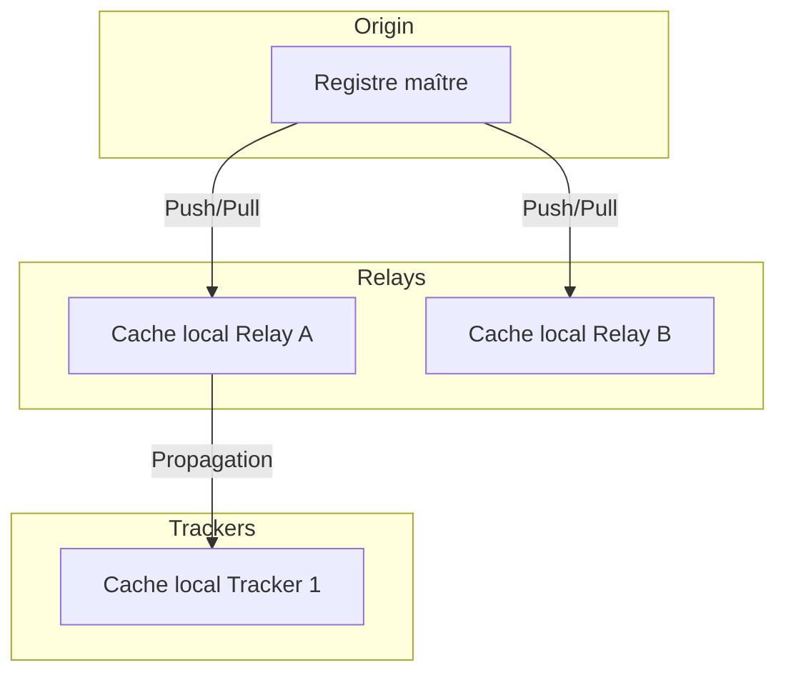
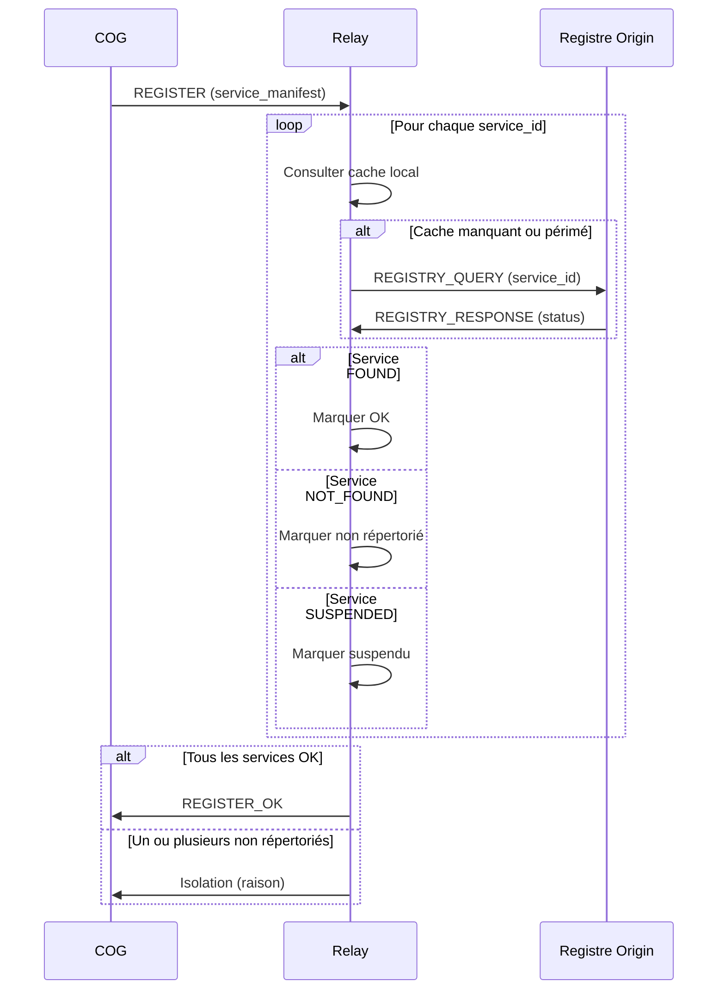
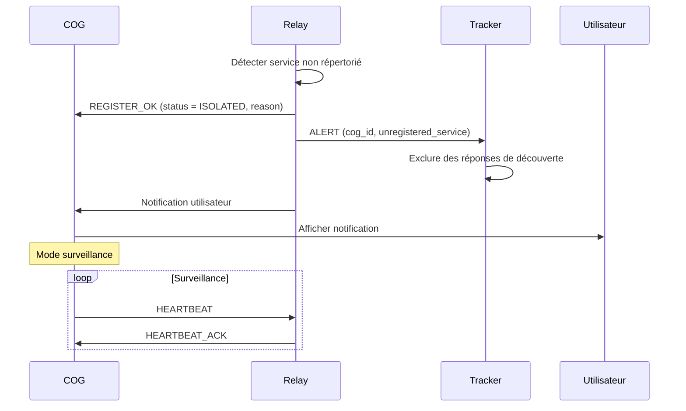
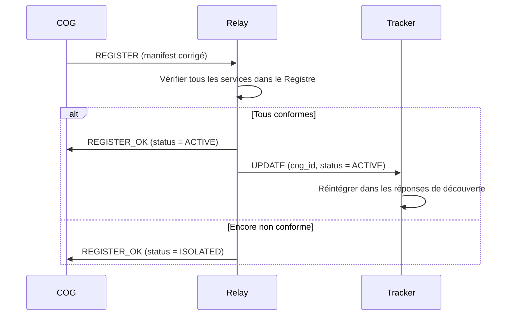

# MWS — Registre de Services et Isolation

## Contexte

Le **Registre de Services** est la liste officielle de tous les Services autorisés sur le réseau MWS. Maintenu par **Origin**, il garantit que seuls des Services **vérifiés et répertoriés** peuvent être installés dans les COGs connectés. L'**isolation** est le mécanisme appliqué aux COGs possédant des Services non répertoriés.

**Référence fondatrice :** [MWS - Document Fondateur](../MWS%20-%20Document%20Fondateur.md)

## Portée / Scope

- Registre de Services : structure, services officiels, services tiers
- Vérification des Services lors de l'enregistrement
- Détection des Services non répertoriés
- Protocole d'isolation et de levée d'isolation
- Suivi des mises à jour

---

## 1. Registre de Services

### 1.1 Principe fondamental

> **Un Service ne peut pas être installé dans un COG connecté au Webway sans être présent dans le Registre de Services du Relay Origin.**

Le Registre garantit :

| Garantie | Description |
|----------|-------------|
| **Authenticité** | Seuls les Services vérifiés sont acceptés |
| **Intégrité** | Les checksums permettent de vérifier l'intégrité |
| **Traçabilité** | L'origine de chaque Service est connue |
| **Compatibilité** | Les versions compatibles avec les Cores sont documentées |

### 1.2 Structure du Registre

Le Registre est maintenu par **Origin** et contient deux catégories :

#### Services officiels Miyukini

| Champ | Description |
|-------|-------------|
| `service_id` | Identifiant unique (ex. `webway.tracker`, `bridge`) |
| `current_version` | Version courante officielle (`MAJOR.MINOR.PATCH`) |
| `min_version` | Version minimale acceptée sur le réseau |
| `checksum` | Hash SHA-256 du binaire/package |
| `download_url` | URL de téléchargement officielle Miyukini |
| `changelog_url` | URL du journal des modifications |
| `core_compatibility` | Liste des `core_version.MAJOR` compatibles |
| `status` | `ACTIVE`, `DEPRECATED`, `RETIRED` |

#### Services tiers répertoriés

| Champ | Description |
|-------|-------------|
| `service_id` | Identifiant unique (préfixe `third.` ou namespace éditeur) |
| `publisher` | Nom de l'éditeur du service tiers |
| `official_source_url` | URL de la source officielle de l'éditeur |
| `current_version` | Dernière version connue dans le Registre |
| `checksum` | Hash SHA-256 de la version répertoriée |
| `core_compatibility` | Liste des `core_version.MAJOR` compatibles |
| `review_status` | `APPROVED`, `PENDING_REVIEW`, `SUSPENDED` |
| `registration_date` | Date d'enregistrement dans le Registre |

### 1.3 Synchronisation



| Mécanisme | Description |
|-----------|-------------|
| **Push depuis Origin** | Origin pousse les mises à jour vers les relays |
| **Pull périodique** | Les relays interrogent Origin périodiquement |
| **Cache local** | Chaque relay/tracker maintient un cache du Registre |

---

## 2. Vérification lors de l'enregistrement

### 2.1 Processus

Quand un COG se présente avec son `service_manifest` :



### 2.2 Résultats possibles

| Statut Registre | Action |
|-----------------|--------|
| `FOUND` + `ACTIVE` | Service accepté |
| `FOUND` + `DEPRECATED` | Accepté avec avertissement |
| `FOUND` + `SUSPENDED` | Service temporairement retiré → isolation |
| `NOT_FOUND` | Service non répertorié → isolation |

---

## 3. Détection des Services non répertoriés

### 3.1 Scénarios de détection

| Scénario | Moment de détection |
|----------|---------------------|
| **Installation hors ligne** | Le COG installe un Service sans connexion réseau, puis se présente au relay |
| **Service retiré** | Un Service précédemment répertorié est retiré du Registre |
| **Contrefaçon** | Un service_id falsifié est détecté |
| **Erreur de configuration** | Un service_id mal orthographié ou invalide |

### 3.2 Informations journalisées

| Champ | Description |
|-------|-------------|
| `cog_id` | COG concerné |
| `service_id` | Service non répertorié |
| `detected_at` | Date de détection |
| `source_ip` | Adresse IP du COG |
| `relay_id` | Relay ayant détecté |
| `reason` | `NOT_FOUND` ou `SUSPENDED` |

---

## 4. Protocole d'isolation

### 4.1 Définition

L'**isolation** est un état où le COG est **exclu du maillage MWS actif** mais maintenu en **surveillance**. Il ne s'agit pas d'une quarantaine classique (non-conformité) mais d'une attente de mise en conformité du `service_manifest`.

### 4.2 Comportement du COG isolé

| Autorisé | Interdit |
|----------|----------|
| Recevoir des notifications | Participer aux annonces de présence |
| Consulter le Registre | Apparaître dans les réponses de découverte |
| Maintenir le tunnel (HEARTBEAT) | Recevoir des connexions inter-COG |
| Se re-enregistrer | Router des données vers d'autres COGs |

### 4.3 Étapes de l'isolation



### 4.4 Notification utilisateur

La notification envoyée à l'utilisateur contient :

| Champ | Description |
|-------|-------------|
| **service_id** | Service non répertorié |
| **Raison** | Absent du Registre de Services |
| **Actions recommandées** | |
| | 1. Soumettre le service au Registre (processus d'enregistrement tiers) |
| | 2. Désinstaller le service non répertorié |
| | 3. Se re-enregistrer avec un manifest conforme |

---

## 5. Levée d'isolation

### 5.1 Conditions

L'isolation est levée **automatiquement** quand :

| Condition | Description |
|-----------|-------------|
| **Manifest corrigé** | Le COG se re-enregistre avec un `service_manifest` entièrement conforme |
| **Service ajouté au Registre** | Le service non répertorié est ajouté au Registre (processus d'enregistrement tiers approuvé) |

### 5.2 Processus de levée



---

## 6. Suivi des mises à jour

### 6.1 Mécanismes

Le COG dispose de capacités de **suivi des mises à jour** :

| Mécanisme | Description |
|-----------|-------------|
| **Vérification périodique** | Le COG interroge le Registre pour comparer son manifest |
| **Notification push** | Le relay envoie `UPDATE_AVAILABLE` via le tunnel actif |
| **Registre local** | Le COG maintient un registre local des versions installées |

### 6.2 Contenu de UPDATE_AVAILABLE

| Champ | Description |
|-------|-------------|
| `service_id` | Service concerné |
| `current_version` | Version installée sur le COG |
| `available_version` | Version disponible |
| `severity` | `critical`, `recommended`, `optional` |
| `download_url` | URL de téléchargement |
| `checksum` | Hash SHA-256 |
| `changelog_url` | Journal des modifications |

### 6.3 Mises à jour critiques

Si une mise à jour est marquée `critical` (faille de sécurité) :

| Délai | Action |
|-------|--------|
| Immédiat | Signalement vers WorrySentinel |
| Après 24h | Throttling du COG |
| Après 72h | Isolation du COG (si configurable) |

> La décision de mise à jour reste **souveraine au COG**. Le relay/Tracker ne force pas la mise à jour, mais applique des mesures progressives.

---

## 7. Enregistrement de services tiers

### 7.1 Processus

Pour qu'un service tiers soit ajouté au Registre :

1. **Soumission** : L'éditeur soumet le service à Origin avec documentation
2. **Audit** : Origin audite le service (sécurité, conformité, compatibilité)
3. **Review** : Statut `PENDING_REVIEW` pendant l'audit
4. **Approbation** : Si approuvé → statut `APPROVED`
5. **Publication** : Le service est ajouté au Registre et synchronisé

### 7.2 Responsabilités

| Acteur | Responsabilité |
|--------|----------------|
| **Éditeur** | Maintenir le service, fournir les mises à jour |
| **Origin** | Auditer, approuver, maintenir le Registre |
| **Relay** | Vérifier, rediriger vers la source officielle |
| **COG** | Télécharger depuis la source officielle |

> **Important :** Le relay **ne distribue pas** les binaires tiers ; il redirige vers la source officielle de l'éditeur.

---

## 8. Schéma récapitulatif

```
+--------------------------------+
|       REGISTRE DE SERVICES     |
|         (maintenu par Origin)  |
|--------------------------------|
| Services officiels Miyukini    |
| Services tiers répertoriés     |
+--------------------------------+
              |
              | Synchronisation
              v
+--------------------------------+
|        RELAY / TRACKER         |
|--------------------------------|
| Cache local du Registre        |
| Vérification lors de REGISTER  |
+--------------------------------+
              |
              | Vérification
              v
+--------------------------------+
|             COG                |
|--------------------------------|
| service_manifest               |
| Tous les services doivent être |
| présents dans le Registre      |
+--------------------------------+
              |
              | Si non répertorié
              v
+--------------------------------+
|          ISOLATION             |
|--------------------------------|
| Tunnel maintenu (surveillance) |
| Exclu du maillage actif        |
| Notification utilisateur       |
| Levée après correction         |
+--------------------------------+
```

---

## Références

- [MWS - Document Fondateur](../MWS%20-%20Document%20Fondateur.md)
- [MWS - Origin](../acteurs/MWS%20-%20Origin.md)
- [MWS - Flux de Vérification](../verification/MWS%20-%20Flux%20de%20Verification.md)
- [Miyukini Webway Relay](../../reference/Miyukini%20Conceptual%20References%20-%20Miyukini%20Webway%20Relay.md) — section 6

---

**Version :** 1.0  
**Classification :** Documentation MWS — Sécurité
