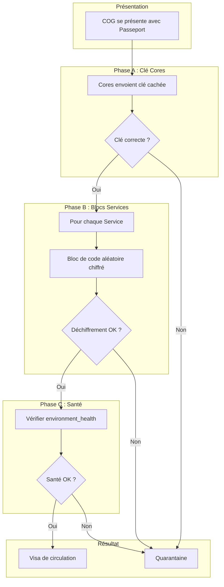
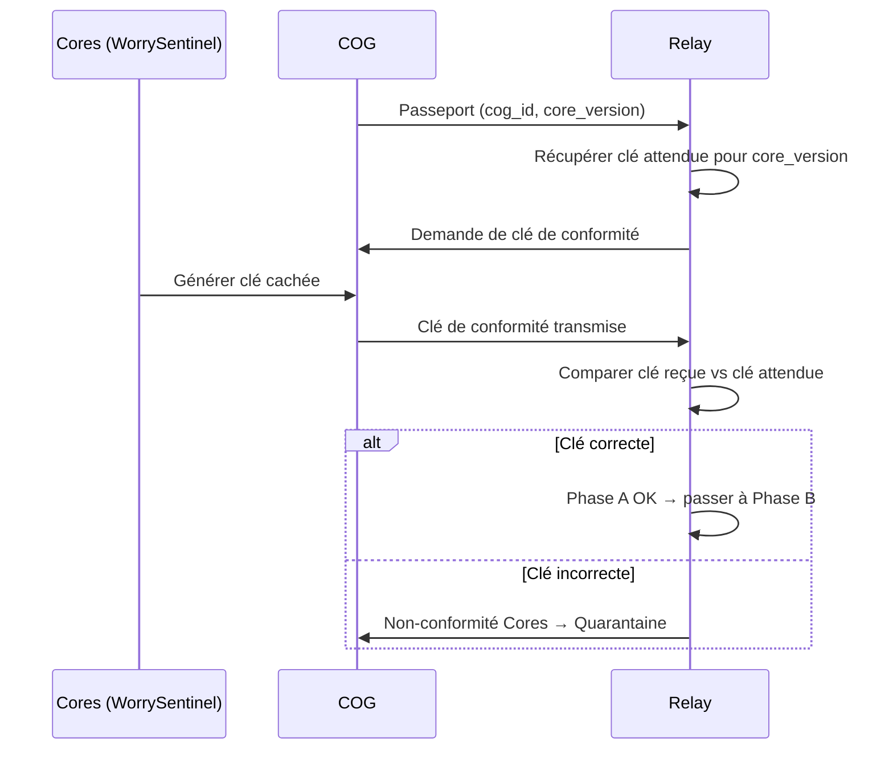
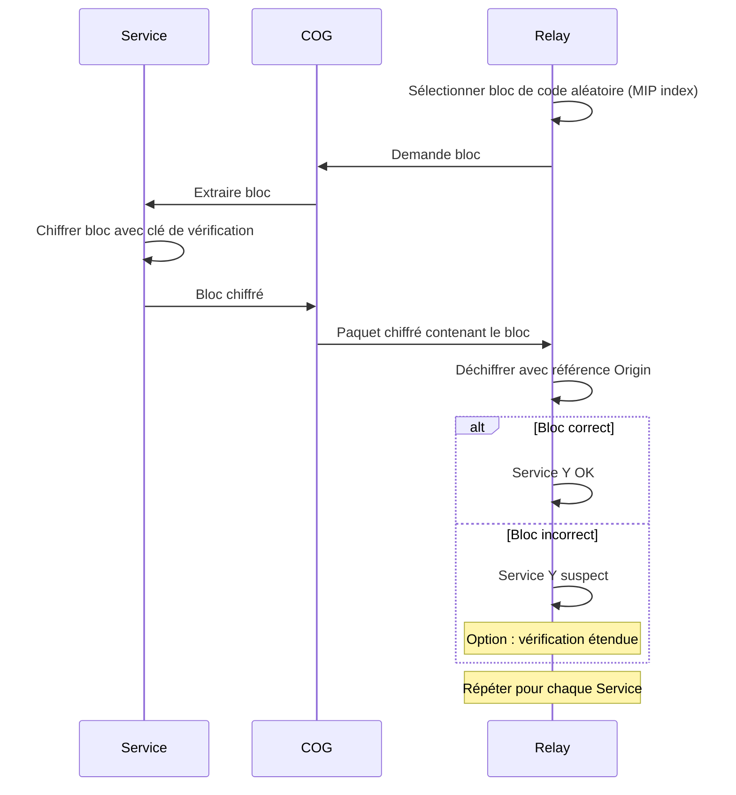
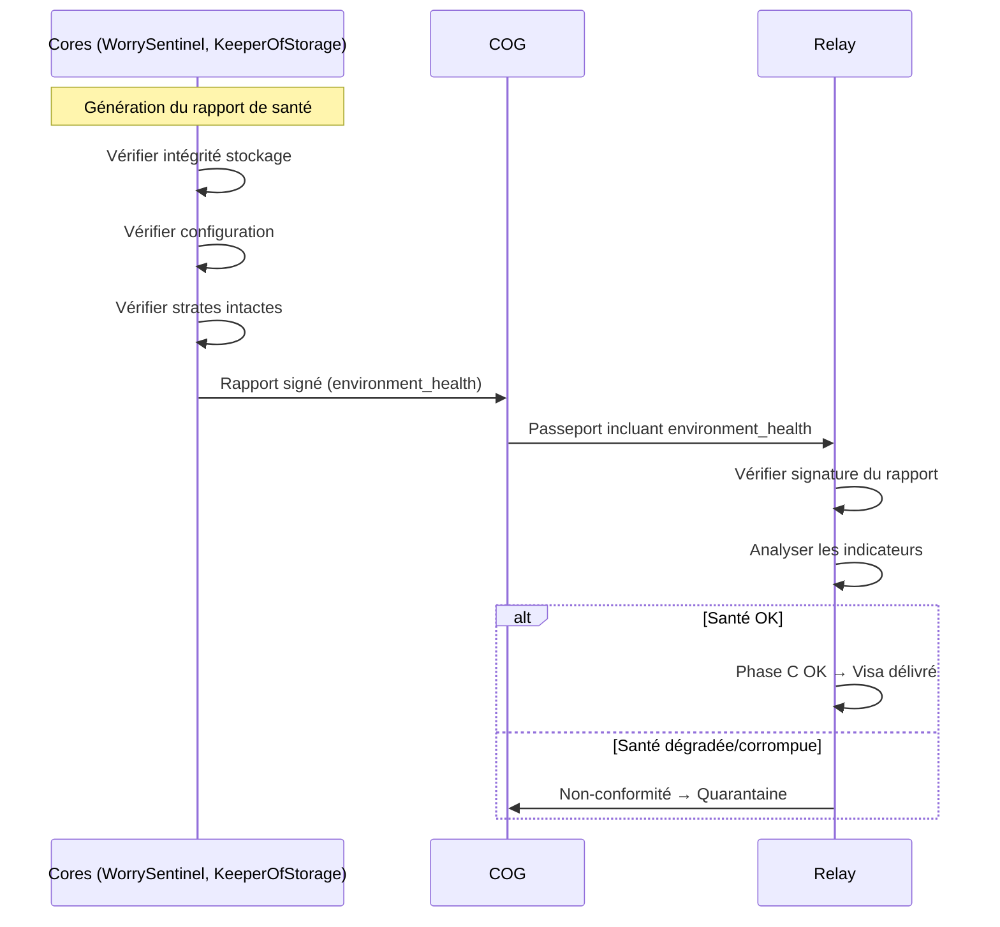
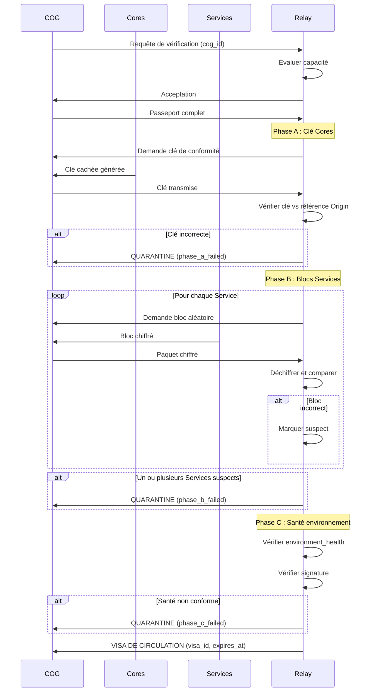

# MWS — Flux de Vérification (3 Phases)

## Contexte

La **vérification de conformité** est le processus par lequel un relay (ou Origin) s'assure qu'un COG est **authentique**, **intègre** et **sain** avant de lui délivrer un Visa de circulation. Cette vérification se déroule en **trois phases** distinctes et complémentaires.

**Référence fondatrice :** [MWS - Document Fondateur](../MWS%20-%20Document%20Fondateur.md)

## Portée / Scope

- Phase A : Vérification de la clé de conformité des Cores
- Phase B : Vérification par blocs de code des Services
- Phase C : Vérification de la santé de l'environnement
- Résultats possibles et actions
- Diagrammes de séquence détaillés
- Sécurité renforcée (vérification étendue)

---

## 1. Vue d'ensemble

---

## 2. Phase A : Vérification de la clé de conformité des Cores

### 2.1 Principe

Les Cores d'un COG contiennent une **clé de conformité cachée** dans leur code. Puisque les Cores proviennent normalement d'Origin (et sont immuables), cette clé est connue du relay et permet de vérifier l'authenticité des Cores.

### 2.2 Mécanisme

### 2.3 Détails techniques

| Élément | Description |
|---------|-------------|
| **Clé cachée** | Intégrée dans le code des Cores à la compilation, non accessible de l'extérieur |
| **Stockage relay** | Le relay possède toutes les clés attendues (héritées d'Origin) pour chaque `core_version` |
| **Comparaison** | Comparaison cryptographique constante-time pour éviter les timing attacks |
| **Résultat** | Concordance = Cores authentiques ; Discordance = Cores potentiellement falsifiés |

### 2.4 Causes d'échec

| Cause | Description |
|-------|-------------|
| **Cores modifiés** | Le code des Cores a été altéré |
| **Cores contrefaits** | Les Cores ne proviennent pas d'Origin |
| **Version déclarée incorrecte** | Le COG déclare une `core_version` différente de celle installée |
| **Corruption** | Corruption du fichier des Cores |

---

## 3. Phase B : Vérification par blocs de code des Services

### 3.1 Principe

Chaque Service du COG doit prouver qu'il exécute du **code authentique et non corrompu**. Pour cela, le relay demande un **bloc de code aléatoire** (au sens du MSCM/MIP) et vérifie qu'il correspond à la version officielle.

### 3.2 Mécanisme

### 3.3 Détails techniques

| Élément | Description |
|---------|-------------|
| **Bloc de code MIP** | Segment de code indexé dans le MSCM Index Protocol |
| **Sélection aléatoire** | Le relay choisit un bloc au hasard (imprévisible) |
| **Chiffrement** | Le Service chiffre le bloc avec une clé de vérification |
| **Référence Origin** | Le relay possède les blocs de référence de toutes les versions officielles |
| **Déchiffrement** | Le relay déchiffre et compare avec la référence |

### 3.4 Gestion des versions

| Situation | Action du relay |
|-----------|-----------------|
| **Version courante** | Vérification normale |
| **Version antérieure valide** | Pas d'alerte ; notification de mise à jour |
| **Version inconnue** | Non-conformité ; vérification impossible |
| **Service non répertorié** | Isolation (voir [MWS - Isolation des Services](../securite/MWS%20-%20Isolation%20des%20Services.md)) |

### 3.5 Vérification étendue

En cas de **doute** (bloc suspect mais pas clairement corrompu), le relay peut demander une **vérification étendue** :

| Mode | Description |
|------|-------------|
| **Standard** | 1 bloc aléatoire par Service |
| **Étendue** | Plusieurs blocs ou tout le code du Service |
| **Maximale** | Vérification de tous les blocs de tous les Services |

La vérification étendue est **plus lente** mais offre une **garantie renforcée**.

---

## 4. Phase C : Vérification de la santé de l'environnement

### 4.1 Principe

Le relay vérifie le rapport de **santé de l'environnement** (`environment_health`) produit par les Cores pour s'assurer que l'environnement global du COG est **sain et intègre**.

### 4.2 Mécanisme

### 4.3 Contenu du rapport de santé

| Indicateur | Valeurs | Description |
|------------|---------|-------------|
| `storage_integrity` | `OK`, `DEGRADED`, `CORRUPTED` | Intégrité du stockage vérifiée par KeeperOfStorage |
| `config_valid` | `true`, `false` | Configuration valide et cohérente |
| `strata_intact` | `true`, `false` | Strates 0-9 intactes |
| `attestation_signature` | signature | Signature cryptographique par WorrySentinel |
| `generated_at` | datetime | Date de génération du rapport |

### 4.4 Critères de conformité

| Indicateur | Conforme | Non-conforme |
|------------|----------|--------------|
| `storage_integrity` | `OK` ou `DEGRADED` (avec avertissement) | `CORRUPTED` |
| `config_valid` | `true` | `false` |
| `strata_intact` | `true` | `false` |
| Signature | Valide | Invalide ou absente |
| Ancienneté | < 5 minutes | > 5 minutes (rapport périmé) |

---

## 5. Résultats de la vérification

### 5.1 Conformité totale

Si les **trois phases** réussissent :

| Action | Description |
|--------|-------------|
| **Visa de circulation** | Délivré avec `visa_id`, `expires_at`, `scope` |
| **Enregistrement** | COG enregistré dans la table de routage du relay |
| **Notification** | Si version en retard : notification de mise à jour |

### 5.2 Non-conformité

Si une ou plusieurs phases échouent :

| Phase échouée | Signification | Action |
|---------------|---------------|--------|
| **Phase A** | Cores falsifiés ou corrompus | Quarantaine immédiate |
| **Phase B** | Service suspect ou non répertorié | Quarantaine ou isolation |
| **Phase C** | Environnement dégradé | Quarantaine |

### 5.3 Escalade de quarantaine

| Tentative | Durée de quarantaine | Action |
|-----------|----------------------|--------|
| 1ère | 1 heure | Isolation, journalisation |
| 2ème | 2 heures (x2) | Isolation, alerte |
| 3ème | Blacklist | COG et IP blacklistés, auto-destruction déclenchée |

Voir [MWS - Quarantaine et Blacklist](../securite/MWS%20-%20Quarantaine%20et%20Blacklist.md).

---

## 6. Diagramme de séquence complet

---

## 7. Performances et optimisations

### 7.1 Temps de vérification typique

| Phase | Temps estimé | Facteurs |
|-------|--------------|----------|
| Phase A | < 100 ms | Comparaison cryptographique |
| Phase B | 100-500 ms par Service | Nombre de Services, taille des blocs |
| Phase C | < 50 ms | Vérification de signature |
| **Total** | 500 ms - 2 s | Selon le nombre de Services |

### 7.2 Optimisations possibles

| Optimisation | Description |
|--------------|-------------|
| **Cache de clés** | Le relay met en cache les clés de conformité |
| **Parallélisation Phase B** | Vérifier plusieurs Services en parallèle |
| **Skip si récent** | Ne pas re-vérifier si dernière vérification < X minutes (Passeports spéciaux) |

---

## 8. Cas particuliers

### 8.1 Passeport spécial

| Aspect | Comportement |
|--------|--------------|
| **Vérification quotidienne** | Allégée (phases simplifiées) |
| **Audit périodique** | Vérification complète et renforcée |
| **Priorité** | Traitement prioritaire par le relay |

### 8.2 Service non répertorié détecté

Si un `service_id` dans le `service_manifest` n'est pas dans le Registre :

1. Phase B échoue pour ce Service
2. COG isolé du réseau (pas en quarantaine classique)
3. Notification utilisateur
4. Levée d'isolation après correction

### 8.3 Version des Cores obsolète mais valide

| Situation | Action |
|-----------|--------|
| `core_version` obsolète | Vérification OK, mais notification de mise à jour |
| `core_version` inconnue | Phase A échoue (clé inconnue) |
| `core_version` incompatible avec le réseau | Refus (politique de version minimale) |

---

## Références

- [MWS - Document Fondateur](../MWS%20-%20Document%20Fondateur.md)
- [MWS - Passeport et Visa](./MWS%20-%20Passeport%20et%20Visa.md)
- [MWS - Quarantaine et Blacklist](../securite/MWS%20-%20Quarantaine%20et%20Blacklist.md)
- [MWS - Relays](../acteurs/MWS%20-%20Relays.md)
- [Miyukini Webway Relay](../../reference/Miyukini%20Conceptual%20References%20-%20Miyukini%20Webway%20Relay.md) — section 2

---

**Version :** 1.0  
**Classification :** Documentation MWS — Vérification
