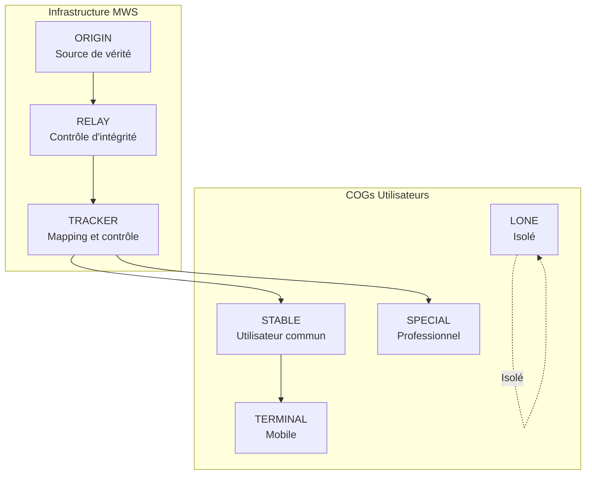
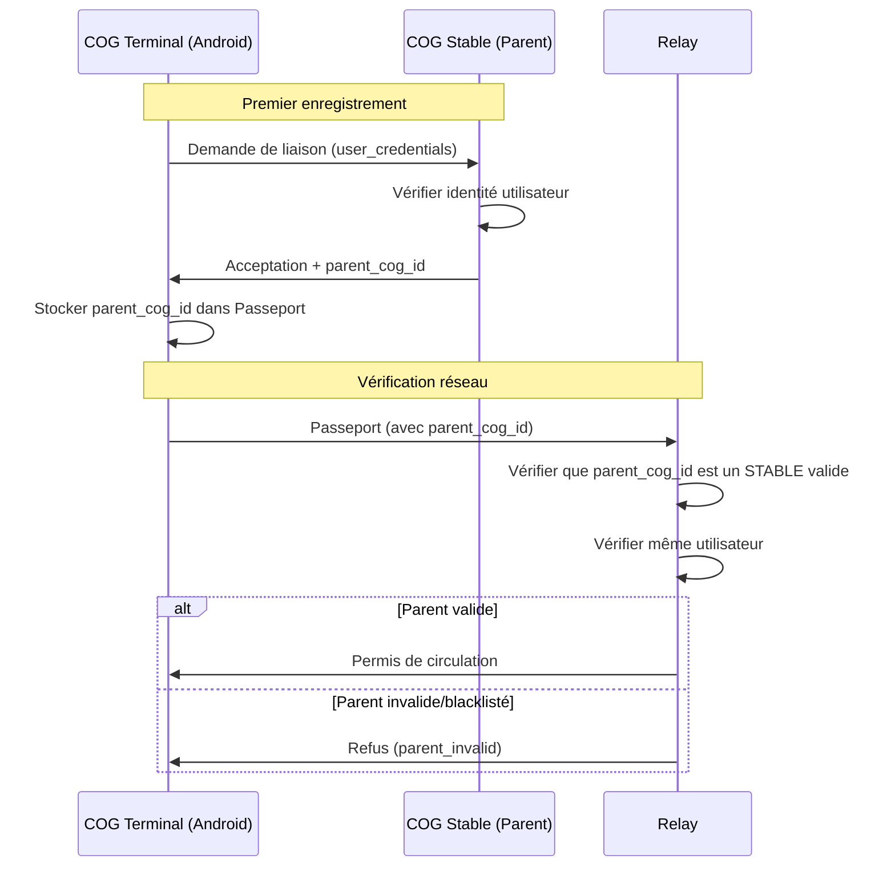
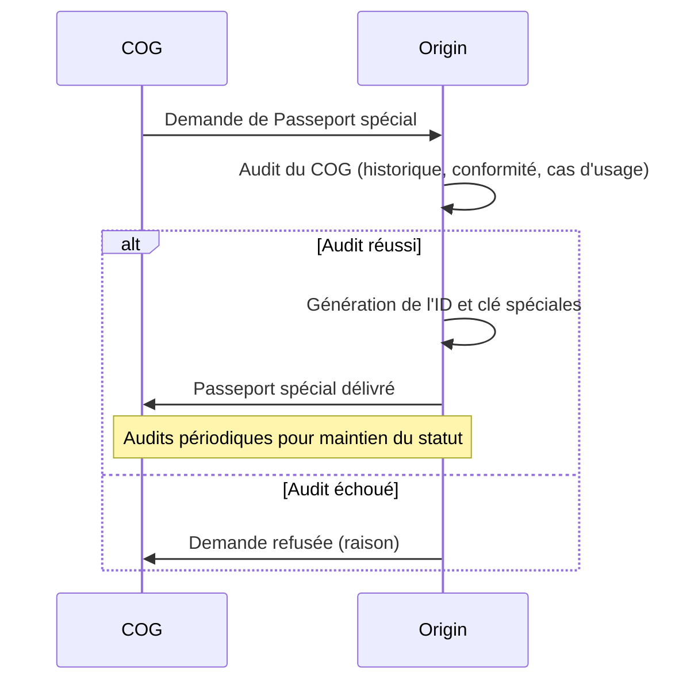
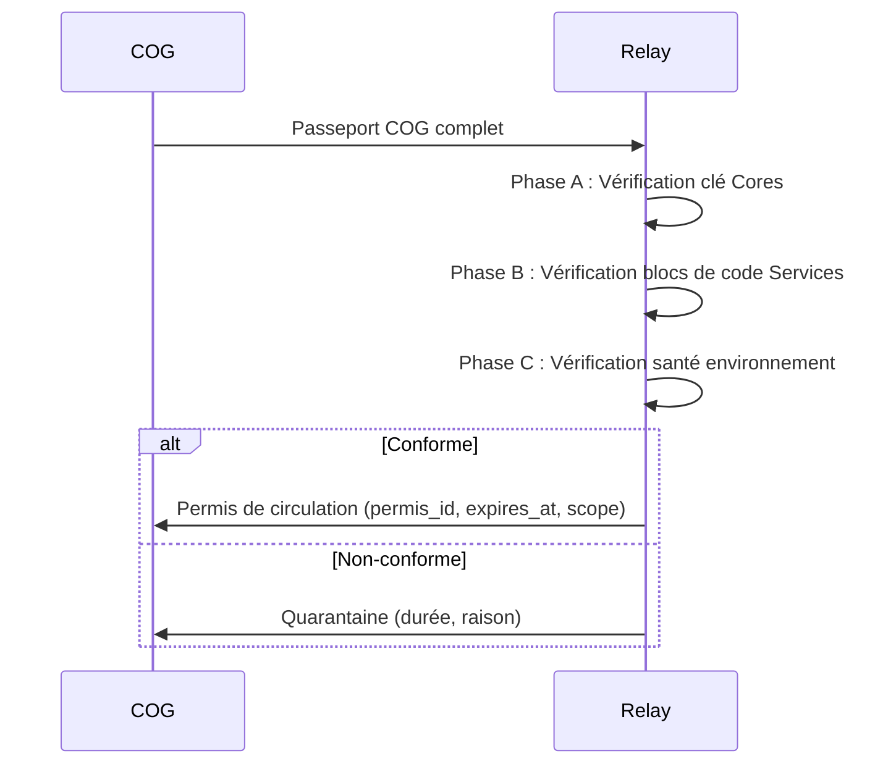
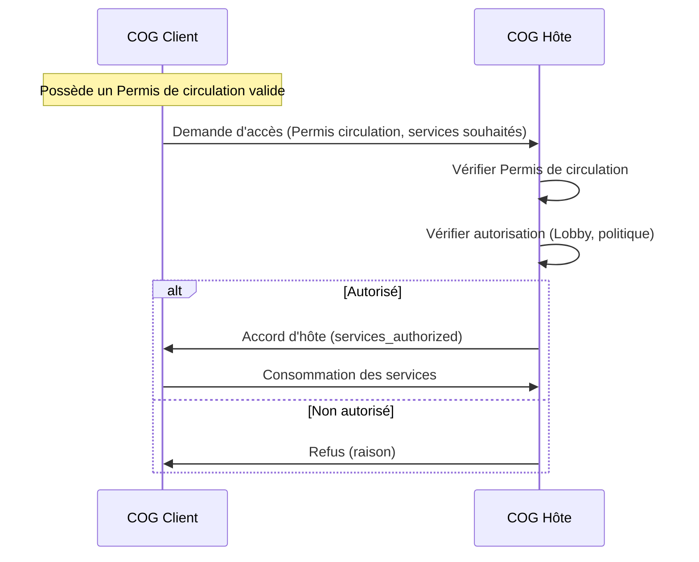
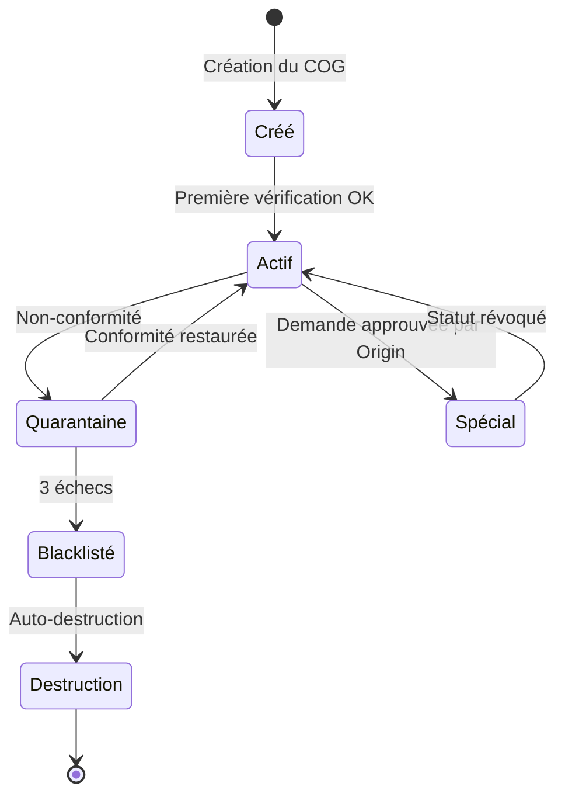
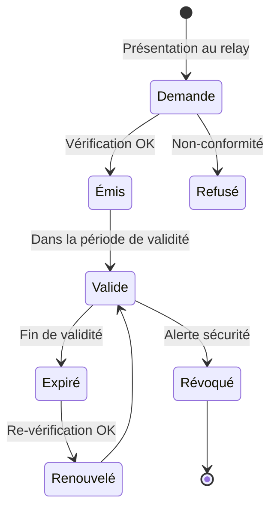

# MWS — Passeport COG et Permis de Circulation

## Contexte

Le **Passeport COG** et le **Permis de circulation** sont les deux documents fondamentaux qui permettent à un COG de participer au réseau Miyukini Webway. Le Passeport est l'identité complète du COG ; le Permis de circulation (accord relay) est l'autorisation de circuler sur le réseau, délivrée par un relay après vérification de conformité, et contrôlée par les trackers (contrôle tracker).

**Référence fondatrice :** [MWS - Document Fondateur](../MWS%20-%20Document%20Fondateur.md)

## Portée / Scope

- Structure et contenu du Passeport COG
- Types de COG (Origin, Relay, Tracker, Stable, Special, Terminal, Lone)
- Types d'OS (Windows, Linux, macOS, Android, iOS)
- Types de Passeport (Standard, Spécial)
- Relation parent-enfant (Terminal)
- Permis de circulation : émission (accord relay), contenu, durée
- Accord d'hôte (distinct du Permis de circulation)
- Cycle de vie des documents

---

## 1. Passeport COG

### 1.1 Définition

Le **Passeport COG** est le document d'identité complet d'un COG. Il contient toutes les informations nécessaires pour que les relays puissent vérifier la conformité du COG.

### 1.2 Structure du Passeport

| Champ | Type | Description |
|-------|------|-------------|
| `cog_id` | string | Identifiant unique du COG (UUID ou LSI) |
| `cog_type` | enum | Type de COG : `ORIGIN`, `RELAY`, `TRACKER`, `STABLE`, `SPECIAL`, `TERMINAL`, `LONE` |
| `os_type` | enum | Système d'exploitation : `WINDOWS`, `LINUX`, `MACOS`, `ANDROID`, `IOS` |
| `core_version` | string | Version des Cores (`MAJOR.MINOR`, ex. `1.0`) |
| `service_list` | array | Liste des Services installés |
| `environment_health` | object | Rapport de santé de l'environnement |
| `previous_permis` | array | Historique des Permis de circulation précédents |
| `passport_type` | enum | `STANDARD` ou `SPECIAL` |
| `special_key` | string | (Passeports spéciaux uniquement) Clé délivrée par Origin |
| `parent_cog_id` | string | (Terminaux uniquement) `cog_id` du COG Stable parent |

### 1.3 Détail des champs

#### cog_id

| Propriété | Description |
|-----------|-------------|
| **Format** | UUID v4 ou LSI (Local Sovereignty Identifier) |
| **Unicité** | Unique dans tout le réseau MWS |
| **Immuabilité** | Ne change jamais pour un COG donné |

#### cog_type

Le **type de COG** définit le rôle et les capacités du COG dans l'écosystème MWS :

| Valeur | Description | Caractéristiques |
|--------|-------------|------------------|
| `ORIGIN` | Point central de vérité du MWS | Unique ; une seule adresse IP et/ou URL ; source de vérité pour tout le réseau |
| `RELAY` | COG de contrôle d'intégrité | Vérification de conformité en 3 phases ; distribution des versions ; subordination à Origin |
| `TRACKER` | Mapping et contrôle | Douanier du réseau ; pools par version ; catalogue ; connexions inter-COG |
| `STABLE` | COG d'utilisateur commun | Usage courant ; environnement personnel ou professionnel standard |
| `SPECIAL` | COG professionnel à forte utilisation | Fort trafic réseau et/ou services larges ; contrôles allégés ; audit renforcé |
| `TERMINAL` | COG embarqué mobile | Enfant d'un COG Stable ; même utilisateur ; capacités réduites ; dépendance au parent |
| `LONE` | COG isolé volontairement | Structurellement et volontairement isolé du réseau ; souveraineté totale |

**Règles par type :**

| Type | Connexion réseau | Passeport | Particularités |
|------|------------------|-----------|----------------|
| `ORIGIN` | Obligatoire (IP/URL fixe) | N/A (source) | Un seul Origin par réseau MWS |
| `RELAY` | Obligatoire | SPECIAL | Doit être enregistré auprès d'Origin |
| `TRACKER` | Obligatoire | SPECIAL | Doit être listé par Origin |
| `STABLE` | Optionnelle | STANDARD | Type par défaut pour utilisateurs |
| `SPECIAL` | Obligatoire | SPECIAL | Audit préalable par Origin |
| `TERMINAL` | Via parent | STANDARD | `parent_cog_id` obligatoire |
| `LONE` | Aucune | N/A | Pas de participation au MWS |

#### os_type

Le **type de système d'exploitation** sur lequel le COG s'exécute :

| Valeur | Description |
|--------|-------------|
| `WINDOWS` | Microsoft Windows (10, 11, Server) |
| `LINUX` | Distributions Linux (Ubuntu, Debian, Fedora, etc.) |
| `MACOS` | Apple macOS |
| `ANDROID` | Google Android (pour COGs TERMINAL) |
| `IOS` | Apple iOS (pour COGs TERMINAL) |

**Règles par OS :**

| OS | Types de COG autorisés | Notes |
|----|------------------------|-------|
| `WINDOWS` | STABLE, SPECIAL, LONE | Environnement desktop/serveur |
| `LINUX` | Tous types | Environnement serveur privilégié pour ORIGIN, RELAY, TRACKER |
| `MACOS` | STABLE, SPECIAL, LONE | Environnement desktop |
| `ANDROID` | TERMINAL, LONE | Mobile uniquement ; doit avoir un parent STABLE |
| `IOS` | TERMINAL, LONE | Mobile uniquement ; doit avoir un parent STABLE |

#### core_version

| Propriété | Description |
|-----------|-------------|
| **Format** | `MAJOR.MINOR` (ex. `1.0`, `2.3`) |
| **Signification MAJOR** | Version majeure des Cores ; détermine la compatibilité inter-COG |
| **Signification MINOR** | Ajustements internes compatibles |
| **Immuabilité** | Les Cores sont immuables à version donnée |

#### service_list

Liste des Services installés sur le COG :

| Champ | Description |
|-------|-------------|
| `service_id` | Identifiant unique du Service |
| `version` | Version du Service (`MAJOR.MINOR.PATCH`) |
| `checksum` | Hash SHA-256 du binaire/package |

Exemple :
```json
[
  {"service_id": "webway.tracker", "version": "1.2.3", "checksum": "abc123..."},
  {"service_id": "bridge", "version": "2.0.1", "checksum": "def456..."}
]
```

#### environment_health

Rapport de santé généré par les Cores (WorrySentinel, KindMother) :

| Champ | Description |
|-------|-------------|
| `storage_integrity` | Intégrité du stockage (OK / DEGRADED / CORRUPTED) |
| `config_valid` | Configuration valide (true / false) |
| `strata_intact` | Strates intactes (true / false) |
| `attestation_signature` | Signature du rapport par WorrySentinel |
| `generated_at` | Date de génération |

#### previous_permis

Historique des Permis de circulation précédents :

| Champ | Description |
|-------|-------------|
| `permis_id` | Identifiant du Permis de circulation |
| `issued_by` | Relay ou Origin émetteur |
| `issued_at` | Date d'émission |
| `expired_at` | Date d'expiration |
| `scope` | Portée du Permis |

#### passport_type

| Valeur | Description |
|--------|-------------|
| `STANDARD` | Passeport standard, contrôles normaux |
| `SPECIAL` | Passeport spécial (professionnel/fort trafic), contrôles allégés au quotidien |

---

## 2. Types de COG

### 2.1 Vue d'ensemble des types



### 2.2 COG Origin

| Caractéristique | Description |
|-----------------|-------------|
| **Rôle** | Point central de vérité unique du MWS |
| **Unicité** | Un seul Origin par réseau MWS |
| **Adressage** | Une seule adresse IP fixe et/ou une URL unique |
| **Fonctions** | Relay + Tracker + Registre de Services + Politiques |
| **OS recommandé** | `LINUX` (serveur) |
| **Passeport** | N/A — Origin est la source, pas un participant |

### 2.3 COG Relay

| Caractéristique | Description |
|-----------------|-------------|
| **Rôle** | Duplication d'Origin pour contrôle d'intégrité |
| **Fonctions** | Vérification 3 phases, distribution des versions |
| **Subordination** | À Origin uniquement |
| **Enregistrement** | Doit être enregistré et approuvé par Origin |
| **OS recommandé** | `LINUX` (serveur) |
| **Passeport** | SPECIAL (délivré par Origin) |

### 2.4 COG Tracker

| Caractéristique | Description |
|-----------------|-------------|
| **Rôle** | Douanier du réseau — mapping et contrôle |
| **Fonctions** | Pools par version, catalogue, connexions inter-COG |
| **Subordination** | À Origin et Relays |
| **Enregistrement** | Doit être listé par Origin dans la liste des trackers officiels |
| **OS recommandé** | `LINUX` (serveur) |
| **Passeport** | SPECIAL (délivré par Origin) |

### 2.5 COG Stable

| Caractéristique | Description |
|-----------------|-------------|
| **Rôle** | COG d'utilisateur commun |
| **Fonctions** | Usage personnel ou professionnel standard |
| **Connexion** | Optionnelle (peut fonctionner hors réseau) |
| **Terminaux** | Peut avoir des COGs TERMINAL enfants |
| **OS supportés** | `WINDOWS`, `LINUX`, `MACOS` |
| **Passeport** | STANDARD (automatique) |

### 2.6 COG Special

| Caractéristique | Description |
|-----------------|-------------|
| **Rôle** | COG professionnel à forte utilisation réseau |
| **Fonctions** | Services larges, fort trafic, haute disponibilité |
| **Connexion** | Obligatoire |
| **Contrôles** | Allégés au quotidien, audits renforcés périodiques |
| **OS supportés** | `WINDOWS`, `LINUX`, `MACOS` |
| **Passeport** | SPECIAL (après audit Origin) |

### 2.7 COG Terminal

| Caractéristique | Description |
|-----------------|-------------|
| **Rôle** | COG embarqué sur mobile, extension d'un COG Stable |
| **Parenté** | Enfant obligatoire d'un COG Stable du même utilisateur |
| **Fonctions** | Capacités réduites, synchronisation avec le parent |
| **Connexion** | Via le parent ou directe avec dépendance |
| **OS supportés** | `ANDROID`, `IOS` |
| **Passeport** | STANDARD (avec `parent_cog_id` obligatoire) |

#### Relation Parent-Enfant (Terminal)



| Règle | Description |
|-------|-------------|
| `parent_cog_id` obligatoire | Un TERMINAL doit toujours déclarer son parent |
| Même utilisateur | Parent et enfant doivent appartenir au même utilisateur |
| Propagation blacklist | Si le parent est blacklisté, tous ses terminaux le sont |
| Limite de terminaux | Un STABLE peut avoir au maximum 5 terminaux |

### 2.8 COG Lone

| Caractéristique | Description |
|-----------------|-------------|
| **Rôle** | COG structurellement et volontairement isolé |
| **Fonctions** | Souveraineté totale, aucune dépendance réseau |
| **Connexion** | Aucune — refus explicite du MWS |
| **Cas d'usage** | Environnements air-gapped, données sensibles, souveraineté absolue |
| **OS supportés** | Tous |
| **Passeport** | N/A — pas de participation au MWS |

> **Note :** Un COG Lone peut décider de rejoindre le réseau ultérieurement en changeant son `cog_type` vers `STABLE` et en passant la vérification initiale.

---

## 3. Types de Passeport

### 3.1 Passeport Standard

| Caractéristique | Description |
|-----------------|-------------|
| **Émission** | Automatique lors de la création du COG |
| **Contrôles** | Vérification complète à chaque présentation |
| **Limite de connexions** | 100 connexions simultanées (hors ports 80/8080) |
| **Cas d'usage** | COGs personnels, petits services, usage courant |

### 3.2 Passeport Spécial

| Caractéristique | Description |
|-----------------|-------------|
| **Émission** | Uniquement par Origin, après audit préalable |
| **ID spéciale** | Identifiant renforcé unique |
| **Clé spéciale** | Clé cryptographique attestant le statut |
| **Contrôles quotidiens** | Allégés pour optimiser les performances |
| **Contrôles périodiques** | Audits renforcés planifiés |
| **Limite de connexions** | Supérieure (configurable) |
| **Cas d'usage** | Sites de grandes entreprises, serveurs MMO, services à fort trafic |

### 3.3 Protocole de délivrance du Passeport Spécial



---

## 4. Permis de Circulation (accord relay)

### 4.1 Définition

Le **Permis de circulation** est l'autorisation officielle de circuler sur le réseau MWS. Il est délivré par un **relay** (ou Origin) après vérification de conformité du COG (accord relay) et vérifié par les trackers (contrôle tracker).

**Validité et trackers officiels :**

- Le Permis de circulation délivré par un relay est **valable sur tout le réseau** accessible au COG qui le présente (maillage MWS couvert par Origin et les relays).
- Lors de la délivrance du Permis, le relay remet au COG les **adresses des trackers sûrs/officiels** (trackers connus et reconnus par Origin). Le COG ne peut et **ne doit pas** se connecter à un tracker inconnu d'Origin : seuls les trackers figurant sur cette liste sont autorisés pour la connexion au maillage.

### 4.2 Structure du Permis de circulation

| Champ | Type | Description |
|-------|------|-------------|
| `permis_id` | string | Identifiant unique du Permis de circulation |
| `cog_id` | string | COG concerné |
| `issued_by` | string | Relay ou Origin émetteur |
| `issued_at` | datetime | Date et heure d'émission |
| `expires_at` | datetime | Date et heure d'expiration |
| `scope` | object | Portée du Permis |
| `core_version` | string | Version des Cores validée |
| `passport_type` | enum | `STANDARD` ou `SPECIAL` |
| `tracker_addresses` | array | Adresses des trackers officiels/sûrs (remises par le relay avec le Permis ; le COG ne doit se connecter qu'à ces trackers). |

### 4.3 Portée (scope) du Permis de circulation

Le champ `scope` définit les **intentions** déclarées par le COG :

| Champ | Description |
|-------|-------------|
| `services_to_use` | Services que le COG souhaite consommer |
| `cogs_to_contact` | COGs que le COG souhaite joindre (optionnel) |
| `expose_services` | Services que le COG expose (si hôte) |
| `accept_connections` | Accepte des connexions entrantes (true/false) |

### 4.4 Durée de validité

| Type de Passeport | Durée typique | Renouvellement |
|-------------------|---------------|----------------|
| Standard | 1 à 24 heures | Automatique à expiration si toujours conforme |
| Spécial | Jusqu'à 7 jours | Renouvellement simplifié |

### 4.5 Émission du Permis de circulation (accord relay)



---

## 5. Accord d'hôte

### 5.1 Définition

Distinct du Permis de circulation, l'**accord d'hôte** est délivré par un **COG hôte** à un COG client pour autoriser la consommation de services spécifiques.

### 5.2 Structure

| Champ | Type | Description |
|-------|------|-------------|
| `accord_id` | string | Identifiant unique (accord d'hôte) |
| `client_cog_id` | string | COG client autorisé |
| `host_cog_id` | string | COG hôte |
| `services_authorized` | array | Services accessibles |
| `issued_at` | datetime | Date d'émission |
| `expires_at` | datetime | Date d'expiration |
| `lobby_id` | string | Lobby concerné (optionnel) |

### 5.3 Distinction avec le Permis de circulation

| Aspect | Permis de circulation (accord relay) | Accord d'hôte |
|--------|--------------------------------------|---------------|
| **Émetteur** | Relay / Origin | COG hôte |
| **Autorisation** | Circuler sur le réseau MWS | Consommer les services du hôte |
| **Vérification** | Conformité du COG (relay) ; contrôle tracker | Autorisation du hôte |
| **Durée** | Heures à jours | Session ou définie par le hôte |

### 5.4 Flow de délivrance



---

## 6. Cycle de vie des documents

### 6.1 Cycle du Passeport



### 6.2 Cycle du Permis de circulation



---

## 7. Contrôle tracker : vérification des Permis de circulation

### 7.1 Points de vérification (contrôle tracker)

Quand un COG se présente à un Tracker :

| Vérification | Description |
|--------------|-------------|
| **Existence** | Le Permis de circulation existe-t-il ? |
| **Expiration** | Le Permis n'est-il pas expiré ? |
| **Émetteur** | Le relay émetteur est-il reconnu ? |
| **Cohérence** | Le scope est-il cohérent avec la requête ? |
| **Blacklist** | Le `cog_id` n'est-il pas blacklisté ? |

### 7.2 Actions selon le résultat

| Résultat | Action |
|----------|--------|
| Permis valide | Accepter la connexion, assigner au pool |
| Permis expiré | Rediriger vers relay pour renouvellement |
| Permis invalide | Refuser, journaliser, potentiel signalement |
| COG blacklisté | Refuser, ignorer le Permis |

---

## 8. Exemples de Passeport et Permis de circulation

### 8.1 Exemple de Passeport Standard (COG Stable)

```json
{
  "cog_id": "550e8400-e29b-41d4-a716-446655440000",
  "cog_type": "STABLE",
  "os_type": "WINDOWS",
  "core_version": "1.0",
  "service_list": [
    {"service_id": "webway.participant", "version": "1.2.0", "checksum": "sha256:abc..."},
    {"service_id": "bridge", "version": "1.0.0", "checksum": "sha256:def..."}
  ],
  "environment_health": {
    "storage_integrity": "OK",
    "config_valid": true,
    "strata_intact": true,
    "attestation_signature": "sig:...",
    "generated_at": "2026-02-13T10:00:00Z"
  },
  "previous_permis": [
    {"permis_id": "permis-001", "issued_by": "relay-eu", "issued_at": "2026-02-12T08:00:00Z"}
  ],
  "passport_type": "STANDARD",
  "special_key": null,
  "parent_cog_id": null
}
```

### 8.2 Exemple de Passeport Terminal (COG mobile enfant)

```json
{
  "cog_id": "660f9500-f30c-52e5-b827-557766550111",
  "cog_type": "TERMINAL",
  "os_type": "ANDROID",
  "core_version": "1.0",
  "service_list": [
    {"service_id": "webway.participant.lite", "version": "1.2.0", "checksum": "sha256:ghi..."}
  ],
  "environment_health": {
    "storage_integrity": "OK",
    "config_valid": true,
    "strata_intact": true,
    "attestation_signature": "sig:...",
    "generated_at": "2026-02-13T10:00:00Z"
  },
  "previous_permis": [],
  "passport_type": "STANDARD",
  "special_key": null,
  "parent_cog_id": "550e8400-e29b-41d4-a716-446655440000"
}
```

### 8.3 Exemple de Passeport Spécial (COG serveur professionnel)

```json
{
  "cog_id": "770a0600-g41d-63f6-c938-668877661222",
  "cog_type": "SPECIAL",
  "os_type": "LINUX",
  "core_version": "1.0",
  "service_list": [
    {"service_id": "webway.participant", "version": "1.2.0", "checksum": "sha256:jkl..."},
    {"service_id": "game.server.mmo", "version": "3.5.2", "checksum": "sha256:mno..."},
    {"service_id": "chat.enterprise", "version": "2.1.0", "checksum": "sha256:pqr..."}
  ],
  "environment_health": {
    "storage_integrity": "OK",
    "config_valid": true,
    "strata_intact": true,
    "attestation_signature": "sig:...",
    "generated_at": "2026-02-13T10:00:00Z"
  },
  "previous_permis": [
    {"permis_id": "permis-sp-001", "issued_by": "origin", "issued_at": "2026-02-01T00:00:00Z"}
  ],
  "passport_type": "SPECIAL",
  "special_key": "sk_live_abc123xyz789...",
  "parent_cog_id": null
}
```

### 8.4 Exemple de Permis de circulation

```json
{
  "permis_id": "permis-002",
  "cog_id": "550e8400-e29b-41d4-a716-446655440000",
  "cog_type": "STABLE",
  "os_type": "WINDOWS",
  "issued_by": "relay-eu",
  "issued_at": "2026-02-13T10:05:00Z",
  "expires_at": "2026-02-14T10:05:00Z",
  "scope": {
    "services_to_use": ["game.server", "chat"],
    "cogs_to_contact": [],
    "expose_services": ["game.server"],
    "accept_connections": true
  },
  "core_version": "1.0",
  "passport_type": "STANDARD",
  "tracker_addresses": [
    {"host": "tracker-eu.miyukini.com", "port": 21000},
    {"host": "tracker-us.miyukini.com", "port": 21000}
  ]
}
```

---

## Références

- [MWS - Document Fondateur](../MWS%20-%20Document%20Fondateur.md)
- [MWS - Flux de Vérification](./MWS%20-%20Flux%20de%20Verification.md)
- [MWS - Relays](../acteurs/MWS%20-%20Relays.md)
- [Miyukini Webway Relay](../../reference/Miyukini%20Conceptual%20References%20-%20Miyukini%20Webway%20Relay.md) — sections 2.2 à 2.7

---

**Version :** 2.0  
**Mise à jour :** Ajout cog_type, os_type, relation Terminal-Stable  
**Classification :** Documentation MWS — Vérification
