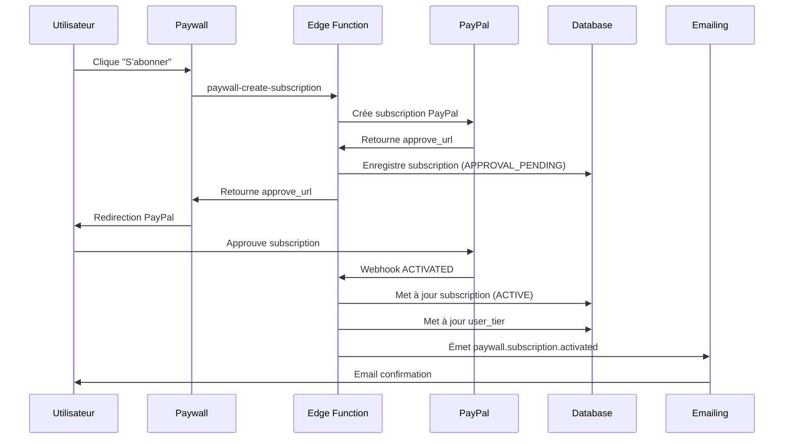
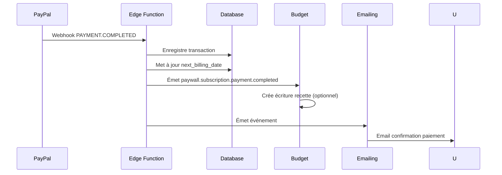
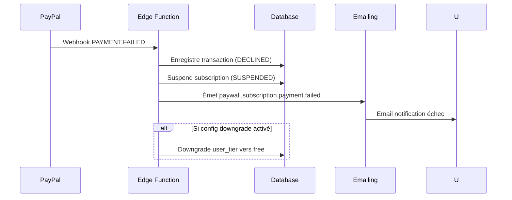
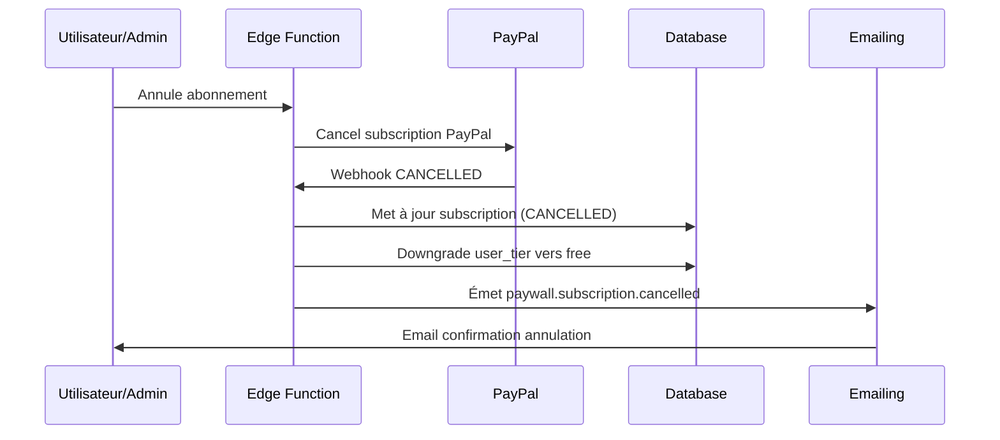

# Miyukini Framework - Module SaaS Paywall PayPal

## Contexte

Le module **SaaS Paywall PayPal** permet au propriétaire du SaaS (SuperAdmin) de monétiser la plateforme via des **abonnements récurrents PayPal**. Il gère les plans d'abonnement, les souscriptions des utilisateurs, et met à jour automatiquement leurs niveaux d'accès (`user_tier`) selon leur abonnement actif.

Ce module s'appuie sur la **capability Payment PayPal** (Subscriptions API) et s'intègre avec le système d'authentification pour gérer les droits d'accès des utilisateurs.

**Différence avec Feature Payment PayPal** :
- La **Feature Payment** est une **capability** réutilisable par d'autres modules (Commerce, Booking)
- Ce **module** est un **module métier** spécifique pour les abonnements de la plateforme elle-même (monétisation du SaaS)

## Portée / Scope

- **Inclus** :
  - Plans d'abonnement PayPal (création, modification, activation/désactivation par SuperAdmin)
  - Page paywall publique (affichage plans, souscription)
  - Gestion des abonnements actifs (liste, détails, suspension, annulation par SuperAdmin)
  - Mise à jour automatique `user_tier` (avec override manuel SuperAdmin)
  - Suivi des transactions récurrentes (historique des paiements)
  - Webhooks PayPal (activation, paiements, échecs, annulations)
  - Notifications email (activation, paiement, échec, annulation)
- **Exclus** :
  - Gestion des abonnements par les utilisateurs eux-mêmes (sauf annulation)
  - Plans personnalisés par utilisateur (plans standardisés uniquement)
  - Paiements uniques (gérés par Feature Payment + modules métier)

---

## 1) Acteurs & rôles

- **SuperAdmin** : création et gestion des plans, gestion des abonnements, configuration
- **Utilisateur** : visualisation paywall, souscription à un plan, annulation de son abonnement
- **Système** : mise à jour automatique tiers, traitement webhooks, notifications

---

## 2) Standard de composition (capabilities utilisées)

- **Auth/RBAC** : identité, rôles, RLS, mise à jour `user_tier`
- **Payment PayPal** : Subscriptions API (création subscription, webhooks, annulation)
- **Emailing** : notifications transactionnelles (activation, paiement, échec, annulation)
- **Budget** : écritures recettes récurrentes (optionnel mais recommandé)

> Règle : le module orchestre et publie des événements `paywall.*`. La capability Payment PayPal reste la source de vérité des subscriptions PayPal.

---

## 3) Modèle métier

### 3.1 Entités

- **Plan** : plan d'abonnement PayPal (nom, description, prix, durée, features, tier associé)
- **Subscription** : abonnement actif d'un utilisateur (lien user ↔ plan ↔ subscription PayPal)
- **Transaction** : paiement récurrent (chaque cycle de facturation PayPal)
- **User Tier** : niveau d'accès utilisateur (`free`, `starter`, `pro`, `enterprise`)

### 3.2 Statuts

**Plans** :
- `draft` : brouillon (non visible sur paywall)
- `active` : actif (visible et souscriptible)
- `archived` : archivé (non visible, abonnements existants continuent)

**Subscriptions** (alignés avec PayPal) :
- `APPROVAL_PENDING` : en attente d'approbation client
- `APPROVED` : approuvé mais pas encore activé
- `ACTIVE` : actif (facturation en cours)
- `SUSPENDED` : suspendu (échec paiement, action admin)
- `CANCELLED` : annulé
- `EXPIRED` : expiré

**Transactions** :
- `COMPLETED` : paiement réussi
- `DECLINED` : paiement refusé
- `PENDING` : en attente

### 3.3 Association Plan → Tier

Chaque plan est associé à un `user_tier` :
- Plan "Starter" → `tier = 'starter'`
- Plan "Pro" → `tier = 'pro'`
- Plan "Enterprise" → `tier = 'enterprise'`
- Plan "Free" → `tier = 'free'` (gratuit, pas d'abonnement PayPal)

Lorsqu'un utilisateur souscrit à un plan, son `user_tier` est automatiquement mis à jour.

---

## 4) Data contract (tables)

### 4.1 Tables du module

#### `saas_paywall_plans`

Champs :
- `id` UUID PRIMARY KEY
- `name` TEXT NOT NULL (ex: "Starter", "Pro", "Enterprise")
- `description` TEXT
- `price_monthly` NUMERIC (prix mensuel)
- `price_yearly` NUMERIC (prix annuel, optionnel)
- `currency` TEXT DEFAULT 'EUR'
- `billing_cycle` TEXT (`monthly`, `yearly`, `both`)
- `tier` ENUM (`free`, `starter`, `pro`, `enterprise`) NOT NULL
- `features` JSONB (liste des fonctionnalités incluses)
- `paypal_plan_id` TEXT UNIQUE (ID plan PayPal, créé via API)
- `status` TEXT (`draft`, `active`, `archived`) DEFAULT 'draft'
- `sort_order` INT (ordre d'affichage sur paywall)
- `is_featured` BOOLEAN (mise en avant)
- `created_at`, `updated_at` TIMESTAMPTZ

**RLS** : lecture publique (pour paywall), écriture super_admin uniquement

#### `saas_paywall_subscriptions`

Champs :
- `id` UUID PRIMARY KEY
- `user_id` UUID REFERENCES `profiles(id)` NOT NULL
- `plan_id` UUID REFERENCES `saas_paywall_plans(id)` NOT NULL
- `paypal_subscription_id` TEXT UNIQUE (ID subscription PayPal)
- `status` TEXT (`APPROVAL_PENDING`, `APPROVED`, `ACTIVE`, `SUSPENDED`, `CANCELLED`, `EXPIRED`)
- `start_date` TIMESTAMPTZ (début abonnement)
- `end_date` TIMESTAMPTZ NULL (fin prévue, NULL si actif)
- `current_period_start` TIMESTAMPTZ (début période de facturation actuelle)
- `current_period_end` TIMESTAMPTZ (fin période de facturation actuelle)
- `next_billing_date` TIMESTAMPTZ (prochain paiement)
- `cancel_at_period_end` BOOLEAN (annulation à la fin de la période)
- `cancelled_at` TIMESTAMPTZ NULL
- `suspended_at` TIMESTAMPTZ NULL
- `suspension_reason` TEXT (échec paiement, action admin, etc.)
- `metadata` JSONB (données additionnelles)
- `created_at`, `updated_at` TIMESTAMPTZ

**RLS** : user voit son propre abonnement, admin/super_admin voit tous

#### `saas_paywall_subscription_transactions`

Champs :
- `id` UUID PRIMARY KEY
- `subscription_id` UUID REFERENCES `saas_paywall_subscriptions(id)` NOT NULL
- `paypal_transaction_id` TEXT UNIQUE (ID transaction PayPal)
- `billing_cycle` INT (numéro du cycle, 1, 2, 3...)
- `status` TEXT (`COMPLETED`, `DECLINED`, `PENDING`)
- `amount` NUMERIC
- `currency` TEXT
- `transaction_time` TIMESTAMPTZ (date transaction PayPal)
- `failure_reason` TEXT (si `DECLINED`)
- `created_at`, `updated_at` TIMESTAMPTZ

**RLS** : user voit ses propres transactions, admin/super_admin voit tous

#### `saas_paywall_subscription_history`

Champs :
- `id` UUID PRIMARY KEY
- `subscription_id` UUID REFERENCES `saas_paywall_subscriptions(id)` NOT NULL
- `event_type` TEXT (`created`, `activated`, `suspended`, `cancelled`, `tier_updated`, `plan_changed`)
- `old_tier` TEXT (tier avant changement)
- `new_tier` TEXT (tier après changement)
- `old_plan_id` UUID (plan avant changement)
- `new_plan_id` UUID (plan après changement)
- `actor_id` UUID REFERENCES `profiles(id)` NULL (qui a fait l'action, NULL si système)
- `metadata` JSONB (contexte additionnel)
- `created_at` TIMESTAMPTZ

**RLS** : user voit l'historique de son abonnement, admin/super_admin voit tous

### 4.2 Relations avec tables existantes

- `saas_paywall_subscriptions.user_id` → `profiles.id` (1:1, un user peut avoir un seul abonnement actif)
- `saas_paywall_subscriptions.plan_id` → `saas_paywall_plans.id` (N:1)
- `profiles.tier` : mis à jour automatiquement selon l'abonnement actif

### 4.3 Contraintes

- Un utilisateur ne peut avoir qu'**un seul abonnement actif** à la fois
- Un plan `active` doit avoir un `paypal_plan_id` valide
- Un plan ne peut être supprimé s'il a des abonnements actifs

---

## 5) Fonctionnalités clés

### 5.1 SuperAdmin - Gestion des plans

**CRUD Plans** :
- Créer un plan (nom, description, prix mensuel/annuel, tier, features)
- Éditer un plan (sauf si des abonnements actifs)
- Activer/désactiver un plan
- Archiver un plan (les abonnements existants continuent)

**Création Plan PayPal** :
- Bouton "Créer plan PayPal" → Edge Function `paywall-create-plan`
- Plan créé sur PayPal via API
- `paypal_plan_id` enregistré dans `saas_paywall_plans`

**Features JSON** :
Structure exemple :
```json
{
  "features": [
    "Accès à tous les modules",
    "Support prioritaire",
    "API illimitée",
    "Stockage 100GB"
  ],
  "limits": {
    "users": 10,
    "storage_gb": 100,
    "api_calls_per_month": 10000
  }
}
```

**Association Plan → Tier** :
- Chaque plan est lié à un `user_tier` (`free`, `starter`, `pro`, `enterprise`)
- Lors de l'activation d'un abonnement, le `user_tier` est mis à jour automatiquement

### 5.2 SuperAdmin - Gestion des abonnements

**Liste des abonnements** :
- Table avec colonnes : utilisateur, plan, statut, dates (début, fin, prochain paiement), actions
- Filtres : statut, plan, date de création, utilisateur
- Recherche : nom utilisateur, email

**Détails abonnement** :
- Informations : plan, utilisateur, statut, dates
- Historique des transactions (liste des paiements récurrents)
- Historique des changements (création, activation, suspension, annulation, changement de plan)
- Actions disponibles selon statut

**Actions** :
- **Suspendre** : suspendre un abonnement (échec paiement, action manuelle)
- **Réactiver** : réactiver un abonnement suspendu
- **Annuler** : annuler un abonnement (immédiat ou à la fin de la période)
- **Changer de plan** : migrer vers un autre plan (upgrade/downgrade)
- **Override tier** : forcer manuellement le `user_tier` (désactive mise à jour auto temporairement)

### 5.3 Page Paywall (publique/authentifiée)

**Route** : `/pricing` ou `/subscribe` ou `/paywall`

**Contenu** :
- **Hero section** : titre, sous-titre, CTA
- **Plans disponibles** : cartes avec nom, prix, durée, features, bouton "S'abonner"
- **Tableau comparatif** : features par plan (checkmarks)
- **FAQ** : questions fréquentes (accordion)
- **CTA final** : "Commencer maintenant"

**Comportement selon état utilisateur** :

- **Non-authentifié** :
  - Affichage des plans
  - Bouton "S'abonner" → redirection `/signup?redirect=/pricing`
  - Après inscription → retour paywall

- **Authentifié sans abonnement** :
  - Affichage des plans
  - Bouton "S'abonner" → Edge Function `paywall-create-subscription`
  - Redirection PayPal → approbation → retour `success_url`

- **Authentifié avec abonnement actif** :
  - Message "Vous êtes abonné au plan [Plan]"
  - Détails abonnement (plan, dates, prochain paiement)
  - Bouton "Gérer mon abonnement" → page dédiée
  - Option "Annuler" (si autorisé)

- **Authentifié avec abonnement expiré** :
  - Message "Votre abonnement a expiré"
  - Affichage des plans
  - Bouton "Renouveler" ou "Choisir un plan"

### 5.4 Workflow automatique

**Souscription** :
1. Utilisateur clique "S'abonner" sur paywall
2. Edge Function `paywall-create-subscription` crée subscription PayPal
3. Redirection vers PayPal (approbation)
4. Client approuve → webhook `BILLING.SUBSCRIPTION.ACTIVATED`
5. Mise à jour subscription (`status = ACTIVE`)
6. Mise à jour `user_tier = plan.tier`
7. Log dans `saas_paywall_subscription_history`
8. Email de confirmation (via Emailing)

**Paiement récurrent** :
1. PayPal facture automatiquement selon plan
2. Webhook `BILLING.SUBSCRIPTION.PAYMENT.COMPLETED`
3. Transaction enregistrée dans `saas_paywall_subscription_transactions`
4. Mise à jour `next_billing_date`
5. Email de confirmation paiement (optionnel)

**Échec paiement** :
1. Webhook `BILLING.SUBSCRIPTION.PAYMENT.FAILED`
2. Transaction enregistrée (`status = DECLINED`)
3. Subscription suspendue (`status = SUSPENDED`)
4. Email de notification échec
5. Optionnel : downgrade `user_tier` vers `free` (configurable)

**Annulation** :
1. Utilisateur ou SuperAdmin annule
2. Edge Function `paypal-cancel-subscription` (depuis Feature Payment)
3. Webhook `BILLING.SUBSCRIPTION.CANCELLED`
4. Mise à jour subscription (`status = CANCELLED`, `end_date`)
5. Mise à jour `user_tier = 'free'` (ou tier par défaut)
6. Log dans historique
7. Email de confirmation annulation

---

## 6) UX / Écrans

### 6.1 Page Paywall (`/pricing`)

**Layout** :
- Hero section (titre, sous-titre)
- Plans en cartes (3-4 colonnes desktop, empilé mobile)
- Tableau comparatif (features par plan)
- FAQ accordion
- CTA "Commencer maintenant"

**Composants** :
- `PaywallScreen` : écran principal
- `PlanCard` : carte d'un plan (nom, prix, features, CTA)
- `PlanComparisonTable` : tableau comparatif
- `PaywallFAQ` : accordion FAQ

**Responsive** :
- Desktop : 3-4 colonnes pour les plans
- Mobile : empilé verticalement

### 6.2 SuperAdmin - Gestion Plans

**Route** : `/admin/superadmin/paywall/plans`

**Écran** :
- Liste plans (table avec statut, prix, tier, actions)
- Bouton "Créer un plan"
- Formulaire création/édition plan
- Preview plan (affichage comme sur paywall)
- Bouton "Créer plan PayPal" (si plan pas encore créé sur PayPal)
- Actions : activer/désactiver, archiver, supprimer (si aucun abonnement)

**Sections formulaire** :
- Informations de base (nom, description)
- Prix (mensuel, annuel, devise)
- Tier associé (dropdown : free/starter/pro/enterprise)
- Features (éditeur JSON ou formulaire structuré)
- Options (featured, sort_order)

### 6.3 SuperAdmin - Gestion Abonnements

**Route** : `/admin/superadmin/paywall/subscriptions`

**Écran** :
- Liste abonnements (table avec user, plan, statut, dates, actions)
- Filtres (statut, plan, date, utilisateur)
- Recherche (nom, email)
- Détails abonnement (modal ou page dédiée)
- Actions : suspendre, réactiver, annuler, changer plan, override tier

**Détails abonnement** :
- Informations : plan, utilisateur, statut, dates
- Historique transactions (tableau)
- Historique changements (timeline)
- Actions disponibles

### 6.4 SuperAdmin - Transactions

**Route** : `/admin/superadmin/paywall/transactions`

**Écran** :
- Liste transactions (table avec subscription, cycle, montant, statut, date)
- Filtres (statut, plan, date)
- Export CSV

### 6.5 SuperAdmin - Configuration

**Route** : `/admin/superadmin/paywall/config`

**Écran** :
- Tier par défaut (si pas d'abonnement ou annulation)
- Comportement échec paiement (suspendre uniquement ou suspendre + downgrade)
- Délai avant downgrade (ex: 3 jours après échec)
- Notifications email (activer/désactiver)

### 6.6 User - Mon Abonnement

**Route** : `/subscription` ou `/my-subscription`

**Écran** :
- Détails abonnement actif (plan, dates, prochain paiement)
- Historique transactions (liste)
- Bouton "Annuler abonnement" (si autorisé)
- Message si pas d'abonnement actif + lien vers paywall

---

## 7) Intégrations Back-Office

### 7.1 Navigation SuperAdmin

**Ajout dans AdminSidebar** :
- Section "Super Admin" → sous-section "Paywall" ou "Abonnements"
- Menu :
  - Plans (`/admin/superadmin/paywall/plans`)
  - Abonnements (`/admin/superadmin/paywall/subscriptions`)
  - Transactions (`/admin/superadmin/paywall/transactions`)
  - Configuration (`/admin/superadmin/paywall/config`)

**Alternative** : nouvelle section dédiée "Abonnements" au même niveau que "Super Admin"

### 7.2 Routes Next.js

- `/admin/superadmin/paywall/plans` → `SuperAdminPaywallPlansScreen`
- `/admin/superadmin/paywall/subscriptions` → `SuperAdminPaywallSubscriptionsScreen`
- `/admin/superadmin/paywall/transactions` → `SuperAdminPaywallTransactionsScreen`
- `/admin/superadmin/paywall/config` → `SuperAdminPaywallConfigScreen`
- `/pricing` → `PaywallScreen` (publique)
- `/subscription` → `UserSubscriptionScreen` (authentifié)

### 7.3 Écrans SuperAdmin

**SuperAdminPaywallPlansScreen** :
- Liste plans avec CRUD
- Formulaire création/édition
- Bouton "Créer plan PayPal"
- Preview plan

**SuperAdminPaywallSubscriptionsScreen** :
- Liste abonnements avec filtres
- Détails abonnement (modal)
- Actions (suspendre, réactiver, annuler, changer plan, override tier)

**SuperAdminPaywallTransactionsScreen** :
- Liste transactions avec filtres
- Export CSV

**SuperAdminPaywallConfigScreen** :
- Formulaire configuration (tier par défaut, comportement échec, notifications)

---

## 8) Edge Functions

### 8.1 `paywall-create-plan` (à créer)

**Objectif** : créer un plan PayPal depuis la configuration SuperAdmin

**Input** :
```typescript
{
  plan_id: string // UUID du plan dans saas_paywall_plans
}
```

**Output** :
```typescript
{
  paypal_plan_id: string
  status: string
}
```

**Logique** :
1. Vérifier auth (super_admin uniquement)
2. Charger plan depuis `saas_paywall_plans`
3. Charger config PayPal provider (`paypal_provider_configs`)
4. Obtenir access token PayPal (OAuth2)
5. Créer plan PayPal via API (`POST /v1/billing/plans`)
6. Mettre à jour plan (`paypal_plan_id`, `status = 'active'`)
7. Émettre événement `paywall.plan.created`

### 8.2 `paywall-create-subscription` (à créer)

**Objectif** : créer une subscription PayPal pour un utilisateur

**Input** :
```typescript
{
  plan_id: string // UUID du plan
  return_url?: string
  cancel_url?: string
}
```

**Output** :
```typescript
{
  subscription_id: string // PayPal subscription ID
  approve_url: string
  status: string
}
```

**Logique** :
1. Vérifier auth (user authentifié)
2. Vérifier qu'aucun abonnement actif n'existe pour cet utilisateur
3. Charger plan depuis `saas_paywall_plans`
4. Vérifier que le plan est `active` et a un `paypal_plan_id`
5. Charger config PayPal provider
6. Obtenir access token PayPal
7. Créer subscription PayPal via API (`POST /v1/billing/subscriptions`)
8. Enregistrer dans `saas_paywall_subscriptions` (`status = APPROVAL_PENDING`)
9. Log dans `saas_paywall_subscription_history`
10. Retourner `approve_url` pour redirection

### 8.3 `paywall-webhook-handler` (à créer)

**Objectif** : traiter les webhooks PayPal spécifiques au paywall

**Input** : Webhook PayPal (headers + body)

**Logique** :
1. Vérifier signature webhook (via PayPal API)
2. Parser l'événement
3. Enqueue dans `payment_outbox` avec `dedupe_key` unique
4. Retourner 200 OK immédiatement
5. Worker asynchrone traite l'événement

**Événements traités** :
- `BILLING.SUBSCRIPTION.ACTIVATED` → mettre à jour subscription (`status = ACTIVE`), mettre à jour `user_tier`, émettre `paywall.subscription.activated`
- `BILLING.SUBSCRIPTION.CANCELLED` → mettre à jour subscription (`status = CANCELLED`), downgrade `user_tier`, émettre `paywall.subscription.cancelled`
- `BILLING.SUBSCRIPTION.PAYMENT.COMPLETED` → enregistrer transaction, mettre à jour `next_billing_date`, émettre `paywall.subscription.payment.completed`
- `BILLING.SUBSCRIPTION.PAYMENT.FAILED` → enregistrer transaction (`status = DECLINED`), suspendre subscription, émettre `paywall.subscription.payment.failed`
- `BILLING.SUBSCRIPTION.SUSPENDED` → mettre à jour subscription (`status = SUSPENDED`), émettre `paywall.subscription.suspended`
- `BILLING.SUBSCRIPTION.UPDATED` → mettre à jour subscription, émettre `paywall.subscription.updated`

### 8.4 Intégration avec Feature Payment

Le module utilise les Edge Functions de la Feature Payment :
- `paypal-cancel-subscription` : pour annuler un abonnement
- `paypal-webhook` : pour recevoir les webhooks (ou handler dédié)

---

## 9) Event map (paywall.*)

### 9.1 Events émis (domaine paywall)

- `paywall.plan.created`
- `paywall.plan.updated`
- `paywall.plan.activated`
- `paywall.plan.archived`
- `paywall.subscription.created`
- `paywall.subscription.activated`
- `paywall.subscription.suspended`
- `paywall.subscription.cancelled`
- `paywall.subscription.plan_changed`
- `paywall.subscription.payment.completed`
- `paywall.subscription.payment.failed`
- `paywall.user.tier.updated`

### 9.2 Events consommés (cross-capabilities)

- `payment.paypal.subscription.activated` (depuis Feature Payment)
- `payment.paypal.subscription.cancelled` (depuis Feature Payment)
- `payment.paypal.subscription.payment.completed` (depuis Feature Payment)
- `payment.paypal.subscription.payment.failed` (depuis Feature Payment)

### 9.3 Side-effects typiques

- `paywall.subscription.activated` → mise à jour `user_tier`, email confirmation
- `paywall.subscription.payment.completed` → Budget : écriture recette récurrente (optionnel)
- `paywall.subscription.payment.failed` → email notification, suspension, optionnel downgrade tier
- `paywall.subscription.cancelled` → downgrade `user_tier` vers `free`, email confirmation

---

## 10) Intégration avec profils utilisateurs

### 10.1 Mise à jour automatique `user_tier`

**Lors activation subscription** :
- `user_tier = plan.tier`
- Log dans `saas_paywall_subscription_history` (`event_type = 'tier_updated'`)

**Lors annulation** :
- `user_tier = 'free'` (ou tier par défaut configuré)
- Log dans historique

**Lors suspension** :
- `user_tier` inchangé par défaut (ou optionnel downgrade selon config)
- Log dans historique

**Lors changement de plan** :
- `user_tier = new_plan.tier`
- Log dans historique (`event_type = 'plan_changed'`)

### 10.2 Override manuel SuperAdmin

**Fonctionnalité** :
- SuperAdmin peut forcer un `user_tier` manuellement
- Désactive temporairement la mise à jour automatique pour cet utilisateur
- Flag `tier_override` dans `profiles.metadata` (optionnel)

**Cas d'usage** :
- Utilisateur beta testeur (tier `pro` sans abonnement)
- Utilisateur entreprise (tier `enterprise` avec contrat personnalisé)
- Correction manuelle après erreur

**Log** :
- Toute modification manuelle loggée dans `saas_paywall_subscription_history` avec `actor_id = super_admin`

---

## 11) Policies / RLS (modèle recommandé)

### 11.1 Principes

- **Public** : lecture des plans `active` uniquement (pour paywall)
- **User** : voit son propre abonnement et ses transactions
- **Admin/SuperAdmin** : voit tous les abonnements (modération)
- **SuperAdmin** : écriture plans et configuration uniquement

### 11.2 Règles (pseudo)

- `saas_paywall_plans`
  - `SELECT`: public si `status = 'active'` ; sinon admin/super_admin
  - `INSERT/UPDATE/DELETE`: `is_super_admin()`
- `saas_paywall_subscriptions`
  - `SELECT`: `auth.uid() = user_id` OR `is_admin_user()`
  - `INSERT`: authenticated (via Edge Function)
  - `UPDATE`: service role (via webhook/worker) OU super_admin (actions manuelles)
- `saas_paywall_subscription_transactions`
  - `SELECT`: user propriétaire de la subscription OU admin
  - `INSERT/UPDATE`: service role (via webhook)
- `saas_paywall_subscription_history`
  - `SELECT`: user propriétaire de la subscription OU admin
  - `INSERT`: service role (via webhook/worker) OU super_admin (actions manuelles)

> Important : éviter les policies récursives. Utiliser les helpers `is_admin_user()` / `is_super_admin()`.

---

## 12) Workflows détaillés

### 12.1 Workflow Souscription



### 12.2 Workflow Paiement Récurrent



### 12.3 Workflow Échec Paiement



### 12.4 Workflow Annulation



---

## 13) Templates transactionnels (Emailing)

### 13.1 Templates requis

| Event (`event_type`) | Email envoyé à | Objectif | Variables |
| --- | --- | --- | --- |
| `paywall.subscription.activated` | utilisateur | confirmation activation | `plan_name`, `price`, `billing_cycle`, `next_billing_date` |
| `paywall.subscription.payment.completed` | utilisateur | confirmation paiement récurrent | `amount`, `transaction_date`, `next_billing_date` |
| `paywall.subscription.payment.failed` | utilisateur | notification échec | `amount`, `failure_reason`, `retry_date` |
| `paywall.subscription.cancelled` | utilisateur | confirmation annulation | `plan_name`, `end_date` |
| `paywall.subscription.suspended` | utilisateur | notification suspension | `suspension_reason`, `reactivation_info` |

### 13.2 Variables de templates

- `user_name` : nom de l'utilisateur
- `plan_name` : nom du plan
- `plan_price` : prix du plan
- `billing_cycle` : cycle de facturation (monthly/yearly)
- `next_billing_date` : prochain paiement
- `subscription_start_date` : date de début
- `subscription_end_date` : date de fin (si annulé)
- `amount` : montant transaction
- `failure_reason` : raison échec (si applicable)

---

## 14) Intégration Budget (optionnel)

### 14.1 Écritures automatiques

**Lors paiement récurrent** :
- Événement `paywall.subscription.payment.completed`
- Budget écoute l'événement
- Crée entrée `budget_entries` :
  - `type = 'income'`
  - `amount = transaction.amount`
  - `category_id = 'subscriptions'` (catégorie dédiée)
  - `description = 'Abonnement [Plan] - [User]'`
  - `dedupe_key = 'paywall_subscription_transaction:{transaction_id}'`

**Idempotence** :
- `dedupe_key` unique par transaction
- Évite les doublons en cas de retry webhook

---

## 15) Plan de développement

### Phase 1 : Infrastructure ✅

- [ ] Migration SQL `saas_paywall_plans` (table + RLS)
- [ ] Migration SQL `saas_paywall_subscriptions` (table + RLS)
- [ ] Migration SQL `saas_paywall_subscription_transactions` (table + RLS)
- [ ] Migration SQL `saas_paywall_subscription_history` (table + RLS)
- [ ] Types TypeScript générés
- [ ] Module manifest (`src/modules/saas-paywall/manifest.ts`)

### Phase 2 : Back-office SuperAdmin - Plans

- [ ] Écran `SuperAdminPaywallPlansScreen` (liste plans)
- [ ] Formulaire création/édition plan
- [ ] Bouton "Créer plan PayPal"
- [ ] Edge Function `paywall-create-plan`
- [ ] Preview plan (affichage comme paywall)
- [ ] Actions : activer/désactiver, archiver

### Phase 3 : Back-office SuperAdmin - Abonnements

- [ ] Écran `SuperAdminPaywallSubscriptionsScreen` (liste abonnements)
- [ ] Filtres et recherche
- [ ] Détails abonnement (modal)
- [ ] Actions : suspendre, réactiver, annuler, changer plan, override tier
- [ ] Historique transactions et changements

### Phase 4 : Page Paywall

- [ ] Route `/pricing`
- [ ] Écran `PaywallScreen` (affichage plans)
- [ ] Composant `PlanCard`
- [ ] Composant `PlanComparisonTable`
- [ ] Composant `PaywallFAQ`
- [ ] Comportement selon état utilisateur
- [ ] Edge Function `paywall-create-subscription`
- [ ] Redirection PayPal et retour

### Phase 5 : Webhooks & Automatisation

- [ ] Edge Function `paywall-webhook-handler`
- [ ] Traitement événements PayPal
- [ ] Mise à jour automatique `user_tier`
- [ ] Logs dans historique
- [ ] Notifications email (templates)

### Phase 6 : User - Mon Abonnement

- [ ] Route `/subscription`
- [ ] Écran `UserSubscriptionScreen`
- [ ] Détails abonnement actif
- [ ] Historique transactions
- [ ] Bouton "Annuler abonnement"

### Phase 7 : Améliorations

- [ ] Tableau comparatif features
- [ ] FAQ complète
- [ ] Analytics (revenus, abonnements actifs)
- [ ] Export CSV transactions
- [ ] Intégration Budget (écritures automatiques)

---

## 16) Robustesse (anti-bugs)

### 16.1 Idempotence

- **Webhooks** : `dedupe_key` unique dans `payment_outbox` (évite traitement multiple)
- **Transactions** : `paypal_transaction_id` UNIQUE (évite doublons)
- **Subscriptions** : un seul abonnement actif par utilisateur (contrainte DB)

### 16.2 Gestion erreurs

- **Échec création plan PayPal** : rollback, message erreur SuperAdmin
- **Échec création subscription** : rollback, message erreur utilisateur
- **Webhook invalide** : log erreur, pas de traitement
- **Échec mise à jour tier** : retry avec backoff, log erreur

### 16.3 Audit

- Tous les changements loggés dans `saas_paywall_subscription_history`
- Actor ID (qui a fait l'action : système, utilisateur, super_admin)
- Métadonnées (contexte, raison)

### 16.4 Timezones

- Stocker toutes les dates en UTC
- Afficher selon timezone utilisateur
- `next_billing_date` calculé selon timezone PayPal

---

## 17) Sécurité

### 17.1 Secrets

- `client_secret` PayPal stocké dans `paypal_provider_configs` (à chiffrer via Vault à terme)
- Jamais exposé côté client
- Rotation programmée

### 17.2 Webhooks

- Vérification signature obligatoire (via PayPal API)
- Idempotence via `dedupe_key`
- Retry avec backoff exponentiel
- Logs complets

### 17.3 RLS

- Plans : lecture publique pour paywall, écriture super_admin
- Subscriptions : user voit son abonnement, admin voit tous
- Transactions : user voit ses transactions, admin voit tous
- History : user voit son historique, admin voit tous

---

## 18) Références

### Documentation Framework

- `docs/features/payment/Miyukini Framework - Feature Payment PayPal.md` : capability Payment PayPal
- `docs/framework/Miyukini Framework - Compte Utilisateur.md` : profils et tiers
- `docs/framework/Miyukini Framework - Back Office et Super Admin.md` : administration

### Documentation PayPal

- [Subscriptions API v1](https://developer.paypal.com/docs/api/subscriptions/v1/)
- [Plans API](https://developer.paypal.com/docs/api/subscriptions/v1/#plans)
- [Webhooks](https://developer.paypal.com/docs/api-basics/notifications/webhooks/)

---

## Prochaines étapes

1. **Valider l'architecture** : plans, subscriptions, intégration `user_tier`
2. **Créer les migrations SQL** : tables `saas_paywall_*` + RLS
3. **Développer Edge Functions** : `paywall-create-plan`, `paywall-create-subscription`, `paywall-webhook-handler`
4. **Implémenter back-office SuperAdmin** : écrans gestion plans et abonnements
5. **Créer page paywall** : route `/pricing`, composants, intégration PayPal
6. **Tester workflows complets** : souscription, paiement, échec, annulation
7. **Intégrer notifications email** : templates transactionnels
8. **Intégrer Budget** : écritures recettes récurrentes (optionnel)
