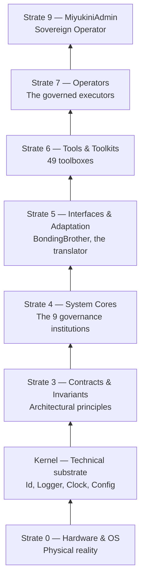
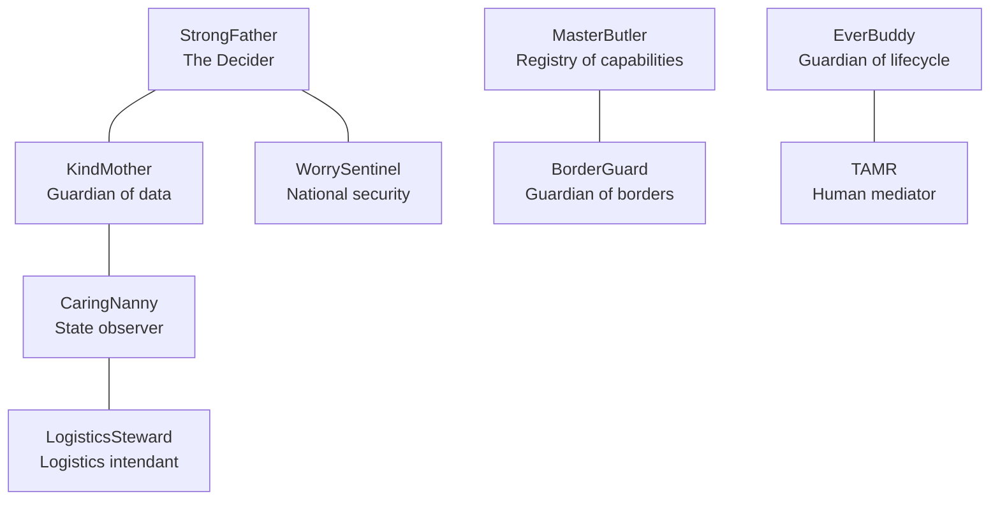
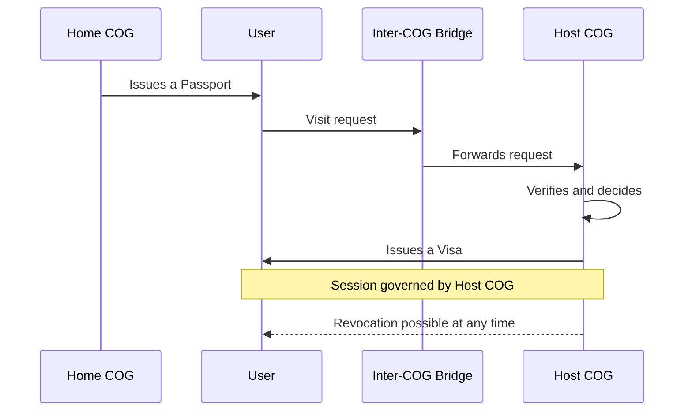
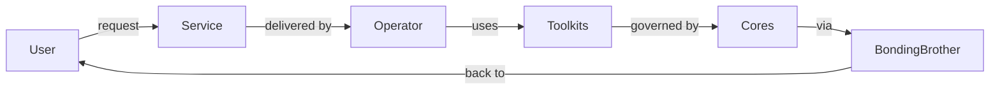
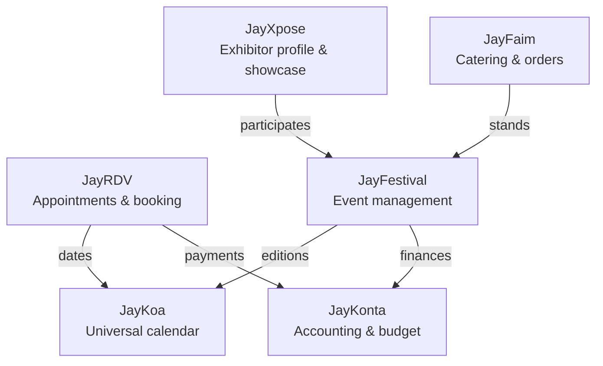
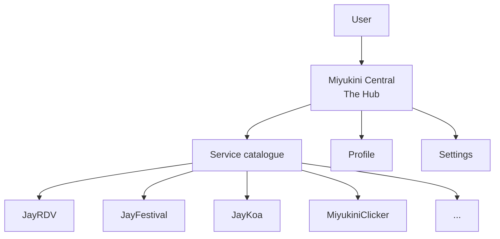

# Miyukini COG

> *"Miyukini is not an OS. It's the cog that makes digital systems work together."*

**Miyukini** is a **COG** — a **Core-Orchestrated Governance Environment**. It is not a framework, not a library, not an OS. It is a **governed software ecosystem**: a complete environment in which software entities operate under strict rules, verifiable contracts, and centralized governance — from the technical kernel to the user interface.

---

## Table of contents

1. [Philosophy — Why Miyukini exists](#1-philosophy--why-miyukini-exists)
2. [Project scale — What is being built](#2-project-scale--what-is-being-built)
3. [Strata — How everything is organized](#3-strata--how-everything-is-organized)
4. [Distinct mechanisms](#4-distinct-mechanisms)
5. [Toolkits — The universal toolbox](#5-toolkits--the-universal-toolbox)
6. [Operators — The governed executors](#6-operators--the-governed-executors)
7. [Services — What the user sees](#7-services--what-the-user-sees)
8. [Miyukini Central — The entry point](#8-miyukini-central--the-entry-point)
9. [Implemented services](#9-implemented-services)
10. [Project status](#10-project-status)
11. [Reference documentation](#11-reference-documentation)
12. [Licence](#12-licence)

---

## 1. Philosophy — Why Miyukini exists

### The digital nation allegory

Imagine building a **country** — not a house, not a neighbourhood, but an entire country. That country needs a constitution, institutions, civil servants, laws, borders, and diplomacy. It must be able to function **even when all roads are cut**: no panic, no collapse, just degraded but orderly operation.

That is exactly what Miyukini does. Except the country is digital, the constitution is code, and the citizens are software components.

### The problem Miyukini solves

Modern software relies on fragile assumptions: permanent connectivity, always-available cloud, accessible third-party services. When one of these assumptions fails, everything collapses.

Miyukini tackles the problem the other way round:

> **Disconnection is not an error to fix. It is a normal state of the system.**

A Miyukini system starts without a network, runs without the cloud, degrades gracefully in isolation, remains locally manageable, and reconciles when the network returns — without rebuilding.

### The 8 Laws of Autonomy

These laws are the **non-negotiable invariants** of the ecosystem. Nothing may contradict them:

| Law | Statement |
|-----|-----------|
| **LOI-1** | No critical external dependency at runtime |
| **LOI-2** | The system treats isolation as a normal state |
| **LOI-3** | Local state is sovereign |
| **LOI-4** | No global time required |
| **LOI-5** | Cost must be proportional to hardware |
| **LOI-6** | Autonomy does not prevent federation |
| **LOI-7** | The Cores stratum is immutable — evolution by environment |
| **LOI-8** | Migration = diplomacy between environments |

> Permanent design question: *"Does it still work when the system is alone, slow, and isolated?"*

Documentation: [Laws of Autonomy](Miyukini%20-%20Laws%20of%20Autonomy.md)

### This is not a theoretical exercise

Miyukini is a **large-scale experimental project**, written in **Rust**, with a native desktop application (egui/eframe) already working. It is not a whitepaper: it is code that compiles, architectures that run, mechanisms that execute.

---

## 2. Project scale — What is being built

To give an idea of scale:

```
 9 Governance Cores          (the system's institutions)
49 implemented Toolkits       (the professional tools)
10 documented services       (the public services)
70+ Rust crates               (the code modules)

1000+ pages of conceptual documentation
 244 market analyses (Odoo, etc.)
 Complete stratified architecture (layer 0 to top)
```

This is not a prototype. It is a **structural ecosystem** whose ambition is to replace CMSs, SaaS, and siloed applications with a sovereign, governed, and autonomous environment.

---

## 3. Strata — How everything is organized

### The government building allegory

Think of a government building. In the basement, foundations and utilities (never touched). On the ground floor, archives and the electricity meter. On the middle floors, the ministries. On the upper floors, civil servants who receive the public. At the very top, the president's office.

The **Miyukini Pyramid** works exactly like that:



**Fundamental rule:** dependency is strictly one-way, top to bottom. An upper stratum may use what is below, but never the reverse.

| Stratum | Allegory | Role |
|---------|----------|------|
| **0** | The land | Hardware and OS — physical reality |
| **K** | The foundations | Kernel — identifiers, clock, logs (zero business logic) |
| **3** | The internal regulations | Architectural contracts and invariants |
| **4** | The ministries | 9 Cores that govern but never execute |
| **5** | The official interpreter | BondingBrother translates intentions to the Cores |
| **6** | The toolbox | 49 Toolkits — executable, governed capabilities |
| **7** | The civil servants | Operators — execute services on behalf of the user |
| **9** | The president | MiyukiniAdmin — sovereign authority by exception |

Documentation: [Complete Architecture Pyramid](Miyukini%20-%20Complete%20Architecture%20Pyramid.md)

---

## 4. Distinct mechanisms

### 4.1 Cores — The institutions that govern

In our country allegory, **Cores** are the **ministries**. Each has an exclusive domain, absolute authority in that domain, but **no power of execution**. They decide, govern, define — but never execute.



| Core | Allegory | Fundamental question |
|------|----------|----------------------|
| **StrongFather** | The President | *"Should this action be done?"* |
| **KindMother** | Guardian of the archives | *"How is data persisted?"* |
| **CaringNanny** | The school nurse | *"What state is the system in?"* |
| **MasterButler** | The land registry | *"What is possible in this environment?"* |
| **BorderGuard** | The customs officer | *"Where are the borders and crossing rules?"* |
| **EverBuddy** | The version archivist | *"How does the system evolve without breaking?"* |
| **WorrySentinel** | The security agency | *"What security level applies?"* |
| **TAMR** | The citizen mediator | *"When may humans intervene?"* |
| **LogisticsSteward** | The intendant | Resource and logistics management |

> **Golden rule:** Cores decide or govern, but **never execute**.

### 4.2 A COG — A sovereign digital nation

A **COG** (Core-Orchestrated Governance Environment) is not a simple running program. It is a **sovereign entity** — like a country with its constitution, borders, and laws.

Each COG has:
- **A fixed version of its Cores** — its constitution, immutable
- **A unique identifier** — its state passport
- **Strict boundaries** — no entry without authorization
- **Bound Operators** — its civil servants, tied to this COG only

> **LOI-7:** *"The Cores stratum is immutable. Any evolution is done by creating a new complete environment."*

No wild patches, no hotfixes. If the country must evolve, a new complete, versioned and auditable country is created.

**Three levels of identity:**
- **LSI** (Local Sovereign ID) — the COG declares itself (offline, fully autonomous)
- **VID** (Verified ID) — verified by a global registry (connected, federated)
- **WID** (Witnessed ID) — attested by indirect exchange (USB key, QR, signature)

Documentation: [COG Definition](Miyukini%20-%20Definition%20COG.md) | [Environment Sovereignty](Miyukini%20-%20Environment%20Sovereignty.md)

### 4.3 Inter-COG protocols — Digital diplomacy

How do two sovereign countries exchange without merging their governments? Through **diplomacy**. That is exactly what COGs do.



The allegory is clear:
- **User Passport** — issued by your home country, proves who you are. **Grants no rights.**
- **Visit request** — your intention to access a foreign country (which services, what use)
- **Inter-COG Bridge** — the embassy that carries documents. **Never trusts, never decides, only transports.**
- **Connection Visa** — issued by the host country. Defines exactly what you may do, for how long, and at what security level (S1 to S5)

> *"A COG never hosts a foreign governance. It only hosts visitors, under a visa, in a framework it defines alone."*

**Visa levels:**

| Level | Name | Usage |
|-------|------|-------|
| **S1** | Observation | Read-only, spectator |
| **S2** | Controlled interaction | Forms, navigation |
| **S3** | Real time | Game, live collaboration |
| **S4** | Sensitive | Administration, finance |
| **S5** | Critical | MiyukiniAdmin only |

Documentation: [Inter-COG Connection](Miyukini%20-%20Inter-COG%20Connection.md)

### 4.4 The Webway — The network of galaxies

Miyukini includes a **tracking and participation** system between federated COGs via two dedicated Toolkits:
- **MiyuWebwayTracker** — observes and maps COGs reachable on the network, without ever modifying state
- **MiyuWebwayParticipant** — manages a COG's active participation in the federated network (announcement, discovery, governed synchronization)

These mechanisms allow a COG to **discover other COGs**, **offer its services**, and **consume remote services** — all under strict governance, without ever importing foreign logic.

---

## 5. Toolkits — The universal toolbox

### The workshop allegory

A **Toolkit** (Tool kit) is like a **professional toolbox**. The box contains tools (screwdriver, wrench, drill). Each tool does one precise thing. The box organizes them so they are more effective together. But **the box never decides** what to build — that is the carpenter's job (the Operator).

> *"A Tool does, but never decides."*

### 49 implemented Toolkits

Each Toolkit is a Rust crate, documented (foundational doc + governance contracts + tool reference):

| Domain | Toolkits |
|--------|----------|
| **Data & infra** | MiyuSQL, MiyuWeb, MiyuClock, MiyuLocale, MiyuValidate, MiyuExport, MiyuSearch, MiyuJobs |
| **Identity & social** | MiyuAuth, MiyuProfile, MiyuContacts, MiyuSocialFeed, MiyuSocialMessaging, MiyuSocialProfile, MiyuSocialModeration, MiyuStory, MiyuDiscovery |
| **Content & media** | MiyuCMS, MiyuMedia, MiyuText, MiyuWidgets, MiyuForum, MiyuPolls, MiyuFeeds, MiyuBookmarks, MiyuModerationForum, MiyuAntiSpam, MiyuPM |
| **Commerce & finance** | MiyuStore, MiyuShipping, MiyuBooking, MiyuBilling, MiyuInvoice, MiyuExpense, MiyuTreasury |
| **Point of sale** | MiyuPosSales, MiyuPosInventory, MiyuPosAnalytics, MiyuPosLoyalty, MiyuPosKitchen, MiyuPosPayment |
| **Accounting** | MiyuComptaLedger, MiyuComptaReports, MiyuDeclarations |
| **Organization** | MiyuHR, MiyuCalc, MiyuNotify, MiyuBooking |
| **Federation** | MiyuWebwayParticipant, MiyuWebwayTracker |

Documentation: [Tools and Toolkits](Miyukini%20-%20Tools%20and%20Toolkits.md)

---

## 6. Operators — The governed executors

### The civil servant allegory

An **Operator** is like a **civil servant** in our digital country. They perform a specific role on behalf of the citizen (the user). But unlike a freelancer, they never work alone and without a framework: they are **governed**, **mandated**, and **traceable**.

> *"In Miyukini, users do not install applications. They interact with governed Operators that perform roles on their behalf."*



**Operator types:**

| Type | Role | Example |
|------|------|---------|
| **Service Operator** | Manages a functional domain | CMS, Auth, Billing |
| **Interface Operator** | Exposes services to the user | Web UI, Mobile app |
| **Domain Operator** | Performs a specific trade | Blog, Catalogue, Forum |
| **Automation Operator** | Acts automatically | Notifications, Scheduling |
| **Sovereign Operator** | System authority (exception) | MiyukiniAdmin only |

**Mandated collaboration:** Operators never collaborate freely. All collaboration is framed by a **Permission Mandate** issued by StrongFather and a **Team Contract** that defines flows, data types, and security levels.

Documentation: [Operators and Terminology](Miyukini%20-%20Operators%20and%20Terminology.md) | [Mandates and Operator Teams](Miyukini%20-%20Mandates%20and%20Operator%20Teams.md)

---

## 7. Services — What the user sees

A **Service** is what the citizen perceives. They do not see the ministries (Cores), the toolboxes (Toolkits), or the internal procedures (Mandates). They see: *"I want to book an appointment"*, *"I want to manage my festival"*, *"I want to keep my accounts"*.

### The Jay family — Interconnected services

**Jay** services are designed to **inter-operate**: they couple naturally with each other while remaining independent.



| Service | Description |
|---------|-------------|
| **JayRDV** | Online appointment and booking (B2B2C). Slots, calendars, confirmations, reminders. |
| **JayFestival** | Event and festival management. Catalogue, exhibitor dashboard, visitor agenda, ticketing. |
| **JayKoa** | COG universal calendar. Aggregates dates from all services, detects conflicts, exports (iCal, PDF). |
| **JayKonta** | Multi-scale accounting and budget. From personal budget (JayBudget) to business accounting. |
| **JayXpose** | Exhibitor profile and showcase site for craftspeople, artists, small brands. Integrates with JayFestival. |
| **JayFaim** | Table booking and online ordering. Restaurants, caterers, food trucks. Couples with JayFestival. |

### Miyukini services

| Service | Description |
|---------|-------------|
| **MiyukiniCentral** | The Hub — single entry point to all COG services |
| **MiyukiniClicker** | Official idle/clicker + strategy game. Demo of multi-service coexistence in a COG |
| **MiyukiniSurvivor** | Hybrid Survivor + Tower Defense game. Preparation phase, battle phase, towers and castle |
| **MiyukiniSales** | Sales and quotes: full cycle quote → orders → invoicing → payments |

---

## 8. Miyukini Central — The entry point

### The town hall allegory

**Miyukini Central** is the **Town Hall** of our digital country. It is where the citizen goes to access public services. The Town Hall does not provide the services itself — it **lists** them, **presents** them, and **directs** the citizen to the right counter.



**Miyukini Central is a native desktop application** (egui/eframe, pure Rust) that provides:
- A **loading screen** with progress and random phrases
- A **Hub** with a catalogue of available services (grid or list)
- A **sidebar** for search and filters (categories, types)
- **Service cards** with name, description and open button
- A **tab** system (Hub + open services)
- **Profile** and **Settings** overlays (persistent light/dark theme)

> Miyukini Central **never decides**. It translates user intentions to the Cores via BondingBrother.

---

## 9. Implemented services

### Implementation status

| Layer | Component | Status |
|-------|-----------|--------|
| **Kernel** | miyukini-kernel | Implemented |
| **Cores** (x9) | strongfather, kindmother, caringnanny, masterbutler, borderguard, everbuddy, worrysentinel, tamr, logisticssteward | Implemented |
| **Toolkits** (x49) | All MiyuXxx | Phase 1 (skeletons) complete, Phase 2 (logic) in progress |
| **Miyukini Central** | Desktop Hub (egui) | Functional |
| **JayKoa** | Universal calendar | Implemented (crate + UI) |
| **JayFestival** | Event management | Implemented (crate) |
| **MiyukiniClicker** | Idle/clicker game | Implemented (crate) |
| **MiyukiniSurvivor** | Survivor/TD game | Implemented (crate lord_of_the_castle) |
| **MiyukiniAdmin** | Admin console | Implemented (crate + web UI) |
| **JayRDV, JayKonta, JayXpose, JayFaim, MiyukiniSales** | Documented services | Conceptual phase (full documentation, no crate yet) |

### Next phase

Work is moving towards **Operator implementation** (Strate 7). Operators will orchestrate the 49 already-implemented Toolkits — alone or in teams — to deliver services to users, under governance (StrongFather, Permission Mandates, Team contracts).

---

## 10. Project status

### What is stable

- The **Pyramid**, **Cores**, **Laws of Autonomy** and **governance contracts** are documented and stable
- The **Kernel** and **9 Cores** are implemented as Rust crates
- The **49 Toolkits** are implemented (full skeletons, progressive logic)
- **Miyukini Central** (desktop Hub) is functional
- **1000+ pages** of conceptual documentation covering the whole architecture
- **244 market analyses** (including an exhaustive Odoo module-by-module study)
- **Semantic markup** (MSCM) and **structural indexing** (MIP) system operational

### In progress

- Progressive implementation of business logic in Toolkits (Phase 2)
- Product design for Jay services (JayRDV, JayFestival, JayKonta, JayXpose, JayFaim)
- Specification of Operator requirements for each service

### Still to do

- **Operators** (Strate 7) implementation — the layer that orchestrates Toolkits to deliver services
- **Inter-COG federation** — protocols documented, implementation to come
- **Webway** — the discovery and federation network between COGs

### Project maturity

```
Conceptual documentation    ████████████████████  95%
Architecture (Pyramid/Cores) ████████████████████  95%
Kernel                       ██████████████████░░  90%
Toolkits (49 crates)         ████████████░░░░░░░░  60%
Services (conception)        ████████████░░░░░░░░  55%
Miyukini Central (Hub)       ██████████████░░░░░░  70%
Operators (implementation)   ████░░░░░░░░░░░░░░░░  15%
Inter-COG federation         ██░░░░░░░░░░░░░░░░░░  10%
```

---

## 11. Reference documentation

### Public documentation

All conceptual reference documentation is in the `docs/public/` folder:

| Theme | Document |
|-------|----------|
| **Official dictionary** | [Glossary](Miyukini%20-%20Glossary.md) |
| **What is a COG** | [COG Definition](Miyukini%20-%20Definition%20COG.md) |
| **Stratified architecture** | [Complete Architecture Pyramid](Miyukini%20-%20Complete%20Architecture%20Pyramid.md) |
| **Fundamental laws** | [Laws of Autonomy](Miyukini%20-%20Laws%20of%20Autonomy.md) |
| **Environment sovereignty** | [Environment Sovereignty](Miyukini%20-%20Environment%20Sovereignty.md) |
| **Operators** | [Operators and Terminology](Miyukini%20-%20Operators%20and%20Terminology.md) |
| **Tools** | [Tools and Toolkits](Miyukini%20-%20Tools%20and%20Toolkits.md) |
| **Governed collaboration** | [Mandates and Operator Teams](Miyukini%20-%20Mandates%20and%20Operator%20Teams.md) |
| **Exchanges between COGs** | [Inter-COG Connection](Miyukini%20-%20Inter-COG%20Connection.md) |
| **COG behavior (schema)** | [COG Environments Behavior](Miyukini%20-%20COG%20Environments%20Behavior.md) |
| **Kernel maintenance** | [Kernel Maintenance Observability Contract](Miyukini%20-%20Kernel%20Maintenance%20Observability%20Contract.md) |

### Further (private repo)

| Theme | Location |
|-------|----------|
| Toolkit index | `docs/tools/_index.md` |
| Service documentation | `docs/services/` |
| Core documentation | `docs/cores/` |
| Market analyses | `docs/market/` |
| Security | `docs/security/` |

---

## 12. Licence

Miyukini is distributed under a **dual licence policy**:

- **Domestic / personal use** (individual, non-commercial): **free** — see [LICENSE](LICENSE)
- **Use by a company or organisation** (business, association, administration): **commercial licence required**

Details: [Miyukini — Licence policy](docs/legal/Miyukini%20-%20Politique%20de%20Licence.md)

---

> *"Miyukini is not a library. It is a governed environment in which Operators operate."*

**Last updated:** 2026-02-07
