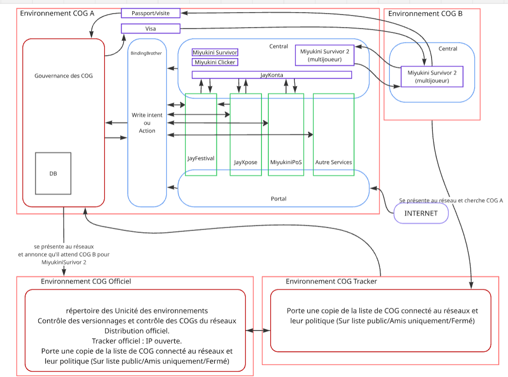

# Miyukini Conceptual References — Comportement des COG et schéma des environnements

## Contexte

Ce document décrit le **comportement des environnements COG** (Core-Orchestrated Governance) dans l’écosystème Miyukini : rôles des différents types d’environnements, interactions entre eux, et mécanismes de gouvernance, découverte et communication. Il s’appuie sur le schéma architectural des COG (environnements A, B, Officiel, Tracker) pour en formaliser l’usage.

## Portée / Scope

- Comportement d’un **COG autonome** (gouvernance, BondingBrother, Central, Portail, Services).
- Comportement des **environnements COG Officiel** et **COG Tracker** (répertoire, versionnage, découverte).
- **Communication inter-COG** (découverte réseau, multijoueur, Passport/Visa).
- Différenciation claire par rapport à une simple application web front-end.

**Public :** Architectes, développeurs, toute décision d’intégration ou d’exposition de services.

---

## 1. Schéma de référence : environnements COG

Le schéma ci-dessous illustre les quatre types d’environnements et leurs relations. Chaque cadre délimite une **unité souveraine** ou un **système de gestion** des COG.

*Pour afficher le schéma : placer l’image sous `images/references/Miyukini-Schema-Comportement-Environnements-COG.png` à la racine du dépôt.*

### Légende du schéma

| Couleur / zone | Signification |
|----------------|---------------|
| **Cadre rouge** | Frontière d’un environnement COG |
| **Bleu clair** | Composants d’orchestration (BondingBrother, Central, Portail) |
| **Vert** | Services (JayFestival, JayXpose, MiyukiniPoS, autres) |
| **Violet** | Applications utilisateur (Passport/visite, Visa, Miyukini Survivor, Miyukini Clicker, JayKonta, etc.) |
| **Gris** | Base de données (état, configuration) |
| **Flèches** | Flux d’information ou d’appels |

---

## 2. Comportement d’un environnement COG autonome (ex. COG A)

Un COG de type « autonome » contient toute la chaîne : gouvernance, orchestration, services et applications.

### 2.1 Gouvernance des COG (cœur décisionnel)

| Comportement | Description |
|--------------|-------------|
| **Autorité** | Cœur décisionnel et administratif de l’environnement. |
| **Persistance** | Interagit avec une base de données locale (état, configuration, politiques). |
| **Identité et accès** | Initie **Passport/visite** et **Visa** (authentification et autorisation pour l’accès aux services). |
| **Coordination** | Communication bidirectionnelle avec **BondingBrother** pour coordonner les intentions et les décisions. |
| **Annonce** | Se présente aux réseaux et annonce ses capacités (ex. « attend COG B pour Miyukini Survivor 2 ») via la DB et l’environnement **COG Officiel**. |

La gouvernance **ne fait pas exécuter** ; elle décide et délègue via BondingBrother et les Cores.

### 2.2 BondingBrother (orchestrateur interne)

| Comportement | Description |
|--------------|-------------|
| **Rôle** | Orchestrateur ou bus d’événements interne ; traduction et délégation (strate 5 — Interfaces & Adaptation). |
| **Entrées** | Reçoit **Write Intent** ou **Action** (intentions d’écriture, commandes, requêtes). |
| **Routage** | Interactions bidirectionnelles avec les Services (JayFestival, JayXpose, MiyukiniPoS, etc.) et avec les applications (Miyukini Survivor, Miyukini Clicker). |
| **Règles** | Ne décide pas à la place des Cores ; transporte et route selon les décisions de gouvernance. |

### 2.3 Flux Passport/visite et Visa

| Étape | Acteur | Comportement |
|-------|--------|--------------|
| 1 | Gouvernance | Délivre **Passport/visite** (identité, origine, intégrité). |
| 2 | BondingBrother | Valide et applique le **Visa** pour les accès autorisés. |
| 3 | Services / Applications | Agissent uniquement dans le cadre du Visa (voir [Connexion Inter-COG](./Miyukini%20Conceptual%20References%20-%20Connexion%20Inter-COG.md)). |

### 2.4 Central et applications

| Composant | Comportement |
|-----------|--------------|
| **Central** | Point d’entrée pour l’utilisateur du COG ; héberge les applications (Miyukini Survivor, Miyukini Clicker, Miyukini Survivor 2 multijoueur, etc.). |
| **Applications** | Envoient des données/actions vers **JayKonta** et consomment les Services via BondingBrother. |
| **JayKonta** | Agrège ou traite les données/actions et les transmet au Portail et à Miyukini Survivor 2 (multijoueur). |

### 2.5 Portail et Services exposés

| Composant | Comportement |
|-----------|--------------|
| **Portail** (Miyukini Web Portal) | Encapsule les **façades publiques** des Services (JayFestival, JayXpose, MiyukiniPoS, autres) ; point d’entrée pour les utilisateurs externes ou pour la découverte réseau. |
| **Présence réseau** | Le Portail **se présente au réseau** et **cherche** d’autres COG (ex. COG A) via **INTERNET**, selon les mécanismes du COG Officiel / Tracker. |

Les Services restent gouvernés : exposition ≠ transfert de gouvernance.

---

## 3. Comportement d’un environnement COG secondaire (ex. COG B)

Un COG peut être simplifié et dédié à un usage précis (ex. multijoueur).

| Comportement | Description |
|--------------|-------------|
| **Contenu** | Peut héberger une instance d’application partagée (ex. **Miyukini Survivor 2 (multijoueur)**). |
| **Connexion** | Reçoit la connexion ou les données de l’instance homologue dans un autre COG (ex. COG A). |
| **Découverte** | **Se présente au réseau** et **cherche** l’autre COG (ex. COG A) via INTERNET, selon les politiques et le répertoire (COG Officiel / Tracker). |

Chaque COG reste **souverain** ; la session multijoueur est gouvernée par les deux environnements et les règles inter-COG (Visa, politique d’accueil).

---

## 4. Comportement de l’environnement COG Officiel

Le **COG Officiel** est l’autorité centrale de répertoire, de contrôle et de distribution.

| Comportement | Description |
|--------------|-------------|
| **Unicité des environnements** | Garantit que chaque COG est identifiable de manière unique. |
| **Versionnage** | Contrôle des versions des Cores et des COG sur les réseaux (compatibilité, conformité). |
| **Distribution** | Gère la **distribution officielle** des COG ou de leurs composants. |
| **Tracker officiel** | Expose une **IP ouverte** comme point de contact pour la découverte. |
| **Liste et politiques** | Porte une **copie de la liste des COG connectés** et leurs **politiques** (Sur liste public / Amis uniquement / Fermé). |
| **Entrées** | Reçoit les informations de la DB du COG A (présence, attentes, annonces). |
| **Sorties** | Communique avec l’**Environnement COG Tracker** pour la diffusion. |

Il **ne gouverne pas** le contenu des COG ; il gouverne l’**enregistrement, la découverte et la politique d’ouverture** des environnements.

---

## 5. Comportement de l’environnement COG Tracker

| Comportement | Description |
|--------------|-------------|
| **Liste et politiques** | Porte une **copie de la liste des COG connectés** et de leurs **politiques** (public / amis / fermé). |
| **Rôle** | Diffusion et surveillance des informations sur les COG connectés. |
| **Réseau** | Interagit avec **INTERNET** pour diffuser ou récupérer les informations sur les COGs. |
| **Lien** | Alimenté ou synchronisé avec le **COG Officiel**. |

Le Tracker permet la **découverte** et le **repérage** des COG sans détenir l’autorité de définition (réservée au COG Officiel).

---

## 6. Synthèse : pourquoi ce n’est pas « une app React/Vite sans COG »

Le schéma et les comportements ci-dessus montrent que les COG **ne se réduisent pas** à une application web front-end (type React/TypeScript Vite). Résumé des différences :

| Aspect | Application web classique (ex. Vite) | Environnements COG Miyukini |
|--------|--------------------------------------|-----------------------------|
| **Unité** | Client léger + backend centralisé | **COG = unité autonome** avec gouvernance, DB, services, applications. |
| **Découverte** | URL / API fixes | **Présentation au réseau**, annonce, recherche d’autres COG via COG Officiel / Tracker. |
| **Inter-COG** | Souvent absent | **Communication inter-COG** (multijoueur, visite, Visa, Passport). |
| **Orchestration** | Backend unique | **BondingBrother** + Cores : routage, Write Intent, validation, pas d’exécution directe par la gouvernance. |
| **Politiques** | Gestion ad hoc | **Politiques explicites** (liste public / amis / fermé), versionnage, distribution officielle. |
| **Souveraineté** | Hébergeur maître des données | **État local souverain** ; chaque COG garde sa gouvernance (voir [Souveraineté Environnement](./Miyukini%20Conceptual%20References%20-%20Souverainete%20Environnement.md)). |

Une app **Vite/React peut être la surface** (Portail, UI) d’un COG ; elle ne remplace pas la chaîne Gouvernance → BondingBrother → Cores → Services ni les environnements COG Officiel / Tracker.

---

## 7. Références croisées

- [Connexion Inter-COG](./Miyukini%20Conceptual%20References%20-%20Connexion%20Inter-COG.md) — Passeport, Visa, visite gouvernée, utilisateurs externes.
- [Souveraineté Environnement](./Miyukini%20Conceptual%20References%20-%20Souverainete%20Environnement.md) — Entité souveraine, versionnée, isolée.
- [Definition COG](./Miyukini%20Conceptual%20References%20-%20Definition%20COG.md) — Définition du COG et de la pyramide.
- [Miyukini Webway System](./Miyukini%20Conceptual%20References%20-%20Miyukini%20Webway%20System.md) — Présence et découverte sur le réseau.
- [Pyramide Architecture Complete](./Miyukini%20Conceptual%20References%20-%20Pyramide%20Architecture%20Complete.md) — Strates et position des Cores, BondingBrother, Opérateurs.

---

*Document créé le 08/02/2026 — Classification : Reference conceptuelle*
