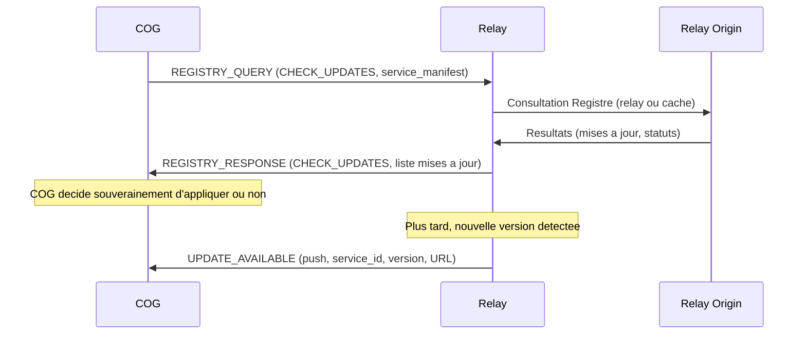

# Miyukini Conceptual References - Miyukini Webway Relay Protocol

## Contexte

Ce document specifie le **protocole** du **relay Miyukini Webway** : les messages de controle, le format binaire des echanges et les sequences d'authentification et d'enregistrement de tunnel entre un COG et le relay. Il complete le document d'architecture [Miyukini Webway Relay](./Miyukini%20Conceptual%20References%20-%20Miyukini%20Webway%20Relay.md) en decrivant ce qui est envoye sur le cable (handshake, types de trames, champs obligatoires).

**Principe :**

> **Le protocole relay est minimal, oriente controle de tunnel et routage par `cog_id` ; il ne transporte pas la gouvernance ni les donnees metier -- il permet d'etablir et de maintenir le tunnel entre un COG et le relay.**

## Portee / Scope

- **Types de messages** : REGISTER, CONNECT, DATA, HEARTBEAT, CLOSE, ERROR, REGISTRY_QUERY, REGISTRY_RESPONSE, UPDATE_AVAILABLE, CORE_KEY, SERVICE_BLOCK, VERIFY_RESULT, REDIRECT
- **Handshake** : authentification par token/secret, enregistrement du tunnel associe au `cog_id`
- **Format binaire** : structure des trames, encodage, longueurs, version de protocole
- **Securite** : TLS obligatoire, authentification par token, protection contre le rejeu (replay protection)
- **Versioning** : numero de version du protocole, empreinte de version COG (Cores + Services), retrocompatibilite
- **Registre de Services** : messages REGISTRY_QUERY, REGISTRY_RESPONSE, UPDATE_AVAILABLE pour consultation du Registre et suivi des mises a jour via le Relay Origin

Ce document **ne couvre pas** :
- L'architecture et le deploiement du relay -> voir [Miyukini Webway Relay](./Miyukini%20Conceptual%20References%20-%20Miyukini%20Webway%20Relay.md)
- Le protocole MWS de decouverte (annonces, Trackers) -> voir [Miyukini Webway System](./Miyukini%20Conceptual%20References%20-%20Miyukini%20Webway%20System.md) et [MWS Normes et Standards](./Miyukini%20Conceptual%20References%20-%20Miyukini%20Webway%20System%20Normes%20et%20Standards.md)

---

## 1. Version du protocole

| Element | Valeur |
|---------|--------|
| **Nom** | Miyukini Webway Relay Protocol |
| **Version actuelle** | **1** |
| **Identifiant dans les trames** | `protocol_version = 1` (1 octet) |

Les implementations doivent ignorer ou rejeter poliment les trames dont la version de protocole n'est pas supportee. Les evolutions **compatibles** (champs optionnels ajoutes) peuvent conserver la meme version ; les changements **incompatibles** (structure des messages, semantique) doivent incrementer la version majeure.

---

## 2. Transport et securite de base

> **Principe :** Le protocole relay est expose sur Internet via le port TLS du relay. Chaque message doit etre authentifie, integre et protege contre le rejeu. La securite au niveau protocole est la **premiere ligne de defense**.

### 2.1 TLS obligatoire

- Toute connexion **client (COG) -> relay** et **relay -> client** doit utiliser **TLS** (minimum TLS 1.2, recommande TLS 1.3).
- Le relay expose un endpoint **TCP avec TLS** (ex. port **7000** -- voir [Miyukini Webway Relay](./Miyukini%20Conceptual%20References%20-%20Miyukini%20Webway%20Relay.md)).
- **Aucun mode plaintext** sur le port officiel du protocole relay. Un relay **ne doit pas** accepter de connexions non-TLS.
- **Cipher suites** : seules les suites jugees sures sont acceptees (PFS obligatoire, pas de RC4/3DES/TLS_RSA_*). Voir la section 6 du document [Miyukini Webway Relay](./Miyukini%20Conceptual%20References%20-%20Miyukini%20Webway%20Relay.md) pour la liste detaillee.
- **Validation du certificat** : le client (COG ou appelant) **doit** verifier la chaine de confiance du certificat serveur (CA, nom de domaine). En test (auto-signe), utiliser le certificate pinning.

### 2.2 Authentification par token

- L'enregistrement du tunnel est protege par un **token d'authentification** (minimum 256 bits d'entropie, genere aleatoirement) connu du COG et du relay.
- Le token n'est **jamais** transmis en clair ; il est envoye une seule fois sur le canal TLS (chiffre) dans la trame REGISTER. Apres enregistrement, le token n'apparait plus dans les trames DATA/HEARTBEAT.
- **HMAC challenge-response (optionnel, recommande)** : plutot qu'envoyer le token brut, le relay peut envoyer un **challenge** (nonce aleatoire) et le COG repond avec `HMAC(secret, challenge)`. Cela evite l'exposition du token meme sur le canal TLS en cas de compromission du relay.
- Le relay associe chaque tunnel enregistre a un **`cog_id`** ; le routage des connexions entrantes se fait par `cog_id`.
- **Echec d'authentification** : fermeture immediate de la connexion TLS apres envoi de REGISTER_ERR. Le relay ne doit pas reveler si c'est le token ou le `cog_id` qui est invalide (message generique).

### 2.3 Replay protection

- Les messages critiques (REGISTER, CONNECT) **doivent** inclure un **nonce** (aleatoire, minimum 16 octets) **et** un **horodatage** (timestamp, precision secondes) pour empecher la reutilisation d'une meme trame.
- Le relay **doit** :
  - Verifier que le timestamp est dans une fenetre d'acceptation (recommande : +/-30 secondes).
  - Maintenir un **registre de nonces** (cache bornee, ex. dernieres 60 secondes) pour rejeter les nonces deja vus dans la fenetre.
  - Rejeter toute trame avec nonce/timestamp hors limites (reponse : ERROR ou REGISTER_ERR avec code `replay_detected`).
- **Sequences** : pour les trames de controle en session active (HEARTBEAT, CLOSE), un **numero de sequence** incremente monotoniquement peut etre utilise pour detecter les doublons et les trames hors-ordre.

### 2.4 Politique de chiffrement (controle vs donnees)

- **Canal de controle (toujours chiffre TLS)** : les messages REGISTER, CONNECT, HEARTBEAT, CLOSE, ERROR, REGISTRY_QUERY, REGISTRY_RESPONSE, UPDATE_AVAILABLE transitent **obligatoirement** sur TLS. Aucune exception.
- **Canal de donnees (DATA) -- chiffre TLS par defaut** : les trames DATA sont chiffrees TLS par defaut. Une **exemption temps reel** est possible pour les cas necessitant une latence minimale (ex. jeu multijoueur, streaming audio/video en direct) :
  - L'exemption doit etre **negociee** via le canal de controle chiffre (flag dans CONNECT ou REGISTER).
  - Les deux COGs doivent etre **verifies et authentifies** par le relay avant la negociation.
  - Le flux non chiffre est **ephemere** (session limitee, pas de persistance).
  - L'utilisateur est **informe** du mode non chiffre.
  - La session est **journalisee** (cog_id source, cog_id destination, duree, volume).
- **En cas de doute, le chiffrement est obligatoire.** L'exemption temps reel est un cas d'exception, pas la regle.

### 2.5 Limites de taille et validation d'entree

- **Toute trame recue** doit etre validee avant traitement :
  - Longueur du payload coherente avec le type de message et les limites definies (ex. cog_id max 256 octets, token max 512 octets, svc_manifest max 4096 octets).
  - Encodage UTF-8 valide pour les champs texte (cog_id, core_version, svc_manifest, messages d'erreur).
  - Version de protocole supportee.
- **Trames malformees** : fermeture immediate de la connexion apres envoi de ERROR (code `invalid_format`). Un client qui envoie des trames malformees de maniere repetee peut etre blackliste temporairement (voir rate limiting dans le document d'architecture).
- **Taille maximale de trame** : definie par l'implementation (recommande : 64 Ko pour les trames de controle, configurable pour DATA).

---

## 3. Format binaire des trames

### 3.1 Structure generale

Chaque **trame** envoyee sur le canal (COG <-> relay) a la forme :

```
+--------+--------+--------+------------------+
| Version|  Type  | Flags  | Payload length   |  (en octets, big-endian ou fixe selon spec)
+--------+--------+--------+------------------+
| Payload (variable)                           |
+----------------------------------------------+
```

- **Version** : 1 octet -- numero de version du protocole (actuellement 1).
- **Type** : 1 octet -- type de message (voir section 4).
- **Flags** : 1 octet -- reserve ou bits optionnels (ex. direction, fin de flux).
- **Payload length** : 2 ou 4 octets (big-endian) -- longueur du payload en octets.
- **Payload** : contenu du message, selon le type.

Les nombres multi-octets sont en **big-endian** (network byte order) sauf indication contraire.

### 3.2 Types de message (octet Type)

| Code | Nom       | Direction typique | Description |
|------|-----------|-------------------|-------------|
| 0x01 | REGISTER   | COG -> Relay      | Enregistrement du tunnel (auth + cog_id + empreinte version) |
| 0x02 | REGISTER_OK| Relay -> COG      | Accuse d'enregistrement reussi (+ info version relay) |
| 0x03 | REGISTER_ERR | Relay -> COG    | Refus d'enregistrement (cause dans payload) |
| 0x04 | CONNECT    | Client -> Relay   | Demande de connexion vers un cog_id (cote joignant) |
| 0x05 | CONNECT_OK | Relay -> Client   | Tunnel logique etabli (pret pour DATA, + version du COG cible) |
| 0x06 | CONNECT_ERR| Relay -> Client   | Refus de connexion |
| 0x07 | DATA       | Bidirectionnel    | Donnees opaques a relayer |
| 0x08 | HEARTBEAT  | Bidirectionnel    | Garde la connexion / tunnel vivant |
| 0x09 | HEARTBEAT_ACK | Reponse        | Accuse de HEARTBEAT |
| 0x0A | CLOSE      | Bidirectionnel    | Fermeture propre du tunnel ou de la connexion |
| 0x0B | ERROR      | Bidirectionnel    | Erreur protocolaire ou applicative (code + message) |
| 0x0C | REGISTRY_QUERY | COG -> Relay  | Interrogation du Registre de Services (via Relay Origin) |
| 0x0D | REGISTRY_RESPONSE | Relay -> COG | Reponse du Registre (statut service, version, source) |
| 0x0E | UPDATE_AVAILABLE | Relay -> COG | Notification push de mise a jour disponible |
| 0x10 | CORE_KEY | COG -> Relay | Cle de conformite des Cores (Phase A de verification) |
| 0x11 | SERVICE_BLOCK | COG -> Relay | Bloc de code MIP chiffre d'un Service (Phase B de verification) |
| 0x12 | VERIFY_RESULT | Relay -> COG | Resultat intermediaire d'une phase de verification |
| 0x13 | REDIRECT | Relay/Origin -> COG | Redirection vers un autre relay (Origin sature) |

Les codes 0x00 et 0x14-0xFF sont reserves ou pour extensions futures.

---

## 4. Handshake et enregistrement du tunnel

### 4.1 Sequence de verification et enregistrement (COG -> Origin/Relay)

La verification suit le flux complet decrit dans [Miyukini Webway Relay](./Miyukini%20Conceptual%20References%20-%20Miyukini%20Webway%20Relay.md) section 2 :

**Phase 0 : Presentation a Origin**

1. Le COG ouvre **TCP + TLS** vers Origin et transmet son `cog_id` + requete de verification.
2. Origin evalue sa capacite (CPU / saturation).
   - **Accepte** : la verification se poursuit sur Origin.
   - **Sature** : repond avec `REDIRECT` vers un relay. Le COG se reconnecte au relay designe.

**Phase 1 : Transmission du Passeport COG (trame REGISTER)**

3. Le COG envoie une trame **REGISTER** contenant le **Passeport COG** complet :
   - **Token** (ou preuve d'authentification derivee).
   - **cog_id** : identifiant du COG.
   - **Nonce/timestamp** pour replay protection.
   - **core_version** : version des Cores (`MAJOR.MINOR`).
   - **svc_manifest** : JSON compact des versions de Services actifs avec checksums.
   - **environment_health** : rapport de sante de l'environnement genere par les Cores.
   - **previous_visas** : historique des visas precedents (IDs, relays emetteurs).
   - **passport_type** : `STANDARD` (0x01) ou `SPECIAL` (0x02).
   - **special_key** (si passport_type = SPECIAL) : cle speciale delivree par Origin.

**Phase 2 : Verification en trois phases par le relay**

4. **Phase A** : le relay recoit la **cle de conformite des Cores** (transmise separement par les Cores via le canal TLS). Le relay la compare avec la cle attendue pour la `core_version` declaree (heritee d'Origin). Concordance = Cores authentiques.
5. **Phase B** : pour chaque Service, le relay recoit un **paquet chiffre** contenant un **bloc de code MIP** choisi aleatoirement. Le relay tente de dechiffrer avec les references Origin. Si le bon bloc est dechiffre = Service authentique. En cas de doute, verification renforcee sur tout le code.
6. **Phase C** : le relay verifie le `environment_health` (integrite stockage, configuration, strates).

**Phase 3 : Resultat**

7. Le relay repond :
   - **REGISTER_OK** avec un **Visa de circulation** (visa_id, duree, portee, core_version validee).
   - **REGISTER_ERR** avec code d'erreur (quarantaine, notification de mise a jour, ou blacklistage).

Apres **REGISTER_OK**, le tunnel est actif et le COG possede un Visa valide pour se connecter aux trackers.

### 4.2 Format REGISTER (orientation)

| Champ        | Type / longueur | Description |
|-------------|------------------|-------------|
| token_len   | 2 octets (BE)    | Longueur du token en octets |
| token       | token_len octets | Token d'authentification |
| cog_id_len  | 2 octets (BE)    | Longueur de cog_id en octets |
| cog_id      | cog_id_len octets| Identifiant COG (UTF-8) |
| nonce_ts    | 8 octets (BE)    | Nonce ou timestamp pour replay protection |
| core_ver_len | 1 octet         | Longueur de core_version en octets (ex. 3 pour "1.0") |
| core_version | core_ver_len octets | Version des Cores (UTF-8, format `MAJOR.MINOR`) |
| svc_manifest_len | 2 octets (BE) | Longueur du service manifest (0 si absent) |
| svc_manifest | svc_manifest_len octets | JSON compact des versions de Services avec checksums (UTF-8) ; vide si len=0 |
| env_health_len | 2 octets (BE) | Longueur du rapport de sante de l'environnement |
| environment_health | env_health_len octets | Rapport de sante genere par les Cores (WorrySentinel, KeeperOfStorage) : integrite stockage, configuration, strates. |
| visa_history_len | 2 octets (BE) | Longueur de l'historique des visas precedents (0 si premier enregistrement) |
| previous_visas | visa_history_len octets | JSON compact des visas precedents (visa_id, issued_by, expires_at). |
| passport_type | 1 octet | Type de passeport : `0x01` = STANDARD, `0x02` = SPECIAL |
| special_key_len | 2 octets (BE) | Longueur de la cle speciale (0 si STANDARD) |
| special_key | special_key_len octets | Cle speciale delivree par Origin (uniquement si passport_type = SPECIAL) |

> **Note :** La **cle de conformite des Cores** et les **paquets chiffres des Services** (blocs de code MIP) sont transmis dans des sous-trames dediees **apres** la trame REGISTER, dans le cadre de la verification en trois phases (Phase A et B). Voir section 4.4.

Les limites (taille max de `cog_id`, de token, de `svc_manifest`, etc.) sont definies par l'implementation et documentees dans [Miyukini Webway Relay](./Miyukini%20Conceptual%20References%20-%20Miyukini%20Webway%20Relay.md) section 2.

### 4.3 REGISTER_OK / REGISTER_ERR

- **REGISTER_OK** : payload contenant :
  - **session_id** (16 octets) : identifiant de session unique pour correlation.
  - **registration_status** (1 octet) : `0x01` = ACTIVE, `0x02` = ISOLATED, `0x03` = UPDATE_RECOMMENDED.
  - **visa_id** (16 octets) : identifiant unique du Visa de circulation delivre.
  - **visa_expires_at** (8 octets BE) : expiration du Visa (secondes epoch).
  - **visa_scope_len** (2 octets BE) + **visa_scope** (UTF-8) : portee du Visa (intentions autorisees).
  - **heartbeat_interval** (2 octets BE) : delai de heartbeat recommande (en secondes).
  - **min_core_version_len** (1 octet) + **min_core_version** (UTF-8) : version minimale des Cores recommandee.
  - **relay_protocol_version** (1 octet) : version du protocole cote relay.
  - **isolation_reason_len** (2 octets BE) + **isolation_reason** (UTF-8) : raison d'isolation (0 si ACTIVE).
  
  Le COG utilise le `visa_id` et `visa_expires_at` pour se presenter aux trackers. Si le statut est `UPDATE_RECOMMENDED`, le Visa est delivre mais une mise a jour est disponible (pas un blocage). Si le statut est `ISOLATED`, le tunnel est maintenu en surveillance.

- **REGISTER_ERR** : payload recommande -- **code** (2 octets, big-endian) + **message** (longueur + UTF-8). Codes d'erreur :

| Code | Nom | Description |
|------|-----|-------------|
| 1 | `auth_failed` | Echec d'authentification (token invalide) |
| 2 | `cog_id_in_use` | Le cog_id est deja enregistre par un autre tunnel |
| 3 | `rate_limit` | Seuil de rate limiting depasse |
| 4 | `invalid_format` | Trame ou champ malforme |
| 5 | `unsupported_protocol_version` | La version de protocole du COG n'est pas supportee par le relay |
| 6 | `incompatible_core_version` | La core_version du COG est incompatible avec la politique du relay |
| 7 | `replay_detected` | Nonce/timestamp deja vu ou hors fenetre |
| 8 | `unregistered_service` | Service non present dans le Registre |
| 9 | `core_key_mismatch` | La cle de conformite des Cores ne correspond pas (Phase A echouee) |
| 10 | `service_block_mismatch` | Un ou plusieurs blocs de code de Services ne se dechiffrent pas correctement (Phase B echouee) |
| 11 | `environment_health_failed` | Le rapport de sante de l'environnement est non conforme (Phase C echouee) |
| 12 | `quarantine` | Le COG est en quarantaine (delai non expire). Payload inclut `quarantine_expires_at`. |
| 13 | `blacklisted` | Le COG ou son IP est blackliste. Le protocole d'auto-destruction doit etre declenche. |
| 14 | `redirect` | Origin est sature. Payload inclut `redirect_relay_host` et `redirect_relay_port`. |
| 15 | `special_key_invalid` | La cle speciale du Passeport special est invalide ou revoquee. |

### 4.4 Sous-trames de verification (Phase A et Phase B)

Apres l'envoi de la trame REGISTER (Passeport), la verification en trois phases s'effectue via des **sous-trames dediees** sur le meme canal TLS :

#### 4.4.1 CORE_KEY (0x10) -- Phase A : Cle de conformite des Cores

| Champ | Type / longueur | Description |
|-------|------------------|-------------|
| core_key_len | 2 octets (BE) | Longueur de la cle de conformite |
| core_key | core_key_len octets | Cle de conformite cachee dans le code des Cores, specifique a la `core_version` declaree |

Direction : **COG -> Relay** (transmise par les Cores eux-memes via le canal). Le relay compare avec la cle attendue pour la version declaree. Si la cle ne correspond pas, le relay repond immediatement **REGISTER_ERR** code `9` (`core_key_mismatch`).

#### 4.4.2 SERVICE_BLOCK (0x11) -- Phase B : Bloc de code d'un Service

| Champ | Type / longueur | Description |
|-------|------------------|-------------|
| service_id_len | 2 octets (BE) | Longueur de l'identifiant du Service |
| service_id | service_id_len octets | Identifiant du Service (UTF-8) |
| block_index | 4 octets (BE) | Index du bloc de code MIP choisi aleatoirement |
| encrypted_block_len | 4 octets (BE) | Longueur du paquet chiffre |
| encrypted_block | encrypted_block_len octets | Bloc de code MIP chiffre, issu du Service |

Direction : **COG -> Relay**. Un message SERVICE_BLOCK est envoye **par Service** declare dans le `svc_manifest`. Le relay tente de dechiffrer avec les references Origin pour la version du Service. Si le dechiffrement echoue, le relay peut :
- **Etendre la verification** : demander d'autres blocs (flag `EXTENDED_CHECK` en reponse).
- **Rejeter** : REGISTER_ERR code `10` (`service_block_mismatch`).

#### 4.4.3 VERIFY_RESULT (0x12) -- Resultat intermediaire

| Champ | Type / longueur | Description |
|-------|------------------|-------------|
| phase | 1 octet | Phase completee : `0x01` = A, `0x02` = B, `0x03` = C |
| status | 1 octet | `0x00` = OK, `0x01` = FAIL, `0x02` = EXTENDED_CHECK |
| detail_len | 2 octets (BE) | Longueur du detail (0 si OK) |
| detail | detail_len octets | Detail de l'echec ou demande de verification etendue (UTF-8) |

Direction : **Relay -> COG**. Envoye apres chaque phase pour informer le COG de la progression. Si toutes les phases sont OK, le relay envoie **REGISTER_OK** avec le Visa de circulation.

---

## 5. Connexion entrante (CONNECT) et routage

Un **client** (autre COG ou service) qui souhaite joindre un COG derriere le relay etablit une connexion vers le relay et envoie **CONNECT** avec le **cog_id** cible. Le relay route la connexion (ou les donnees) vers le tunnel enregistre correspondant.

### 5.1 Sequence CONNECT

1. Le client ouvre **TCP + TLS** vers le relay.
2. Le client envoie **CONNECT** : **cog_id** cible (longueur + UTF-8), eventuellement **nonce/timestamp**, et optionnellement sa propre **core_version** pour que le relay puisse verifier la compatibilite.
3. Le relay verifie qu'un tunnel est enregistre pour ce `cog_id` ; si oui, il peut optionnellement verifier la compatibilite des `core_version` (appelant vs. COG enregistre) et associe la connexion client au tunnel.
4. Le relay repond **CONNECT_OK** (avec la `core_version` et le `service_manifest` du COG cible) ou **CONNECT_ERR** (payload : code + message).

### 5.2 Format CONNECT (orientation)

| Champ       | Type / longueur | Description |
|------------|------------------|-------------|
| cog_id_len | 2 octets (BE)    | Longueur de cog_id cible |
| cog_id     | cog_id_len octets| Identifiant COG cible (UTF-8) |
| nonce_ts   | 8 ou 4 octets    | Optionnel, replay protection |
| caller_core_ver_len | 1 octet | Longueur de core_version de l'appelant (0 si non fourni) |
| caller_core_version | caller_core_ver_len octets | Version Cores de l'appelant (UTF-8) ; permet au relay de verifier la compatibilite |

### 5.3 CONNECT_OK (informations de version)

La reponse **CONNECT_OK** inclut optionnellement les informations de version du COG cible pour que l'appelant puisse verifier la compatibilite avant d'envoyer des donnees :

| Champ | Type / longueur | Description |
|-------|------------------|-------------|
| target_core_ver_len | 1 octet | Longueur de core_version du COG cible |
| target_core_version | target_core_ver_len octets | Version Cores du COG cible (UTF-8) |
| target_svc_manifest_len | 2 octets (BE) | Longueur du service manifest du COG cible (0 si non disponible) |
| target_svc_manifest | target_svc_manifest_len octets | JSON compact des Services du COG cible |

L'appelant peut alors decider de poursuivre (DATA) ou de fermer (CLOSE) si les versions sont incompatibles.

### 5.4 Verification de compatibilite cote relay (CONNECT)

Le relay peut appliquer une **verification de compatibilite** lors du CONNECT :

- Si l'appelant fournit sa `caller_core_version` et que le relay connait la `core_version` du COG cible (stockee lors du REGISTER), il peut comparer les `MAJOR` versions.
- Si les `MAJOR` versions sont differentes, le relay **peut** (selon politique) :
  - Refuser le CONNECT avec le code `incompatible_core_version`.
  - Accepter le CONNECT mais inclure un avertissement dans le CONNECT_OK (champ flags).
  - Laisser la decision aux COGs (pas de verification relay, les COGs negocient dans la couche DATA).

---

## 6. Donnees (DATA) et coeur du relay

Une fois le tunnel enregistre et la connexion (ou le flux) etablie :

- **DATA** : payload opaque. Le relay transporte les octets sans interpretation (byte-stream). Les limites de taille (fragmentation, MTU) sont definies par l'implementation.
- Le sens (COG -> relay -> client, ou client -> relay -> COG) est deduit du cote de la connexion ; le type **DATA** peut etre identique dans les deux sens, avec eventuellement un **Flags** ou un champ d'en-tete indiquant le sens ou l'identifiant de flux si multiplexage.

---

## 7. HEARTBEAT et maintien du tunnel

- **HEARTBEAT** : envoye periodiquement (COG -> relay ou relay -> COG) pour maintenir le tunnel et detecter les deconnexions. Payload optionnel (ex. 0 octet ou timestamp).
- **HEARTBEAT_ACK** : reponse au HEARTBEAT. Si aucun HEARTBEAT_ACK (ou HEARTBEAT) recu pendant un delai configure, la connexion peut etre consideree morte et le tunnel libere.

Les intervalles recommandes (ex. 30 s, 60 s) et les timeouts sont documentes dans le guide de deploiement ou l'architecture du relay.

---

## 8. Fermeture (CLOSE) et erreurs (ERROR)

### 8.1 CLOSE

- **CLOSE** : fermeture propre du tunnel ou de la connexion logique. Payload optionnel (code de raison, message).
- Apres envoi de CLOSE, l'emetteur peut fermer l'ecriture du canal ; le recepteur repond idealement par CLOSE puis ferme. Le relay peut liberer l'etat associe au tunnel ou a la connexion.

### 8.2 ERROR

- **ERROR** : signalisation d'erreur (protocolaire ou applicative). Payload recommande : **code** (2 octets BE) + **message** (longueur + UTF-8). Apres ERROR, la connexion peut etre fermee par l'une ou l'autre des parties.

---

## 9. Registre de Services et mises a jour (REGISTRY_QUERY, REGISTRY_RESPONSE, UPDATE_AVAILABLE)

### 9.1 Principe

Le protocole relay inclut des messages dedies a l'interrogation du **Registre de Services** du Relay Origin et a la notification de mises a jour. Ces messages transitent par le tunnel actif d'un COG enregistre (session active). Voir [Miyukini Webway Relay](./Miyukini%20Conceptual%20References%20-%20Miyukini%20Webway%20Relay.md) section 5 pour l'architecture du Relay Origin et du Registre.

### 9.2 REGISTRY_QUERY (0x0C) -- COG -> Relay

Le COG interroge le Registre de Services via le relay (qui transmet au Relay Origin ou consulte un cache local).

| Champ | Type / longueur | Description |
|-------|------------------|-------------|
| query_type | 1 octet | Type de requete : `0x01` = verification d'un service, `0x02` = liste des mises a jour, `0x03` = details d'un service |
| service_count | 1 octet | Nombre de services concernes (1-255) |
| services[] | variable | Liste de : `service_id_len` (2 octets BE) + `service_id` (UTF-8) + `current_version_len` (1 octet) + `current_version` (UTF-8) |

**Semantique :**

- `query_type = 0x01` (VERIFY) : le COG demande si chaque service est present dans le Registre. La reponse indique pour chacun : repertorie (APPROVED, PENDING_REVIEW) ou non repertorie (NOT_FOUND, SUSPENDED).
- `query_type = 0x02` (CHECK_UPDATES) : le COG envoie son manifest complet et recoit la liste des services pour lesquels une mise a jour est disponible.
- `query_type = 0x03` (DETAILS) : le COG demande les details d'un service (version courante, checksum, URL, source officielle tiers).

### 9.3 REGISTRY_RESPONSE (0x0D) -- Relay -> COG

| Champ | Type / longueur | Description |
|-------|------------------|-------------|
| response_type | 1 octet | Correspond au query_type de la requete |
| entry_count | 1 octet | Nombre d'entrees dans la reponse |
| entries[] | variable | Chaque entree selon le response_type (voir ci-dessous) |

**Entree VERIFY (response_type = 0x01) :**

| Champ | Type / longueur | Description |
|-------|------------------|-------------|
| service_id_len | 2 octets BE | Longueur du service_id |
| service_id | UTF-8 | Identifiant du service |
| registry_status | 1 octet | `0x01` = APPROVED, `0x02` = PENDING_REVIEW, `0x03` = SUSPENDED, `0x04` = NOT_FOUND |

**Entree CHECK_UPDATES (response_type = 0x02) :**

| Champ | Type / longueur | Description |
|-------|------------------|-------------|
| service_id_len | 2 octets BE | Longueur du service_id |
| service_id | UTF-8 | Identifiant du service |
| available_version_len | 1 octet | Longueur de la version disponible |
| available_version | UTF-8 | Version disponible dans le Registre |
| severity | 1 octet | `0x01` = critical, `0x02` = recommended, `0x03` = optional |
| download_url_len | 2 octets BE | Longueur de l'URL de telechargement |
| download_url | UTF-8 | URL de telechargement (officielle ou redirection tiers) |
| checksum_len | 1 octet | Longueur du hash (0 si absent) |
| checksum | octets | SHA-256 de la version disponible |

**Entree DETAILS (response_type = 0x03) :**

| Champ | Type / longueur | Description |
|-------|------------------|-------------|
| service_id_len | 2 octets BE | Longueur du service_id |
| service_id | UTF-8 | Identifiant du service |
| registry_status | 1 octet | Statut dans le Registre |
| current_version_len | 1 octet | Longueur de la version courante |
| current_version | UTF-8 | Version courante dans le Registre |
| publisher_len | 2 octets BE | Longueur du nom de l'editeur (0 si officiel Miyukini) |
| publisher | UTF-8 | Nom de l'editeur (vide si officiel) |
| source_url_len | 2 octets BE | Longueur de l'URL source officielle |
| source_url | UTF-8 | URL de la source officielle (telechargement ou site editeur tiers) |
| core_compat_len | 1 octet | Longueur de la liste de core_version.MAJOR compatibles |
| core_compat | UTF-8 | Liste comma-separated des core_version.MAJOR compatibles (ex. "1,2") |

### 9.4 UPDATE_AVAILABLE (0x0E) -- Relay -> COG (push)

Le relay peut envoyer proactivement une notification de mise a jour au COG via le tunnel actif, sans requete prealable (push). Ce message est emis lorsque le Registre du Relay Origin signale une nouvelle version pour un service du manifest du COG.

| Champ | Type / longueur | Description |
|-------|------------------|-------------|
| update_count | 1 octet | Nombre de mises a jour notifiees |
| updates[] | variable | Meme format que les entrees CHECK_UPDATES de REGISTRY_RESPONSE |

Le COG **n'est pas oblige** de reagir a cette notification ; la decision de mise a jour reste souveraine (voir [Miyukini Webway Relay](./Miyukini%20Conceptual%20References%20-%20Miyukini%20Webway%20Relay.md) section 5.5).

### 9.5 Diagramme de consultation du Registre



---

## 10. Resume des messages et flux

| Message      | Role |
|-------------|------|
| **REGISTER** | COG transmet son Passeport complet (token, cog_id, core_version, svc_manifest, environment_health, previous_visas, passport_type, special_key) |
| **CORE_KEY** | Cores du COG transmettent la cle de conformite cachee (Phase A de verification) |
| **SERVICE_BLOCK** | Chaque Service envoie un bloc de code MIP chiffre choisi aleatoirement (Phase B) |
| **VERIFY_RESULT** | Relay informe le COG du resultat de chaque phase de verification (A, B, C) |
| **REGISTER_OK** | Verification reussie : Visa de circulation delivre (visa_id, expiration, portee) + status (ACTIVE / ISOLATED / UPDATE_RECOMMENDED) |
| **REGISTER_ERR** | Verification echouee : code erreur (core_key_mismatch, service_block_mismatch, quarantine, blacklisted, redirect, etc.) |
| **REDIRECT** | Origin sature : redirection vers un relay disponible |
| **CONNECT** | Client demande a joindre un cog_id (+ core_version appelant optionnel) |
| **CONNECT_OK** / **CONNECT_ERR** | Relay accepte ou refuse (+ version COG cible si OK) |
| **DATA** | Donnees opaques a relayer |
| **HEARTBEAT** / **HEARTBEAT_ACK** | Maintien du tunnel, detection de deconnexion |
| **REGISTRY_QUERY** | COG interroge le Registre de Services |
| **REGISTRY_RESPONSE** | Relay retourne les resultats du Registre |
| **UPDATE_AVAILABLE** | Relay notifie le COG d'une mise a jour disponible (push) |
| **CLOSE** | Fermeture propre |
| **ERROR** | Signalisation d'erreur |

---

## 11. References croisees

- [Miyukini Webway Relay](./Miyukini%20Conceptual%20References%20-%20Miyukini%20Webway%20Relay.md) -- architecture du relay, deploiement, securite, versioning COG (section 4)
- [Miyukini Webway System Complet](./Miyukini%20Conceptual%20References%20-%20Miyukini%20Webway%20System%20Complet.md) -- vue d'ensemble MWS et relay
- [Miyukini Webway System](./Miyukini%20Conceptual%20References%20-%20Miyukini%20Webway%20System.md) -- acteurs, annonces, securite MWS
- [Miyukini Webway System Normes et Standards](./Miyukini%20Conceptual%20References%20-%20Miyukini%20Webway%20System%20Normes%20et%20Standards.md) -- formats MWS, ports, bindings
- [Miyukini - Oracle Cloud Instance Webway Relay](../setup/Miyukini%20-%20Oracle%20Cloud%20Instance%20Webway%20Relay.md) -- instance et configuration
- [Miyukini - Webway Relay Deployment Guide](../setup/Miyukini%20-%20Webway%20Relay%20Deployment%20Guide.md) -- guide de deploiement pas a pas (VM, TLS, systemd, tests)
- [MiyuWebwayTracker - Passive Systems Contract](../tools/MiyuWebwayTracker/contracts/security/MiyuWebwayTracker%20-%20Passive%20Systems%20Contract.md) -- contrats systemes passifs Tracker
- [MiyuWebwayTracker - Active Systems Contract](../tools/MiyuWebwayTracker/contracts/security/MiyuWebwayTracker%20-%20Active%20Systems%20Contract.md) -- contrats systemes actifs Tracker
