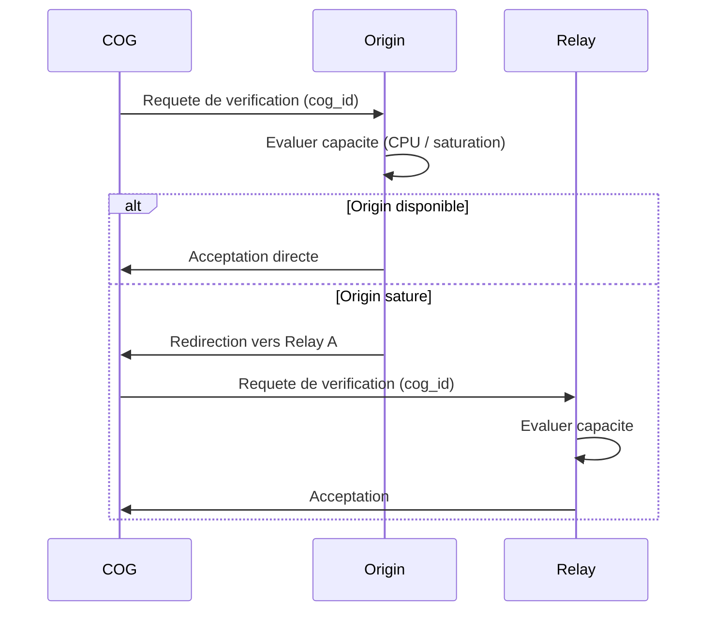
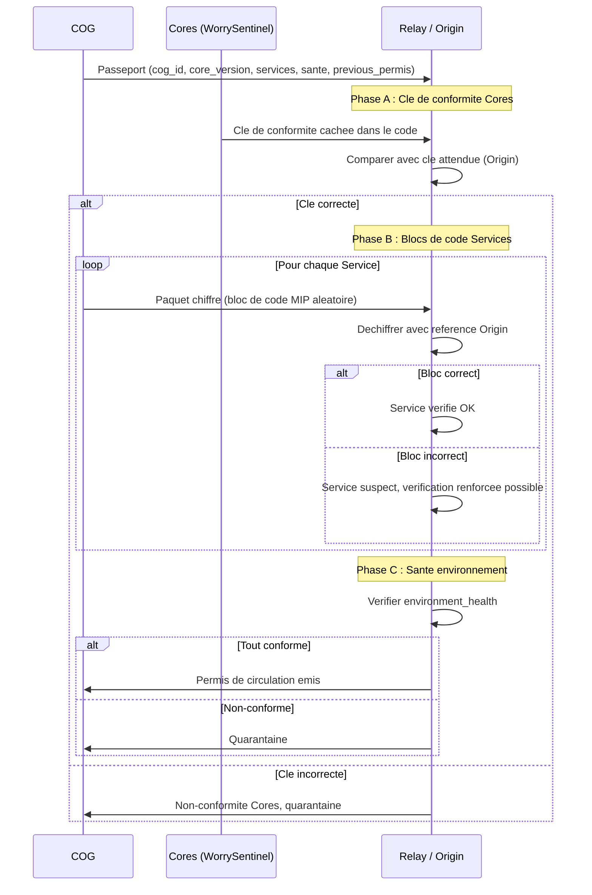
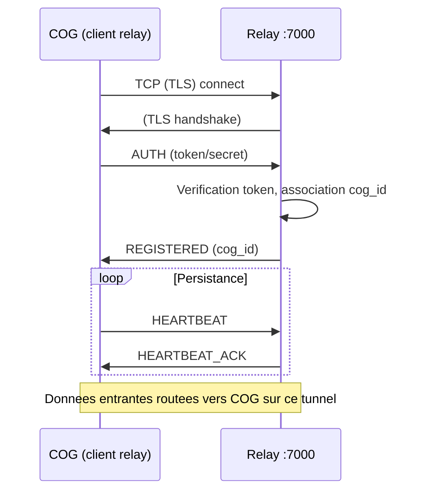
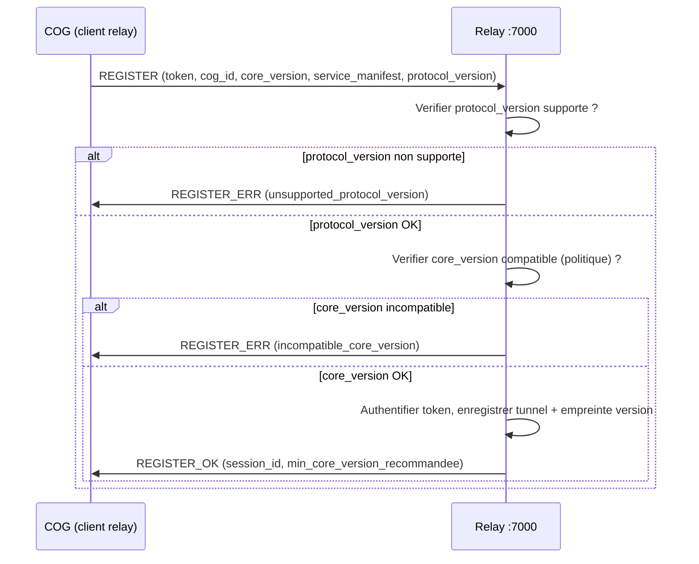
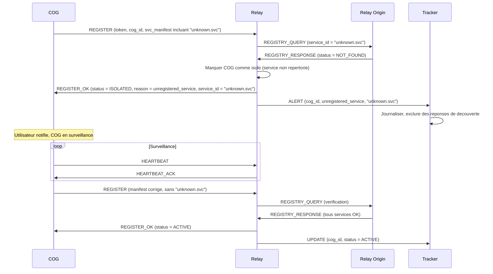
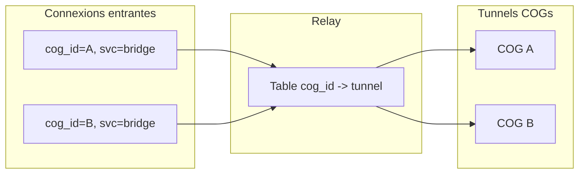

# Miyukini Conceptual References - Miyukini Webway Relay

## Contexte

**Origin** est le point d'origine du Miyukini Webway System (MWS). Origin possede les fonctions de **relay** et de **tracker** ; il est la source de verite unique de l'ecosysteme. Les **relays** sont des duplications d'Origin, sous l'autorite d'Origin, qui garantissent la conformite des COGs, la maintenance des environnements et la distribution des versions. Les **trackers** assurent les connexions entre COGs et leur securite par des controles d'identite et **contrôle tracker** (verification du Permis de circulation), comme un douanier. Ce document decrit l'architecture du relay et du maillage MWS : Origin, relays, trackers, flux de verification, passeports, permis de circulation (accord relay), quarantaine, securite et robustesse.

**Principes fondamentaux :**

- **Origin** est le point d'entree initial de tout COG sur le MWS. Il a les fonctions de relay et de tracker.
- Les **relays** sont des duplications d'Origin sous son autorite. Ils garantissent la conformite en substance des COGs, la maintenance des environnements et la distribution des versions (mises a jour). Ils possedent la liste officielle des services disponibles aux COGs.
- Les **trackers** assurent les connexions entre COGs et en assurent la securite par des controles d'identite et **contrôle tracker** (douaniers du reseau). Ils possedent et gerent les whitelists, blacklists et quarantaines. Ils dirigent des **pools par version des Cores** pour ne jamais connecter des COGs avec des versions differentes.
- Un COG se presente d'abord a Origin ; si Origin est sature, il redirige vers un relay jusqu'a ce qu'un relay accepte la verification.
- La verification repose sur le **Passeport COG**, la **cle de conformite des Cores** et la **verification par blocs de code** (au sens MIP) des Services.
- En cas de conformite, un **Permis de circulation** (accord relay) est emis. En cas de non-conformite, une **quarantaine** progressive s'applique.

## Portee / Scope

- **Origin, Relays, Trackers** : architecture complete du MWS, fonctions de chaque acteur, topologie.
- **Flux de verification complet** : presentation a Origin, Passeport COG, verification en trois phases (cle Cores, blocs de code Services, sante environnement), Permis de circulation (accord relay).
- **Passeports speciaux** : COGs professionnels/fort trafic, controle allege/renforce.
- **Quarantaine et escalade** : escalade progressive (1h, 2h, blacklist), alerte reseau, confinement.
- **COG blackliste** : auto-destruction, ping Origin, reconstruction, retrait de la blacklist.
- **Verite distribuee d'Origin** : le relay heberge une copie des criteres Origin, les diffuse aux COGs et aux Trackers.
- **Separation des roles** : Origin (source de verite), relays (duplication, verification, accord relay), trackers (douaniers, pools, contrôle tracker).
- **Protocole d'enregistrement** : COG -> relay, authentification par token/secret, enregistrement du tunnel.
- **Routing** par `cog_id` : multi-COG, multi-service, isolation des tunnels.
- **Versioning COG** : empreinte de version (Cores + Services), verification de compatibilite, mise a jour.
- **Relay Origin et Registre de Services** : source de verite, registre officiel et tiers, redirection, isolation des services non repertories, suivi des mises a jour.
- **Mode d'urgence reseau** : confinement, lecture seule, reconstruction progressive.
- **Chiffrement** : politique de chiffrement obligatoire avec exemption temps reel.
- **Securite** : TLS, authentification, isolation, rate limiting, audit, gestion des secrets.
- **Robustesse** : reconnexion, timeouts, backpressure, arret propre (graceful shutdown).
- **Migration COG pere/fils** : parentalite, archivage DB par strates, migration vers COG fils, renforcement du Passeport.
- **Surface de connexion** : surface stricte, rejet hors surface, limite 100 connexions simultanees (hors ports 80/8080), serveur web embarque.
- **Services web** : catalogue et **Lobbys** des trackers (port 80), presentation des surfaces au tracker, chemins client→hôte, **Lobbys prives** (mot de passe, 5 echecs puis ban, de-ban manuel), **accord d'hôte**, **favoris**, **amis entre COGs** ; site web des relays et Origin.
- **Integration MWS** : adresses annoncees (relay_host:port + token), decouverte via Tracker.

Ce document **ne specifie pas** le format binaire des messages du protocole relay ; cela releve de [Miyukini Webway Relay Protocol](./Miyukini%20Conceptual%20References%20-%20Miyukini%20Webway%20Relay%20Protocol.md).

---

## 1. Vue d'ensemble : Origin, Relays, Trackers

### 1.1 Origin : le point d'origine du MWS

**Origin** est le point d'origine du Miyukini Webway System. Il possede les fonctions de **relay** et de **tracker** :

| Fonction | Description |
|----------|-------------|
| **Fonction relay** | Verification de conformite des COGs, maintenance des environnements, distribution des versions et mises a jour, hebergement du Registre de Services officiel. |
| **Fonction tracker** | Gestion des connexions entre COGs, controle d'identite et **contrôle tracker**, gestion des whitelists/blacklists/quarantaines, pools par version des Cores. |
| **Source de verite unique** | Toutes les versions des Cores, Services officiels, checksums, politiques de conformite et passeports speciaux emanent d'Origin. |
| **Point d'entree initial** | Tout COG se presente d'abord a Origin pour sa premiere verification. Si Origin est sature (puissance de calcul / saturation), il redirige vers un relay. |

### 1.2 Relays : duplications d'Origin

Les relays sont des **duplications d'Origin**, sous l'autorite d'Origin. Chaque relay heberge une copie de la verite d'Origin et peut effectuer les memes verifications de conformite.

| Capacite | Description |
|----------|-------------|
| **Verification de conformite** | Verifier le Passeport COG, la cle de conformite des Cores, les blocs de code des Services, la sante de l'environnement. |
| **Liste officielle des services** | Le relay possede la liste officielle des services disponibles aux COGs, heritee d'Origin. |
| **Versions distribuees** | Le relay possede les versions distribuees par Origin pour distinguer un probleme de version d'une non-conformite (notification de mise a jour vs alerte). |
| **Distribution des mises a jour** | Distribuer les mises a jour des Services officiels et mettre a disposition les nouvelles versions des Cores. |
| **Transport et routing** | Accepter les tunnels des COGs, router le trafic, isolation par `cog_id`. |

### 1.3 Trackers : les douaniers du reseau

Les trackers assurent les **connexions entre COGs** et en assurent la securite par des controles d'identite et **contrôle tracker**, comme un **douanier** a une frontiere.

| Capacite | Description |
|----------|-------------|
| **Contrôle d'identite et contrôle tracker** | Verifier que le COG possede un Permis de circulation valide delivre par un relay (accord relay) avant de le laisser se connecter au maillage. |
| **Whitelists / Blacklists / Quarantaines** | Gerer les listes d'autorisation, d'exclusion et de quarantaine pour le reseau. |
| **Pools par version des Cores** | Diriger des **pools** separes par version des Cores pour ne **jamais** connecter des COGs avec des versions differentes entre eux. |
| **Monitoring et congestion** | Journaliser et monitorer l'etat du reseau, detecter les points de congestion. Si un COG accumule beaucoup de connexions, renforcer la surveillance. |
| **Fermeture de connexions** | Pouvoir fermer tout ou partie des connexions pour circonscrire une attaque, en fonction des annonces des relays. |

### 1.4 Topologie : Origin, Relays, Trackers, COGs

```mermaid
flowchart TB
    subgraph Origin["Origin (relay + tracker)"]
        O[Origin]
        OR[Registre officiel + Verite]
        O --- OR
    end

    subgraph Relays["Relays (duplications d'Origin)"]
        R1[Relay A]
        R2[Relay B]
    end

    subgraph Trackers["Trackers (douaniers)"]
        T1[Tracker 1]
        T2[Tracker 2]
    end

    subgraph COGs["COGs"]
        C1[COG 1]
        C2[COG 2]
        C3[COG 3]
    end

    C1 -->|1. Presentation initiale| O
    O -.->|Sature : redirection| R1
    C1 -->|2. Verification| R1
    R1 -->|3. Permis de circulation delivre| C1
    C1 -->|4. Connexion (contrôle tracker)| T1
    T1 -->|5. Pool version| C2
    T1 -->|5. Pool version| C3
    O -->|Verite distribuee| R1
    O -->|Verite distribuee| R2
    R1 -.->|Annonces securite| T1
    R2 -.->|Annonces securite| T2
```

---

## 2. Flux de presentation et verification d'un COG

### 2.1 Etape 1 : Presentation a Origin

Le COG se presente a Origin avec son **identite** et sa **requete de verification**. Origin evalue sa capacite a prendre en charge la requete :

- **Si Origin peut traiter** (puissance de calcul suffisante, pas de saturation) : il accepte la requete et effectue la verification directement.
- **Si Origin est sature** : il redirige le COG vers un **relay** parmi les relays disponibles, jusqu'a ce qu'un relay accepte de prendre en charge la verification.



### 2.2 Etape 2 : Transmission du Passeport COG

Quand la requete est acceptee, le COG transmet son **Passeport COG** complet :

| Champ du Passeport | Description |
|---------------------|-------------|
| `cog_id` | Identifiant unique du COG |
| `core_version` | Version des Cores (`MAJOR.MINOR`) |
| `service_list` | Liste des Services installes avec versions et checksums |
| `environment_health` | Rapport de sante de l'environnement (genere par les Cores : WorrySentinel, KeeperOfStorage) |
| `previous_permis` | Historique des Permis de circulation precedents (duree, portee, relay emetteur) |
| `passport_type` | Type de passeport : `STANDARD` ou `SPECIAL` (voir section 2.6) |
| `special_key` | (Passeports speciaux uniquement) Cle speciale delivree par Origin |

### 2.3 Etape 3 : Verification par le relay

Le relay verifie les informations du Passeport en trois phases :

#### Phase A : Verification de la cle de conformite des Cores

Les Cores du COG envoient une **cle de conformite de version** cachee dans le code. Puisque le COG provient normalement d'Origin, cette cle est connue du relay (heritee d'Origin) et permet de verifier que les Cores sont authentiques et non modifies.

| Verification | Description |
|--------------|-------------|
| Le relay possede la cle attendue pour la `core_version` declaree | Heritee d'Origin, stockee dans le cache du relay |
| Le COG transmet la cle cachee dans le code des Cores | Generee par les Cores eux-memes, non accessible depuis l'exterieur |
| **Concordance** = Cores authentiques | La cle transmise correspond a la cle attendue |
| **Discordance** = Cores potentiellement corrompus ou falsifies | Non-conformite, declenchement du protocole de quarantaine |

#### Phase B : Verification par blocs de code des Services

Chaque Service du COG envoie un **paquet de fonctionnement chiffre** contenant un **bloc de code** (au sens du MSCM/MIP) choisi **aleatoirement** parmi les blocs de code du Service :

1. Le relay selectionne ou recoit un bloc de code aleatoire du Service.
2. Le relay tente de **dechiffrer** le bloc en utilisant les references de la version connue du Service (heritees d'Origin).
3. Si le relay dechiffre le **bon bloc de code** = le Service est authentique et execute un code non corrompu (au moins sur le bloc verifie).
4. En cas de **doute**, la verification peut etre etendue a **tout le code** du Service (securite renforcee).

> **Note :** Le relay possede les versions distribuees par Origin. Si la version du Service est simplement en retard (non-courante mais valide), le relay ne declenchera **pas** une alerte de non-conformite mais une **notification de mise a jour**. Un COG a le droit de garder volontairement une version anterieure de ses Cores, mais il ne pourra utiliser que les Services qui lui sont compatibles.

#### Phase C : Verification de la sante de l'environnement

Le relay verifie le rapport de sante (`environment_health`) transmis par les Cores pour s'assurer de l'integrite globale de l'environnement (pas de corruption de stockage, configuration coherente, strates intactes).

### 2.4 Diagramme de la verification complete



### 2.5 Resultat de la verification

| Resultat | Action |
|----------|--------|
| **Conforme** | Un **Permis de circulation** (accord relay) est emis pour une duree et une portee limitees par les intentions du COG (voir section 2.7). Le COG peut se connecter au Webway via les trackers (contrôle tracker). |
| **Version en retard (mais valide)** | Pas d'alerte de non-conformite. Une **notification de mise a jour** est envoyee. Le COG garde volontairement sa version et n'utilise que les services compatibles. |
| **Non-conforme** | Le COG est mis en **quarantaine** (voir section 2.8). |

### 2.6 Passeports speciaux (usage professionnel / fort trafic)

Certains COGs peuvent posseder un **Passeport special** delivre par Origin avec un protocole specifique. Cela concerne les COGs a usage **professionnel** ou a **fort trafic**.

| Caracteristique | Description |
|----------------|-------------|
| **ID speciale** | Identifiant unique renforce delivre par Origin |
| **Cle speciale** | Cle cryptographique speciale delivree par Origin, attestant le statut professionnel |
| **Controle allege au quotidien** | Verification simplifiee lors des connexions courantes pour gagner en performance |
| **Controle renforce lors des audits** | Verifications approfondies planifiees ou declenchees par le reseau |
| **Cas d'usage** | Sites de grandes entreprises, serveurs de services, jeux MMO, services a fort trafic |
| **Principe** | Gagner en **performance** au detriment de la securite quotidienne, dans une optique d'utilisation intense et optimale des services du COG hote |
| **Facilites de connexion** | Integrent des facilites de connexion a leurs services avec les risques assumes |
| **Protocole de delivrance** | Delivre par Origin avec un protocole specifique d'attestation et d'audit prealable |

### 2.7 Permis de circulation (accord relay)

En cas de conformite, un **Permis de circulation** (accord relay) est emis :

| Champ du Permis | Description |
|-----------------|-------------|
| `permis_id` | Identifiant unique du permis |
| `cog_id` | COG concerne |
| `issued_by` | Relay ou Origin emetteur |
| `issued_at` | Date et heure d'emission |
| `expires_at` | Date et heure d'expiration |
| `scope` | Portee du permis (intentions declarees par le COG : services a utiliser, COGs a contacter) |
| `core_version` | Version des Cores validee |
| `passport_type` | STANDARD ou SPECIAL |
| `tracker_addresses` | Liste des adresses des **trackers officiels/sûrs** (connus d'Origin) ; le COG ne peut et ne doit se connecter qu'a ces trackers. |

Le Permis est **valable sur tout le reseau** accessible au COG qui le presente. Avec le Permis, le relay remet les **adresses des trackers officiels** ; un COG **ne peut pas et ne doit pas** se connecter a un tracker inconnu d'Origin. Les trackers effectuent le **contrôle tracker** (verification du Permis de circulation) avant d'autoriser les connexions.

### 2.8 Non-conformite : quarantaine et escalade

En cas de non-conformite du COG :

| Etape | Delai | Action |
|-------|-------|--------|
| **1ere non-conformite** | Quarantaine **1 heure** | Le COG est isole. Le reseau est informe. L'action est journalisee. Le COG peut retenter apres le delai. |
| **2eme non-conformite** | Quarantaine **2 heures** (x2) | Idem, delai double. |
| **3eme non-conformite** | **Blacklistage** | Le COG et son IP sont **blacklistes pour tout le reseau**. Le COG est identifie comme corrompu (voir section 2.9). |

#### Alerte reseau en cas d'attaque

Si **plusieurs COGs sont rejetes dans un tres court laps de temps**, une alerte est envoyee au reseau (trackers et relays) pour :

1. **Circonscrire l'attaque ou la corruption** : les relays et trackers renforcent immediatement les controles.
2. **Controle renforce obligatoire** de tous les COGs connectes au reseau.
3. **Fermeture possible de toutes les connexions inter-COG** : les trackers peuvent fermer tout ou partie des connexions.
4. **Origin et relays restent accessibles en lecture seule** avec leurs fonctions de verification. Les COGs ne peuvent plus echanger de donnees entre eux, mais peuvent se re-verifier.
5. **Reconstruction progressive** : les COGs valides reconstruisent le reseau petit a petit en se re-verifiant aupres des relays.

### 2.9 COG blackliste : auto-destruction et reconstruction

Un COG dont l'ID est **blacklistee** suit un protocole de remediation :

1. **Identification comme corrompu** : le COG s'identifie comme corrompu.
2. **Auto-destruction** : un protocole supprime **toutes les strates jusqu'aux Cores**. Le contenu est vide.
3. **Ping Origin** : le Core de securite (WorrySentinel/Border Guard) **ping Origin** des qu'une connexion Internet est disponible, en transmettant son etat actuel.
4. **Remise en conformite** : Origin fournit les instructions pour restaurer le COG dans sa **version d'origine** (rebuild de l'environnement a partir de la version des Cores du COG).
5. **Retrait de la blacklist** : si le COG retrouve un etat de conformite valide apres reconstruction, il est **retire de la blacklist** et peut se re-presenter normalement.

---

## 3. Roles detailles et verite distribuee d'Origin

### 3.1 Origin comme source de verite

Origin heberge et distribue a tous les relays :

| Element de verite | Description |
|-------------------|-------------|
| **Registre de Services** | Liste officielle de tous les services disponibles aux COGs (officiels + tiers repertories), avec checksums, versions, URLs. |
| **Versions des Cores** | Toutes les versions des Cores, cles de conformite associees, historique, seuils minimaux. |
| **References de blocs de code** | Blocs de code de reference (au sens MIP) de chaque Service, pour la verification par blocs aleatoires. |
| **Politiques de conformite** | Criteres de securite, seuils de quarantaine, regles de blacklistage. |
| **Passeports speciaux** | Registre des COGs avec Passeport special (ID, cle speciale, niveau de controle). |

### 3.2 Separation des roles : Origin / Relay / Tracker

| Responsabilite | Origin | Relay | Tracker |
|---------------|--------|-------|---------|
| **Verification de conformite** (Passeport, Cores, Services) | **Oui** (reference) | **Oui** (duplication) | **Non** |
| **Delivrance de Permis de circulation (accord relay)** | **Oui** | **Oui** | **Non** (verification seulement) |
| **Delivrance de Passeports speciaux** | **Oui** (exclusif) | Non | Non |
| **Distribution des mises a jour** | **Oui** (source) | **Oui** (relais) | Non (redirige vers relay) |
| **Registre de Services officiel** | **Oui** (maitre) | **Oui** (copie synchronisee) | Non |
| **Contrôle d'identite et contrôle tracker** | Oui | Oui | **Oui** (role principal) |
| **Gestion des whitelists / blacklists** | **Oui** (maitre) | Oui (copie synchronisee) | **Oui** (application locale) |
| **Quarantaine** | Oui | Oui | **Oui** (application) |
| **Pools par version des Cores** | Non | Non | **Oui** (exclusif) |
| **Monitoring reseau / congestion** | Non | Partiel | **Oui** (role principal) |
| **Fermeture de connexions (confinement)** | Non | Annonces d'alerte | **Oui** (execution) |
| **Connexions entre COGs** | Non | Transport (tunnel) | **Oui** (passerelle, decouverte) |

### 3.3 Politique de chiffrement

Les donnees et interactions entre les relays, les trackers et les COGs sont **chiffrees par defaut** (TLS). Une exception est prevue pour les scenarios necessitant une vitesse **temps reel** :

| Mode | Chiffrement | Cas d'usage |
|------|-------------|-------------|
| **Standard** (defaut) | **TLS obligatoire** (TLS 1.2+, PFS) sur toutes les connexions : relay, tracker, inter-COG. | Enregistrement, verification, decouverte, echanges de donnees, mises a jour, toute interaction MWS. |
| **Temps reel** (exception) | Chiffrement **optionnel** sur le canal de donnees (DATA), apres negociation explicite entre les deux COGs. Le canal de controle reste **toujours chiffre TLS**. | Jeu multijoueur, streaming audio/video en direct, interactions necessitant une latence minimale. |

**Regles :**

1. **Le canal de controle est toujours chiffre TLS** : aucune exception.
2. **Le canal de donnees (DATA) est chiffre TLS par defaut**. L'exemption temps reel n'est possible que si :
   - Les deux COGs ont **prealablement negocie** l'exemption via le canal de controle chiffre.
   - Les deux COGs possedent un **Permis de circulation valide** et ont ete verifies par un relay (accord relay).
   - Le flux non chiffre est **ephemere** (session limitee dans le temps).
   - L'utilisateur est **explicitement informe** du mode non chiffre.
   - Les COGs avec **Passeport special** peuvent negocier l'exemption plus facilement (risques assumes).
3. **Journalisation** : toute session en mode temps reel non chiffre est journalisee.

### 3.4 Mode d'urgence reseau

En cas d'alerte reseau (multiples rejets simultanes, attaque detectee) :

| Phase | Etat | Description |
|-------|------|-------------|
| **Alerte** | Annoncee par relays | Les relays et trackers renforcent immediatement les controles. Controle renforce obligatoire de tous les COGs connectes. |
| **Confinement** | Execute par trackers | Les trackers peuvent fermer **tout ou partie** des connexions inter-COG pour circonscrire l'attaque ou la corruption. |
| **Lecture seule** | Origin + relays | Origin et relays restent accessibles en **lecture seule** avec leurs fonctions de verification. Les COGs ne peuvent plus echanger de donnees entre eux mais peuvent se re-verifier. |
| **Reconstruction** | Progressive | Les COGs valides (re-verifies) reconstruisent le reseau petit a petit. Chaque COG se re-presente a un relay, obtient un nouveau Permis de circulation (accord relay), et rejoint le maillage. |

---

## 4. Protocole d'enregistrement (COG -> relay)

### 4.1 Sequence d'enregistrement

1. **Connexion** : le COG etablit une connexion TCP (recommande : TLS) vers `relay_host:7000`.
2. **Handshake / authentification** : le relay exige une authentification (token et/ou secret). Le COG envoie les informations d'authentification selon le protocole relay (voir [Miyukini Webway Relay Protocol](./Miyukini%20Conceptual%20References%20-%20Miyukini%20Webway%20Relay%20Protocol.md)).
3. **Enregistrement du tunnel** : le COG declare son `cog_id` (et eventuellement des identifiants de service). Le relay associe la connexion (tunnel) a ce `cog_id` dans sa table de routage.
4. **Persistance** : la connexion reste ouverte. Le COG peut envoyer des **heartbeats** pour maintenir le tunnel et detecter les deconnexions.
5. **Donnees** : le trafic entrant destine a ce `cog_id` est transmis sur ce tunnel ; le trafic sortant du COG vers le relay peut etre multiplexe selon le protocole (controle vs donnees).

### 4.2 Flux d'enregistrement (schema)



### 4.3 Authentification

- **Token** : identifiant opaque (ex. derive d'un secret partage) permettant au relay d'accepter l'enregistrement et d'associer le tunnel a un `cog_id`. Le `cog_id` peut etre fourni dans le message d'enregistrement ou derive du token selon l'implementation.
- **Secret** : pour renforcer l'authentification, un secret partage (ou une preuve derivee) peut etre exige en plus du token, afin de limiter l'usurpation et le replay.
- **Un tunnel actif par `cog_id`** : en general, un seul tunnel enregistre par `cog_id` a la fois ; une nouvelle enregistrement pour le meme `cog_id` peut remplacer l'ancien (reconnexion).

---

## 5. Versioning COG et compatibilite

### 5.1 Principe : Cores immuables, Services patchables

Le modele de versioning des COGs repose sur une separation fondamentale :

- **Version des Cores** : les Cores (Border Guard, WorrySentinel, StrongFather, BondingBrother, KindMother, KeeperOfStorage, Master Butler, Ever Buddy) sont **immuables** a version donnee. La version des Cores definit le socle de gouvernance et de securite du COG. Deux COGs ne peuvent interagir que s'ils partagent la **meme version majeure des Cores**.
- **Version des Services** : les Services (Operateurs, Outils, Kits d'Outils) peuvent etre **patches** independamment des Cores. Un Service peut recevoir des correctifs (patch) ou des mises a jour mineures sans modifier les Cores. Differentes versions de Services restent compatibles tant que la version des Cores est identique.

> **Regle fondamentale :** La compatibilite entre COGs est determinee par la version des Cores. Les Services sont interchangeables/patchables a Cores identiques.

### 5.2 Empreinte de version COG

Chaque COG qui se presente au relay (ou au Tracker) fournit une **empreinte de version** (COG Version Fingerprint) dans sa declaration :

| Champ | Format | Description |
|-------|--------|-------------|
| `core_version` | `MAJOR.MINOR` (ex. `1.0`) | Version des Cores. Seul le MAJOR determine la compatibilite stricte ; le MINOR indique des ajustements internes compatibles. |
| `service_manifest` | Liste de `{service_id, version}` | Versions des Services actifs du COG (ex. `[{"svc": "webway.tracker", "ver": "1.2.3"}, {"svc": "bridge", "ver": "2.0.1"}]`). |
| `protocol_version` | entier (ex. `1`) | Version du protocole relay ou MWS utilise par le COG. |
| `build_id` | chaine opaque (optionnel) | Identifiant de build ou hash du deploiement (pour tracabilite, pas de compatibilite). |

L'empreinte de version est transmise dans le message **REGISTER** (relay) ou dans la **declaration de presence** (Tracker MWS). Voir [Miyukini Webway Relay Protocol](./Miyukini%20Conceptual%20References%20-%20Miyukini%20Webway%20Relay%20Protocol.md) section 4 pour le format binaire.

### 5.3 Verification de compatibilite au relay

Lors de l'enregistrement d'un tunnel, le relay effectue les verifications suivantes :

1. **Version du protocole relay** : le relay verifie que le `protocol_version` declare par le COG est supporte. Si la version n'est pas supportee, le relay repond **REGISTER_ERR** avec le code `unsupported_protocol_version`.

2. **Version des Cores** : le relay peut optionnellement verifier la `core_version` declaree par le COG. Si le relay applique une politique de compatibilite (ex. n'accepter que les COGs avec `core_version.MAJOR >= N`), il rejette les COGs non conformes avec le code `incompatible_core_version`.

3. **Informations de version dans la table de routage** : le relay stocke l'empreinte de version du COG dans la table de routage, aux cotes du `cog_id` et du tunnel. Ces informations peuvent etre consultees par un appelant (via le relay, si le protocole le prevoit) pour verifier la compatibilite **avant** d'initier un echange de donnees.

### 5.4 Verification de compatibilite au Tracker

Le Tracker effectue une verification plus approfondie car il gere la **decouverte** et la **liste de COGs avec statuts** :

1. **Validation de l'empreinte de version** : toute annonce de presence inclut l'empreinte de version. Le Tracker valide la coherence des champs (format correct, `core_version` non vide, `protocol_version` supporte).

2. **Compatibilite des Cores** : le Tracker **doit** verifier que la `core_version.MAJOR` du COG annonceur est compatible avec les COGs deja presents dans la liste. Les reponses de decouverte peuvent etre filtrees par compatibilite de `core_version.MAJOR` : un COG demandeur recoit uniquement les COGs avec lesquels il peut interagir (memes Cores).

3. **Enregistrement des versions** : la liste locale de COGs avec statuts inclut l'empreinte de version (ou au minimum la `core_version` et la `protocol_version`). Cela permet le filtrage par version dans les reponses de decouverte.

4. **Signalement de version obsolete** : si un COG se presente avec une `core_version` ou un `protocol_version` depasse(e) (selon la politique locale), le Tracker emet un signalement vers les Cores (WorrySentinel) sans necessairement bloquer (systeme passif). Les systemes actifs peuvent degrader ou bloquer si la politique l'exige.

### 5.5 Compatibilite des Services

Les Services (Operateurs, Outils, Kits d'Outils) suivent un **versioning semantique** (`MAJOR.MINOR.PATCH`) :

- **MAJOR** : changement incompatible (nouveau contrat, rupture d'interface).
- **MINOR** : ajout de fonctionnalites compatibles.
- **PATCH** : correctifs, securite, performance, sans changement d'interface.

Regles de compatibilite inter-COG pour les Services :

| Situation | Compatible ? | Action |
|-----------|-------------|--------|
| Meme `core_version.MAJOR`, Services identiques | Oui | Interaction normale |
| Meme `core_version.MAJOR`, Service version PATCH differente | Oui | Interaction normale ; les patchs sont transparents |
| Meme `core_version.MAJOR`, Service version MINOR differente | Oui | Interaction normale ; le service le plus ancien peut ne pas comprendre les fonctionnalites ajoutees (degradation gracieuse) |
| Meme `core_version.MAJOR`, Service version MAJOR differente | Possible | Les deux COGs doivent negocier ; le service appelant annonce la version et le service cible accepte ou refuse |
| `core_version.MAJOR` differente | Non | Interaction refusee ; le relay ou le Tracker peut signaler l'incompatibilite |

### 5.6 Mise a jour et notification de version

- **Source de verite** : le **Relay Origin** est la reference centrale pour les versions des Cores et des Services officiels, ainsi que pour le registre des services tiers. Voir section 6 pour le detail du Relay Origin et du Registre de Services.
- **Annonce de mise a jour** : lorsqu'un COG met a jour un ou plusieurs Services (patch, mise a jour mineure), il peut reenvoyer une declaration de presence au Tracker avec la nouvelle empreinte de version. Le Tracker met a jour la liste locale.
- **Re-enregistrement relay** : si un COG met a jour son `protocol_version` ou sa `core_version`, il **doit** fermer le tunnel existant et se re-enregistrer aupres du relay avec la nouvelle empreinte. Un changement de `protocol_version` peut necessiter un nouveau handshake.
- **Notification de version obsolete** : le relay ou le Tracker peut, dans sa reponse (REGISTER_OK ou reponse de decouverte), indiquer les versions minimales recommandees (`min_core_version`, `min_protocol_version`) pour informer le COG qu'une mise a jour est souhaitable.
- **Redirection vers les sources de mise a jour** : le relay et le Tracker peuvent diriger les COGs vers les sources officielles de mise a jour via le Relay Origin (services officiels : URL de telechargement Miyukini ; services tiers : redirection vers la source officielle de l'editeur).
- **Suivi des mises a jour** : chaque COG dispose d'une capacite de suivi des mises a jour (verification periodique, notifications push, registre local). Voir section 6.5 pour le detail.
- **Pas de mise a jour forcee** : ni le relay ni le Tracker ne forcent la mise a jour d'un COG. Ils peuvent signaler, degrader ou refuser selon la politique, mais la decision de mise a jour reste souveraine au COG.

### 5.7 Diagramme de verification de version (relay)



### 5.8 Migration COG (père/fils) et parentalité

Un COG peut **preparer sa migration** vers un COG aux Cores plus recents (**COG fils**). Seuls les **Services** sont mis a jour avec des versions compatibles aux Cores du COG ; pour beneficier de Cores plus recents, la migration vers un COG fils est le mecanisme prevu.

| Etape | Acteur | Action |
|-------|--------|--------|
| 1 | **COG fils** | Enregistre sa **parentalite** aupres du COG pere (lien parent-enfant declare et verifie). |
| 2 | **COG pere** | **Archive sa base de donnees** en plusieurs fichiers, par strates. |
| 3 | **COG fils** | Installation des versions **compatibles** des Services ; execution de la **migration DB** dans la mesure des compatibilites. |
| 4 | **Reseau** | Les deux COGs conservent leur **propre Passeport** et sont **uniques**. Le COG pere peut continuer a etre utilise mais ne beneficie pas des avantages des COGs plus recents. |

**Effet sur la securite et les controles :**

- Le **lien de parentalite** renforce la securite et la force du Passeport lors des controles.
- Un **COG enfant** d'un COG pere **sûr de longue date** peut passer **plus rapidement** les controles douaniers des trackers (facilitation basee sur la confiance heritee du pere).

La parentalite est enregistree et verifiable par les relays et Origin ; elle n'altère pas l'unicite des identites (chaque COG garde son `cog_id` et son Passeport distincts).

---

## 6. Relay Origin et Registre de Services

### 6.1 Relay Origin : source de verite

Le **Relay Origin** est un relay Webway designe comme la **source de verite** pour le versioning et le registre de services de l'ecosysteme Miyukini. Il joue un role particulier au-dela du transport :

| Capacite | Description |
|----------|-------------|
| **Source de verite des Cores** | Le Relay Origin publie la version officielle des Cores (`core_version` courante, historique, changelog). Tout relay ou Tracker peut interroger le Relay Origin pour connaitre la derniere version des Cores. |
| **Source de verite des Services officiels** | Le Relay Origin publie le catalogue des Services officiels Miyukini (service_id, version courante, hash de verification, URL de telechargement). |
| **Registre des Services tiers** | Le Relay Origin maintient un **Registre de Services** (Service Registry) qui repertorie les services tiers autorises : identifiant, editeur, source officielle de mise a jour, version courante connue. |
| **Redirection vers les sources officielles** | Pour les services tiers repertories, le Relay Origin fournit les **URLs de source officielle** de l'editeur (depot, site) afin que les COGs puissent verifier et telecharger les mises a jour directement depuis la source officielle. |

> **Regle fondamentale :** Un Service ne peut pas etre installe dans un COG connecte au Webway sans etre present dans le Registre de Services du Relay Origin (officiel ou tiers repertorie).

### 6.2 Registre de Services (Service Registry)

Le Registre de Services est maintenu par le Relay Origin et contient deux categories :

#### 5.2.1 Services officiels Miyukini

| Champ | Description |
|-------|-------------|
| `service_id` | Identifiant unique du service (ex. `webway.tracker`, `bridge`, `central.hub`) |
| `current_version` | Version courante officielle (`MAJOR.MINOR.PATCH`) |
| `min_version` | Version minimale acceptee sur le reseau |
| `checksum` | Hash de verification (SHA-256) du binaire ou du package de la version courante |
| `download_url` | URL de telechargement officielle |
| `changelog_url` | URL du journal des modifications |
| `core_compatibility` | Liste des `core_version.MAJOR` compatibles |
| `status` | ACTIVE, DEPRECATED, RETIRED |

#### 5.2.2 Services tiers repertories

| Champ | Description |
|-------|-------------|
| `service_id` | Identifiant unique attribue au service tiers (prefixe `third.` ou namespace editeur) |
| `publisher` | Nom de l'editeur du service tiers |
| `official_source_url` | URL de la source officielle de l'editeur (depot, site) pour verification et mise a jour |
| `current_version` | Derniere version connue du service tiers dans le registre |
| `checksum` | Hash de verification (SHA-256) de la version repertoriee |
| `core_compatibility` | Liste des `core_version.MAJOR` compatibles |
| `review_status` | APPROVED (audite, autorise), PENDING_REVIEW (en attente d'audit), SUSPENDED (temporairement retire) |
| `registration_date` | Date d'enregistrement dans le registre |

### 6.3 Consultation du Registre

Les relays, Trackers et COGs peuvent interroger le Relay Origin pour :

1. **Verifier un service** : le COG (ou le relay/Tracker) envoie un `service_id` et recoit en retour le statut du service dans le registre (present/absent, version courante, source officielle, checksum).
2. **Lister les mises a jour disponibles** : le COG envoie son `service_manifest` et recoit la liste des services pour lesquels une mise a jour est disponible, avec les versions et URLs de telechargement.
3. **Redirection vers les sources tiers** : pour un service tiers, le Relay Origin fournit l'`official_source_url` de l'editeur afin que le COG puisse verifier et telecharger directement depuis la source officielle (le Relay Origin ne distribue pas les binaires tiers, il redirige).

### 6.4 Service non repertorie : detection et isolation

#### 5.4.1 Detection

Lorsqu'un COG se presente au relay ou au Tracker avec un `service_manifest` contenant un service **non present dans le Registre de Services** du Relay Origin :

1. Le relay ou le Tracker identifie le `service_id` inconnu en consultant le Registre (directement ou via un cache local synchronise periodiquement).
2. Le service est marque comme **non repertorie** (`unregistered_service`).

#### 5.4.2 Isolation du COG

Si un service non repertorie est detecte (ex. installe hors ligne sans verification prealable), le Webway applique une **isolation progressive** :

| Etape | Action | Description |
|-------|--------|-------------|
| 1 | **Signalement** | Le relay/Tracker journalise l'evenement (cog_id, service_id non repertorie, horodatage) et emet une alerte vers les Cores du COG concerne (WorrySentinel). |
| 2 | **Notification utilisateur** | Le COG recoit une notification explicite informant l'utilisateur qu'un service non repertorie a ete detecte. Le message inclut : le `service_id` concerne, la raison (absent du Registre), et les actions recommandees (soumettre le service au Registre ou le desinstaller). |
| 3 | **Isolation reseau** | Le Webway **isole** le COG du reseau MWS : le tunnel relay est maintenu en mode **surveillance** (le COG peut recevoir les notifications et consulter le Registre, mais ne peut plus participer au maillage MWS normal -- pas d'annonces de presence, pas de reponses de decouverte, pas de routing de donnees vers d'autres COGs). |
| 4 | **Surveillance continue** | Le relay/Tracker maintient la surveillance du COG isole : heartbeats acceptes, notifications envoyees, verification periodique du `service_manifest` (le COG peut se mettre en conformite et reenvoyer un REGISTER avec un manifest corrige). |
| 5 | **Journalisation reseau** | L'evenement est journalise dans le registre du Relay Origin et communique aux Trackers connectes pour enrichir la surveillance globale du maillage. |
| 6 | **Levee d'isolation** | L'isolation est levee automatiquement lorsque le COG se re-enregistre avec un `service_manifest` conforme (tous les services repertories) ou lorsque le service non repertorie est ajoute au Registre par le processus d'enregistrement officiel. |

#### 5.4.3 Diagramme d'isolation



### 6.5 Suivi des mises a jour des Services par les COGs

Chaque COG connecte au Webway dispose d'une capacite de **suivi des mises a jour** :

#### 5.5.1 Mecanisme

1. **Verification periodique** : le COG interroge periodiquement le Relay Origin (ou un relay/Tracker relayant la requete) pour comparer son `service_manifest` au Registre de Services. Le relay peut inclure les informations de mise a jour dans les reponses HEARTBEAT_ACK ou via un message dedie.

2. **Notification push** : le relay peut envoyer un message **UPDATE_AVAILABLE** au COG via le tunnel actif lorsqu'une mise a jour est disponible pour un ou plusieurs services du manifest du COG. Le COG decide souverainement de l'appliquer ou non.

3. **Contenu de la notification de mise a jour** :

| Champ | Description |
|-------|-------------|
| `service_id` | Service concerne |
| `current_version` | Version installee sur le COG |
| `available_version` | Version disponible dans le Registre |
| `severity` | `critical` (securite), `recommended`, `optional` |
| `download_url` | URL de telechargement (officielle ou redirection source tiers) |
| `checksum` | Hash SHA-256 de la nouvelle version |
| `changelog_url` | URL du journal des modifications |

4. **Decision souveraine du COG** : le COG recoit la notification et decide :
   - **Appliquer** la mise a jour (telecharger, verifier le checksum, installer, se re-enregistrer).
   - **Reporter** la mise a jour (la notification est conservee pour rappel ulterieur).
   - **Ignorer** la mise a jour (le COG reste sur la version actuelle ; si la version devient inferieure au `min_version` du Registre, les consequences de compatibilite s'appliquent).

#### 5.5.2 Mises a jour critiques (securite)

- Si une mise a jour est marquee `critical` (faille de securite, vulnerabilite connue), le relay/Tracker peut appliquer des mesures progressives si le COG ne se met pas a jour dans un delai configure :
  - **Signalement** (immediat) vers WorrySentinel.
  - **Degradation** (apres delai) : throttling, reponses de decouverte limitees.
  - **Isolation** (apres delai prolonge, selon politique) : le COG est isole du maillage comme pour un service non repertorie, jusqu'a mise a jour.

#### 5.5.3 Registre local de versions (cote COG)

Le COG maintient un **registre local de versions** qui stocke :

- La derniere empreinte de version connue (locale).
- La date de derniere verification aupres du Relay Origin.
- Les notifications de mise a jour recues et leur statut (appliquee, reportee, ignoree).
- L'historique des mises a jour appliquees (service_id, ancienne version, nouvelle version, date).

Ce registre permet au COG de gerer ses mises a jour de maniere souveraine et tracable.

---

## 7. Routing par `cog_id` (multi-COG, multi-service)

### 7.1 Table de routage (enrichie version)

Le relay maintient une **table de routage** :

- **Cle** : `cog_id` (et eventuellement un identifiant de service ou de session, selon le protocole).
- **Valeur** : reference au tunnel actif (connexion persistante du COG vers le relay), **empreinte de version** (`core_version`, `service_manifest`, `protocol_version`).

Lorsqu'une connexion entrante (ou un message) arrive avec une cible `cog_id` (et optionnellement service_id), le relay :

1. Consulte la table de routage.
2. Si un tunnel est enregistre pour ce `cog_id`, transmet les donnees (ou etablit le chemin) vers ce tunnel.
3. Sinon, renvoie une erreur (ex. COG non enregistre ou equivalent protocole).

### 7.2 Multi-COG et multi-service

- **Multi-COG** : plusieurs COGs distincts (plusieurs `cog_id`) peuvent s'enregistrer sur la meme instance relay ; chaque COG recoit uniquement le trafic destine a son `cog_id`.
- **Multi-service** : un meme COG peut exposer plusieurs services (ex. Bridge, autre endpoint). Le protocole peut prevoir un niveau supplementaire (ex. `service_id`) dans la cible pour router vers le bon canal logique cote COG ; l'isolation reste garantie par `cog_id`.

### 7.3 Diagramme de routing multi-service



---

## 8. Surface de connexion, limites et service web (COG)

### 8.1 Surface de connexion stricte

Un COG ouvre ses **services aux connexions externes de facon stricte**. Toute connexion **en dehors de la surface** exposee est **systematiquement rejetee**. L'**integrite des Cores et de la base de donnees** est prioritaire : la surface de connexion definit explicitement ce qui est autorise ; tout le reste est refuse.

| Principe | Description |
|----------|-------------|
| **Surface explicite** | Seuls les services et ports declares (annonces, configuration) acceptent des connexions externes. |
| **Rejet hors surface** | Connexion sur un port ou un service non expose = rejet systematique. |
| **Priorite integrite** | Cores et DB ne sont jamais exposes directement ; seuls les Services autorises le sont. |

### 8.2 Limite des connexions simultanees (COG classique)

Un COG peut heberger les services qu'il souhaite. Un **COG classique** (sans Passeport special) ne peut pas avoir **plus de 100 connexions simultanees**, **hors** ports web **80** et **8080**.

| Regle | Description |
|-------|-------------|
| **Plafond 100** | Connexions simultanees (hors ports 80 et 8080) plafonnees a 100 pour un COG classique. |
| **Ports 80 et 8080 exclus** | Les connexions entrantes sur les ports web 80 et 8080 ne sont pas comptees dans cette limite. |
| **Objectif** | Garantir une qualite de suivi des organes de securite ; les COGs ne sont pas des services type torrent. |

Cette limite est suffisante pour la plupart des usages. Les COGs avec **Passeport special** peuvent etre autorises a des plafonds superieurs (voir section 2.6). Les **surfaces exposees au web** (ports 80/8080) ne sont pas soumises aux memes protocoles de securite MWS que le canal de controle, de par leur nature publique ; l'acces web reste gere par le COG (authentification, autorisation applicative).

### 8.3 Serveur web embarque et disponibilite web

Un COG peut **embarquer un serveur web**. Celui-ci permet a certains Services de fonctionner en **headless** et en **permanence**, et de proposer leur service sur des **navigateurs web**.

| Cas d'usage | Description |
|-------------|-------------|
| **Site web, SaaS** | Services necessitant une disponibilite web permanente (site vitrine, application web, portail). |
| **Acces visiteur** | Les utilisateurs « visiteurs » peuvent acceder par navigateur pour faciliter l'acces (ex. COG gerant la disponibilite web de JayFestival). |
| **Facilitation par les trackers** | Les trackers peuvent faciliter l'acces aux COGs ayant une surface web active et publique (catalogue, redirection) ; voir section 9.1. |

Le serveur web embarque est expose sur les ports 80 et/ou 8080 ; il reste soumis a la politique de surface du COG (seuls les Services autorises sont exposes).

---

## 9. Services web des trackers et des relays

### 9.1 Catalogue web des trackers (port 80) — services WEB publics uniquement

Les **trackers** disposent d'un **service web de portail** (port 80) qui presente le **catalogue des services WEB publics** des COGs connectes au reseau, a la maniere d'un **moteur de recherche** ; il gere aussi les **adresses URL**. Le catalogue est **global**, mis a jour et diffuse automatiquement. Les COGs n'ont pas besoin de nom de domaine ni d'IP fixe : le tracker agit comme **facilitateur** et gere les URLs/redirections. Les **Lobbys des autres services COG** (jeu, APIs, etc.) **ne sont pas visibles** depuis ce portail. Le **catalogue de Lobbys** pour chaque type de service est **visible depuis ces memes services** (ex. client jeu, client SaaS) — voir section 9.3.

#### Controle initial et presentation au tracker

Lorsqu'un COG se presente aux trackers, il montre son **Passeport** pour un **controle initial** effectue par un relay (conformite, Permis de circulation / accord relay). Quand **tous les controles sont valides**, le COG presente aux trackers :

| Declaration | Description |
|-------------|-------------|
| **Surfaces de connexion** | Quels services sont concernes, sur quels ports, et si le COG accepte des connexions entrantes. |
| **Surfaces web publiques** | Services web exposes au catalogue du portail (port 80). |
| **Attentes et desirs** | Ce que le COG propose (ex. service de jeu, SaaS, portail) et eventuellement ce qu'il cherche a joindre. |

Si le COG **accepte des connexions** pour certains **services** et sur certains **ports**, cela cree un **Lobby** dans le **catalogue de Lobbys** tenu par le tracker. Ce catalogue **n'est pas affiche sur le portail web** : les Lobbys sont **visibles et joignables depuis les services COG** concernes (voir section 9.3). Un **Lobby** est une entree : COG hôte, services exposes, ports, visibilite (publique ou privee).

#### Pool par version des Cores et chemins

Le tracker expose la **pool des COGs connectes** en fonction de la **version des Cores** du COG entrant (client). Il **indique les chemins** aux COGs clients pour se connecter aux COGs hôtes (adresses relay, tunnel, ou direct selon la topologie). Le tracker tient le **catalogue de Lobbys** (Lobbys de services exposes) ; ce catalogue est consulte par les **services COG** (pas par le portail web du tracker).

### 9.2 Lobbys prives (mot de passe, ban, de-ban)

Certaines expositions ou **Lobbys peuvent etre prives** et exiger un **mot de passe** pour y acceder.

| Regle | Description |
|-------|-------------|
| **Acces prive** | Le COG hôte peut proteger un Lobby par mot de passe. Le COG client doit fournir le mot de passe pour rejoindre. |
| **Limite d'echecs** | **5 echecs maximum** (mot de passe incorrect) ; au-dela, le **COG client est banni** de ce Lobby. |
| **Notification** | En cas de ban, **notification a l'utilisateur du COG hôte** (proprietaire du Lobby). |
| **De-ban** | **De-ban manuel uniquement** par l'utilisateur du COG hôte ; aucun de-ban automatique. |

Le tracker journalise les tentatives et les bans pour tracabilite et alerte le COG hôte.

### 9.3 Flow client–hôte : accord d'hôte, consommation, favoris

**Cote utilisateur (depuis le service du COG client) :**

1. L'utilisateur voit la **liste des Lobbys concernes** distribuee par le tracker (filtree par service, par version des Cores, par visibilite).
2. Il **cherche ou trouve le COG hôte** qu'il desire joindre.
3. Le **COG client se connecte au COG hôte** en suivant les **protocoles de securite** (Permis de circulation, puis autorisation hôte).
4. Il **consomme les services exposes** grace à l'**accord d'hôte** delivre par le COG hôte : le COG hôte emet un accord d'hôte (ou mandat) autorisant ce client a utiliser les services du Lobby. L'accord d'hôte est distinct du Permis de circulation (accord relay) ; il regit l'acces aux ressources du hôte.
5. L'utilisateur peut **ajouter le COG hôte en « favoris »** pour le retrouver plus vite dans les listes du tracker.

| Concept | Description |
|---------|-------------|
| **Permis de circulation (accord relay)** | Delivre par le relay/Origin ; autorise le COG a circuler sur le Webway et a se presenter aux trackers (contrôle tracker). |
| **Accord d'hôte** | Delivre par le **COG hôte** ; autorise le COG client a consommer les services exposes par ce hôte (Lobby). |
| **Favoris** | Liste locale (cote client) ou signalee au tracker : COGs hôtes que l'utilisateur souhaite retrouver rapidement. |

### 9.4 Amis entre COGs

Une fonctionnalite **« amis »** entre COGs permet de connecter **deux COGs plus rapidement**, avec des **protocoles de controle allegees** et une **periodicite de re-verification plus longue**.

| Caracteristique | Description |
|-----------------|-------------|
| **Demande et confirmation humaines** | Les demandes d'amis et leur confirmation sont **humaines** : initiees et acceptees par les utilisateurs (pas d'acceptation automatique). |
| **Controles allegees** | Une fois « amis », les controles douaniers (tracker) et d'acces (hôte) peuvent etre **alleges** pour ces paires (confiance explicite). |
| **Periodicite** | La periodicite de re-presentation ou de renouvellement de preuves peut etre **plus longue** que pour les COGs non amis. |
| **Noms / pseudos** | Les COGs peuvent exposer les **noms ou pseudos de leurs utilisateurs** pour faciliter la reconnaissance (affichage dans les listes, demandes d'amis). |

Les COGs amis restent soumis aux regles de surface et de securite ; la relation « amis » est une **facilitation** contractuelle entre deux environnements, pas un contournement des Cores.

### 9.5 Site web des relays et d'Origin

Les **relays** et **Origin** exposent un **serveur web** permettant de consulter la **presentation de l'ensemble du projet Miyukini COG** sur un **site dynamique**.

| Contenu | Description |
|---------|-------------|
| **Presentation du projet** | Presentation globale du projet Miyukini COG. |
| **Documentation** | Acces a la documentation officielle. |
| **Telechargement des versions** | Telechargement des versions des COGs (Cores, images, packages officiels). |
| **Dev blog** | Affichage du blog de developpement et des actualites. |
| **Annonces globales** | Emission des annonces globales (nouvelles versions des Cores, alertes, communications officielles). |

Les relays sont **source de verite** pour ces contenus mais restent **toujours subordonnes a Origin** : Origin publie le contenu de reference ; les relays le diffusent et le mettent a disposition.

---

## 10. Securite

> **Principe fondamental :** Le relay est un composant critique expose sur Internet. Toute faiblesse dans le transport, l'authentification ou l'isolation peut compromettre la joignabilite et la confidentialite des COGs connectes. La securite du relay est **non negociable**.

### 10.1 TLS (chiffrement en transit)

- **TLS obligatoire** : toutes les connexions (COG -> relay et appelant -> relay) **doivent** etre chiffrees TLS (minimum TLS 1.2, recommande TLS 1.3). Aucun mode plaintext n'est accepte sur le port du relay.
- **Certificat serveur** : le relay expose un endpoint TLS (port 7000 par defaut) avec un certificat signe par une CA (recommande : Let's Encrypt) ou auto-signe pour les environnements de test.
- **Validation du certificat cote client** : les COGs et appelants **doivent** valider le certificat du relay (chaine de confiance, nom de domaine) pour se premunir contre les attaques MITM. En cas de certificat auto-signe, le certificat doit etre distribue et epingle (certificate pinning) dans la configuration du client.
- **Cipher suites** : seules les cipher suites jugees sures au moment du deploiement sont activees. Les suites faibles ou deprecees (ex. RC4, 3DES, TLS_RSA_*) **doivent** etre desactivees.
- **Forward secrecy** : les cipher suites avec **Perfect Forward Secrecy (PFS)** (ECDHE, DHE) sont **obligatoires** pour proteger les sessions passees en cas de compromission de la cle privee du serveur.

### 10.2 Authentification

- **Token d'authentification** : seuls les clients possedant un token valide peuvent enregistrer un tunnel pour un `cog_id`. Le token est un identifiant opaque (suffisamment long et aleatoire, minimum 256 bits d'entropie recommandes) associe au `cog_id` cote relay.
- **Secret complementaire (optionnel, recommande)** : un secret partage (ou une preuve derivee type HMAC challenge-response) peut etre exige en plus du token pour renforcer l'authentification et limiter l'impact d'une fuite de token.
- **Pas d'authentification par IP** : l'autorisation repose **uniquement** sur le token/secret, jamais sur l'adresse source. Les adresses IP peuvent changer (NAT, mobile, VPN).
- **Replay protection** : le protocole relay **doit** prevoir des garde-fous contre la reutilisation de messages d'authentification :
  - **Nonce** : chaque message AUTH inclut un nonce unique pour empecher le rejeu.
  - **Timestamp** : horodatage dans le message AUTH avec une fenetre d'acceptation (ex. +/-30 s).
  - **Sequence** : numero de sequence incremente a chaque echange de controle pour detecter les doublons.
  - Detail dans [Miyukini Webway Relay Protocol](./Miyukini%20Conceptual%20References%20-%20Miyukini%20Webway%20Relay%20Protocol.md) section 7.
- **Rotation des tokens** : les tokens d'authentification **doivent** pouvoir etre revoques et renouveles sans interruption de service (prise en charge de plusieurs tokens valides simultanes pendant la transition).
- **Echec d'authentification** : tout echec entraine la fermeture immediate de la connexion TCP/TLS et un evenement de journalisation (sans exposer le token attendu dans les logs).

### 10.3 Isolation des tenants

- **Isolation stricte par `cog_id`** : le trafic d'un `cog_id` ne doit **jamais** etre route vers un autre `cog_id`. La table de routage et le multiplexage des donnees doivent garantir cette separation a tout instant. Un bug d'isolation est un **incident de securite critique**.
- **Pas d'acces cross-tenant** : un appelant ne peut cibler que des `cog_id` pour lesquels le relay a un tunnel enregistre ; le relay **ne devoile jamais** la liste des `cog_id` enregistres a des tiers non autorises (pas d'enumeration de tenants).
- **Isolation memoire** : les buffers et files d'attente par tunnel sont separes pour empecher un tenant malveillant d'observer ou d'influencer le trafic d'un autre tenant via des canaux lateraux (timing, remplissage memoire).
- **Un tunnel par `cog_id`** : un seul tunnel enregistre par `cog_id` a la fois ; une nouvelle connexion pour le meme `cog_id` remplace l'ancienne (invalidation), empechant le hijacking de tunnel par connexion parallele non authentifiee.

### 10.4 Rate limiting et protection contre les abus

- **Enregistrements** : limiter le nombre d'enregistrements par adresse source et/ou par token sur une fenetre de temps glissante pour prevenir l'epuisement de ressources (inscription/desinscription massive, amplification).
- **Connexions entrantes** : limiter le nombre de connexions simultanees et le taux de nouvelles connexions par adresse source (protection contre le DDoS de connexions).
- **Debit par tunnel** : limiter le volume de donnees par tunnel ou par `cog_id` (bytes/s et connexions/s) pour proteger le relay et les autres tenants.
- **Heartbeat** : limiter la frequence des heartbeats acceptes par tunnel (un heartbeat trop frequent peut etre un signal d'abus ou de mauvaise configuration).
- **Connexions non authentifiees** : timeout agressif (ex. 5 s) sur la phase de handshake ; fermeture immediate si aucun message AUTH dans le delai.
- **Blacklist temporaire** : apres N echecs d'authentification depuis une meme adresse source dans une fenetre, refuser temporairement les connexions de cette source (backoff exponentiel ou ban temporaire).

### 10.5 Audit et journalisation

- **Evenements journalises** : enregistrement de tunnel (succes, echec), deconnexion (normale, timeout, erreur), echec d'authentification (type d'erreur, adresse source sans token), erreurs de routing, rate limiting declenche, blacklist temporaire activee.
- **Donnees sensibles** : ne **jamais** logger les tokens, secrets, ou le contenu des donnees relayees. Logger uniquement les `cog_id` (ou identifiants opaques), adresses sources (IP), horodatages, types d'evenements et codes d'erreur.
- **Retention** : conserver les logs selon la politique de retention du deploiement (voir [Oracle Cloud Instance Webway Relay](../setup/Miyukini%20-%20Oracle%20Cloud%20Instance%20Webway%20Relay.md) section 9.2 et [Webway Relay Deployment Guide](../setup/Miyukini%20-%20Webway%20Relay%20Deployment%20Guide.md) section 8.5).
- **Correlation** : chaque connexion et tunnel recoit un identifiant de session unique (ex. UUID) pour permettre la correlation des evenements lies a un meme tunnel ou appelant.

### 10.6 Securite de la configuration et des secrets

- **Fichiers sensibles** : les cles TLS, tokens et fichiers de configuration contenant des secrets **doivent** avoir des droits restreints (`chmod 600`, proprietaire = utilisateur du service uniquement).
- **Variables d'environnement** : si les secrets sont passes par variables d'environnement, s'assurer qu'ils ne sont pas visibles dans `/proc/*/environ` ou dans les logs de demarrage.
- **Pas de secrets dans le code source** : aucun token, cle privee ou secret ne doit etre present dans le code source ni dans les fichiers versionnes (`.gitignore` les fichiers de secrets).

### 10.7 Resume des exigences de securite

| Domaine | Exigence | Niveau |
|---------|----------|--------|
| **TLS** | TLS 1.2+ obligatoire, PFS, cipher suites sures, validation certificat cote client | Obligatoire |
| **Authentification** | Token 256+ bits, replay protection (nonce + timestamp), rotation possible | Obligatoire |
| **Isolation** | Separation stricte par `cog_id`, pas d'enumeration de tenants, buffers separes | Obligatoire |
| **Rate limiting** | Enregistrements, connexions, debit, heartbeat, blacklist temporaire | Obligatoire |
| **Audit** | Journalisation des evenements significatifs, pas de secrets dans les logs, correlation par session | Obligatoire |
| **Secrets** | Droits fichiers restreints, pas de secrets dans le code source | Obligatoire |
| **Versioning** | Empreinte de version obligatoire (core_version + protocol_version), verification de compatibilite, rejet si core_version incompatible | Obligatoire |
| **Registre de Services** | Verification de tout service dans le Registre du Relay Origin ; isolation reseau si service non repertorie ; suivi des mises a jour | Obligatoire |
| **Verification de conformite** | Phase A (cle Cores), Phase B (blocs de code MIP Services), Phase C (sante environnement) | Obligatoire |
| **Passeport COG** | Transmission obligatoire du Passeport complet (ID, versions, services, sante, previous_permis, type) | Obligatoire |
| **Permis de circulation (accord relay)** | Delivre apres conformite. Verifie par les trackers (contrôle tracker). Duree et portee limitees. | Obligatoire |
| **Quarantaine / Blacklist** | Escalade progressive (1h, 2h, blacklist au 3eme echec). Auto-destruction et reconstruction pour COGs blacklistes. | Obligatoire |
| **Passeports speciaux** | Controle allege quotidien, renforce lors des audits. Delivrance exclusive par Origin. | Optionnel (pro/fort trafic) |
| **Confinement reseau** | Fermeture des connexions inter-COG par les trackers sur alerte des relays. Origin/relays en lecture seule. Reconstruction progressive. | Urgence |
| **Chiffrement** | TLS obligatoire sur le canal de controle ; TLS par defaut sur DATA ; exemption temps reel possible apres negociation et verification prealable | Obligatoire (controle), Defaut (donnees) |

---

## 11. Robustesse

### 11.1 Reconnexion (cote COG)

- Le COG doit pouvoir **reconnecter** apres une deconnexion (reseau, redemarrage relay). Apres reconnexion, re-authentification et re-enregistrement du tunnel pour le meme `cog_id`.
- Cote relay : accepter une nouvelle connexion pour un `cog_id` deja enregistre peut invalider l'ancien tunnel (remplacement) pour eviter les doublons.

### 11.2 Timeouts

- **Tunnel inactif** : si aucun heartbeat ni donnee pendant une duree configuree, le relay peut fermer le tunnel et retirer le `cog_id` de la table de routage.
- **Handshake** : timeout sur la phase d'authentification et d'enregistrement pour liberer les ressources en cas de client lent ou malveillant.
- **Connexions entrantes** : timeout d'attente de reponse du tunnel (COG ne consomme pas les donnees) pour eviter les files d'attente infinies.

### 11.3 Backpressure

- Si le COG ne consomme pas assez vite les donnees relayees, le relay doit appliquer une **backpressure** (ralentir ou refuser temporairement les donnees entrantes pour ce tunnel) pour ne pas saturer la memoire ni penaliser les autres tenants.
- Mecanismes possibles : fenetre de flux, mise en file limitee, signal d'arret au producteur (selon le protocole).

### 11.4 Graceful shutdown

- A l'arret du relay : **graceful shutdown** : ne plus accepter de nouvelles connexions, terminer les echanges en cours, fermer proprement les tunnels et notifier les COGs si le protocole le permet (ex. message CLOSE).
- Les COGs detectent la fermeture et peuvent se reconnecter vers une autre instance ou apres redemarrage du relay (selon la strategie de deploiement).

---

## 12. Integration avec le MWS

### 12.1 Adresses annoncees

- Les COGs qui utilisent le relay pour etre joignables peuvent **annoncer** sur le Webway une adresse de la forme **relay_host:port** (ex. `webway.studiomiyukini.com:7000`) avec un **token** ou un identifiant derive permettant aux appelants d'indiquer la cible (sans exposer l'IP reelle du COG).
- Le detail de ce qui est annonce (token, `cog_id` public, alias) releve du protocole MWS et des [Normes et Standards](./Miyukini%20Conceptual%20References%20-%20Miyukini%20Webway%20System%20Normes%20et%20Standards.md) ; le relay ne fait qu'assurer le transport et le routing une fois la cible connue.

### 12.2 Decouverte via Tracker

- Un **COG Tracker MWS** (port 21000) peut etre heberge sur la meme machine que le relay. Les COGs participants s'annoncent au Tracker (presence, services) et peuvent indiquer comme adresse de contact **relay_host:7000** + token (ou identifiant). Les appelants decouvrent cette adresse via le Tracker puis se connectent au relay en fournissant le `cog_id` (ou l'identifiant derive) pour etre routes.
- Reference : [Miyukini Webway System Complet](./Miyukini%20Conceptual%20References%20-%20Miyukini%20Webway%20System%20Complet.md) (sections 4 et 9).

### 12.3 Ports

- **Relay** : **7000** (TCP) -- orientation documentee, modifiable selon l'implementation.
- **Tracker MWS** : **21000** (TCP) -- port officiel MWS pour la decouverte.

---

## 13. Deploiement (orientation)

- **Instance** : une VM (ex. Oracle Cloud Always Free) peut heberger le relay sur le port 7000 et optionnellement le Tracker sur 21000. Voir [Miyukini - Oracle Cloud Instance Webway Relay](../setup/Miyukini%20-%20Oracle%20Cloud%20Instance%20Webway%20Relay.md).
- **Binaire** : deploiement du binaire relay (crate Rust), configuration TLS, tokens/secrets, timeouts, rate limiting et logs. Guide pas a pas : [Miyukini - Webway Relay Deployment Guide](../setup/Miyukini%20-%20Webway%20Relay%20Deployment%20Guide.md).
- **DNS** : nom de domaine pointant vers l'IP publique (ex. `webway.studiomiyukini.com`) pour une adresse stable du relay.

---

## References croisees

### Documents relay et MWS

- [Miyukini Webway Relay Protocol](./Miyukini%20Conceptual%20References%20-%20Miyukini%20Webway%20Relay%20Protocol.md) -- specification du protocole relay (messages, handshake, format)
- [Miyukini Webway System Complet](./Miyukini%20Conceptual%20References%20-%20Miyukini%20Webway%20System%20Complet.md) -- document maitre MWS (section 4 : Relay Webway)
- [Miyukini Webway System](./Miyukini%20Conceptual%20References%20-%20Miyukini%20Webway%20System.md) -- document conceptuel principal MWS
- [Miyukini Webway System - Normes et Standards](./Miyukini%20Conceptual%20References%20-%20Miyukini%20Webway%20System%20Normes%20et%20Standards.md) -- formats, ports, bindings

### Setup et deploiement

- [Miyukini - Oracle Cloud Instance Webway Relay](../setup/Miyukini%20-%20Oracle%20Cloud%20Instance%20Webway%20Relay.md) -- creation instance Always Free, regles de securite, ports
- [Miyukini - Webway Relay Deployment Guide](../setup/Miyukini%20-%20Webway%20Relay%20Deployment%20Guide.md) -- guide de deploiement complet (VM, TLS, systemd, tests)

### Connexes

- [Miyukini Webway System](./Miyukini%20Conceptual%20References%20-%20Miyukini%20Webway%20System.md) -- decouverte, Trackers, listes de statuts
- [MiyuWebwayTracker - Passive Systems Contract](../tools/MiyuWebwayTracker/contracts/security/MiyuWebwayTracker%20-%20Passive%20Systems%20Contract.md) -- contrats systemes passifs Tracker
- [MiyuWebwayTracker - Active Systems Contract](../tools/MiyuWebwayTracker/contracts/security/MiyuWebwayTracker%20-%20Active%20Systems%20Contract.md) -- contrats systemes actifs Tracker
- [Connexion Inter-COG](./Miyukini%20Conceptual%20References%20-%20Connexion%20Inter-COG.md) -- visite gouvernee (Passeport, Permis de circulation, Bridge)
- [Glossaire](./Miyukini%20Conceptual%20References%20-%20Glossaire.md) -- termes MWS et relay

---

*Document cree le 12/02/2026*  
*Classification : Reference conceptuelle -- Architecture Miyukini Webway Relay*
