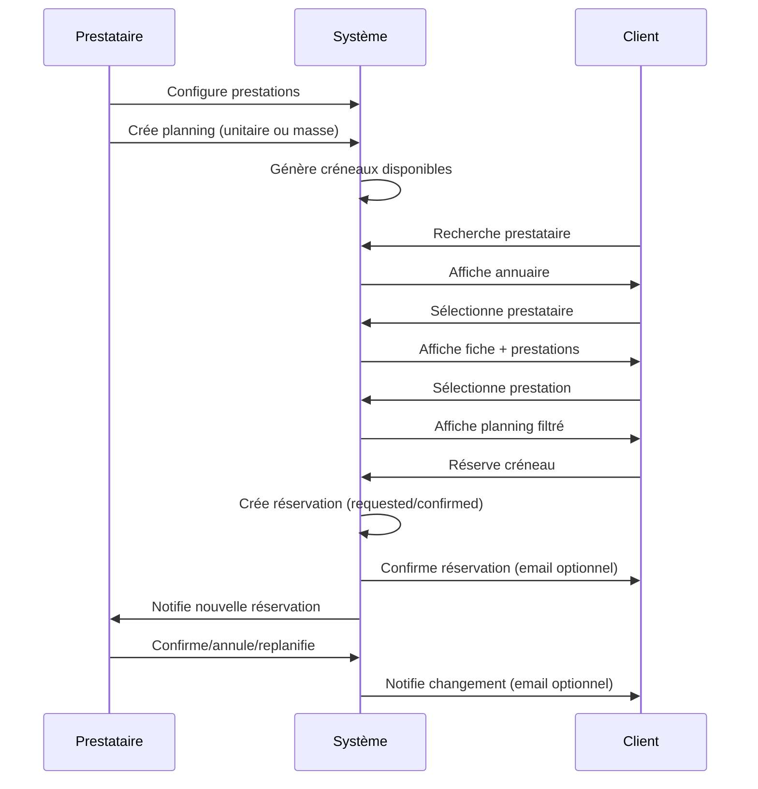
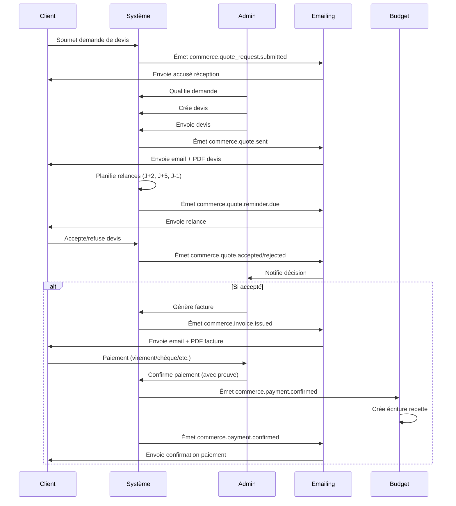

# SaaS Gerdv - Product Requirements Document (PRD)

## Contexte

Gerdv est un SaaS de gestion de réservations et de commerce par devis, construit sur le **Miyukini Framework**. Il permet aux prestataires de gérer leurs créneaux, leurs prestations et leurs réservations, tout en offrant aux clients une plateforme de recherche et de réservation en ligne. Le système intègre également un module de commerce B2B par devis avec facturation et suivi budgétaire.

## Vision Produit

Gerdv se positionne comme une **alternative framework-ready à Planity/Doctolib** pour la gestion de réservations, combinée à un **système de commerce par devis** adapté aux besoins B2B. La plateforme vise à offrir :

- Une expérience fluide pour les prestataires (gestion de planning, prestations, réservations)
- Une découverte simple pour les clients (annuaire, recherche, réservation)
- Un cycle commercial complet (devis → facture → paiement → budget)
- Une administration centralisée (back-office admin + super admin)

## Public Cible

### Acteurs Principaux

1. **Clients / Visiteurs** : utilisateurs finaux qui recherchent et réservent des prestations
2. **Prestataires** : professionnels qui proposent des services et gèrent leur planning
3. **Administrateurs** : gestion de la plateforme, modération, supervision
4. **Super Administrateurs** : configuration système, intégrations, métriques

### Cas d'Usage Principaux

- **Prestataire** : "Je veux gérer mes créneaux, mes prestations et mes réservations en ligne"
- **Client** : "Je veux trouver un prestataire et réserver un créneau rapidement"
- **Entreprise B2B** : "Je veux demander un devis, le valider et payer en ligne"
- **Admin** : "Je veux superviser la plateforme et modérer les contenus"

---

## Architecture & Stack Technique

### Stack Frontend

- **Framework** : Next.js 14.2.35 (React 18, TypeScript strict)
- **UI Kit** : Atomic Design avec FlyonUI 2.4.1
- **State Management** : TanStack Query + Zustand
- **Styling** : Tailwind CSS avec thème dynamique
- **Offline** : Dexie (IndexedDB) pour cache local

### Stack Backend

- **Base de données** : Supabase PostgreSQL 14.1
- **Authentification** : Supabase Auth (JWT, sessions, MFA)
- **API** : Supabase Edge Functions (Deno/TypeScript)
- **Storage** : Supabase Storage (buckets publics/privés)
- **RLS** : Row Level Security sur toutes les tables

### Architecture Modulaire

- **ModuleRegistry** : centralisation des modules (`booking`, `commerce-devis`, `budget`, `emailing`, `auth`)
- **EventBus** : communication inter-modules via événements (`booking.*`, `commerce.*`, `emailing.*`)
- **Capabilities** : fonctionnalités réutilisables (Agenda, Documents, Emailing, Budget)
- **Ports/Adapters** : isolation des dépendances externes

### Infrastructure

- **Migrations SQL** : versionnées et appliquées via Supabase MCP
- **Edge Functions** : déployées sur Supabase (cron, webhooks, API)
- **RLS Policies** : sécurité au niveau base de données
- **Storage Buckets** : `app-branding`, `booking-provider-photos`, `budget-receipts`, etc.

---

## Modules Principaux

### 3.1 Module Booking (Réservation)

#### Fonctionnalités Prestataires

**Gestion de Prestations**
- CRUD des prestations (nom, description, durée, prix indicatif)
- Catégorisation (catégories, tags)
- Capacité par défaut (multi-places)
- Politique d'annulation (délai, pénalité)
- Activation/désactivation
- Nécessite validation (mode approval)

**Planning**
- **Créneaux unitaires** : création/modification/suppression manuelle
  - Date, heure, durée, buffer avant/après
  - Capacité (multi-places)
  - Prestations autorisées sur le créneau
  - Visibilité (public/unlisted)
- **Création en masse** : génération via semaine type
  - Templates de plages horaires (ex: Lun 9-12 + 14-18)
  - Génération sur période (ex: 8 semaines)
  - Règles de prestations par plage horaire
- **Vacances** : indisponibilités sur période
  - Mode : bloquer créneaux / annuler réservations / demander replanification
- **Exceptions** : jours fériés, événements, indisponibilités partielles

**Profil Public**
- Nom d'enseigne, description
- Photos (upload Supabase Storage, ordre, visibilité)
- Horaires d'ouverture (JSON)
- Adresse complète (ligne 1, ligne 2, code postal, ville, pays)
- Coordonnées GPS (lat/lng)
- Contact (email, téléphone, site web)
- Réseaux sociaux (JSON)
- Avis clients (rating, commentaires)

**Dashboard Prestataire**
- Vue d'ensemble (prochaines réservations, statistiques)
- Accès rapide aux outils (Prestations, Planning, Vacances, Semaine type, Réservations)
- Guide d'utilisation de chaque outil

**Gestion des Réservations**
- Vue planning (calendrier + liste)
- Actions : confirmer, annuler, replanifier, marquer no-show/completed
- Informations client (nom, prénom, téléphone, email)
- Export (CSV/ICS)

#### Fonctionnalités Clients

**Annuaire de Prestataires**
- Recherche (nom, tags, ville)
- Filtres (catégories, localisation)
- Liste avec photo, nom, adresse, rating
- Layout responsive (mobile/desktop)

**Fiche Publique Prestataire**
- Hero avec galerie photos (photo active + thumbnails)
- Informations (nom, adresse, horaires, contact)
- Rating et avis
- Onglets : "Prendre RDV", "Avis", "À propos"
- Liste des prestations groupées par catégorie
- Sélection de prestation → redirection vers planning

**Réservation**
- Planning filtré par prestation sélectionnée
- Navigation (précédent/suivant jour/semaine, aujourd'hui)
- Affichage des créneaux (libre = vert, réservé = bleu)
- Formulaire de réservation (email, téléphone si non connecté)
- Confirmation de réservation
- Gestion des réservations (annulation, replanification)

#### Workflows

1. **Création de créneau** : Prestataire crée un créneau → disponible publiquement
2. **Réservation** : Client sélectionne prestation + créneau → réservation créée (statut `requested` ou `confirmed`)
3. **Confirmation** : Si mode approval, prestataire confirme → statut `confirmed`
4. **Annulation** : Client ou prestataire annule → statut `cancelled_by_client` ou `cancelled_by_provider`
5. **Replanification** : Client ou prestataire change le créneau → nouvelle réservation

#### Statuts

- **Slots** : `draft`, `pending`, `confirmed`, `paid`, `cancelled`
- **Bookings** : `requested`, `confirmed`, `cancelled_by_client`, `cancelled_by_provider`, `no_show`, `completed`

### 3.2 Module Commerce par Devis

#### Workflow Complet

1. **Demande de devis** : Client soumet un formulaire dynamique (champs configurables)
2. **Qualification** : Admin qualifie la demande et crée un devis
3. **Envoi** : Devis envoyé automatiquement (email + PDF)
4. **Relances** : Relances automatiques si non répondu (J+2, J+5, J-1 avant expiration)
5. **Décision** : Client accepte ou refuse
6. **Facturation** : Si accepté, facture générée automatiquement
7. **Paiement** : Paiement confirmé manuellement (avec preuve)
8. **Budget** : Écriture budgétaire automatique (recette réalisée)

#### États des Devis

- `draft` : Brouillon
- `sent` : Envoyé (ne peut plus être modifié, nécessite révision)
- `viewed` : Consulté (tracking optionnel)
- `accepted` : Accepté
- `rejected` : Refusé
- `expired` : Expiré
- `cancelled` : Annulé

#### États des Factures

- `draft` : Brouillon
- `issued` : Envoyée
- `paid_confirmed` : Paiement confirmé manuellement
- `cancelled` : Annulée
- `credited` : Avoir (optionnel)

#### Fonctionnalités

**Formulaire de Demande Dynamique**
- Éditeur JSON pour configurer les champs
- Types : texte, nombre, date, fichier, etc.
- Validation et règles métier
- Anti-spam

**Messagerie Interne**
- Thread de messages entre demandeur et vendeur
- Messages internes (visibles staff uniquement)
- Rôles : `requester`, `seller`, `admin`

**Relances Automatiques**
- Scheduler (Edge Function cron)
- Séquence de relances (1..N)
- Conditions : statut `sent` ou `viewed`, `valid_until` non dépassé
- Cadence paramétrable (ex: J+2, J+5, J-1)

**Révisions**
- Un devis `sent` ne peut plus être modifié
- Création d'une révision (nouveau devis avec `revision` incrémenté)

**Intégration Budget**
- Écriture automatique à confirmation de paiement
- Catégorisation automatique
- Lien vers facture

### 3.3 Module Budget

#### Fonctionnalités

**Catégories**
- Types : `income`, `expense`, `both`
- Hiérarchie (parent/child) optionnelle
- Icône, couleur, code comptable
- Activation/désactivation

**Entrées Budgétaires**
- Types : `income`, `expense`, `refund`, `transfer`
- Statuts : `draft`, `validated`, `reconciled`, `archived`
- Montants (net, taxe, brut)
- Multi-devises (currency, fx_rate)
- Catégorisation
- Centres de coûts (optionnel)
- Tags et notes
- Justificatifs (upload Storage)

**Plans Budgétaires**
- Périodes : `month`, `quarter`, `year`
- Prévisionnel vs réalisé
- Variance (alertes seuil)
- Par contexte (workspace, module, édition)

**Automatisations**
- Facture payée → recette automatique (idempotence via `dedupe_key`)
- Rapprochement
- Récurrences (optionnel)

**Reporting**
- KPIs (solde, trésorerie, burn rate)
- Exports (CSV, PDF, format compta)
- Graphiques et tableaux de bord

### 3.4 Module Emailing

#### Configuration

**Providers**
- SMTP (configuration globale SuperAdmin)
- Gmail OAuth2 (optionnel)
- Gmail SMTP (optionnel)

**Templates Transactionnels**
- Stockés dans `notification_settings`
- Par `event_type` (ex: `commerce.quote.sent`)
- Variables dynamiques (schéma JSON)
- Multi-langue (locale)
- Preview et validation

**Logs**
- Trace de chaque envoi
- Statuts : `pending`, `success`, `error`
- Retries exponentiels
- Idempotence (`dedupe_key`)

#### Emails Automatiques

**Commerce**
- Accusé réception demande
- Devis envoyé (+ PDF)
- Relances devis
- Facture envoyée (+ PDF)
- Confirmation paiement

**Booking**
- Confirmation réservation
- Rappel réservation
- Annulation
- Replanification

**Auth**
- Email de bienvenue
- Magic link (optionnel)

### 3.5 Module Auth & Account

#### Authentification

- Inscription (email, mot de passe, prénom, nom, téléphone obligatoires)
- Connexion (email + mot de passe)
- Sessions (refresh tokens, expiration)
- MFA (optionnel)
- Magic link (optionnel)

#### Profils Utilisateurs

- Prénom, nom, nom d'affichage
- Téléphone (éditable)
- Avatar (upload Storage)
- Métadonnées (JSON)
- Email vérifié / non vérifié
- Onboarding complété / en cours

#### Rôles

- `user` : Utilisateur standard
- `admin` : Administrateur (back-office)
- `super_admin` : Super administrateur (configuration système)

#### Tiers

- `free` : Gratuit
- `starter` : Starter
- `pro` : Professionnel
- `enterprise` : Entreprise

#### RGPD

- Consentements (marketing, analytics, service, newsletter)
- Historique des consentements
- Suppression de données (fonction `rgpd-delete-user`)
- Logs d'audit

---

## Back-Office & Administration

### 4.1 Back-Office Admin

#### Gestion Utilisateurs
- Liste des utilisateurs
- Rôles et permissions
- Activation/désactivation
- Invitations

#### Gestion Catégories
- CRUD des catégories de navigation
- Ordre et visibilité
- Icônes et routes
- Préférences utilisateur (activation/désactivation)

#### Gestion Devis & Factures
- Liste des demandes de devis
- Qualification et attribution
- Édition de devis
- Suivi des relances
- Génération de factures
- Confirmation de paiement

#### Gestion Budget
- Aperçu (KPIs, graphiques)
- Entrées (CRUD, filtres, tags)
- Prévisionnel (grille par catégorie/période)
- Catégories (CRUD, mapping comptes)
- Justificatifs
- Clôture de période
- Exports (CSV/PDF)

#### Gestion Contenu
- Édition de la homepage
- Gestion des pages publiques

#### Paramètres Généraux
- Notifications
- Sécurité (futur)

### 4.2 Super Admin Panel

#### Configuration Branding
- Titre de l'application
- Logo (upload Storage ou URL)
- Affichage dans Header

#### Configuration SMTP Globale
- Provider (SMTP)
- Host, port, username, password
- From name, from email, reply-to
- Headers JSON
- Test de connexion
- Envoi email de test

#### Configuration PayPal
- **Globale** : Client ID, Client Secret, Environment (sandbox/live)
- **Par module** : Mode (orders/subscriptions), Intent (CAPTURE/AUTHORIZE), URLs (success/cancel)
- Toggles : webhooks, refunds, payouts, disputes
- Test de connexion

#### Gestion Modules
- Activation/désactivation des modules
- Configuration par module

#### Édition Homepage
- Sections configurables (Hero, Stats, Quick Actions, FAQ, Onboarding)
- Éditeur visuel (style Elementor)
- Réorganisation (drag & drop)
- Visibilité par section
- Publication/dépublier

#### Intégrations
- SMTP (configuration et tests)
- PayPal (configuration globale + module)
- Webhooks (futur)

#### Métriques & Logs
- Métriques système (latence, erreurs, uptime)
- Logs d'audit
- Logs d'emails
- Logs de paiements

---

## Fonctionnalités Transverses

### 5.1 Homepage Éditable

**Sections Configurables**
- **Hero** : Badge, titre (2 lignes), sous-titre, CTA primaire/secondaire
- **Stats** : Liste de statistiques (valeur + label)
- **Quick Actions** : Actions rapides (icône, label, description, path)
- **FAQ** : Questions/réponses (titre, contenu, ouvert par défaut)
- **Onboarding** : Étapes d'onboarding (titre, description, icône)

**Éditeur**
- Interface style Elementor
- Réorganisation par drag & drop
- Visibilité par section
- Édition individuelle de chaque section
- Contenu stocké en base (JSON)

**Publication**
- Statut publié/dépublié
- Contenu visible publiquement si publié
- Skeleton de chargement (évite clignotement)

### 5.2 Branding

**Configuration**
- Titre de l'application (configurable par SuperAdmin)
- Logo (upload Supabase Storage ou URL externe)
- Formats supportés : PNG, JPG, SVG, WEBP
- Taille max : 2 Mo

**Affichage**
- Header dynamique (charge le branding depuis la base)
- Fallback sur valeurs par défaut si non configuré
- Logo remplace l'icône par défaut si présent

### 5.3 Navigation & Catégories

**Catégories**
- Configurables par SuperAdmin
- Propriétés : nom, icône, route, ordre, visibilité
- Préférences utilisateur (activation/désactivation, ordre personnalisé)
- Stockage : base de données + localStorage (non-authentifiés)

**Navigation**
- **Mobile** : Bottom navigation (5 zones max)
- **Desktop** : Sidebar admin (sections collapsibles)
- Adaptation selon rôle (admin/super_admin)

### 5.4 Intégrations

**SMTP**
- Configuration globale (SuperAdmin)
- Support multi-providers (SMTP générique)
- Test de connexion
- Envoi email de test
- Logs d'envoi

**PayPal**
- Configuration globale (credentials, environment)
- Configuration par module (mode, intent, URLs, toggles)
- Webhooks (capture, refund, subscription)
- Tests de connexion
- Sandbox et Live

---

## Workflows Métier

### 6.1 Workflow Booking

### 6.2 Workflow Commerce

---

## Sécurité & RGPD

### 7.1 Row Level Security (RLS)

**Principes**
- Toutes les tables sensibles ont RLS activé
- Policies basées sur `auth.uid()` et rôles
- Helpers : `is_admin_user()`, `is_super_admin()`, `is_slot_owner()`
- Éviter les policies récursives

**Exemples**
- `profiles` : lecture/écriture de son propre profil
- `booking_providers` : prestataire voit uniquement ses données
- `commerce_quotes` : demandeur voit ses devis, staff voit tous
- `budget_entries` : admin uniquement
- `email_provider_configs` : super_admin uniquement

### 7.2 Rôles & Permissions

**Hiérarchie**
- `user` : accès limité à ses propres données
- `admin` : accès back-office, modération
- `super_admin` : accès configuration système, intégrations

**Isolation**
- Admin n'a pas accès au back-office privé des prestataires
- Prestataire voit uniquement ses propres données (RLS)
- Super admin peut accéder à tout (override)

### 7.3 RGPD

**Consentements**
- Types : marketing, analytics, service, newsletter, third_party
- Historique (granted_at, revoked_at)
- Source et IP address
- Logs d'audit

**Suppression de Données**
- Fonction `rgpd-delete-user` (Edge Function)
- Purge complète (profiles, consents, sessions, logs)
- Rétention configurable

**Rétention**
- Logs techniques : 6-12 mois
- Documents : alignés avec politique Documents
- Emails : logs 6-12 mois

### 7.4 Audit & Logs

**Logs Centralisés**
- Table `admin_logs` pour actions critiques
- Triggers automatiques sur modifications sensibles
- Actor, action, payload, timestamp

**Rotation de Clés**
- Secrets stockés dans Supabase Vault
- Rotation programmée
- Traçabilité

---

## UI/UX

### 8.1 Design System

**Atomic Design**
- **Atoms** : Button, Input, Badge, Avatar, Icon
- **Molecules** : FormField, Card, Accordion, Modal
- **Organisms** : Header, BottomNav, CalendarGrid, ProfileDropdown
- **Templates** : AppShellScreen, ContentStack, AdminLayout
- **Pages** : Routes Next.js (montent les Screens)

**Thème Dynamique**
- Tokens de couleur (primary, secondary, success, error, etc.)
- Pas de couleurs hardcodées
- `useActiveTheme` hook
- `colorToRgba` helper pour opacités

### 8.2 Responsive

**Mobile-First**
- Breakpoints Tailwind (sm, md, lg, xl)
- Bottom navigation (mobile)
- Sidebar (desktop)
- Grilles adaptatives

**Layout Triptyque**
- **Header** : Navigation sticky, branding, actions utilisateur
- **Body** : Contenu principal (scrollable)
- **Bottom** : Navigation mobile ou actions rapides

### 8.3 Composants Réutilisables

**FlyonUI**
- Composants pré-stylés (Button, Card, Badge, etc.)
- Variants (primary, secondary, soft, outline)
- Tailles (sm, md, lg, xl)

**Composants Custom**
- `CalendarGrid` : Grille calendrier responsive
- `Modal` : Modale responsive avec overlay
- `ProfileDropdown` : Menu utilisateur
- `AdminSidebar` : Navigation admin

### 8.4 Modales & Notifications

**Modales**
- Overlay avec backdrop blur
- Fermeture (clic backdrop, ESC, bouton)
- Scroll interne si contenu long
- Responsive (max-width, max-height)

**Notifications**
- ToastStack pour feedbacks
- Alertes (success, error, warning, info)
- Badges de statut

---

## Données & Modèles

### 9.1 Schéma de Base de Données

**Tables Principales**

**Auth & Account**
- `auth.users` : Utilisateurs Supabase
- `profiles` : Profils utilisateurs (prénom, nom, téléphone, avatar, rôle, tier)
- `auth_sessions` : Sessions utilisateurs
- `user_consents` : Consentements RGPD
- `categories` : Catégories de navigation
- `user_category_preferences` : Préférences utilisateur

**Booking**
- `booking_providers` : Prestataires (profil, tags, timezone, adresse, horaires, photos, avis)
- `booking_services` : Prestations (nom, durée, prix, capacité, catégories)
- `booking_bookings` : Réservations (client, prestataire, service, slot, statut)
- `booking_week_templates` : Semaines types
- `booking_time_off` : Vacances et indisponibilités
- `booking_provider_photos` : Photos prestataires
- `booking_provider_reviews` : Avis clients
- `agendas` : Agendas (réutilisé de capability Agenda)
- `slots` : Créneaux (réutilisé de capability Agenda)

**Commerce**
- `commerce_quote_requests` : Demandes de devis
- `commerce_quotes` : Devis (numéro, statut, révision, montants)
- `commerce_quote_items` : Lignes de devis
- `commerce_quote_messages` : Messagerie
- `commerce_quote_audit` : Audit devis
- `commerce_quote_reminders` : Relances planifiées
- `commerce_quote_invoices` : Factures
- `commerce_invoice_payments` : Paiements
- `commerce_outbox` : Outbox pattern (événements)

**Budget**
- `budget_categories` : Catégories budgétaires
- `budget_entries` : Entrées budgétaires
- `budget_plans` : Plans budgétaires
- `budget_plan_lines` : Lignes de plan
- `budget_entry_audit` : Audit entrées

**Emailing**
- `email_provider_configs` : Configuration SMTP
- `notification_settings` : Templates transactionnels (futur)
- `email_logs` : Logs d'envoi (futur)

**App**
- `app_branding` : Branding (titre, logo)
- `homepage_content` : Contenu homepage (JSON)
- `framework_modules` : Modules activés

### 9.2 Relations Entre Entités

**Booking**
- `booking_providers` → `profiles` (1:1)
- `booking_services` → `booking_providers` (N:1)
- `booking_bookings` → `booking_providers`, `booking_services`, `slots`, `profiles` (N:1)
- `booking_provider_photos` → `booking_providers` (N:1)
- `booking_provider_reviews` → `booking_providers`, `booking_bookings` (N:1)

**Commerce**
- `commerce_quotes` → `commerce_quote_requests`, `profiles` (N:1)
- `commerce_quote_items` → `commerce_quotes` (N:1)
- `commerce_quote_invoices` → `commerce_quotes` (1:1)
- `commerce_invoice_payments` → `commerce_quote_invoices` (N:1)

**Budget**
- `budget_entries` → `budget_categories`, `commerce_quote_invoices` (N:1)
- `budget_plan_lines` → `budget_plans`, `budget_categories` (N:1)

### 9.3 Enums & Statuts

**Booking**
- `booking_booking_status` : `requested`, `confirmed`, `cancelled_by_client`, `cancelled_by_provider`, `no_show`, `completed`
- `agenda_slot_status` : `draft`, `pending`, `confirmed`, `paid`, `cancelled`
- `booking_time_off_mode` : `block_slots`, `cancel_bookings`, `request_reschedule`

**Commerce**
- `commerce_quote_request_status` : `draft`, `submitted`, `qualified`, `cancelled`
- `commerce_quote_status` : `draft`, `sent`, `viewed`, `accepted`, `rejected`, `expired`, `cancelled`
- `commerce_invoice_status` : `draft`, `issued`, `paid_confirmed`, `cancelled`, `credited`
- `commerce_payment_method` : `bank_transfer`, `cash`, `check`, `card_remote`, `other`
- `commerce_quote_reminder_status` : `scheduled`, `sent`, `cancelled`, `error`

**Budget**
- `budget_category_type` : `income`, `expense`, `both`
- `budget_entry_type` : `income`, `expense`, `refund`, `transfer`
- `budget_entry_status` : `draft`, `validated`, `reconciled`, `archived`
- `budget_period_type` : `month`, `quarter`, `year`

**Auth**
- `user_role` : `user`, `admin`, `super_admin`
- `user_tier` : `free`, `starter`, `pro`, `enterprise`
- `consent_type` : `marketing`, `analytics`, `service`, `newsletter`, `third_party`

**Emailing**
- `email_provider_type` : `smtp`, `gmail_oauth2`, `gmail_smtp`

**PayPal**
- `paypal_environment` : `sandbox`, `live`
- `paypal_payment_mode` : `orders`, `subscriptions`
- `paypal_intent` : `CAPTURE`, `AUTHORIZE`

### 9.4 Migrations SQL

**Migrations Principales**
- Migration Initiale (profiles, consents, auth_sessions)
- Migration Booking (tables booking + RPC)
- Migration Commerce par Devis (tables commerce)
- Migration Budget (tables budget)
- Migration Emailing (SMTP config)
- Migration PayPal (provider + module config)
- Migration Homepage Content
- Migration Categories
- Migration App Branding
- Migration Booking Provider Profile Public
- Migration Booking Provider Photos Storage

**Application**
- Migrations appliquées via Supabase MCP
- Versionnées et tracées
- Rollback possible

---

## État Actuel & Roadmap

### 10.1 Fonctionnalités Implémentées

**✅ Module Booking**
- Gestion prestations (CRUD complet)
- Planning (unitaire, masse, semaines types)
- Vacances et indisponibilités
- Profil public prestataire (photos, horaires, adresse, avis)
- Annuaire prestataires (recherche, filtres)
- Réservation client (planning filtré, formulaire)
- Dashboard prestataire
- Gestion réservations (confirmation, annulation, replanification)

**✅ Module Commerce par Devis**
- Formulaire de demande dynamique (éditeur JSON)
- Workflow devis (création, envoi, acceptation/refus)
- Relances automatiques (scheduler Edge Function)
- Messagerie interne
- Facturation (génération depuis devis accepté)
- Confirmation paiement manuelle
- Intégration Budget (écritures automatiques)

**✅ Module Budget**
- Catégories (CRUD, hiérarchie)
- Entrées budgétaires (CRUD, statuts, multi-devises)
- Plans budgétaires (prévisionnel vs réalisé)
- Audit trail
- Intégration Commerce (recettes automatiques)

**✅ Module Emailing**
- Configuration SMTP (SuperAdmin)
- Templates transactionnels (structure)
- Emails automatiques (devis, factures, relances)
- Logs d'envoi (structure)

**✅ Module Auth & Account**
- Inscription (prénom, nom, téléphone obligatoires)
- Connexion
- Profils utilisateurs (édition)
- Rôles et permissions
- RGPD (consentements, suppression)

**✅ Back-Office Admin**
- Gestion utilisateurs
- Gestion catégories
- Gestion devis et factures
- Gestion budget
- Gestion contenu

**✅ Super Admin Panel**
- Configuration branding (titre, logo)
- Configuration SMTP globale
- Configuration PayPal (globale + module)
- Gestion modules
- Édition homepage
- Intégrations

**✅ Fonctionnalités Transverses**
- Homepage éditable (sections configurables)
- Branding dynamique (Header)
- Navigation & catégories (configurables)
- Intégrations (SMTP, PayPal)

### 10.2 Fonctionnalités en Cours

**🔄 Améliorations UI/UX**
- Optimisation responsive
- Amélioration accessibilité
- Performance (lazy loading, optimisations)

**🔄 Tests & Qualité**
- Tests unitaires
- Tests d'intégration
- Tests e2e (Playwright)

### 10.3 Prochaines Étapes

**📋 Court Terme**
- Finalisation des templates email transactionnels
- Amélioration des logs et observabilité
- Optimisations performance
- Tests complets

**📋 Moyen Terme**
- Module Documents (génération PDF devis/factures)
- Module Notifications (centre de notifications)
- Amélioration reporting Budget
- Export comptable (FEC-like)

**📋 Long Terme**
- Module Abonnements (paiements récurrents)
- Module Analytics (tableaux de bord avancés)
- API publique (pour intégrations tierces)
- Mobile apps (React Native)

### 10.4 Limitations Connues

**Techniques**
- Pas de paiement en ligne intégré (PSP/checkout) - confirmation manuelle uniquement
- Pas de signature électronique qualifiée
- Pas de dossiers médicaux (hors scope santé)
- Pas de multi-tenant complet (workspace_id présent mais pas utilisé partout)

**Fonctionnelles**
- Templates email en structure uniquement (pas d'éditeur visuel)
- Pas de campagnes email marketing
- Pas d'import bancaire automatique
- Pas de rapprochement bancaire automatique

---

## Références Techniques

### Documentation Framework

- `docs/framework/Miyukini Framework - Overview.md` : Vue d'ensemble
- `docs/framework/Miyukini Framework - Architecture Globale et Dépendances.md` : Architecture
- `docs/framework/Miyukini Framework - Infrastructure Supabase.md` : Infrastructure
- `docs/framework/Miyukini Framework - Back Office et Super Admin.md` : Administration

### Documentation Modules

- `docs/modules/Miyukini Framework - Module Reservation Booking.md` : Module Booking
- `docs/modules/Miyukini Framework - Module Commerce par Devis.md` : Module Commerce
- `docs/modules/Miyukini Framework - Module Commerce par Devis Event Map Emailing Budget.md` : Intégrations

### Documentation Features

- `docs/features/budget/Miyukini Framework - Feature Budget Apex.md` : Feature Budget
- `docs/features/Emailing/Miyukini Framework - Feature Emailing Gmail SMTP.md` : Feature Emailing
- `docs/framework/Miyukini Framework - Compte Utilisateur.md` : Module Auth

---

## Conclusion

Gerdv est un SaaS complet de gestion de réservations et de commerce par devis, construit sur le Miyukini Framework. Il offre une solution modulaire, extensible et robuste pour les prestataires et les entreprises B2B.

Le système est actuellement en développement actif, avec les modules principaux implémentés et fonctionnels. La roadmap prévoit des améliorations continues et l'ajout de nouvelles fonctionnalités pour répondre aux besoins évolutifs des utilisateurs.
