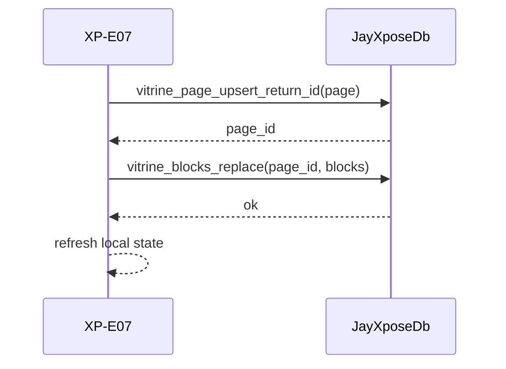

# JayXpose - Architecture Page Builder

## 1. Objectif

Definir l'architecture du module M3 Page Builder de JayXpose.
Reference UX cible: WordPress + Elementor + WooCommerce, adaptee a eGUI.

## 2. Principes

- Donnee source = JSON type
- Rendu = interpretation des blocs
- Persistance = double couche
- `vitrine_pages.content` pour snapshot document
- `vitrine_blocs` pour requetes structurees et edition bloc a bloc

## 3. Composants

### 3.1 Modele JSON

- Type: `PageBuilderDocument`
- Champs:
- `version`
- `page_id`
- `title`
- `slug`
- `settings`
- `blocks[]`

### 3.2 Bloc

- Type: `PageBuilderBlock`
- Champs:
- `id`
- `block_type`
- `props`

### 3.3 Mapping DB

- Table page: `vitrine_pages`
- Table blocs: `vitrine_blocs`
- Mapping:
- `block_key` <- `PageBuilderBlock.id`
- `block_type` <- `PageBuilderBlock.block_type`
- `props_json` <- serialisation `props`

## 4. Catalogue de blocs MVP

- `hero`
- `features`
- `product_grid`
- `story`
- `testimonials`
- `faq`
- `contact_cta`
- `gallery`

## 5. Flux d'edition

1. Charger page `presentation`
2. Lire blocs depuis `vitrine_blocs` si disponibles
3. Construire `PageBuilderDocument`
4. Afficher canvas
5. Modifier ordre/ajout/suppression blocs
6. Regenerer JSON
7. Sauvegarder page + blocs

## 6. Flux de sauvegarde

## 7. Flux de preview

- Ecran: XP-E08
- Source prioritaire:
- `state.presentation_content`
- fallback `page.content`
- Parser `PageBuilderDocument`
- Renderer par type de bloc

## 8. Templates

Table `vitrine_templates` seedee:
- `Mini-Site Vitrine`
- `E-Shop`
- `Service-Shop`

Usage:
- Application d'un template local dans XP-E07
- Base de depart pour exposant

## 9. Contrats de qualite

- JSON invalide -> fallback document genere
- Bloc inconnu -> rendu degrade (label bloc)
- Sauvegarde partielle -> message explicite utilisateur

## 10. Interfaces techniques

- UI:
- `crates/jayxpose/src/screens/exp/e07_vitrine_presentation.rs`
- `crates/jayxpose/src/screens/exp/e08_vitrine_preview.rs`

- Data:
- `crates/jayxpose/src/data/types.rs`
- `crates/jayxpose/src/data/kindmother_db.rs`

## 11. Evolution

### Court terme

- Edition visuelle `props` par bloc
- Drag and drop natif egui
- Undo/redo

### Moyen terme

- Theme tokens et style system
- Blocs commerce avances (cross-sell, upsell)
- Internationalisation contenu

### Long terme

- Conception multi-pages unifiee
- Collaboration multi-utilisateur
- Pipeline publication multi-environnements

## 12. Bornage

### Inclus

- Page builder JSON type
- Persistance blocs + document
- Preview runtime

### Exclu MVP

- CSS custom libre
- JS custom execute
- Plugin ecosystem externe
