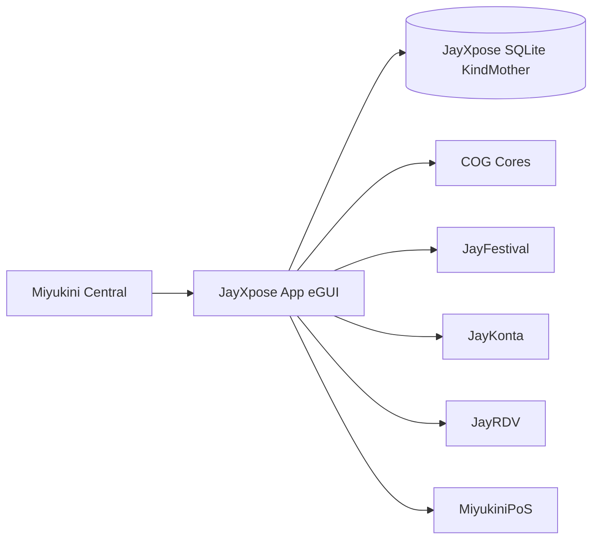

# JayXpose - Architecture Technique

## 1. Objectif

Ce document decrit l'architecture technique de JayXpose dans le COG Miyukini.
JayXpose couvre:
- profil exposant
- catalogue produits
- page builder vitrine
- publication vitrine
- coffre-fort documents
- annuaire public
- synchronisations inter-services

## 2. Positionnement COG

- Strate: Service (7)
- Service parent UI: Miyukini Central
- Stockage local souverain: KindMother Daughter (SQLite)
- Gouvernance: StrongFather + MasterButler + BorderGuard + WorrySentinel

## 3. Architecture logique

## 4. Architecture applicative (crate)

- `crates/jayxpose/src/app.rs`
- `crates/jayxpose/src/app_state.rs`
- `crates/jayxpose/src/screens/exp/*`
- `crates/jayxpose/src/screens/pub_/*`
- `crates/jayxpose/src/data/types.rs`
- `crates/jayxpose/src/data/kindmother_db.rs`

### 4.1 Couches

- UI: eframe/egui, ecrans EXP et PUB
- Domain: types metier (profil, produits, documents, vitrine, sync)
- Persistance: JayXposeDb SQLite
- Integration: flux inter-services journalises dans `sync_logs`

## 5. Modules M1..M8

### M1 Profil Entreprise

- Entite: `ExposantProfile`
- Table: `exposants`
- Ecrans: XP-E01, XP-E02, XP-E11

### M2 Catalogue Produits

- Entites: `ProduitCatalogue`, `CategorieProduit`, `ProduitVisuel`
- Tables: `produits_catalogue`, `categories_produits`, `produits_visuels`
- Ecrans: XP-E03, XP-E04, XP-E05

### M3 Page Builder

- Entites: `PageBuilderDocument`, `PageBuilderBlock`, `VitrineBlock`, `VitrineTemplate`
- Tables: `vitrine_pages`, `vitrine_blocs`, `vitrine_templates`
- Ecrans: XP-E07, XP-E08

### M4 Vitrine

- Entite: `VitrinePage`
- Table: `vitrine_pages`
- Ecrans: XP-E06, XP-E07, XP-E08

### M5 Coffre-Fort Documents

- Entites: `DocumentProfessionnel`, `DocumentVersion`, `DocumentPartage`
- Tables: `documents_professionnels`, `documents_versions`, `documents_partages`
- Ecrans: XP-E09, XP-E10, XP-E12

### M6 Annuaire Exposants

- Source principale: `exposants` + regles `confidentialite_profil`
- Ecrans publics: PUB-E01..PUB-E06

### M7 Sync MiyukiniPoS

- Entites: `PosStockLink`, `SyncLog`
- Tables: `pos_stock_links`, `sync_logs`
- Ecran: XP-E03 (action manuelle), XP-E01 (pulse inter-services)

### M8 CMS Articles

- Planifie
- Table cible: `cms_articles`

## 6. Contrats internes

### 6.1 Contrats de persistance

- `exposant_upsert`, `exposant_by_id`
- `produit_insert`, `produit_update`, `produit_delete`, `produits_by_exposant`
- `vitrine_page_upsert_return_id`, `vitrine_blocks_replace`, `vitrine_blocks_by_page`
- `sync_log_insert`, `sync_logs_by_exposant`
- `pos_stock_upsert`, `pos_stock_links_by_exposant`

### 6.2 Contrats UI

- Router EXP: `crates/jayxpose/src/screens/exp/mod.rs`
- Router PUB: `crates/jayxpose/src/screens/pub_/mod.rs`
- Etat partage: `ExpState`, `PubState`

## 7. Flux cle

### 7.1 Creation d'une vitrine

1. Exposant complete profil (XP-E02)
2. Exposant cree produits (XP-E03/04)
3. Exposant structure page (XP-E07)
4. Application persiste page + blocs
5. Exposant previsualise/publie (XP-E08)

### 7.2 Sync stock PoS

1. Action `Sync stock PoS` depuis XP-E03
2. `pos_stock_upsert` met a jour `pos_stock_links`
3. disponibilite catalogue ajuste automatiquement
4. `sync_log_insert` cree un audit `stock_push`

### 7.3 Flux inter-services

- JayFestival: extraction profil + catalogue + vitrine
- JayKonta: partage RIB/documents via mandats
- JayRDV: exposition catalogue/service vers reservation

## 8. Accessibilite depuis Central

JayXpose est embarque par Central via:
- `crates/miyukini-central/src/services/jayxpose_service.rs`

Pattern:
- instanciation `JayXposeApp::new_embedded()`
- rendu `app.show_in_ui(ui.ctx())`

## 9. Bornage

### In scope

- Gestion profil expose
- Catalogue, categories, visuels
- Builder JSON + preview
- Sync stock PoS locale + audit
- Journal sync inter-services

### Out of scope (MVP)

- Paiement en ligne
- Marketplace multi-vendeur
- Plugins tiers
- Domaine custom auto-provisionne

## 10. Observabilite et audit

- Journal metier: `sync_logs`
- Traite erreurs DB via `DbError`
- Rendu status utilisateur via `status_message`

## 11. Qualite technique

- `cargo check -p jayxpose`
- `cargo check -p miyukini-central`
- Typage JSON builder avec serde
- Indices DB pour perf (`idx_vitrine_blocs_page`, `idx_sync_logs_exposant`, `idx_pos_stock_sku`)

## 12. Evolution recommandee

1. Ajouter `cms_articles` et workflows M8
2. Ajouter auth/session reelle multi-exposants
3. Ajouter sync bidirectionnelle PoS (push + pull)
4. Ajouter outils de resolution de conflits de stock
5. Ajouter tests integration ecran -> DB pour M3/M7
