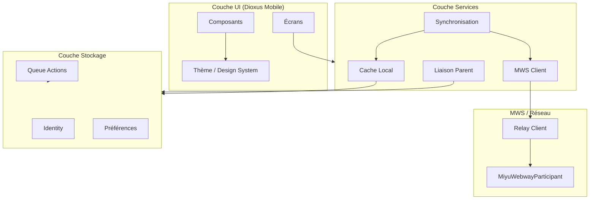
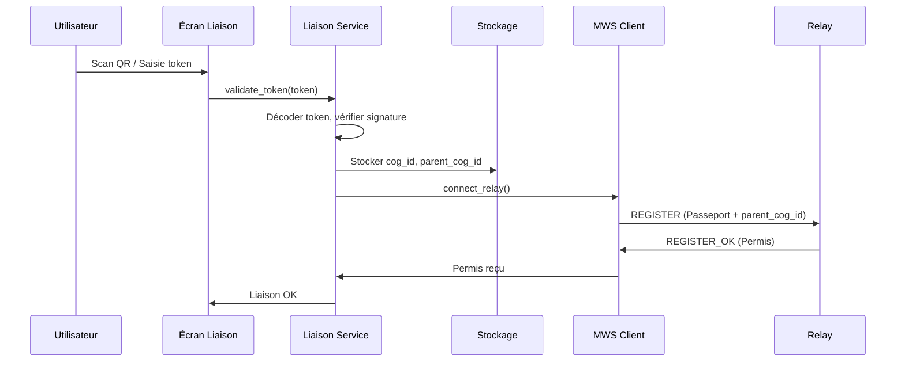
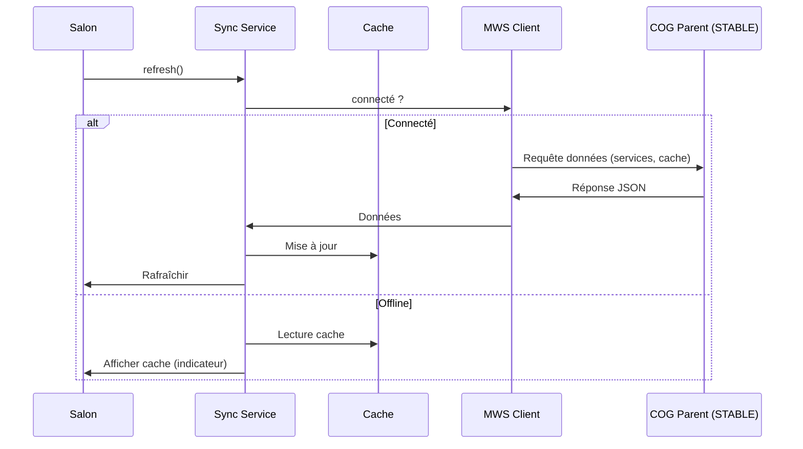
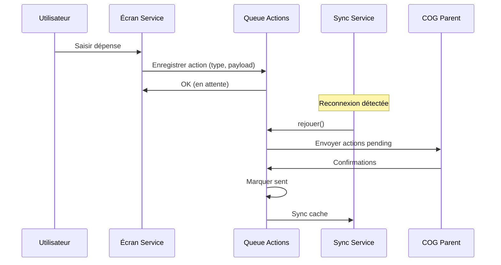
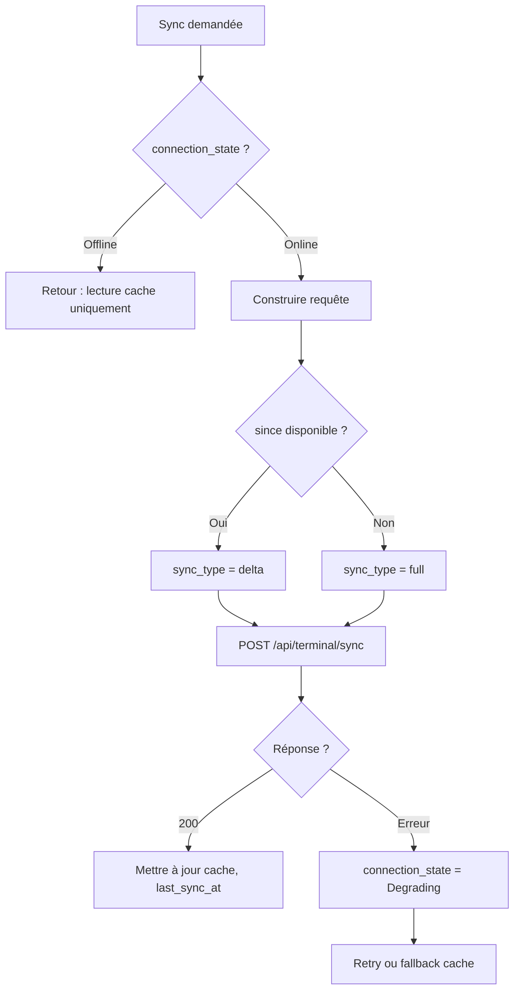

# MiyukiniTerminal — Architecture Technique

## Contexte

Ce document décrit l'**architecture technique** de l'application MiyukiniTerminal : couches, flux de données, interactions entre composants et décisions techniques. Stack confirmée : **Dioxus** (UI) + **Rust** (logique, MWS, persistance).

**Références :**

- [Document Fondateur](./MiyukiniTerminal%20-%20Document%20Fondateur.md)
- [Spec Canaux Connexion MWS Parent-Enfant](./MiyukiniTerminal%20-%20Spec%20Canaux%20Connexion%20MWS%20Parent%20Enfant.md)
- [Stack Dioxus Mobile Spec](./MiyukiniTerminal%20-%20Stack%20Dioxus%20Mobile%20Spec.md)
- [MWS - Protocole Relay](../../miyukini-webway-system/protocole/MWS%20-%20Protocole%20Relay.md)

---

## Portée / Scope

- Schémas d'architecture (Mermaid)
- Couches applicatives
- Flux de données et interactions
- Décisions techniques (Rust/Dioxus confirmé)
- Réutilisation des crates existants

---

## 1. Vue d'ensemble des couches



---

## 2. Schéma détaillé par couche

### 2.1 Couche UI (Dioxus Mobile)

| Composant | Rôle |
|-----------|------|
| **Écrans** | Liaison, Salon, Service (détail), Paramètres, Profil |
| **Composants** | Boutons, cartes, listes, champs, modals (réutilisés ou adaptés Central) |
| **Thème** | Palette Gaming héritée ; adaptations mobile (taille touch, grille) |

**Entrées :** Gestes utilisateur, événements  
**Sorties :** Appels à la couche Services (liaison, sync, actions)

### 2.2 Couche Services

| Composant | Rôle |
|-----------|------|
| **Liaison Parent** | Validation token, création identité, stockage `parent_cog_id`, `cog_id` |
| **Synchronisation** | Sync avec parent (services, préférences, cache) ; détection online/offline |
| **MWS Client** | Connexion Relay, Passeport, Permis, heartbeats |
| **Cache Local** | Données en cache (JayKonta, JayKoa) ; lecture en offline |

### 2.3 Couche MWS

| Composant | Rôle |
|-----------|------|
| **Relay Client** | TCP/TLS vers Relay (port 7000) ; REGISTER avec `parent_cog_id` ; connexion **directe** par défaut (Mode A) |
| **MiyuWebwayParticipant** | Crate existant ; transport, déclaration, discovery (adapté client seul) |

**Pas de :** Tracker serveur (port 21000 en écoute) — Terminal = client uniquement.

**Canaux :** Voir [Spec Canaux Connexion MWS Parent-Enfant](./MiyukiniTerminal%20-%20Spec%20Canaux%20Connexion%20MWS%20Parent%20Enfant.md) pour les modes direct Relay vs via parent.

### 2.4 Couche Stockage

| Composant | Rôle |
|-----------|------|
| **Identity** | `cog_id`, `parent_cog_id`, identité utilisateur |
| **Queue Actions** | Actions différées (dépenses, événements) ; rejeu à la reconnexion |
| **Préférences** | Thème, verrouillage, notifications |
| **Cache** | Données services (soldes, mouvements, agenda) |

---

## 3. Flux de données principaux

### 3.1 Flux liaison (premier lancement)



### 3.2 Flux synchronisation



### 3.3 Flux action différée (offline → online)



---

## 4. Décisions techniques

### 4.1 Stack confirmée

| Décision | Choix | Justification |
|----------|-------|---------------|
| **UI** | Dioxus 0.6+ (mobile) | Compatibilité maximale avec Central ; Rust partagé |
| **Langage** | Rust | Un seul langage ; réutilisation crates ; sécurité mémoire |
| **MWS** | miyuwebway_participant (adapté) | Éviter duplication protocole ; cohérence MWS |
| **Stockage** | SQLite / rusqlite ou KindMother | Persistance locale ; option chiffrement |

### 4.2 Pas de Kotlin / JNI

- **Pas de JNI** : logique MWS en Rust pur ; Dioxus compile en binaire Android (NDK)
- **Pas de Kotlin** : éviter deux codebases ; maintenance simplifiée

### 4.3 Réutilisation crates

| Crate | Usage |
|-------|-------|
| `miyuwebway_participant` | relay_client, declaration, transport ; adapter pour client seul (pas tracker) |
| `apps/origin` (protocol) | Types `CogType`, `OsType`, messages (extraire en crate partagé si besoin) |
| `kindmother` / `kindmother-client` | Optionnel ; rusqlite suffit pour MVP |
| `miyukini-central` | Thème, patterns (référence) ; pas de dépendance directe (app séparée) |

---

## 5. Structure du projet (cible)

```
apps/terminal/
├── Cargo.toml
├── src/
│   ├── main.rs              # Point d'entrée Dioxus mobile
│   ├── app.rs               # App racine, providers
│   ├── state.rs             # AppState, AppContext
│   ├── theme.rs             # ThemePalette (hérité Central)
│   ├── screens/
│   │   ├── liaison.rs
│   │   ├── salon.rs
│   │   ├── service_detail.rs
│   │   ├── parametres.rs
│   │   └── profil.rs
│   ├── components/
│   │   └── ...
│   ├── services/
│   │   ├── liaison.rs
│   │   ├── sync.rs
│   │   └── mws.rs
│   ├── storage/
│   │   ├── identity.rs
│   │   ├── queue.rs
│   │   └── cache.rs
│   └── mws/
│       └── relay_client.rs  # ou wrapper miyuwebway_participant
└── ...                      # Fichiers Dioxus mobile (Android)
```

---

## 6. Points d'intégration externe

| Point | Protocole / Format |
|-------|-------------------|
| **Relay** | TCP/TLS, port 7000 ; trames binaires MWS |
| **Central (parent)** | Token de liaison ; API sync (à définir) |
| **Stockage Android** | `getFilesDir()`, `databases/` ; SQLite |

---

## 7. Logique de décision par couche

### 7.1 Couche UI : règles de routage

| Événement | Condition | Action |
|-----------|-----------|--------|
| Lancement app | `identity` vide | Afficher écran Liaison |
| Lancement app | `identity` présente | Afficher Salon |
| Clic service | Service JayKonta | Ouvrir écran détail JayKonta |
| Clic service | Service JayKoa | Ouvrir écran détail JayKoa |
| Pull-to-refresh | Toujours | Déclencher sync |
| Perte réseau | Détection ConnectivityManager | Mettre connection_state = Offline |
| Retour réseau | Détection | Mettre Online, lancer sync, rejouer queue |

### 7.2 Couche Services : protocole sync



### 7.3 Couche MWS : état machine connexion

| État | Transition entrante | Transition sortante |
|------|---------------------|----------------------|
| Disconnected | Init | Connexion TCP réussie → Connecting |
| Connecting | TCP connect | TLS OK → Registering |
| Registering | Envoi REGISTER | REGISTER_OK → Connected ; REGISTER_ERR → Disconnected |
| Connected | Régulier | Heartbeat ; CLOSE → Disconnected |
| Reconnecting | Perte connexion | REGISTER → Registering |

### 7.4 Conformité MSCM/MIP

L'architecture doit faciliter le **balisage MSCM** : chaque module (liaison, mws, sync, storage) doit exposer des blocs identifiables pour la Phase B. Voir [Spec MSCM MIP Conformite](./MiyukiniTerminal%20-%20Spec%20MSCM%20MIP%20Conformite.md).

---

## 8. Références

- [Stack Dioxus Mobile Spec](./MiyukiniTerminal%20-%20Stack%20Dioxus%20Mobile%20Spec.md)
- [Spec MSCM MIP Conformite](./MiyukiniTerminal%20-%20Spec%20MSCM%20MIP%20Conformite.md)
- [Spec MiyuWebwayParticipant Adapt](./MiyukiniTerminal%20-%20Spec%20MiyuWebwayParticipant%20Adapt.md)
- [Spec Stockage Local](./MiyukiniTerminal%20-%20Spec%20Stockage%20Local.md)
