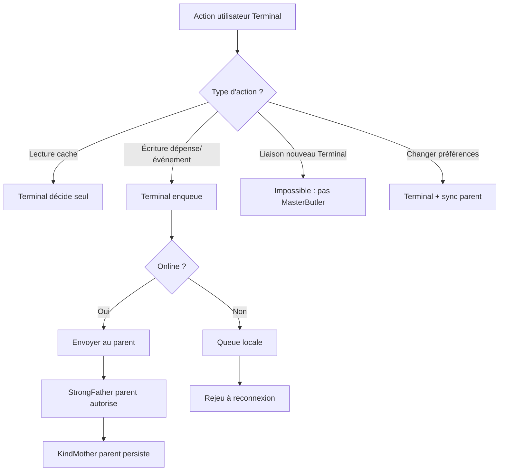

# MiyukiniTerminal — Document Fondateur

## Contexte

**MiyukiniTerminal** est l'application Android permettant aux utilisateurs en mobilité d'interagir avec leur environnement COG via un **terminal léger** — un COG de type TERMINAL (`cog_type` 0x05) et `os_type` ANDROID. Elle est enfant obligatoire d'un COG STABLE du même utilisateur et hérite des services et préférences du parent.

**Références :**

- [Spec Canaux Connexion MWS Parent-Enfant](./MiyukiniTerminal%20-%20Spec%20Canaux%20Connexion%20MWS%20Parent%20Enfant.md)
- [MWS - Passeport et Visa](../../miyukini-webway-system/verification/MWS%20-%20Passeport%20et%20Visa.md)
- [Étude App Android Terminal](../../implementation/Miyukini%20COG%20-%20Etude%20App%20Android%20Terminal.md)
- [Plan de Développement](../../implementation/Miyukini%20COG%20-%20Plan%20Developpement%20App%20Android%20Terminal.md)

---

## Portée / Scope

- Vision, objectifs et non-objectifs de MiyukiniTerminal
- Positionnement COG TERMINAL dans l'écosystème MWS
- Relation parent-enfant, limites, conformité aux Lois d'Autonomie
- Bornage fonctionnel (IN / OUT)

---

## 1. Vision et principe

**MiyukiniTerminal** étend l'environnement COG à la mobilité : l'utilisateur garde accès à ses services (JayKonta, JayKoa, etc.) et à son identité COG depuis son appareil Android, tout en restant gouverné par son COG STABLE parent.

### 1.1 Extension, pas substitution

| Principe | Description |
|----------|-------------|
| **Extension** | Le Terminal est une **extension** du COG Stable. Il ne remplace pas Central ; il offre un accès adapté au mobile. |
| **Gouvernance parent** | Toutes les décisions importantes (création du Terminal, révocation, capacités) passent par le parent. |
| **Même utilisateur** | Parent et enfant appartiennent au même utilisateur ; vérification au Relay. |

### 1.2 Invariant : Terminal ne gouverne pas

MiyukiniTerminal **ne possède pas** de Cores ni de BondingBrother complets. Il :

- Consomme les services exposés par le parent
- Présente un Passeport avec `parent_cog_id` pour obtenir un Permis
- Délègue les actions au parent (saisie dépense, création événement)
- Ne peut pas créer d'autres Terminaux ni gérer des Services de façon autonome

---

## 2. Objectifs

| # | Objectif | Description |
|---|----------|-------------|
| 1 | **Accès mobile aux services** | Consultation JayKonta (soldes, mouvements), JayKoa (agenda, événements) depuis l'appareil Android |
| 2 | **Identité COG en mobilité** | Présence MWS (Relay, Permis) ; le Terminal participe au réseau comme COG légitime |
| 3 | **Autonomie limitée** | Mode offline : lecture cache, queue d'actions différées ; sync à la reconnexion |
| 4 | **Sécurité et conformité** | Stockage sensible chiffré ; TLS obligatoire ; conformité Cores (StrongFather, KindMother, etc.) |
| 5 | **Compatibilité Central** | Stack Dioxus ; réutilisation thème et patterns de Miyukini Central |

---

## 3. Non-objectifs

| # | Non-objectif | Raison |
|---|--------------|--------|
| 1 | **Remplacer Miyukini Central** | Central reste le hub principal ; Terminal = vue mobile limitée |
| 2 | **COG autonome** | Pas de Cores, pas de BondingBrother ; dépendance au parent |
| 3 | **Services complets** | Vue consultative et actions simples uniquement ; pas d'administration |
| 4 | **iOS (phase actuelle)** | Focus Android ; iOS possible ultérieurement |
| 5 | **Tracker ou Relay** | Terminal = client uniquement ; pas de port en écoute MWS |

---

## 4. Positionnement COG TERMINAL

### 4.1 Dans l'écosystème MWS

| Attribut | Valeur |
|----------|--------|
| `cog_type` | `TERMINAL` (0x05) |
| `os_type` | `ANDROID` (0x04) |
| `parent_cog_id` | Obligatoire ; cog_id du COG STABLE parent |
| `passport_type` | STANDARD |
| Connexion | Via Relay (direct) ou via parent (tunnel) — voir [Spec Canaux Connexion MWS](./MiyukiniTerminal%20-%20Spec%20Canaux%20Connexion%20MWS%20Parent%20Enfant.md) |

### 4.2 Relation parent-enfant

| Règle | Description |
|-------|-------------|
| **Limite** | Maximum **5 Terminaux** par COG Stable |
| **Même utilisateur** | Parent et enfant = même identité ; vérification Relay |
| **Blacklist** | Si le parent est blacklisté, tous ses Terminaux le sont |
| **Provisionnement** | Le parent (via Central) crée le Terminal et fournit un token de liaison |

### 4.3 Capacités réduites

| Capacité | Terminal | Stable |
|----------|----------|--------|
| Connexion Relay | ✅ | ✅ |
| Permis de circulation | ✅ (avec parent valide) | ✅ |
| Services complets | ❌ (consultatif + actions simples) | ✅ |
| Création Terminaux | ❌ | ✅ |
| BondingBrother | ❌ (délégation au parent) | ✅ |
| Cores | ❌ (hérite du parent) | ✅ |

---

## 5. Conformité aux 8 Lois d'Autonomie

| Loi | Application au Terminal |
|-----|--------------------------|
| **LOI-1** | Pas de dépendance externe critique : fonctionne en offline limité (lecture cache, queue) |
| **LOI-2** | Accepte l'isolement : sync différée, pas de blocage si réseau absent |
| **LOI-3** | État local souverain : cache et queue locaux, pas de serveur central obligatoire |
| **LOI-4** | Pas de temps global : horodatage local, sync asynchrone |
| **LOI-5** | Coût proportionnel : app légère, pas de services cloud tiers obligatoires |
| **LOI-6** | Fédération : connexion MWS via Relay ; compatibilité réseau |
| **LOI-7** | Cores immuables : Terminal = client d'un environnement versionné ; pas de modification Cores |
| **LOI-8** | Migration : via le parent ; pas de migration directe du Terminal |

---

## 6. Bornage fonctionnel

### 6.1 IN (dans le périmètre)

- Liaison au parent (token, QR, saisie manuelle)
- Connexion Relay, Passeport, Permis
- Vue consultative : JayKonta (soldes, mouvements récents), JayKoa (agenda, événements)
- Actions simples : saisie dépense, création événement (délégation au parent)
- Mode offline : cache, queue, indicateur état
- Synchronisation avec le parent
- Notifications (rappels, seuils)
- Paramètres : verrouillage, préférences
- Gestion Terminaux depuis Central (création, révocation)

### 6.2 OUT (hors périmètre)

- Administration de Services (installer, configurer)
- Création d'autres Terminaux
- Rôle Tracker ou Relay
- Services complets (toutes les fonctions de JayXpose, JayFestival, etc.)
- iOS (phase actuelle)
- Jeux lourds (Miyukini Survivor complet ; MiyuClicker léger possible)

---

## 7. Dépendances

### 7.1 Cores sollicités (via le parent)

| Core | Usage |
|------|-------|
| **StrongFather** | Autorisation des actions déléguées |
| **KindMother** | Persistance côté parent ; cache local côté Terminal |
| **MasterButler** | Capacités exposées au Terminal |
| **BorderGuard** | Frontières, confiance parent-enfant |
| **WorrySentinel** | Niveaux de sécurité, stockage sensible |

### 7.2 Outils requis

| Outil | Usage |
|------|-------|
| **MiyuWebwayParticipant** | Transport, déclaration, discovery (adapté client seul) |
| **KindMother** | Stockage local (optionnel ; rusqlite possible) |

### 7.3 Opérateurs / Services liés

| Service | Usage |
|---------|-------|
| **Miyukini Central** | Écran "Gérer mes Terminaux" ; génération token/QR |
| **JayKonta** | Vue consultative, actions dépenses |
| **JayKoa** | Vue consultative, actions événements |
| **Miyukini Origin** | Relay, Tracker (connexion MWS) |

---

## 8. Stack technique

| Composant | Choix |
|-----------|-------|
| **UI** | Dioxus 0.6+ (mobile) |
| **Langage** | Rust |
| **MWS** | miyuwebway_participant (adapté) |
| **Stockage** | SQLite / rusqlite ou KindMother |
| **Réseau** | TCP/TLS (Relay port 7000) |

---

## 9. Logique de gouvernance et décision

### 9.1 Arbre de décision : qui décide quoi

**Règle explicite :** Le Terminal **ne prend aucune décision de gouvernance**. Il exécute des intentions ; le parent (Cores) décide.

### 9.2 Chaîne de confiance

| Étape | Acteur | Rôle |
|-------|--------|------|
| 1 | Utilisateur | Saisit action (dépense, événement) |
| 2 | Terminal | Valide format, enqueue ou envoi |
| 3 | Parent (StrongFather) | Autorise ou refuse |
| 4 | Parent (KindMother) | Persiste si autorisé |
| 5 | Terminal | Reçoit confirmation, met à jour cache |

Le Terminal ne bypass jamais le parent pour une action gouvernée.

### 9.3 Conformité MSCM/MIP

MiyukiniTerminal doit être **balisé MSCM** et **indexé MIP** pour la vérification de conformité MWS (Phase B). Voir [Spec MSCM MIP Conformite](./MiyukiniTerminal%20-%20Spec%20MSCM%20MIP%20Conformite.md).

---

## 10. Références

- **Index** : [MiyukiniTerminal - Index Documentation](./MiyukiniTerminal%20-%20Index%20Documentation.md)
- **Architecture** : [MiyukiniTerminal - Architecture Technique](./MiyukiniTerminal%20-%20Architecture%20Technique.md)
- **MSCM/MIP** : [MiyukiniTerminal - Spec MSCM MIP Conformite](./MiyukiniTerminal%20-%20Spec%20MSCM%20MIP%20Conformite.md)
- **Plan** : `docs/implementation/Miyukini COG - Plan Developpement App Android Terminal.md`
