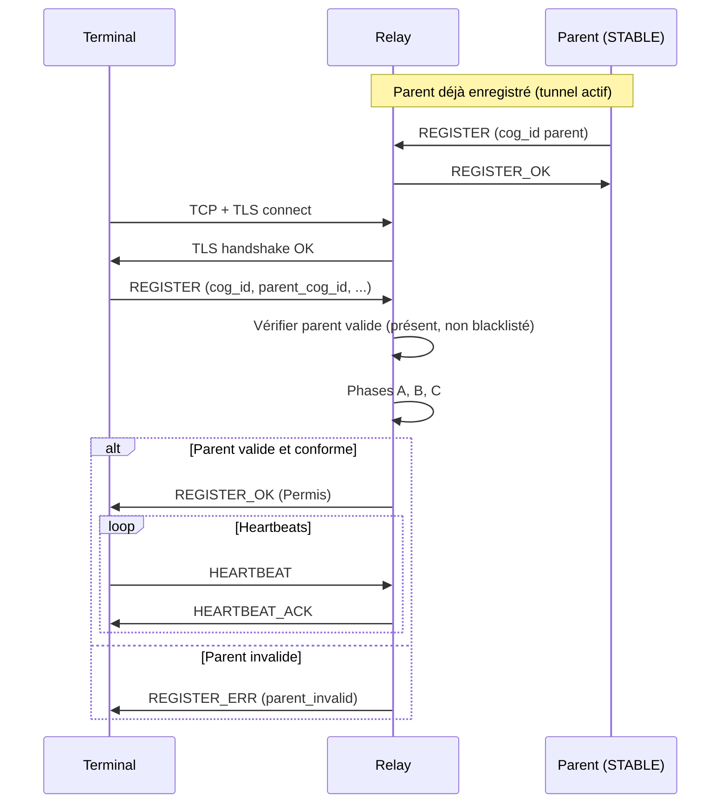
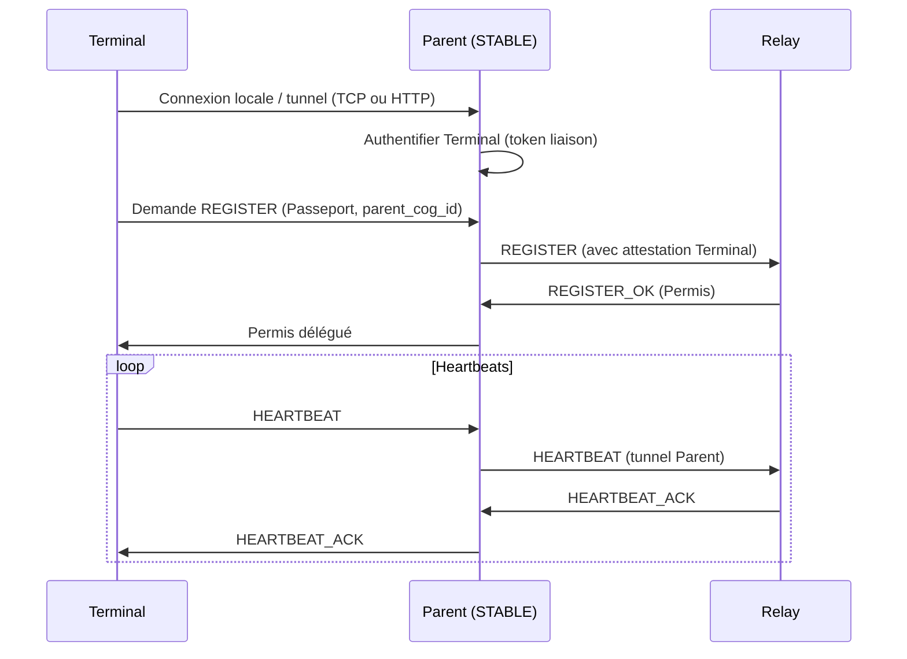
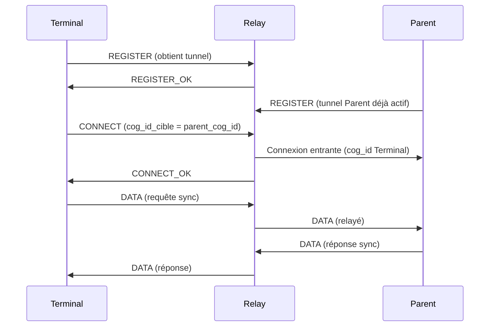
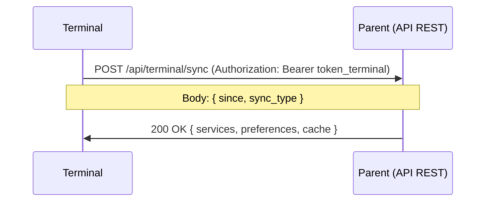
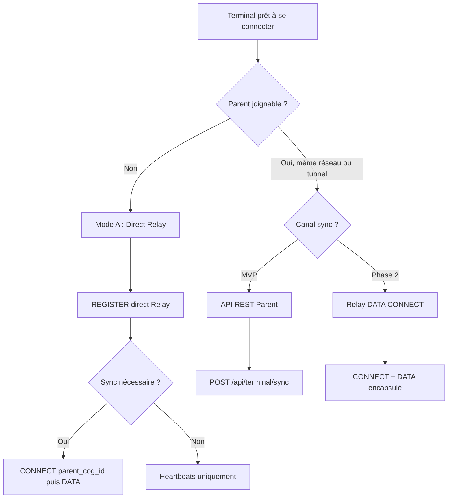

# MiyukiniTerminal — Spécification Canaux Connexion MWS Parent-Enfant

## Contexte

Ce document explicite les **canaux de connexion** entre un COG TERMINAL (enfant) et son COG STABLE (parent) via le **Miyukini Webway System (MWS)**. Il décrit les modes de connexion (direct vs via parent), les acteurs impliqués, les séquences et les critères de choix.

**Références :**

- [Document Fondateur](./MiyukiniTerminal%20-%20Document%20Fondateur.md)
- [Spec Protocole Relay Terminal](./MiyukiniTerminal%20-%20Spec%20Protocole%20Relay%20Terminal.md)
- [Spec Synchronisation Parent](./MiyukiniTerminal%20-%20Spec%20Synchronisation%20Parent.md)
- [MWS - Protocole Relay](../../miyukini-webway-system/protocole/MWS%20-%20Protocole%20Relay.md)

---

## Portée / Scope

- Canaux MWS : connexion directe au Relay vs connexion via parent (tunnel/proxy)
- Acteurs : Terminal, Parent STABLE, Relay, Tracker
- Flux : présentation Passeport, Permis, heartbeats, sync
- Schémas de séquence et tableaux comparatifs
- Recommandations pour le MVP et l'évolution

---

## 1. Acteurs et rôles

| Acteur | Rôle dans la connexion parent-enfant |
|--------|-------------------------------------|
| **Terminal** | COG TERMINAL ; se connecte pour obtenir un Permis ; consomme services et sync via le parent |
| **Parent (STABLE)** | COG STABLE ; possède tunnel Relay actif ; fournit données et délègue actions |
| **Relay (Origin)** | Point central de vérité MWS ; port 7000 (TLS) ; enregistre les tunnels, délivre Permis, route DATA |
| **Tracker** | Port 21000 ; découverte des COGs ; Terminal peut interroger pour découvrir le parent (optionnel) |

**Principe :** Le Terminal **doit** présenter un `parent_cog_id` valide pour obtenir un Permis. Le Relay vérifie que le parent est enregistré et non blacklisté avant d'accepter le Terminal.

---

## 2. Canaux de connexion MWS

### 2.1 Vue d'ensemble

Le Terminal dispose de **deux modes** pour participer au MWS :

| Mode | Description | Canal MWS |
|------|-------------|-----------|
| **A — Direct Relay** | Le Terminal se connecte **directement** au Relay (comme un STABLE) | Terminal ↔ Relay (port 7000) |
| **B — Via parent (tunnel)** | Le Terminal se connecte au parent (réseau local ou tunnel) ; le parent transmet les requêtes MWS | Terminal ↔ Parent ↔ Relay |

Ces deux modes concernent la **connexion MWS** (Passeport, Permis, heartbeats). La **synchronisation des données** (services, cache) peut emprunter d'autres canaux (Relay DATA ou API REST parent) — voir section 5.

---

## 3. Mode A — Connexion directe au Relay

### 3.1 Architecture

```
                    +-------------+
                    |   Relay     |
                    |  (Origin)  |
                    |  :7000 TLS |
                    +------+------+
                           |
         +-----------------+-----------------+
         |                                   |
         | Tunnel T (cog_id Terminal)        | Tunnel P (cog_id Parent)
         | parent_cog_id = Parent            |
         |                                   |
    +----+----+                         +----+----+
    | Terminal |                         | Parent  |
    | (TERMINAL) |                       | (STABLE)|
    +-----------+                       +---------+
```

Le Terminal ouvre sa **propre** connexion TCP/TLS vers le Relay et envoie REGISTER avec :
- `cog_id` du Terminal
- `cog_type` = TERMINAL (0x05)
- `parent_cog_id` = cog_id du Parent

Le Relay :
1. Vérifie que `parent_cog_id` correspond à un STABLE enregistré et en bon état
2. Vérifie que le parent n'est pas blacklisté
3. Exécute les phases A, B, C de vérification (Cores, MIP, environment_health)
4. Délivre REGISTER_OK (session_id, permis_id, trackers)

### 3.2 Séquence directe Relay



### 3.3 Avantages et inconvénients

| Critère | Mode A (Direct Relay) |
|---------|----------------------|
| **Indépendance** | Terminal fonctionne même si le parent est éteint (tant qu'il a un Permis valide) |
| **Simplicité** | Une seule connexion à gérer côté Terminal |
| **Surface d'attaque** | Terminal expose une connexion directe vers l'extérieur |
| **Compatibilité** | Requiert accès réseau au Relay (IP publique ou DNS) |

---

## 4. Mode B — Connexion via parent (tunnel)

### 4.1 Architecture

```
                    +-------------+
                    |   Relay     |
                    |  (Origin)  |
                    +------+------+
                           |
                           | Tunnel unique Parent
                           |
                    +------+------+
                    |   Parent   |
                    |  (STABLE)  |
                    | Proxy MWS  |
                    +------+------+
                           |
         +-----------------+-----------------+
         |                                   |
    Connexion locale              Tunnel custom
    (réseau local)                (VPN, tunnel)
         |                                   |
    +----+----+                         +----+----+
    | Terminal |                         | Terminal |
    | (même LAN) |                       | (mobile) |
    +-----------+                       +---------+
```

Le Terminal **ne se connecte pas** directement au Relay. Il se connecte au **parent** (même réseau local, ou via un tunnel géré par le parent). Le parent :
- Reçoit les requêtes MWS du Terminal (REGISTER simulé, heartbeats)
- **Proxifie** ces requêtes vers le Relay en son nom
- Transmet les réponses du Relay au Terminal

Le Relay ne voit que le Parent ; le Terminal n'a pas de tunnel propre côté Relay. Le Parent atteste que le Terminal est légitime (token de liaison, identité).

### 4.2 Séquence via parent



**Note :** Le Relay peut accepter une "session déléguée" où le Parent enregistre plusieurs Terminaux sous son tunnel — à définir dans le protocole Origin. Sinon, le Parent transmet les messages Relay au Terminal de façon transparente (tunnel multiplexé).

### 4.3 Avantages et inconvénients

| Critère | Mode B (Via parent) |
|---------|---------------------|
| **Sécurité** | Moins de surface d'attaque ; Terminal n'expose pas de connexion directe au Relay |
| **Dépendance** | Terminal **nécessite** que le Parent soit allumé et connecté au Relay |
| **NAT / réseau** | Terminal peut être derrière NAT sans exposition ; le Parent fait le relais |
| **Complexité** | Implémentation proxy côté Parent ; gestion multiplexage si plusieurs Terminaux |

---

## 5. Canaux de synchronisation des données

Indépendamment du canal MWS (direct ou via parent), la **synchronisation** (services, préférences, cache JayKonta/JayKoa) peut emprunter **deux canaux** distincts :

### 5.1 Option Sync 1 : Via Relay DATA (CONNECT → DATA)

Le Terminal, une fois enregistré au Relay, peut **CONNECT** vers `parent_cog_id` pour établir un tunnel logique. Les messages sync sont encapsulés dans des trames DATA.



| Avantage | Infrastructure MWS unifiée ; pas d'API HTTP additionnelle |
| Inconvénient | Complexité ; format payload sync à définir dans DATA |
| Recommandation | Phase 2+ si infrastructure Relay prête pour trafic inter-COG |

### 5.2 Option Sync 2 : API REST sur le parent

Le Parent expose une API HTTP (`POST /api/terminal/sync`) authentifiée par token Terminal. Le Terminal envoie sa requête sync ; le Parent répond avec delta ou full.



| Avantage | Simple, standard HTTP, facile à déboguer |
| Inconvénient | Nécessite que le Parent expose une API (port ou reverse proxy) ; canal séparé du MWS |
| Recommandation | **MVP** — plus rapide à implémenter |

---

## 6. Tableau comparatif des canaux

### 6.1 Canal MWS (Passeport, Permis, heartbeats)

| Critère | Mode A — Direct Relay | Mode B — Via parent |
|---------|------------------------|---------------------|
| **Connexion** | Terminal → Relay (port 7000) | Terminal → Parent → Relay |
| **Tunnel Relay** | Terminal a son propre tunnel | Terminal partage (ou délègue via) tunnel Parent |
| **Parent éteint** | Permis reste valide jusqu'expiration ; sync impossible | Terminal déconnecté du MWS |
| **NAT / mobile** | Terminal doit joindre Relay (IP/DNS publique) | Terminal peut être sur réseau privé |
| **Implémentation** | Relay déjà prévu (parent_cog_id) | Proxy Parent à développer |
| **Phase actuelle** | ✅ Prévu | Optionnel, Phase 2+ |

### 6.2 Canal Sync (données services, cache)

| Critère | Relay DATA (CONNECT) | API REST Parent |
|---------|----------------------|-----------------|
| **Transport** | Trames DATA sur tunnel Relay | HTTP/HTTPS |
| **Authentification** | Session Relay (Permis) | Token Terminal (JWT ou dérivé) |
| **Parent requis** | Oui (pour CONNECT cible) | Oui (serveur API) |
| **Complexité** | Plus élevée (format DATA) | Plus faible |
| **MVP** | Non | ✅ Recommandé |

---

## 7. Diagramme de décision : choix du canal



---

## 8. Recommandations

### 8.1 Pour le MVP

| Canal | Recommandation |
|-------|-----------------|
| **MWS (Permis)** | **Mode A (Direct Relay)** — déjà supporté par le Relay avec `parent_cog_id` |
| **Sync données** | **API REST sur Parent** — plus simple, standard, débogage aisé |

### 8.2 Évolution

| Phase | Évolution possible |
|-------|---------------------|
| **Phase 2** | Option Mode B (via parent) pour terminaux en réseau local strict (pas d'accès Relay direct) |
| **Phase 2** | Migrer la sync vers Relay DATA (CONNECT + DATA) pour unifier le transport |
| **Phase 3** | Support multi-Relay (redirection) ; optimisation batterie (sync adaptative) |

---

## 9. Références

- [Document Fondateur](./MiyukiniTerminal%20-%20Document%20Fondateur.md)
- [Spec Protocole Relay Terminal](./MiyukiniTerminal%20-%20Spec%20Protocole%20Relay%20Terminal.md)
- [Spec MWS Passeport Permis](./MiyukiniTerminal%20-%20Spec%20MWS%20Passeport%20Permis.md)
- [Spec Synchronisation Parent](./MiyukiniTerminal%20-%20Spec%20Synchronisation%20Parent.md)
- [MWS - Protocole Relay](../../miyukini-webway-system/protocole/MWS%20-%20Protocole%20Relay.md)
- [Étude App Android Terminal](../../implementation/Miyukini%20COG%20-%20Etude%20App%20Android%20Terminal.md) (§ 4.1, 4.2)
