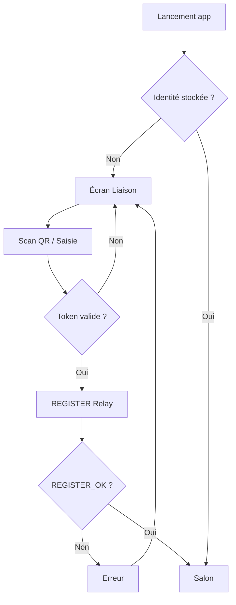
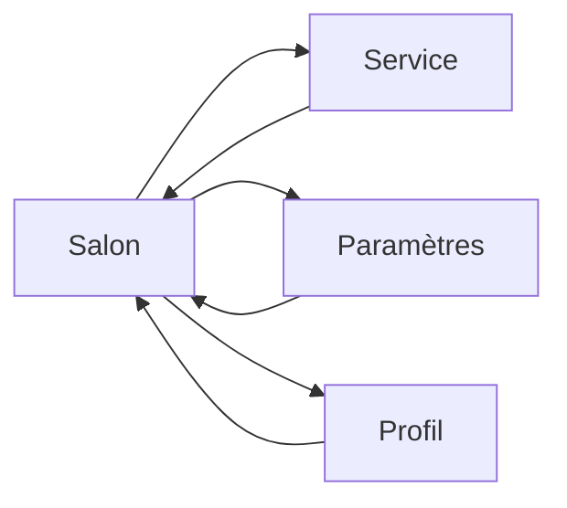

# MiyukiniTerminal — Spécification Écrans et Navigation

## Contexte

Ce document décrit les **écrans** de l'app Terminal (Liaison, Salon, Service, Paramètres, Profil), la **navigation** (bottom nav, drawer), les flux premier lancement vs utilisateur lié et les transitions.

**Références :**

- [Alignement Central Dioxus](./MiyukiniTerminal%20-%20Alignement%20Central%20Dioxus.md)
- [Spec Design System Mobile](./MiyukiniTerminal%20-%20Spec%20Design%20System%20Mobile.md)
- [Spec Parcours Utilisateur](./MiyukiniTerminal%20-%20Spec%20Parcours%20Utilisateur.md)

---

## Portée / Scope

- Liste des écrans
- Navigation (bottom nav)
- Flux premier lancement / utilisateur lié
- Wireframes (texte/Mermaid)
- Transitions

---

## 1. Liste des écrans

| Écran | Rôle |
|-------|------|
| **Liaison** | Scan QR / saisie token ; premier lancement ou après révocation |
| **Salon** | Liste des services du parent ; accès rapide |
| **Service (détail)** | Vue consultative ou actions d'un service (JayKonta, JayKoa) |
| **Paramètres** | Verrouillage, notifications, préférences |
| **Profil** | Infos Terminal, statut liaison, dernière sync |

---

## 2. Navigation

### 2.1 Bottom Navigation (tabs)

```
+------------------------------------------+
|  [Contenu écran actif]                   |
|                                          |
+------------------------------------------+
|  [Salon]  [Paramètres]  [Profil]         |
+------------------------------------------+
```

| Tab | Icône | Écran |
|-----|-------|-------|
| Salon | Maison / grille | Salon |
| Paramètres | Engrenage | Paramètres |
| Profil | Utilisateur | Profil |

### 2.2 Navigation secondaire

- Salon → Service : clic sur une carte service → écran détail
- Retour : bouton ou geste back Android

### 2.3 Drawer (optionnel)

Pour Phase 2+ : drawer latéral avec liens (Salon, Paramètres, Profil, Déconnexion). Alternative à bottom nav si plus de 3 tabs.

---

## 3. Flux premier lancement



### 3.1 Écran Liaison

- Zone scan QR (camera ou galerie)
- Champ saisie manuelle (code ou lien)
- Bouton "Lier"
- Message d'état (en cours, erreur)

---

## 4. Flux utilisateur lié



- Au démarrage : afficher Salon (onglet actif)
- Navigation par tabs sans pile (remplacement écran)
- Service → retour : pile simple (Salon en dessous)

---

## 5. Wireframes texte

### 5.1 Salon

```
+------------------------------------------+
|  MiyukiniTerminal    [●] Connecté        |
+------------------------------------------+
|                                          |
|  Services                                |
|  +------------------------------------+  |
|  | 💰 JayKonta                        |  |
|  | Soldes, mouvements                 |  |
|  +------------------------------------+  |
|  +------------------------------------+  |
|  | 📅 JayKoa                          |  |
|  | Agenda, événements                 |  |
|  +------------------------------------+  |
|                                          |
|  [Pull to refresh]                       |
|                                          |
+------------------------------------------+
|  [Salon]    [Paramètres]    [Profil]     |
+------------------------------------------+
```

### 5.2 Service (ex. JayKonta)

```
+------------------------------------------+
|  [←] JayKonta                            |
+------------------------------------------+
|                                          |
|  Mes portefeuilles                       |
|  +------------------------------------+  |
|  | Principal    125,50 €               |  |
|  +------------------------------------+  |
|  | Voyage       50,00 €                |  |
|  +------------------------------------+  |
|                                          |
|  Derniers mouvements                     |
|  ...                                     |
|                                          |
+------------------------------------------+
```

### 5.3 Paramètres

```
+------------------------------------------+
|  Paramètres                              |
+------------------------------------------+
|  Verrouillage       [Activé]              |
|  Notifications      [Activé]              |
|  Thème              Gaming ▼              |
|  À propos                                |
+------------------------------------------+
|  [Salon]    [Paramètres]    [Profil]     |
+------------------------------------------+
```

---

## 6. Transitions

| Transition | Effet |
|------------|-------|
| Changement tab | Remplacement immédiat (pas d'animation) |
| Salon → Service | Slide droite (standard Android) |
| Service → Retour | Slide gauche |
| Modal | Fade + scale |

---

## 7. Références

- [Spec Design System Mobile](./MiyukiniTerminal%20-%20Spec%20Design%20System%20Mobile.md)
- [Spec Parcours Utilisateur](./MiyukiniTerminal%20-%20Spec%20Parcours%20Utilisateur.md)
- [Alignement Central Dioxus](./MiyukiniTerminal%20-%20Alignement%20Central%20Dioxus.md)
