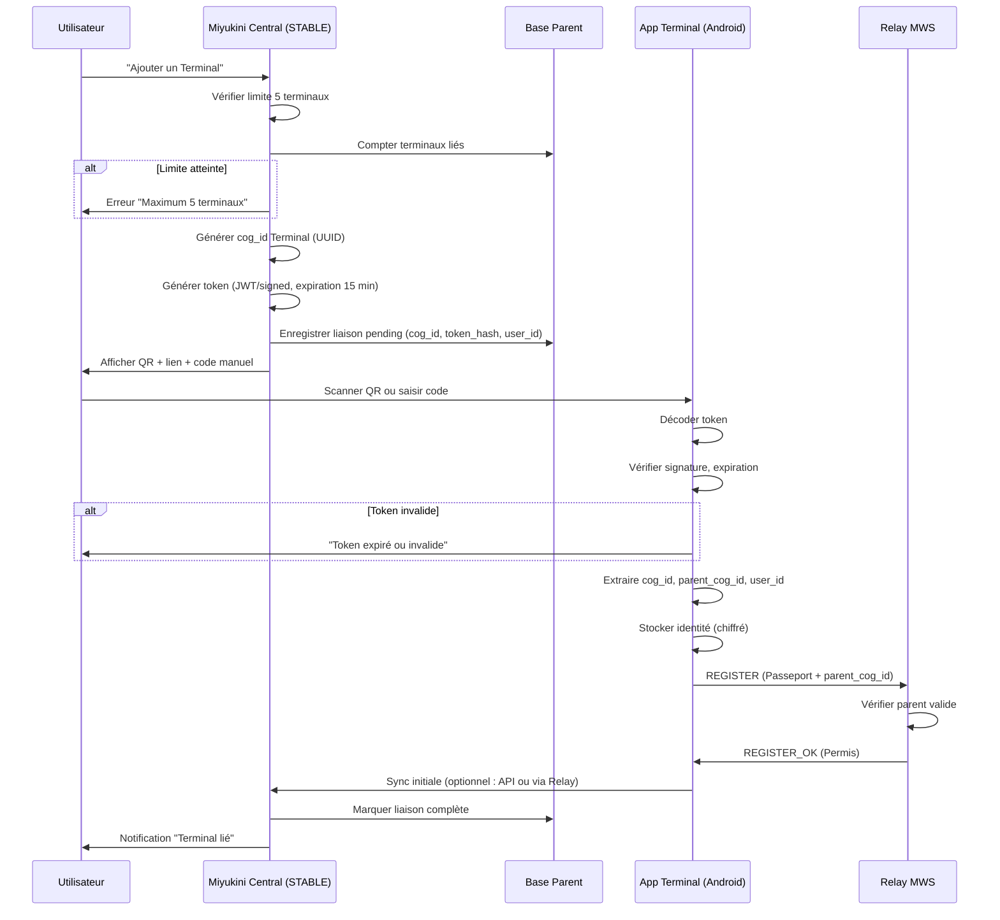
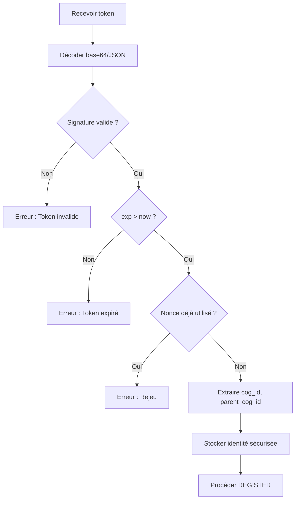

# MiyukiniTerminal — Spécification Flux Liaison Parent

## Contexte

Ce document décrit le **flux complet de liaison** entre un COG STABLE (via Central) et un Terminal Android : génération du token par Central, transmission via QR/lien, scan/saisie par le Terminal, validation, création de l'identité et enregistrement MWS.

**Références :**

- [Document Fondateur](./MiyukiniTerminal%20-%20Document%20Fondateur.md)
- [Spec Central Gestion Terminaux](./MiyukiniTerminal%20-%20Spec%20Central%20Gestion%20Terminaux.md)
- [Spec Token Liaison Securite](./MiyukiniTerminal%20-%20Spec%20Token%20Liaison%20Securite.md)

---

## Portée / Scope

- Flux complet (séquence Mermaid)
- Contenu QR / lien
- Durée de vie du token
- Sécurité (chiffrement, expiration)
- Étapes côté Central et côté Terminal

---

## 1. Flux global



---

## 2. Contenu QR / lien

### 2.1 Format URL

```
miyukini://terminal/link?token=<TOKEN_BASE64>
```

Ou variante :

```
https://miyukini.local/terminal/link?t=<TOKEN_BASE64>
```

### 2.2 Format QR (données brutes)

```json
{
  "v": 1,
  "token": "<TOKEN_JWT_ou_SIGNED>",
  "parent_name": "Mon COG",
  "expires_at": 1234567890
}
```

`token` : JWT ou payload signé contenant cog_id, parent_cog_id, user_id, expiration, nonce.

### 2.3 Code manuel (fallback)

Format court (ex. 8 caractères alphanumériques) permettant de récupérer le token via une API Central :

```
XXXX-XXXX
```

Le Terminal appelle `GET /api/terminal/link/{code}` pour obtenir le token (une seule fois ; code invalidé après utilisation).

---

## 3. Étapes détaillées

### 3.1 Côté Central

| Étape | Action |
|-------|--------|
| 1 | Vérifier utilisateur connecté |
| 2 | Compter terminaux liés ; si >= 5, refuser |
| 3 | Générer cog_id (UUID v4) pour le nouveau Terminal |
| 4 | Générer token (voir [Spec Token](./MiyukiniTerminal%20-%20Spec%20Token%20Liaison%20Securite.md)) |
| 5 | Stocker en DB : cog_id, parent_cog_id, token_hash, created_at, status=pending |
| 6 | Afficher QR (données token + métadonnées) |
| 7 | Afficher lien cliquable (deep link) |
| 8 | Afficher code manuel (optionnel) |
| 9 | À la confirmation Terminal : status=linked |

### 3.2 Côté Terminal

| Étape | Action |
|-------|--------|
| 1 | Écran Liaison : scan QR ou saisie code/lien |
| 2 | Décoder token |
| 3 | Vérifier signature (clé Central/Origin) |
| 4 | Vérifier expiration |
| 5 | Vérifier nonce (anti-rejeu) |
| 6 | Extraire cog_id, parent_cog_id |
| 7 | Stocker identité (Keystore / EncryptedSharedPreferences) |
| 8 | Se connecter au Relay avec Passeport (parent_cog_id) |
| 9 | Si REGISTER_OK : liaison complète ; passer à Salon |
| 10 | Si REGISTER_ERR : afficher erreur ; proposer réessayer |

---

## 4. Durée de vie token

| Paramètre | Valeur |
|-----------|--------|
| Expiration | 15 minutes (configurable) |
| Usage unique | Recommandé ; token invalidé après première utilisation |
| Renouvellement | Utilisateur peut générer un nouveau token depuis Central |

---

## 5. Sécurité

| Mesure | Description |
|--------|-------------|
| Signature | Token signé (HMAC ou Ed25519) ; vérification côté Terminal |
| Expiration courte | Limiter fenêtre d'utilisation |
| Pas de log | Ne jamais logger le token en clair |
| Stockage identité | cog_id, parent_cog_id chiffrés (Keystore) |
| HTTPS / TLS | Toute communication avec Central en TLS |
| Anti-rejeu | Nonce dans token ; vérifier côté Central |

---

## 6. Logique de validation token (côté Terminal)



### 6.1 Ordre des vérifications

| Ordre | Vérification | Si échec |
|-------|--------------|----------|
| 1 | Décodage (base64, JSON) | Token invalide |
| 2 | Présence champs obligatoires | Token invalide |
| 3 | Signature Ed25519 | Token invalide |
| 4 | exp > now (+ marge 60s) | Token expiré |
| 5 | Nonce (anti-rejeu si applicable) | Token déjà utilisé |
| 6 | cog_id, parent_cog_id non vides | Token invalide |

### 6.2 Gestion d'erreurs

| Erreur | Message utilisateur |
|--------|---------------------|
| Token expiré | "Le lien a expiré. Générez-en un nouveau depuis Central." |
| Token invalide | "Lien invalide. Vérifiez le code ou scannez à nouveau le QR." |
| Limite 5 atteinte | "Vous avez déjà 5 terminaux. Révoquez-en un pour en ajouter." |
| Parent déconnecté | "Votre COG parent n'est pas connecté au réseau. Réessayez plus tard." |
| REGISTER_ERR | "Impossible de joindre le réseau. Vérifiez votre connexion." |

---

## 7. Références

- [Spec Central Gestion Terminaux](./MiyukiniTerminal%20-%20Spec%20Central%20Gestion%20Terminaux.md)
- [Spec Token Liaison Securite](./MiyukiniTerminal%20-%20Spec%20Token%20Liaison%20Securite.md)
