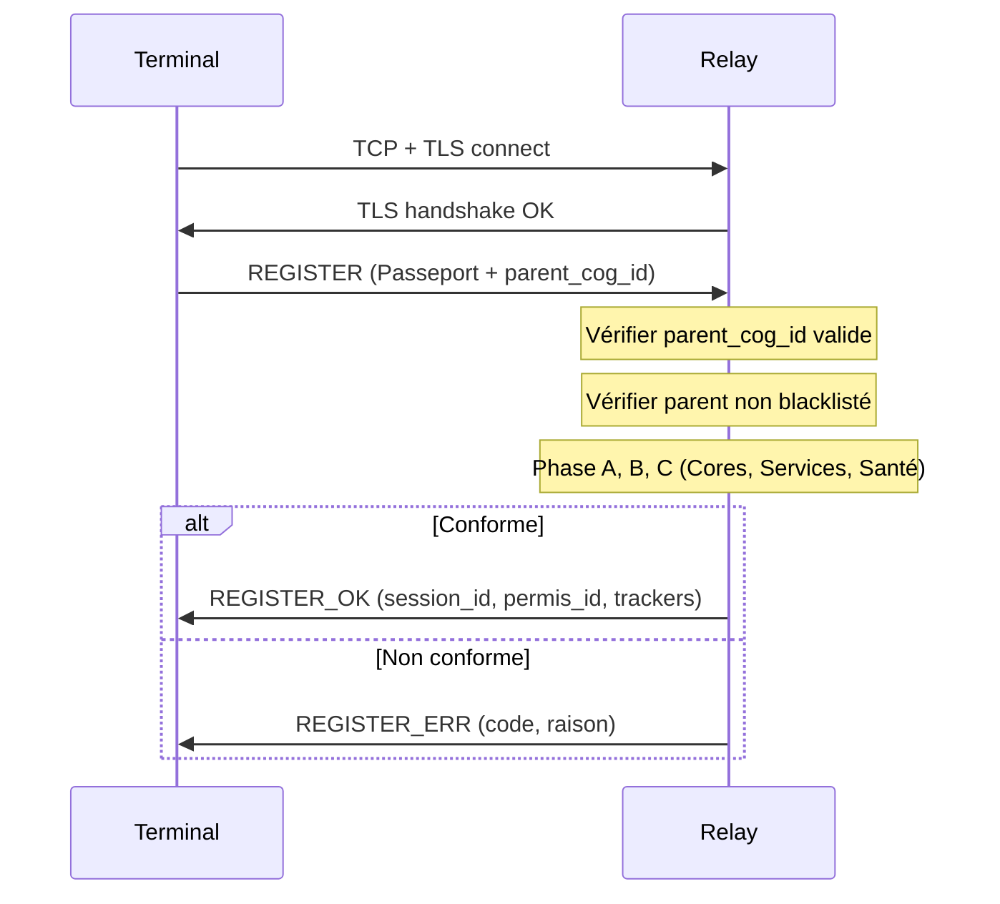
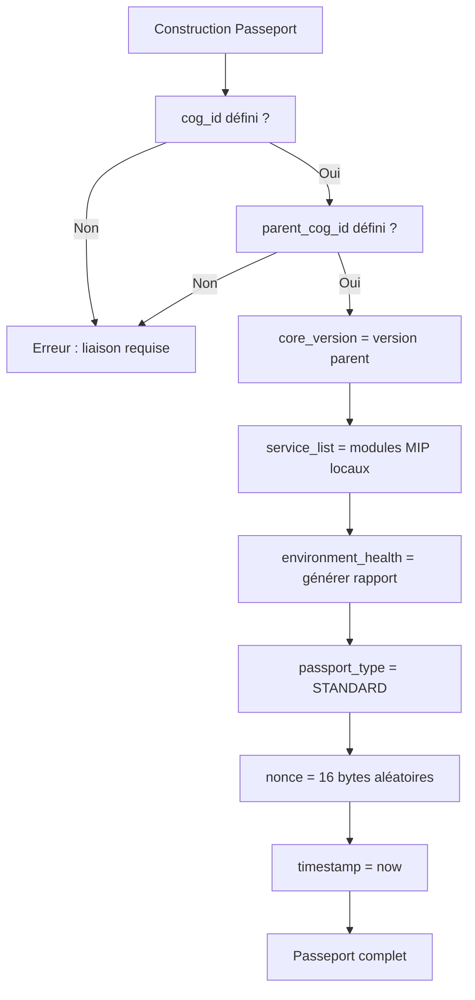

# MiyukiniTerminal — Spécification MWS Passeport et Permis

## Contexte

Ce document détaille le **Passeport COG** et le **Permis de circulation** pour un COG TERMINAL Android : champs obligatoires, format, séquence de présentation au Relay, codes d'erreur, durée et renouvellement.

**Références :**

- [Spec Canaux Connexion MWS Parent-Enfant](./MiyukiniTerminal%20-%20Spec%20Canaux%20Connexion%20MWS%20Parent%20Enfant.md)
- [MWS - Passeport et Visa](../../miyukini-webway-system/verification/MWS%20-%20Passeport%20et%20Visa.md)
- [MWS - Protocole Relay](../../miyukini-webway-system/protocole/MWS%20-%20Protocole%20Relay.md)
- [Spec Protocole Relay Terminal](./MiyukiniTerminal%20-%20Spec%20Protocole%20Relay%20Terminal.md)

---

## Portée / Scope

- Passeport TERMINAL : champs obligatoires et valeurs
- Format binaire (aligné protocole Relay)
- Séquence présentation Relay
- Permis de circulation : contenu, durée, renouvellement
- Codes d'erreur applicables au Terminal

---

## 1. Passeport TERMINAL — Champs obligatoires

### 1.1 Vue d'ensemble

| Champ | Valeur TERMINAL | Obligatoire |
|-------|-----------------|-------------|
| `cog_id` | UUID v4 ou LSI | ✅ |
| `cog_type` | `TERMINAL` (0x05) | ✅ |
| `os_type` | `ANDROID` (0x03) | ✅ |
| `core_version` | `MAJOR.MINOR` (ex. `1.0`) | ✅ |
| `service_list` | Liste Services du parent (réduite) | ✅ |
| `environment_health` | Rapport santé (simplifié Terminal) | ✅ |
| `previous_permis` | Historique (vide si premier) | ✅ |
| `passport_type` | `STANDARD` (0x00) | ✅ |
| `parent_cog_id` | cog_id du COG STABLE parent | ✅ |
| `special_key` | Vide (STANDARD) | — |
| `nonce` | 16 octets aléatoires | ✅ |
| `timestamp` | Secondes depuis epoch | ✅ |

### 1.2 Détail des champs

#### cog_id

| Propriété | Description |
|-----------|-------------|
| **Format** | UUID v4 ou LSI |
| **Génération** | Par le parent (Central) lors de la liaison |
| **Unicité** | Unique dans le réseau MWS |

#### cog_type

| Valeur | Octet | Description |
|--------|-------|-------------|
| TERMINAL | 0x05 | COG mobile enfant d'un STABLE |

#### os_type

| Valeur | Octet | Description |
|--------|-------|-------------|
| ANDROID | 0x03 | Google Android |

#### core_version

| Propriété | Description |
|-----------|-------------|
| **Format** | `MAJOR.MINOR` (ex. `1.0`, `2.3`) |
| **Source** | Héritée du parent ; identique au STABLE |
| **Compatibilité** | Doit matcher la version attendue par le Relay |

#### service_list (svc_manifest)

Pour un Terminal, liste **réduite** des services consultables :

```json
[
  {"service_id": "jaykonta", "version": "1.0.0", "mode": "consultative"},
  {"service_id": "jaykoa", "version": "1.0.0", "mode": "consultative"}
]
```

#### environment_health

Rapport simplifié (Terminal n'a pas de Cores complets) :

```json
{
  "storage_integrity": "OK",
  "config_valid": true,
  "strata_intact": true,
  "terminal_parent_valid": true,
  "generated_at": 1234567890
}
```

#### parent_cog_id

| Propriété | Description |
|-----------|-------------|
| **Obligatoire** | Toujours présent pour TERMINAL |
| **Format** | UUID ou LSI du parent |
| **Validation Relay** | Le Relay vérifie que le parent est un STABLE valide et non blacklisté |

#### previous_permis

Historique des Permis précédents (JSON) ; vide `[]` si premier enregistrement.

---

## 2. Format binaire (REGISTER)

Aligné sur [MWS - Protocole Relay](../../miyukini-webway-system/protocole/MWS%20-%20Protocole%20Relay.md) section 4.2.

| Champ | Taille | Description |
|-------|--------|-------------|
| token_len | 2 | Longueur token |
| token | Variable | Token d'auth |
| cog_id_len | 2 | Longueur cog_id |
| cog_id | Variable | Identifiant COG |
| cog_type | 1 | 0x05 (TERMINAL) |
| os_type | 1 | 0x03 (ANDROID) |
| core_version_len | 1 | Longueur core_version |
| core_version | Variable | ex. "1.0" |
| svc_manifest_len | 2 | Longueur JSON services |
| svc_manifest | Variable | service_list JSON |
| env_health_len | 2 | Longueur rapport |
| environment_health | Variable | JSON |
| permis_history_len | 2 | Longueur previous_permis |
| previous_permis | Variable | JSON |
| passport_type | 1 | 0 (STANDARD) |
| special_key_len | 2 | 0 (STANDARD) |
| special_key | — | Vide |
| parent_cog_id_len | 2 | Longueur parent_cog_id |
| parent_cog_id | Variable | cog_id du parent |
| nonce | 16 | Anti-rejeu |
| timestamp | 8 | Epoch seconds |

---

## 3. Séquence présentation Relay



**Vérification parent :** Le Relay doit pouvoir valider que `parent_cog_id` correspond à un STABLE enregistré et en bon état.

### 3.1 Logique détaillée des phases (TERMINAL)

| Phase | STABLE | TERMINAL | Explication |
|-------|--------|----------|-------------|
| **Phase A** | Clé Cores locale | Clé dérivée ou délégation parent | Terminal n'a pas de Cores ; clé attestant intégrité du build client |
| **Phase B** | Blocs des Services locaux | Blocs du code Terminal (liaison, mws, sync) | Vérification de l'intégrité du client, pas des Services distants |
| **Phase C** | environment_health complet | environment_health simplifié | storage_integrity, config_valid, terminal_parent_valid |

**Décision Relay pour Phase A TERMINAL :** Si le Terminal présente une clé dérivée des blocs MIP (hash des modules critiques), le Relay compare avec la référence Origin pour la version déclarée. Alternative : le Relay accepte une délégation — le parent atteste que le Terminal est légitime (mécanisme à définir entre Relay et Origin).

**Décision Relay pour Phase B TERMINAL :** Le Relay interprète `service_list` comme une liste de **modules de code local** (ex. `terminal.liaison`, `terminal.mws`). Il demande un bloc aléatoire parmi ces modules via l'index MIP du Terminal. Voir [Spec MSCM MIP Conformite](./MiyukiniTerminal%20-%20Spec%20MSCM%20MIP%20Conformite.md).

---

## 4. Permis de circulation

### 4.1 Contenu REGISTER_OK

| Champ | Description |
|-------|-------------|
| session_id | 16 octets ; identifiant session |
| permis_id | Identifiant Permis |
| permis_expires_at | Date expiration (epoch) |
| permis_scope | Portée (JSON) |
| tracker_addresses | Liste trackers officiels |
| tracker_signature | Signature Ed25519 liste trackers |
| status | 0=OK, 1=UPDATE_RECOMMENDED |
| min_core_version | (optionnel) Version min recommandée |

### 4.2 Durée

| Type | Durée typique |
|------|---------------|
| STANDARD | 24–72 h (configurable côté Origin) |
| Renouvellement | Avant expiration ; nouveau REGISTER ou heartbeat prolonge |

### 4.3 Renouvellement

- Envoyer HEARTBEAT régulièrement pour maintenir la session
- Si Permis expire : renvoyer REGISTER avec `previous_permis` rempli
- En cas de REGISTER_ERR : réessayer après délai (exponential backoff)

---

## 5. Codes d'erreur REGISTER_ERR

| Code | Nom | Description | Action Terminal |
|------|-----|-------------|-----------------|
| 1 | invalid_token | Token invalide | Vérifier token ; relancer liaison |
| 2 | cog_id_conflict | cog_id déjà pris | Régénérer cog_id (via parent) |
| 7 | incompatible_core_version | Cores incompatibles | Mettre à jour app |
| 9 | core_key_mismatch | Clé Cores incorrecte | Vérifier config |
| 11 | environment_health_failed | Santé non conforme | Corriger config locale |
| 12 | quarantine | COG en quarantaine | Attendre ; contacter support |
| 13 | blacklisted | COG blacklisté | Vérifier parent ; parent blacklisté ? |
| 14 | redirect | Redirection relay | Se connecter au relay indiqué |
| * | parent_invalid | (si implémenté) Parent invalide | Relancer liaison ; vérifier parent |

---

## 6. Règles spécifiques TERMINAL

| Règle | Description |
|-------|-------------|
| parent_cog_id obligatoire | Refus si absent |
| Parent valide | Relay vérifie existence et statut du parent |
| Même utilisateur | Parent et Terminal = même identité (vérification via token/user_id) |
| Limite 5 | Parent ne peut avoir que 5 Terminaux (vérifié côté Central, pas Relay) |
| Blacklist | Si parent blacklisté → tous ses Terminaux refusés |

---

## 7. Arbre de décision : construction du Passeport



### 7.1 Règles de validation pré-envoi

Avant d'envoyer le REGISTER, le Terminal doit vérifier :

| Règle | Vérification |
|-------|--------------|
| cog_id non vide | `cog_id.len() > 0` |
| parent_cog_id non vide | Obligatoire pour TERMINAL |
| core_version format | `MAJOR.MINOR` (regex `\d+\.\d+`) |
| service_list non vide | Au moins un module (terminal.*) |
| environment_health récent | `generated_at` < 5 min |
| nonce unique | Générer via `getrandom` ou équivalent |

---

## 8. Références

- [MWS - Passeport et Visa](../../miyukini-webway-system/verification/MWS%20-%20Passeport%20et%20Visa.md)
- [MWS - Flux de Vérification](../../miyukini-webway-system/verification/MWS%20-%20Flux%20de%20Verification.md)
- [Spec MSCM MIP Conformite](./MiyukiniTerminal%20-%20Spec%20MSCM%20MIP%20Conformite.md)
- [Spec Protocole Relay Terminal](./MiyukiniTerminal%20-%20Spec%20Protocole%20Relay%20Terminal.md)
- [Spec Flux Liaison Parent](./MiyukiniTerminal%20-%20Spec%20Flux%20Liaison%20Parent.md)
