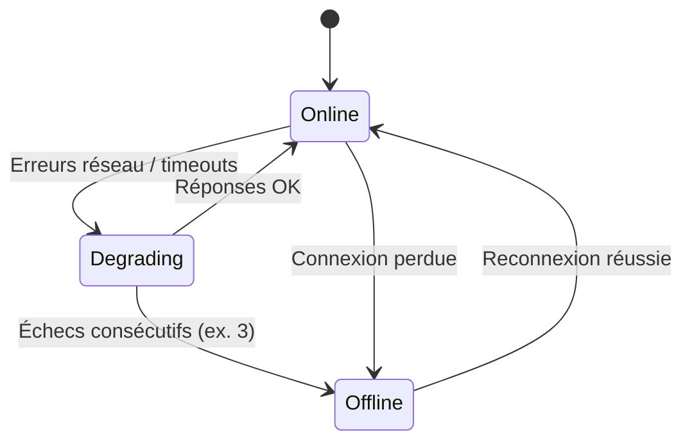

# MiyukiniTerminal — Spécification Mode Offline

## Contexte

Ce document décrit le **mode offline** du Terminal : états (online, offline, degrading), comportement par état, lecture cache, écriture dans la queue, indicateur UI, reconnexion automatique et stratégie de retry.

**Références :**

- [Spec Synchronisation Parent](./MiyukiniTerminal%20-%20Spec%20Synchronisation%20Parent.md)
- [Spec Queue Actions Offline](./MiyukiniTerminal%20-%20Spec%20Queue%20Actions%20Offline.md)
- [Spec Stockage Local](./MiyukiniTerminal%20-%20Spec%20Stockage%20Local.md)

---

## Portée / Scope

- États : online, offline, degrading
- Comportement par état
- Lecture cache, écriture queue
- Indicateur UI
- Reconnexion et retry

---

## 1. États de connexion

### 1.1 Définition

| État | Description |
|------|-------------|
| **Online** | Connexion Relay active ; Permis valide ; sync possible |
| **Offline** | Aucune connexion ; données en cache uniquement |
| **Degrading** | Connexion instable (timeouts, erreurs partielles) ; bascule vers Offline si persistant |

### 1.2 Transitions



---

## 2. Comportement par état

### 2.1 Online

| Action | Comportement |
|--------|--------------|
| Lecture | Données fraîches (sync) ; cache mis à jour |
| Écriture | Envoi immédiat au parent ; pas de queue (sauf si délégation volontaire) |
| Sync | Automatique (périodique) + pull-to-refresh |
| Queue | Rejouer pending au passage Offline → Online |
| Indicateur UI | Icône "Connecté" (vert) |

### 2.2 Offline

| Action | Comportement |
|--------|--------------|
| Lecture | Cache local uniquement ; afficher mention "Dernière mise à jour : …" |
| Écriture | Enregistrer dans queue ; pas d'envoi |
| Sync | Impossible ; bouton désactivé ou message "Hors ligne" |
| Indicateur UI | Icône "Hors ligne" (gris/orange) ; bannière possible |
| Actions | Toutes les actions écriture → queue |

### 2.3 Degrading

| Action | Comportement |
|--------|--------------|
| Lecture | Tenter sync ; si échec, fallback cache |
| Écriture | Tenter envoi ; si échec, queue |
| Indicateur UI | Icône "Connexion instable" (orange) ; "Synchronisation en cours..." |

---

## 3. Lecture cache

### 3.1 Règles

| Règle | Description |
|-------|-------------|
| Toujours disponible | Le cache est lu même en Offline |
| Staleness | Afficher "Données du [date]" si > 1h |
| Vide | Si pas de cache (premier lancement sans sync) : message "Connectez-vous pour charger les données" |

### 3.2 Affichage

- Badge ou texte : "Hors ligne — Données du 22/02/2026 14:30"
- Couleur secondaire (gris) pour indiquer que ce n'est pas du temps réel

---

## 4. Écriture queue

### 4.1 Quand

- En Offline : toute action écriture → queue
- En Degrading : après échec envoi → queue
- En Online : optionnel ; par défaut envoi direct

### 4.2 Feedback utilisateur

| Moment | Message |
|--------|---------|
| Enregistrement queue | "Enregistré. Sera synchronisé à la prochaine connexion." |
| Compteur | Badge "3 actions en attente" (si > 0) |
| Après sync | "Synchronisé" ; vider le badge |

---

## 5. Indicateur UI

### 5.1 Placement

- Barre de statut (header) ou coin écran
- Icône + tooltip au clic

### 5.2 Icônes

| État | Icône | Couleur |
|------|-------|---------|
| Online | ✓ ou wifi | Vert |
| Offline | ⊘ ou nuage barré | Gris |
| Degrading | ⟳ ou wifi faible | Orange |
| Sync en cours | ⟳ (animée) | Bleu |

### 5.3 Bannière (optionnel)

En Offline, bannière en haut : "Vous êtes hors ligne. Les modifications seront synchronisées à la reconnexion."

---

## 6. Reconnexion automatique

### 6.1 Détection

| Méthode | Description |
|---------|-------------|
| Network callback | `ConnectivityManager.NetworkCallback` (Android) |
| Tenter connexion | Periodiquement (ex. 30 s) si Offline |
| Au retour app | Quand l'app repasse au premier plan |

### 6.2 Séquence reconnexion

1. Détecter réseau disponible
2. Tenter connexion Relay (REGISTER ou heartbeat)
3. Si succès : état → Online
4. Lancer sync (pull données)
5. Rejouer queue (actions pending)
6. Mettre à jour indicateur
7. Notification optionnelle : "Connexion rétablie. Données synchronisées."

---

## 7. Stratégie retry (exponential backoff)

### 7.1 Paramètres

| Paramètre | Valeur |
|-----------|--------|
| Intervalle initial | 5 s |
| Multiplicateur | 2 |
| Max intervalle | 60 s |
| Max tentatives | Illimité (jusqu'à succès ou user quit) |

### 7.2 Algorithme

```
delay = min(5 * 2^attempt, 60)
```

Tenter toutes les `delay` secondes. À chaque succès : reset attempt à 0.

---

## 8. Logique de transition d'état (détaillée)

### 8.1 Conditions de passage Offline → Online

| Condition | Détection |
|-----------|------------|
| Réseau disponible | `ConnectivityManager.getActiveNetwork() != null` |
| Relay atteignable | Connexion TCP+TLS réussie |
| REGISTER OK | Réception REGISTER_OK avec permis_id |

**Règle :** Ne pas déclarer Online tant que les trois conditions ne sont pas remplies. Éviter les faux positifs (réseau local sans Internet).

### 8.2 Conditions de passage Online → Offline

| Condition | Détection |
|-----------|------------|
| Perte réseau | `onLost` NetworkCallback |
| Timeout connexion | 3 heartbeats sans ACK |
| CLOSE reçu | Message CLOSE du Relay |
| Erreur TLS/IO | Exception sur socket |

### 8.3 État Degrading : seuils

| Métrique | Seuil Degrading | Seuil Offline |
|----------|-----------------|---------------|
| Heartbeats manqués | 1 | 3 |
| Erreurs consécutives | 2 | 5 |
| Latence | > 5 s | Timeout |

---

## 9. Références

- [Spec Synchronisation Parent](./MiyukiniTerminal%20-%20Spec%20Synchronisation%20Parent.md)
- [Spec Queue Actions Offline](./MiyukiniTerminal%20-%20Spec%20Queue%20Actions%20Offline.md)
- [Spec Parcours Utilisateur](./MiyukiniTerminal%20-%20Spec%20Parcours%20Utilisateur.md)
