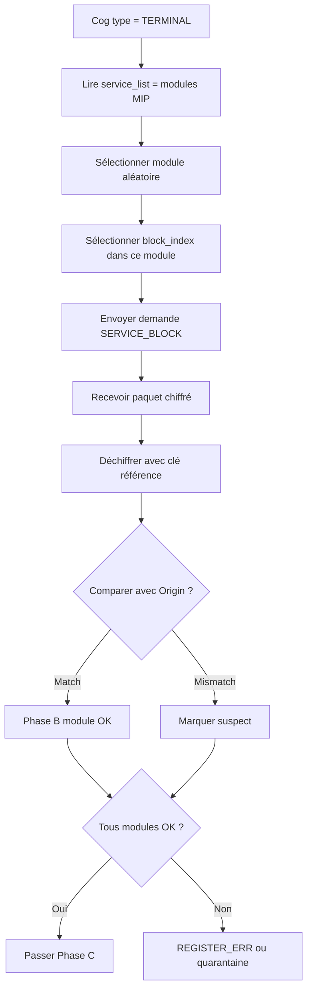

# MiyukiniTerminal — Spécification Protocole Relay Terminal

## Contexte

Ce document détaille la **séquence REGISTER** avec `parent_cog_id`, les trames binaires, les messages (0x01–0x0B, 0x10–0x13), les heartbeats, la gestion TLS, les timeouts et la reconnexion pour un COG TERMINAL.

**Références :**

- [Spec Canaux Connexion MWS Parent-Enfant](./MiyukiniTerminal%20-%20Spec%20Canaux%20Connexion%20MWS%20Parent%20Enfant.md)
- [MWS - Protocole Relay](../../miyukini-webway-system/protocole/MWS%20-%20Protocole%20Relay.md)
- [Spec MWS Passeport Permis](./MiyukiniTerminal%20-%20Spec%20MWS%20Passeport%20Permis.md)
- [Spec MiyuWebwayParticipant Adapt](./MiyukiniTerminal%20-%20Spec%20MiyuWebwayParticipant%20Adapt.md)

---

## Portée / Scope

- Séquence REGISTER avec parent_cog_id
- Structure des trames
- Messages principaux et vérification
- Heartbeats, timeouts, reconnexion
- Cas REFUS parent invalide

---

## 1. Structure des trames

### 1.1 En-tête (header)

```
+--------+--------+--------+------------------+
| Version|  Type  | Flags  | Payload length   |
+--------+--------+--------+------------------+
| Payload (variable)                           |
+----------------------------------------------+
```

| Champ | Taille | Description |
|-------|--------|-------------|
| Version | 1 octet | protocol_version = 1 |
| Type | 1 octet | Type message (voir §2) |
| Flags | 1 octet | Bits optionnels |
| Payload length | 2 ou 4 octets | Big-endian |
| Payload | Variable | Contenu |

### 1.2 Ordre des octets

**Big-endian** (network byte order) pour les champs multi-octets.

---

## 2. Types de messages

### 2.1 Messages principaux

| Code | Nom | Direction | Usage Terminal |
|------|-----|-----------|----------------|
| 0x01 | REGISTER | COG → Relay | ✅ Envoi Passeport + parent_cog_id |
| 0x02 | REGISTER_OK | Relay → COG | ✅ Réception Permis |
| 0x03 | REGISTER_ERR | Relay → COG | ✅ Refus ; raison |
| 0x04 | CONNECT | Client → Relay | Optionnel (connexion vers autre COG) |
| 0x05 | CONNECT_OK | Relay → Client | Optionnel |
| 0x06 | CONNECT_ERR | Relay → Client | Optionnel |
| 0x07 | DATA | Bidirectionnel | Données opaques |
| 0x08 | HEARTBEAT | Bidirectionnel | ✅ Garde la session vivante |
| 0x09 | HEARTBEAT_ACK | Réponse | ✅ Accusé heartbeat |
| 0x0A | CLOSE | Bidirectionnel | Fermeture propre |
| 0x0B | ERROR | Bidirectionnel | Erreur protocolaire |

### 2.2 Messages vérification (Phase A, B, C)

| Code | Nom | Direction | Usage Terminal |
|------|-----|-----------|----------------|
| 0x10 | CORE_KEY | COG → Relay | ✅ Envoi clé conformité Cores |
| 0x11 | SERVICE_BLOCK | COG → Relay | ✅ Blocs MIP Services |
| 0x12 | VERIFY_RESULT | Relay → COG | ✅ Résultat phase |
| 0x13 | REDIRECT | Relay → COG | Redirection vers autre relay |

### 2.3 Autres

| Code | Nom | Usage Terminal |
|------|-----|----------------|
| 0x30 | PERMIT_REVOKE | Réception si Permis révoqué |

---

## 3. Séquence REGISTER complète

```mermaid
sequenceDiagram
    participant T as Terminal
    participant R as Relay

    T->>R: TCP connect
    T->>R: TLS ClientHello
    R->>T: TLS ServerHello, Certificate, ...
    T->>R: TLS ClientKeyExchange, ...
    Note over T,R: TLS handshake OK

    T->>R: REGISTER (token, cog_id, cog_type=0x05, os_type=0x03, parent_cog_id, ...)
    R->>R: Vérifier parent_cog_id
    alt Parent invalide / blacklisté
        R->>T: REGISTER_ERR (parent_invalid ou blacklisted)
        T->>T: Afficher erreur ; relancer liaison
    end

    R->>T: CORE_KEY request (Phase A)
    T->>R: CORE_KEY (clé)
    R->>T: VERIFY_RESULT (phase_a, OK/FAIL)

    R->>T: SERVICE_BLOCK request (Phase B)
    T->>R: SERVICE_BLOCK (paquet)
    R->>T: VERIFY_RESULT (phase_b, OK/FAIL)

    R->>R: Phase C : environment_health

    alt Tout conforme
        R->>T: REGISTER_OK (session_id, permis_id, trackers)
    else Non conforme
        R->>T: REGISTER_ERR (code, raison)
    end
```

---

## 4. REGISTER avec parent_cog_id

Le champ `parent_cog_id` est encodé :

- `parent_cog_id_len` : 2 octets (big-endian), longueur en octets
- `parent_cog_id` : N octets (UTF-8)

Pour TERMINAL : **jamais vide**. Longueur > 0 obligatoire.

---

## 5. Heartbeats

### 5.1 Format HEARTBEAT

| Champ | Taille | Description |
|-------|--------|-------------|
| session_id | 16 octets | Session courante |
| timestamp | 8 octets | Epoch seconds |

### 5.2 Intervalle recommandé

| Paramètre | Valeur |
|-----------|--------|
| Intervalle envoi | 30–60 s |
| Timeout attendu ACK | 10 s |
| Reconnexion si pas d'ACK | Après 3 échecs consécutifs |

### 5.3 HEARTBEAT_ACK

Le Relay répond par HEARTBEAT_ACK avec le même timestamp (ou variante selon spec). Absence de réponse = considérer connexion morte.

---

## 6. TLS

| Règle | Description |
|-------|-------------|
| **Obligatoire** | Connexion Relay toujours en TLS |
| **Port** | 7000 (Relay) |
| **Validation certificat** | Vérifier chaîne ; pas de mode "accepter tout" en prod |
| **Versions** | TLS 1.2 minimum ; TLS 1.3 recommandé |

---

## 7. Timeouts et reconnexion

### 7.1 Timeouts

| Événement | Timeout |
|-----------|---------|
| Connexion TCP | 10 s |
| TLS handshake | 15 s |
| Envoi REGISTER → REGISTER_OK | 30 s |
| HEARTBEAT → HEARTBEAT_ACK | 10 s |

### 7.2 Reconnexion

| Déclencheur | Action |
|-------------|--------|
| Connexion perdue | Reconnexion immédiate |
| REGISTER_ERR | Backoff exponentiel : 1s, 2s, 4s, ... max 60s |
| HEARTBEAT non ACK (3×) | Fermer ; reconnexion |
| REDIRECT | Se connecter au relay indiqué |

### 7.3 Stratégie mobile

Sur Android, la connexion peut être interrompue (réseau mobile, batterie). Le Terminal doit :

- Détecter perte de connexion (IO error, timeout)
- Repasser en mode offline (indicateur UI)
- Tenter reconnexion en arrière-plan (intervalle adaptatif)
- Ne pas bloquer l'UI ; queue des actions

---

## 8. Cas REFUS parent invalide

### 8.1 Codes possibles

| Code | Signification |
|------|---------------|
| REGISTER_ERR (nouveau) | `parent_invalid` : parent_cog_id non trouvé ou invalide |
| REGISTER_ERR 13 | `blacklisted` : parent blacklisté → Terminaux refusés |

### 8.2 Comportement Terminal

1. Afficher message utilisateur : "Impossible de joindre le réseau. Vérifiez que votre COG parent est connecté."
2. Proposer : "Réessayer" ou "Relancer la liaison"
3. Logger l'erreur (sans token ni données sensibles)
4. Ne pas spammer le Relay ; respecter backoff

---

## 9. Flux CLOSE

Si le Relay envoie CLOSE (ex. Permis révoqué, maintenance) :

1. Fermer la connexion proprement
2. Mettre à jour état : déconnecté
3. Indicateur UI : offline
4. Tenter reconnexion après délai

---

## 10. Protocole Phase B (SERVICE_BLOCK) pour Terminal

### 10.1 Logique côté Relay



### 10.2 Logique côté Terminal (réception SERVICE_BLOCK)

| Étape | Action Terminal |
|-------|-----------------|
| 1 | Recevoir `(service_id, block_index)` |
| 2 | Résoudre `service_id` → module (ex. `terminal.liaison`) |
| 3 | Consulter index MIP local : bloc à `block_index` |
| 4 | Extraire lignes `start_line..end_line` du fichier source |
| 5 | Chiffrer le contenu avec clé de vérification |
| 6 | Envoyer paquet dans message réponse |

**Contrainte :** Le Terminal doit embarquer l'index MIP (ou une table bloc→lignes) pour résoudre les demandes. En release, le code source peut être absentes ; les blocs sont pré-extraits et stockés (ou le hash est utilisé).

### 10.3 Format message demande bloc (Relay → Terminal)

| Champ | Description |
|-------|-------------|
| service_id | Identifiant module (ex. `terminal.liaison.v1`) |
| block_index | Index du bloc dans ce module (0-based) |

### 10.4 Référence MIP

Le Relay et Origin utilisent `mscm_index/blocks.json` (ou export) pour connaître les blocs disponibles par version de l'app Terminal. La correspondance `(service_id, block_index)` → `(file, start_line, end_line)` est dérivée de l'index.

---

## 11. Références

- [MWS - Protocole Relay](../../miyukini-webway-system/protocole/MWS%20-%20Protocole%20Relay.md)
- [MWS - Flux de Vérification](../../miyukini-webway-system/verification/MWS%20-%20Flux%20de%20Verification.md)
- [Spec MWS Passeport Permis](./MiyukiniTerminal%20-%20Spec%20MWS%20Passeport%20Permis.md)
- [Spec MSCM MIP Conformite](./MiyukiniTerminal%20-%20Spec%20MSCM%20MIP%20Conformite.md)
- [Spec MiyuWebwayParticipant Adapt](./MiyukiniTerminal%20-%20Spec%20MiyuWebwayParticipant%20Adapt.md)
- Code : `apps/origin/src/relay/`, `apps/origin/src/protocol/`
