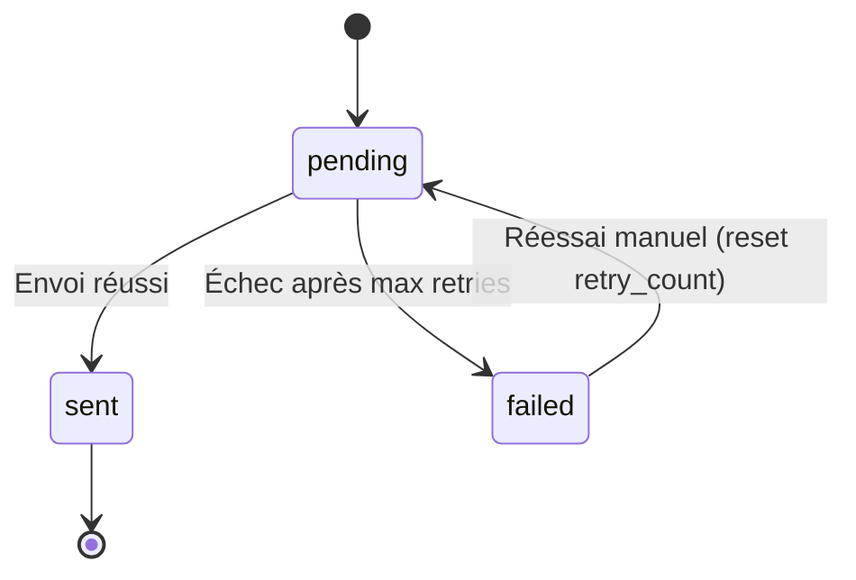

# MiyukiniTerminal — Spécification Queue Actions Offline

## Contexte

Ce document décrit la **structure de la queue d'actions** différées : type d'action, payload, timestamp, statut, politique de retry, gestion des conflits, politique de merge et rejeu à la reconnexion.

**Références :**

- [Spec Stockage Local](./MiyukiniTerminal%20-%20Spec%20Stockage%20Local.md)
- [Spec Mode Offline](./MiyukiniTerminal%20-%20Spec%20Mode%20Offline.md)
- [Spec Synchronisation Parent](./MiyukiniTerminal%20-%20Spec%20Synchronisation%20Parent.md)

---

## Portée / Scope

- Structure de la queue
- Types d'actions
- Statuts et transitions
- Politique retry
- Conflits et merge
- Rejeu à la reconnexion
- Limite de taille

---

## 1. Structure d'une entrée

| Champ | Type | Description |
|-------|------|-------------|
| id | INTEGER | PK auto |
| action_type | TEXT | Identifiant type (ex. `jaykonta.expense`, `jaykoa.event`) |
| payload | TEXT/BLOB | JSON du payload |
| status | TEXT | pending, sent, failed |
| created_at | INTEGER | Epoch création |
| sent_at | INTEGER | Epoch envoi (si sent) |
| retry_count | INTEGER | Nombre de tentatives |
| error_message | TEXT | Dernière erreur (si failed) |
| idempotency_key | TEXT | (optionnel) Clé pour éviter doublon |

---

## 2. Types d'actions

| action_type | Payload exemple | Destination |
|-------------|-----------------|-------------|
| jaykonta.expense | `{"purse_id":"x","amount":-50,"label":"Déjeuner"}` | Parent JayKonta |
| jaykoa.event | `{"title":"RDV","start":"...","end":"..."}` | Parent JayKoa |
| sync.request | `{}` | Demande sync manuelle |

---

## 3. Statuts et transitions



| Statut | Description |
|--------|-------------|
| pending | En attente d'envoi |
| sent | Envoyé et confirmé |
| failed | Échec après toutes les tentatives |

---

## 4. Politique de retry

| Paramètre | Valeur |
|-----------|--------|
| Retries max | 5 |
| Backoff | Exponentiel : 1s, 2s, 4s, 8s, 16s |
| Condition retry | Erreur réseau, timeout, 5xx |
| Pas de retry | 4xx (sauf 429), token invalide |

### 4.1 Algorithme

```
retry_delay = min(2^retry_count, 60) secondes
```

---

## 5. Conflits et merge

### 5.1 Conflit

Conflit = même ressource modifiée localement et côté parent entre le dernier sync et l'envoi de l'action.

### 5.2 Politiques

| Politique | Description | Usage |
|-----------|-------------|-------|
| **Dernier écrit gagnant** | Écraser côté parent | Par défaut pour dépenses, événements |
| **Merge manuel (TAMR)** | Proposer résolution à l'utilisateur | Si conflit explicite détecté |
| **Refuser** | Rejeter l'action | Si règle métier l'exige |

### 5.3 Détection

- Le parent renvoie un code `409 Conflict` ou équivalent.
- Le Terminal marque l'entrée en `failed` avec `error_message = "Conflict"`.
- Option : mode TAMR : afficher modal "Conflit détecté. Conserver local / parent / fusionner ?"

---

## 6. Rejeu à la reconnexion

### 6.1 Déclenchement

1. Détection reconnexion (état Online)
2. Récupérer toutes les entrées `status = pending`
3. Trier par `created_at` (FIFO)
4. Envoyer une par une (ou par batch si API le supporte)
5. Pour chaque succès : `status = sent`, `sent_at = now`
6. Pour chaque échec : incrémenter `retry_count` ; si max : `status = failed`
7. Continuer tant qu'il reste des pending et que la connexion est active

### 6.2 Ordre

Respecter l'ordre chronologique pour les actions dépendantes (ex. dépense avant transfert).

---

## 7. Limite de taille

| Paramètre | Valeur |
|-----------|--------|
| Taille max queue | 100 entrées pending |
| Si dépassement | Refuser nouvelles actions ; afficher "Trop d'actions en attente. Connectez-vous." |
| Purge | Supprimer les `sent` après 7 jours (optionnel) |

---

## 8. Idempotence

Pour éviter les doublons si retry :
- Générer `idempotency_key` (UUID) par action
- L'envoyer au parent
- Le parent ignore les requêtes avec clé déjà traitée

---

## 9. Logique de rejeu (algorithme détaillé)

### 9.1 Pseudo-code rejeu

```
FUNCTION replay_pending():
  pending = SELECT * FROM queue_actions WHERE status = 'pending' ORDER BY created_at
  FOR EACH action IN pending:
    result = send_to_parent(action)
    IF result.success:
      UPDATE queue_actions SET status = 'sent', sent_at = now WHERE id = action.id
    ELSE IF result.conflict:
      UPDATE status = 'failed', error_message = 'Conflict'
      trigger_tamr_resolution(action)
    ELSE:
      retry_count = retry_count + 1
      IF retry_count >= MAX_RETRIES:
        UPDATE status = 'failed'
      END IF
  END FOR
  trigger_cache_sync()  // Rafraîchir les données concernées
```

### 9.2 Dépendances entre actions

Si action B dépend de A (ex. transfert après dépense) :

| Règle | Description |
|-------|-------------|
| Ordre | Toujours rejouer dans l'ordre `created_at` |
| Échec A | Si A échoue, ne pas envoyer B (retry A d'abord) |
| Transaction | Option : grouper A+B en une seule requête si API le supporte |

### 9.3 Conventions MSCM queue

| Fonction | @id | @do |
|----------|-----|-----|
| queue_push | terminal.storage.v1.fn.queue_push | Ajoute action à la queue |
| queue_replay | terminal.storage.v1.fn.queue_replay | Rejoue les pending |
| queue_mark_sent | terminal.storage.v1.fn.queue_mark_sent | Marque action comme envoyée |

---

## 10. Références

- [Spec Stockage Local](./MiyukiniTerminal%20-%20Spec%20Stockage%20Local.md)
- [Spec Mode Offline](./MiyukiniTerminal%20-%20Spec%20Mode%20Offline.md)
- [Spec Actions Simples](./MiyukiniTerminal%20-%20Spec%20Actions%20Simples.md)
- [Spec MSCM MIP Conformite](./MiyukiniTerminal%20-%20Spec%20MSCM%20MIP%20Conformite.md)
