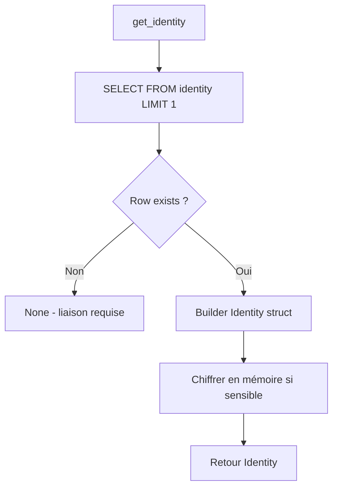
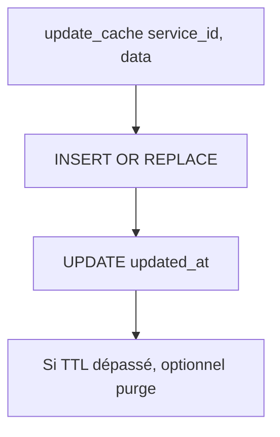

# MiyukiniTerminal — Spécification Stockage Local

## Contexte

Ce document décrit le **stockage local** du Terminal Android : choix SQLite/libSQL vs rusqlite, schéma des tables (identity, cache_services, queue_actions, preferences), migrations, chiffrement optionnel et chemins Android.

**Références :**

- [Architecture Technique](./MiyukiniTerminal%20-%20Architecture%20Technique.md)
- [Spec Queue Actions Offline](./MiyukiniTerminal%20-%20Spec%20Queue%20Actions%20Offline.md)
- [Spec Securite](./MiyukiniTerminal%20-%20Spec%20Securite.md)

---

## Portée / Scope

- Choix moteur (SQLite, rusqlite, KindMother)
- Schéma tables
- Migrations
- Chiffrement (optionnel)
- Chemins Android

---

## 1. Choix moteur

| Option | Avantages | Inconvénients |
|--------|-----------|---------------|
| **rusqlite** | Simple, dépendance légère, portable | Pas de chiffrement natif |
| **libSQL / sqlite3** | Même API que rusqlite | Dépendance externe |
| **KindMother** | Aligné écosystème, chiffrement | Poids, complexité |
| **SQLCipher** | Chiffrement SQLite | Licence, taille binaire |

**Recommandation MVP :** `rusqlite` pour simplicité. Chiffrement au niveau fichier (EncryptedFile) si besoin. Évolution vers KindMother ou SQLCipher si exigence forte.

---

## 2. Schéma des tables

### 2.1 identity

| Colonne | Type | Description |
|--------|------|-------------|
| id | INTEGER PK | Auto |
| cog_id | TEXT NOT NULL | Identifiant Terminal |
| parent_cog_id | TEXT NOT NULL | Identifiant parent |
| user_id | TEXT | (optionnel) |
| permis_id | TEXT | Dernier Permis reçu |
| permis_expires_at | INTEGER | Epoch |
| created_at | INTEGER | Epoch |
| updated_at | INTEGER | Epoch |

**Contrainte :** Une seule ligne (singleton) ; le Terminal a une seule identité.

### 2.2 cache_services

| Colonne | Type | Description |
|---------|------|-------------|
| id | INTEGER PK | Auto |
| service_id | TEXT NOT NULL | ex. jaykonta, jaykoa |
| data | BLOB/TEXT | JSON ou binaire (données en cache) |
| updated_at | INTEGER | Dernière sync |
| ttl | INTEGER | Time-to-live (optionnel) |

**Index :** service_id unique.

### 2.3 queue_actions

| Colonne | Type | Description |
|---------|------|-------------|
| id | INTEGER PK | Auto |
| action_type | TEXT NOT NULL | ex. jaykonta.expense, jaykoa.event |
| payload | BLOB/TEXT | JSON |
| status | TEXT | pending, sent, failed |
| created_at | INTEGER | Epoch |
| sent_at | INTEGER | Epoch (si sent) |
| retry_count | INTEGER | Compteur retries |
| error_message | TEXT | Dernière erreur (si failed) |

Voir [Spec Queue Actions Offline](./MiyukiniTerminal%20-%20Spec%20Queue%20Actions%20Offline.md).

### 2.4 preferences

| Colonne | Type | Description |
|---------|------|-------------|
| key | TEXT PK | Clé |
| value | TEXT | Valeur (JSON ou string) |

Exemples : `theme`, `lock_enabled`, `notifications_enabled`, `last_sync_at`.

---

## 3. Migrations

### 3.1 Stratégie

- Fichiers SQL : `migrations/001_initial.sql`, `002_add_ttl.sql`, ...
- Ou via `rusqlite` : `db.execute_batch(include_str!("migrations/001.sql"))`
- Version stockée dans table `schema_version` (version int).

### 3.2 Ordre d'exécution

1. Créer table schema_version
2. 001_initial : identity, cache_services, queue_actions, preferences
3. Migrations incrémentales selon évolution

---

## 4. Chiffrement optionnel

### 4.1 Niveau fichier

- Chiffrer le fichier SQLite entier (AES) avant écriture.
- Déchiffrer en mémoire au chargement.
- Clé dérivée du Keystore Android.

### 4.2 SQLCipher

- SQLite avec extension chiffrement.
- Transparent pour le code ; activation via `PRAGMA key`.

### 4.3 Données sensibles uniquement

- identity : toujours chiffré (ou dans EncryptedSharedPreferences séparé).
- cache_services : peut rester en clair (données non critiques).
- queue_actions : chiffrer payload si contenant infos sensibles.

---

## 5. Chemins Android

### 5.1 Répertoires

| Rôle | Chemin typique |
|------|----------------|
| Base de données | `context.getFilesDir()/databases/miyukini_terminal.db` |
| Ou | `context.getDatabasePath("miyukini_terminal")` |
| Cache (temporaire) | `context.getCacheDir()` |
| Persistant | `context.getFilesDir()` |

### 5.2 Rust / Dioxus

Via bindings Android ou crate `android-path`: obtenir le chemin depuis le contexte Java/ Kotlin et le passer à Rust.

---

## 6. Requêtes types

### 6.1 Identity

```sql
-- Lire
SELECT * FROM identity LIMIT 1;

-- Mettre à jour permis
UPDATE identity SET permis_id = ?, permis_expires_at = ?, updated_at = ? WHERE id = 1;
```

### 6.2 Cache

```sql
-- Lire service
SELECT data, updated_at FROM cache_services WHERE service_id = ?;

-- Upsert
INSERT INTO cache_services (service_id, data, updated_at) VALUES (?, ?, ?)
ON CONFLICT(service_id) DO UPDATE SET data = ?, updated_at = ?;
```

### 6.3 Queue

```sql
-- Pending
SELECT * FROM queue_actions WHERE status = 'pending' ORDER BY created_at;

-- Marquer sent
UPDATE queue_actions SET status = 'sent', sent_at = ? WHERE id = ?;
```

---

## 7. Logique d'accès et transitions

### 7.1 Arbre de décision : lecture identité



### 7.2 Arbre de décision : écriture cache



### 7.3 Conventions MSCM pour storage

Les fonctions de stockage doivent être balisées pour le MIP :

| Fonction | @id | @layer |
|----------|-----|--------|
| get_identity | terminal.storage.v1.fn.get_identity | infra |
| save_identity | terminal.storage.v1.fn.save_identity | infra |
| queue_push | terminal.storage.v1.fn.queue_push | domain |
| get_cache | terminal.storage.v1.fn.get_cache | infra |

---

## 8. Références

- [Spec Queue Actions Offline](./MiyukiniTerminal%20-%20Spec%20Queue%20Actions%20Offline.md)
- [Spec MSCM MIP Conformite](./MiyukiniTerminal%20-%20Spec%20MSCM%20MIP%20Conformite.md)
- [Spec Securite](./MiyukiniTerminal%20-%20Spec%20Securite.md)
- [rusqlite](https://docs.rs/rusqlite/)
