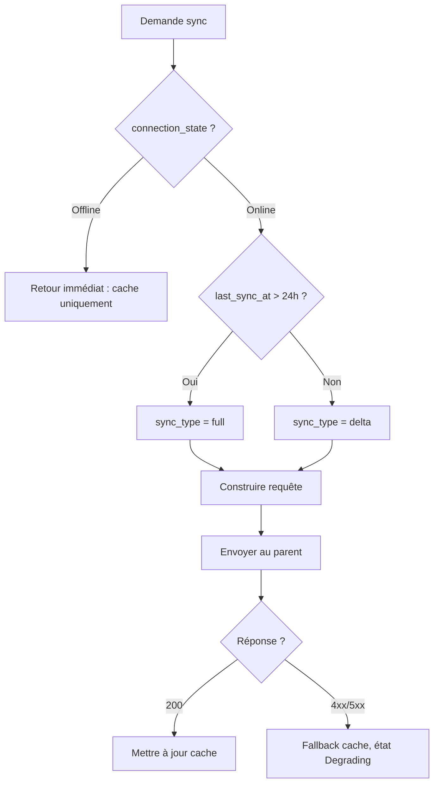

# MiyukiniTerminal — Spécification Synchronisation Parent

## Contexte

Ce document décrit le **protocole de synchronisation** entre le Terminal et son parent STABLE : sync initiale, sync incrémentale, full refresh, données synchronisées (services, préférences, cache JayKonta/JayKoa), fréquence, compression et détection/résolution de conflits.

**Références :**

- [Spec Mode Offline](./MiyukiniTerminal%20-%20Spec%20Mode%20Offline.md)
- [Spec Services Consultatifs](./MiyukiniTerminal%20-%20Spec%20Services%20Consultatifs.md)
- [Spec Queue Actions Offline](./MiyukiniTerminal%20-%20Spec%20Queue%20Actions%20Offline.md)

---

## Portée / Scope

- Protocole sync : init, incrémental, full
- Données synchronisées
- Fréquence et stratégie batch
- Compression
- Conflits et résolution

---

## 1. Modes de synchronisation

### 1.1 Sync initiale (première liaison)

| Étape | Description |
|-------|-------------|
| 1 | Après REGISTER_OK, Terminal demande données initiales |
| 2 | Parent envoie : liste services, préférences, cache minimal (soldes, agenda) |
| 3 | Terminal stocke en cache local |
| 4 | Marquer `last_sync_at` |

### 1.2 Sync incrémentale

| Déclencheur | Description |
|-------------|-------------|
| Reconnexion | Après passage Offline → Online |
| Pull-to-refresh | Utilisateur déclenche |
| Périodique | Toutes les N minutes (si app au premier plan) |
| Après action | Envoyer action, puis refresh données concernées |

| Données | Méthode |
|---------|---------|
| Delta | Envoyer `since` (timestamp) ; parent renvoie uniquement les modifications |
| Ou full | Si delta non supporté, full refresh ciblé (un service) |

### 1.3 Full refresh

| Cas | Description |
|-----|-------------|
| Sync initiale | Toujours full |
| Après erreur | Si delta échoue, fallback full |
| Intervalle long | Si `now - last_sync_at` > 24h, full pour garantir cohérence |

---

## 2. Données synchronisées

### 2.1 Liste des services

| Donnée | Format | Fréquence |
|--------|--------|------------|
| services | `[{id, name, mode}]` | À chaque sync |
| Exemple | `[{"id":"jaykonta","name":"JayKonta","mode":"consultative"}]` | — |

### 2.2 Préférences

| Donnée | Format |
|--------|--------|
| theme | "gaming" |
| notifications_enabled | true/false |
| ... | Selon besoins |

### 2.3 Cache JayKonta

| Donnée | Format | Limite |
|--------|--------|--------|
| Purses (soldes) | `[{purse_id, name, balance, currency}]` | Tous |
| Mouvements récents | `[{id, amount, label, date, ...}]` | 50 derniers par purse |

### 2.4 Cache JayKoa

| Donnée | Format | Limite |
|--------|--------|--------|
| Événements | `[{id, title, start, end, ...}]` | 30 jours à venir + 7 passés |
| Calendriers | Liste des calendriers accessibles |

---

## 3. Format d'échange

### 3.1 Option JSON

```json
{
  "version": 1,
  "sync_type": "full|delta",
  "since": 1234567890,
  "services": [...],
  "preferences": {...},
  "cache": {
    "jaykonta": {...},
    "jaykoa": {...}
  }
}
```

### 3.2 Option protobuf

Pour réduire la taille et accélérer le parsing. À définir si besoin.

---

## 4. Fréquence

### 4.1 Stratégie batch

| État app | Intervalle |
|----------|------------|
| Premier plan | Sync toutes les 5–10 min |
| Arrière-plan | Sync à la reprise (alarm / broadcast) |
| Batterie faible | Réduire fréquence (ex. 30 min) |
| Sur demande | Pull-to-refresh, après action |

### 4.2 Adaptatif batterie

- Utiliser `BatteryManager` (Android) pour détecter mode économie
- En mode économie : sync uniquement au pull-to-refresh ou à la reconnexion

---

## 5. Compression

| Méthode | Usage |
|---------|-------|
| gzip | Corps HTTP si API REST |
| MessagePack / CBOR | Alternative à JSON, plus compact |
| Delta seul | Envoyer uniquement les changements |

---

## 6. Détection et résolution de conflits

### 6.1 Conflit

Conflit = même donnée modifiée localement (queue) et côté parent depuis le dernier sync.

### 6.2 Détection

- Le parent peut renvoyer `409 Conflict` avec la version actuelle
- Ou : comparaison `updated_at` / `version` côté client

### 6.3 Résolution

| Politique | Description |
|-----------|-------------|
| Dernier écrit | Utiliser la version parent (écraser local) |
| TAMR | Proposer à l'utilisateur de choisir |
| Merge | Fusionner si structure le permet (ex. listes) |

---

## 7. Canal de sync

Les canaux de connexion MWS (direct Relay vs via parent) sont détaillés dans [Spec Canaux Connexion MWS Parent-Enfant](./MiyukiniTerminal%20-%20Spec%20Canaux%20Connexion%20MWS%20Parent%20Enfant.md). La **synchronisation des données** peut emprunter :

### 7.1 Option A : Via Relay DATA

- Terminal et Parent communiquent via tunnel Relay (CONNECT vers `parent_cog_id` → DATA)
- Encapsuler les messages sync dans les trames DATA
- Infrastructure MWS unifiée ; Phase 2+

### 7.2 Option B : API REST sur le parent

- Parent expose `POST /api/terminal/sync` (authentifié par token Terminal)
- Terminal envoie `since` ; parent répond avec delta/full
- Simple, standard HTTP ; **recommandé pour le MVP**

### 7.3 Recommandation

Option B plus simple pour le MVP ; Option A si infrastructure Relay déjà prête pour traffic inter-COG. Voir le [tableau comparatif](./MiyukiniTerminal%20-%20Spec%20Canaux%20Connexion%20MWS%20Parent%20Enfant.md#6-tableau-comparatif-des-canaux) des canaux.

---

## 8. Logique de décision : sync vs cache

### 8.1 Arbre de décision : demande sync



### 8.2 Règles de fusion delta

| Cas | Action |
|-----|--------|
| Champ modifié côté parent seulement | Remplacer local |
| Champ modifié local (queue) et parent | Conflit ; politique TAMR ou dernier écrit |
| Nouvel élément parent | Ajouter au cache |
| Élément supprimé parent | Retirer du cache |
| Horodatage | Utiliser `updated_at` pour tri |

### 8.3 Conventions MSCM sync

| Fonction | @id | @do |
|----------|-----|-----|
| sync_initial | terminal.sync.v1.fn.sync_initial | Demande et stocke données initiales |
| sync_delta | terminal.sync.v1.fn.sync_delta | Récupère delta depuis last_sync |
| update_cache | terminal.sync.v1.fn.update_cache | Met à jour cache local |

---

## 9. Références

- [Spec Mode Offline](./MiyukiniTerminal%20-%20Spec%20Mode%20Offline.md)
- [Spec Services Consultatifs](./MiyukiniTerminal%20-%20Spec%20Services%20Consultatifs.md)
- [Spec Queue Actions Offline](./MiyukiniTerminal%20-%20Spec%20Queue%20Actions%20Offline.md)
- [Spec MSCM MIP Conformite](./MiyukiniTerminal%20-%20Spec%20MSCM%20MIP%20Conformite.md)
